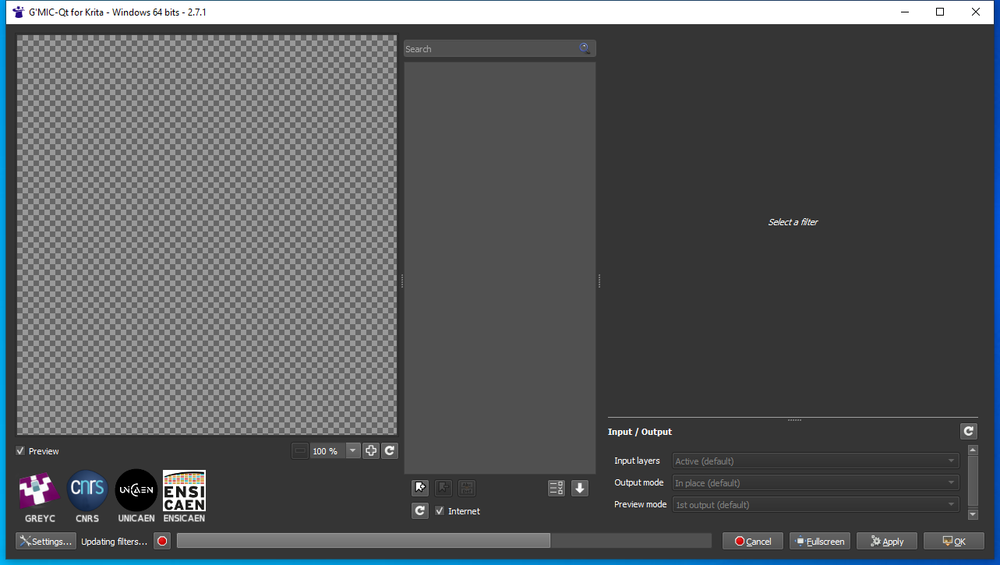

---
title: gmic_krita_qt.exe | 
---

# gmic_krita_qt.exe 

* File Path: `C:\Program Files\Krita (x64)\bin\gmic_krita_qt.exe`

## Screenshot



## Hashes

Type | Hash
-- | --
MD5 | `138A58657513EB7C3C0F3D7016A734BA`
SHA1 | `7EAB8AC15AF4349DFBF76361F60BCD9D1958CE30`
SHA256 | `0BD955D9AFD1C5043FF58B981A03DEDA5BAA9F1F3669A70E27DE42210ED1C754`
SHA384 | `75DA3CA95D1F1A8B002CDE81396BBB3846655BB17897CC4F1B39780C15CFF8B6CA8591EAC84C2A846C52D893C36525B1`
SHA512 | `D22B0020DDA0B244ECEAF3717F65240E4099F6979D8CF8D796695D2D57012B070AE5AE5192B07D39E45B5BFFFFB4EB269EC5BDCA1BBEC6740EEC3AC8DF75B898`
SSDEEP | `196608:zZYyHXOzkcgl7MZbbbbGzbbbb/3bbbbaAbbbb0Wbbbbv1bbbb6jbbbbRPbbbbf0V:zZ8ghMZbbbbGzbbbb/3bbbbaAbbbb0WF`

## Runtime Data

### Usage (stdout):
```Batchfile
Usage: C:\Program Files\Krita (x64)\bin\gmic_krita_qt.exe [options] socket key
Krita G'Mic Plugin

Options:
  -?, -h, --help  Displays this help.

Arguments:
  socket key      Key to find Krita's local server socket

```

### Usage (stderr):
```Batchfile
Unknown options: e, l, p.

```

## Signature

* Status: Signature verified.
* Serial: `087CF87879FAA94B9DCABA3C3A8B0D88`
* Thumbprint: `B3C0F5F192924AEBED669F1D180279A954A066B3`
* Issuer: CN=DigiCert SHA2 Assured ID Code Signing CA, OU=www.digicert.com, O=DigiCert Inc, C=US
* Subject: CN=K Desktop Environment e.V., O=K Desktop Environment e.V., L=Berlin, C=DE

## File Metadata

* Original Filename: 
* Product Name: 
* Company Name: 
* File Version: 
* Product Version: 
* Language: 
* Legal Copyright: 


MIT License. Copyright (c) 2020 Strontic.


