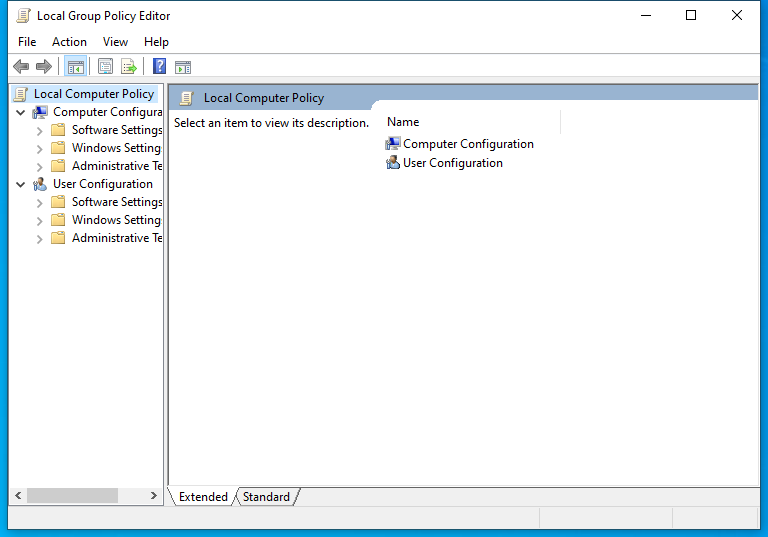

---
title: gpedit.msc | 
excerpt: What is gpedit.msc?
---

# gpedit.msc 

* File Path: `C:\Windows\system32\gpedit.msc`
* Description: Local Group Policy Editor (Window Title)

## Screenshot

## Hashes

Type | Hash
-- | --
MD5 | `6C054DA115C2CA2C523ABD159ED7814B`
SHA1 | `6B2B27433196685D777364DE7E251C198B2F45FE`
SHA256 | `04BA702FCA9BF8765D6774458474CC880551BFD80BBE03A95207D4661058892A`
SHA384 | `E1AB288B1CF5EBBF08375D9051011EAEF7538EDE914C5BD183A672C7B351331B7435BB34134A64683666AC08786A53B6`
SHA512 | `64A4B1E66202C017679AC28A7918BA66A7085156A37F6A536255DACFEC3FE37A98FB9A40512C548C7364119E069D970097D275BA4B92669C8F055CB55105D5FA`
SSDEEP | `384:/Zeyzi4TFBHCPeZc88OIyNgZzuuucuAZe98jT8j8j8j8jURMqcFZwPGnNymfGGG9:Qy+BuuucujRnAwPGymfGGGLlPI9NMlkS`
PESHA1 | `6B2B27433196685D777364DE7E251C198B2F45FE`
PE256 | `04BA702FCA9BF8765D6774458474CC880551BFD80BBE03A95207D4661058892A`

## Runtime Data

### Window Title:
Local Group Policy Editor

### Open Handles:

Path | Type
-- | --
(R-D)   C:\Windows\apppatch\DirectXApps_FOD.sdb | File
(R-D)   C:\Windows\Fonts\StaticCache.dat | File
(R-D)   C:\Windows\Microsoft.NET\assembly\GAC_64\Microsoft.GroupPolicy.AdmTmplEditor\v4.0_10.0.0.0__31bf3856ad364e35\Microsoft.GroupPolicy.AdmTmplEditor.dll | File
(R-D)   C:\Windows\Microsoft.NET\assembly\GAC_64\mscorlib\v4.0_4.0.0.0__b77a5c561934e089\mscorlib.dll | File
(R-D)   C:\Windows\Microsoft.NET\assembly\GAC_MSIL\System.Windows.Forms\v4.0_4.0.0.0__b77a5c561934e089\System.Windows.Forms.dll | File
(R-D)   C:\Windows\System32\atl.dll | File
(R-D)   C:\Windows\System32\en-US\aclui.dll.mui | File
(R-D)   C:\Windows\System32\en-US\AdmTmpl.dll.mui | File
(R-D)   C:\Windows\System32\en-US\certmgr.dll.mui | File
(R-D)   C:\Windows\System32\en-US\dot3gpui.dll.mui | File
(R-D)   C:\Windows\System32\en-US\gpedit.dll.mui | File
(R-D)   C:\Windows\System32\en-US\ieframe.dll.mui | File
(R-D)   C:\Windows\System32\en-US\ipsecsnp.dll.mui | File
(R-D)   C:\Windows\System32\en-US\KernelBase.dll.mui | File
(R-D)   C:\Windows\System32\en-US\MFC42u.dll.mui | File
(R-D)   C:\Windows\System32\en-US\mmc.exe.mui | File
(R-D)   C:\Windows\System32\en-US\mmcbase.dll.mui | File
(R-D)   C:\Windows\System32\en-US\mmcndmgr.dll.mui | File
(R-D)   C:\Windows\System32\en-US\mshtml.dll.mui | File
(R-D)   C:\Windows\System32\en-US\urlmon.dll.mui | File
(R-D)   C:\Windows\System32\en-US\user32.dll.mui | File
(R-D)   C:\Windows\System32\en-US\winmm.dll.mui | File
(R-D)   C:\Windows\System32\en-US\wlangpui.dll.mui | File
(R-D)   C:\Windows\System32\en-US\wsecedit.dll.mui | File
(R-D)   C:\Windows\System32\mmc.exe | File
(R-D)   C:\Windows\System32\stdole2.tlb | File
(R-D)   C:\Windows\SystemResources\AuthFWGP.dll.mun | File
(R-D)   C:\Windows\SystemResources\gpedit.dll.mun | File
(R-D)   C:\Windows\SystemResources\ipsecsnp.dll.mun | File
(R-D)   C:\Windows\SystemResources\mmcbase.dll.mun | File
(R-D)   C:\Windows\SystemResources\mmcndmgr.dll.mun | File
(R-D)   C:\Windows\SystemResources\wlangpui.dll.mun | File
(R-D)   C:\Windows\SystemResources\wsecedit.dll.mun | File
(RW-)   C:\Users\user | File
(RW-)   C:\Windows\System32 | File
(RW-)   C:\Windows\WinSxS\amd64_microsoft.windows.common-controls_6595b64144ccf1df_5.82.19041.488_none_4238de57f6b64d28 | File
(RW-)   C:\Windows\WinSxS\amd64_microsoft.windows.common-controls_6595b64144ccf1df_6.0.19041.746_none_ca02b4b61b8320a4 | File
(RWD)   C:\Windows\Fonts\segoeui.ttf | File
\...\Cor_SxSPublic_IPCBlock | Section
\BaseNamedObjects\__ComCatalogCache__ | Section
\BaseNamedObjects\C:\*ProgramData\*Microsoft\*Windows\*Caches\*{6AF0698E-D558-4F6E-9B3C-3716689AF493}.2.ver0x0000000000000002.db | Section
\BaseNamedObjects\C:\*ProgramData\*Microsoft\*Windows\*Caches\*{DDF571F2-BE98-426D-8288-1A9A39C3FDA2}.2.ver0x0000000000000002.db | Section
\BaseNamedObjects\C:\*ProgramData\*Microsoft\*Windows\*Caches\*cversions.2 | Section
\BaseNamedObjects\Cor_Private_IPCBlock_v4_8660 | Section
\BaseNamedObjects\NLS_CodePage_1252_3_2_0_0 | Section
\BaseNamedObjects\NLS_CodePage_437_3_2_0_0 | Section
\BaseNamedObjects\windows_shell_global_counters | Section
\Sessions\1\BaseNamedObjects\21d4HWNDInterface:260500 | Section
\Sessions\1\BaseNamedObjects\21d4HWNDInterface:2f05c2 | Section
\Sessions\1\BaseNamedObjects\21d4HWNDInterface:350474 | Section
\Sessions\1\BaseNamedObjects\21d4HWNDInterface:590558 | Section
\Sessions\1\BaseNamedObjects\SessionImmersiveColorPreference | Section
\Sessions\1\BaseNamedObjects\UrlZonesSM_user | Section
\Sessions\1\BaseNamedObjects\windows_ie_global_counters | Section
\Sessions\1\BaseNamedObjects\windows_shell_global_counters | Section
\Sessions\1\BaseNamedObjects\windows_webcache_counters_{9B6AB5B3-91BC-4097-835C-EA2DEC95E9CC}_S-1-5-21-2047949552-857980807-821054962-504 | Section
\Sessions\1\Windows\Theme3205582532 | Section
\Windows\Theme3800351183 | Section

### Loaded Modules:

Path |
-- |
C:\Windows\SYSTEM32\apphelp.dll |
C:\Windows\System32\KERNEL32.DLL |
C:\Windows\System32\KERNELBASE.dll |
C:\Windows\SYSTEM32\mmc.exe |
C:\Windows\SYSTEM32\ntdll.dll |

## Signature

* Status: Signature verified.
* Serial: `330000023241FB59996DCC4DFF000000000232`
* Thumbprint: `FF82BC38E1DA5E596DF374C53E3617F7EDA36B06`
* Issuer: CN=Microsoft Windows Production PCA 2011, O=Microsoft Corporation, L=Redmond, S=Washington, C=US
* Subject: CN=Microsoft Windows, O=Microsoft Corporation, L=Redmond, S=Washington, C=US

## File Metadata

* Original Filename: 
* Product Name: 
* Company Name: 
* File Version: 
* Product Version: 
* Language: 
* Legal Copyright: 

## File Scan

* VirusTotal Detections: 0/76
* VirusTotal Link: https://www.virustotal.com/gui/file/04ba702fca9bf8765d6774458474cc880551bfd80bbe03a95207d4661058892a/detection

## File Similarity (ssdeep match)

File | Score
-- | --
[C:\Windows\system32\certlm.msc](certlm.msc-DCCA682FEA47192106EC4F2001EAE182.md) | 33
[C:\Windows\system32\certmgr.msc](certmgr.msc-4C7390A1FF613FBBF59141CA0BE8AE89.md) | 33
[C:\Windows\system32\en-US\certlm.msc](certlm.msc-DCCA682FEA47192106EC4F2001EAE182.md) | 33
[C:\Windows\system32\en-US\certmgr.msc](certmgr.msc-4C7390A1FF613FBBF59141CA0BE8AE89.md) | 33
[C:\Windows\system32\en-US\gpedit.msc](gpedit.msc-6C054DA115C2CA2C523ABD159ED7814B.md) | 100
[C:\Windows\system32\en-US\printmanagement.msc](printmanagement.msc-4856202475EFE0D66FA11EE1DCF6D0D3.md) | 33
[C:\Windows\system32\en-US\tpm.msc](tpm.msc-9359341F78E00134B527814B4868ECD5.md) | 35
[C:\Windows\system32\printmanagement.msc](printmanagement.msc-4856202475EFE0D66FA11EE1DCF6D0D3.md) | 33
[C:\Windows\system32\tpm.msc](tpm.msc-9359341F78E00134B527814B4868ECD5.md) | 35
[C:\Windows\SysWOW64\certlm.msc](certlm.msc-DCCA682FEA47192106EC4F2001EAE182.md) | 33
[C:\Windows\SysWOW64\certmgr.msc](certmgr.msc-4C7390A1FF613FBBF59141CA0BE8AE89.md) | 33
[C:\Windows\SysWOW64\en-US\gpedit.msc](gpedit.msc-6C054DA115C2CA2C523ABD159ED7814B.md) | 100
[C:\Windows\SysWOW64\gpedit.msc](gpedit.msc-6C054DA115C2CA2C523ABD159ED7814B.md) | 100
[C:\Windows\SysWOW64\tpm.msc](tpm.msc-9359341F78E00134B527814B4868ECD5.md) | 35

## Possible Misuse

*The following table contains possible examples of `gpedit.msc` being misused. While `gpedit.msc` is **not** inherently malicious, its legitimate functionality can be abused for malicious purposes.*

Source | Source File | Example | License
-- | -- | -- | --
[sigma](https://github.com/Neo23x0/sigma) | [win_disable_event_logging.yml](https://github.com/Neo23x0/sigma/blob/master/rules/windows/builtin/win_disable_event_logging.yml) | `description: 'Detects scenarios where system auditing (ie: windows event log auditing) is disabled. This may be used in a scenario where an entity would want to bypass local logging to evade detection when windows event logging is enabled and reviewed. Also, it is recommended to turn off "Local Group Policy Object Processing" via GPO, which will make sure that Active Directory GPOs take precedence over local/edited computer policies via something such as "gpedit.msc". Please note, that disabling "Local Group Policy Object Processing" may cause an issue in scenarios of one off specific GPO modifications -- however it is recommended to perform these modifications in Active Directory anyways.'`{:.highlight .language-yaml} | [DRL 1.0](https://github.com/Neo23x0/sigma/blob/master/LICENSE.Detection.Rules.md)

MIT License. Copyright (c) 2020-2021 Strontic.

