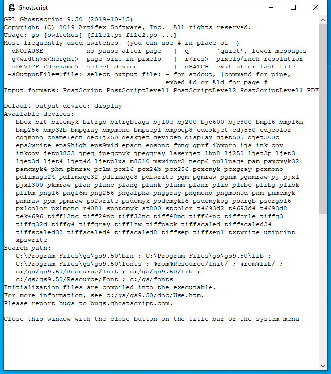

---
title: gswin64.exe | 
---

# gswin64.exe 

* File Path: `C:\Program Files\gs\gs9.50\bin\gswin64.exe`

## Screenshot

## Hashes

Type | Hash
-- | --
MD5 | `22DD8894E258F67B76D2916B97279950`
SHA1 | `4006A56464E7917ED4683CC6EF7B450218AEE369`
SHA256 | `DFFB998016254143885AF837FA46D25DCFFD68A6C28FDB149F5347663A4E68CF`
SHA384 | `4D03DEA1D78326CA0817BC9F8046B0B931C564426619F64735FADDF420C4B40E74965A0FB19539F9E5073CB1E9807CF1`
SHA512 | `EDEFDFFAA4DEC67D3341F0BBDA43A05909BF356E5E8D593431D6DC00C72A608C3C37B140089614106CFD8B90F8388E2DF0A54C9443D488AAE3652F9DA9C8B08F`
SSDEEP | `3072:U0Wi62A0syonMU4Ub8+XsxRT/VBqe6VY/ZEhkaD0SF0Q+bVXLjWAFjJj:fWp2v/5UviRTtBqe6YW9DX5efbFN`

## Signature

* Status: The file C:\Program Files\gs\gs9.50\bin\gswin64.exe is not digitally signed. You cannot run this script on the current system. For more information about running scripts and setting execution policy, see about_Execution_Policies at https:/go.microsoft.com/fwlink/?LinkID=135170
* Serial: ``
* Thumbprint: ``
* Issuer: 
* Subject: 

## File Metadata

* Original Filename: 
* Product Name: GPL Ghostscript
* Company Name: 
* File Version: 9.50
* Product Version: 9.50
* Language: English (United States)
* Legal Copyright: Copyright (C) 2019 Artifex Software, Inc.  All rights reserved.

MIT License. Copyright (c) 2020 Strontic.

