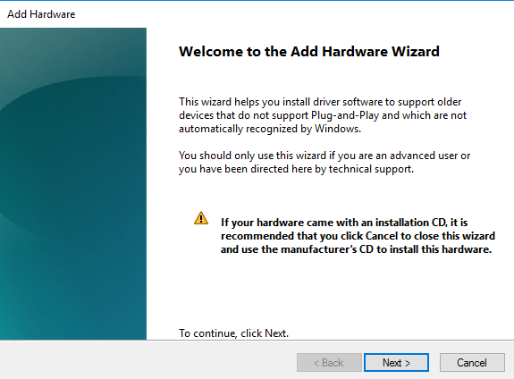

---
title: hdwwiz.exe | Add Hardware Wizard
---

# hdwwiz.exe 

* File Path: `C:\windows\SysWOW64\hdwwiz.exe`
* Description: Add Hardware Wizard

## Screenshot

## Hashes

Type | Hash
-- | --
MD5 | `6D74A46161BCB5E3B3E321A7C0D9ABFF`
SHA1 | `F1FE06F4EA7C6C2AD485284AAA68E6D361447B2B`
SHA256 | `CADEB025A83FC2D084D609C9858FD055B8528457C49B434EA47A7F301A5817B6`
SHA384 | `529C42C5DEB772F88B4EAFFED50FB29E2837EAD4AA61CBAEA7FE6E02E2AC6656C222E31B025C9190F9D1DA52AB239C03`
SHA512 | `A3E29C91B435AB846ED25E90F241F9FE595BD9FE89EA70CBD8D51264D42B4141B6C5EEF962865ED994488C9B3CC8C8A20AD529B4A02AEED9AE06C5A8BC121BDD`
SSDEEP | `768:MW/yTYFkWgzu9b3pbX25T1JlZE74r+dL+GU8SbM2N2gZ7ihP6ditnxn2YVXy:MrukWpuJlL+5bU8QBNLQSExT8`

### Loaded Modules:

Path |
-- |
C:\program files\HandBrake\HandBrake.exe |
C:\Windows\Microsoft.NET\Framework64\v4.0.30319\clr.dll |
C:\Windows\Microsoft.NET\Framework64\v4.0.30319\mscoreei.dll |
C:\Windows\System32\ADVAPI32.dll |
C:\Windows\System32\GDI32.dll |
C:\Windows\System32\gdi32full.dll |
C:\Windows\System32\IMM32.DLL |
C:\Windows\SYSTEM32\kernel.appcore.dll |
C:\Windows\System32\KERNEL32.dll |
C:\Windows\System32\KERNELBASE.dll |
C:\Windows\SYSTEM32\MSCOREE.DLL |
C:\Windows\System32\msvcp_win.dll |
C:\Windows\System32\msvcrt.dll |
C:\Windows\SYSTEM32\ntdll.dll |
C:\Windows\System32\RPCRT4.dll |
C:\Windows\System32\sechost.dll |
C:\Windows\System32\SHLWAPI.dll |
C:\Windows\System32\ucrtbase.dll |
C:\Windows\SYSTEM32\ucrtbase_clr0400.dll |
C:\Windows\System32\USER32.dll |
C:\Windows\SYSTEM32\VCRUNTIME140_CLR0400.dll |
C:\Windows\SYSTEM32\VERSION.dll |
C:\Windows\System32\win32u.dll |

## Signature

* Status: The file C:\windows\SysWOW64\hdwwiz.exe is not digitally signed. You cannot run this script on the current system. For more information about running scripts and setting execution policy, see about_Execution_Policies at http://go.microsoft.com/fwlink/?LinkID=135170
* Serial: ``
* Thumbprint: ``
* Issuer: 
* Subject: 

## File Metadata

* Original Filename: HdwWiz.EXE.MUI
* Product Name: Microsoft Windows Operating System
* Company Name: Microsoft Corporation
* File Version: 6.3.9600.16384 (winblue_rtm.130821-1623)
* Product Version: 6.3.9600.16384
* Language: English (United States)
* Legal Copyright:  Microsoft Corporation. All rights reserved.

## File Similarity (ssdeep match)

File | Score
-- | --
[C:\windows\system32\DevicePairingWizard.exe](DevicePairingWizard.exe-EA2A473AE0C5601D6CC1EC8D8DD0BF2C.md) | 85
[C:\windows\system32\hdwwiz.exe](hdwwiz.exe-14F02676427640AE5694A3E7FB739681.md) | 77
[C:\windows\SysWOW64\DevicePairingWizard.exe](DevicePairingWizard.exe-ACB5CD4528F33568475A55ABCD0C002B.md) | 82

MIT License. Copyright (c) 2020 Strontic.

