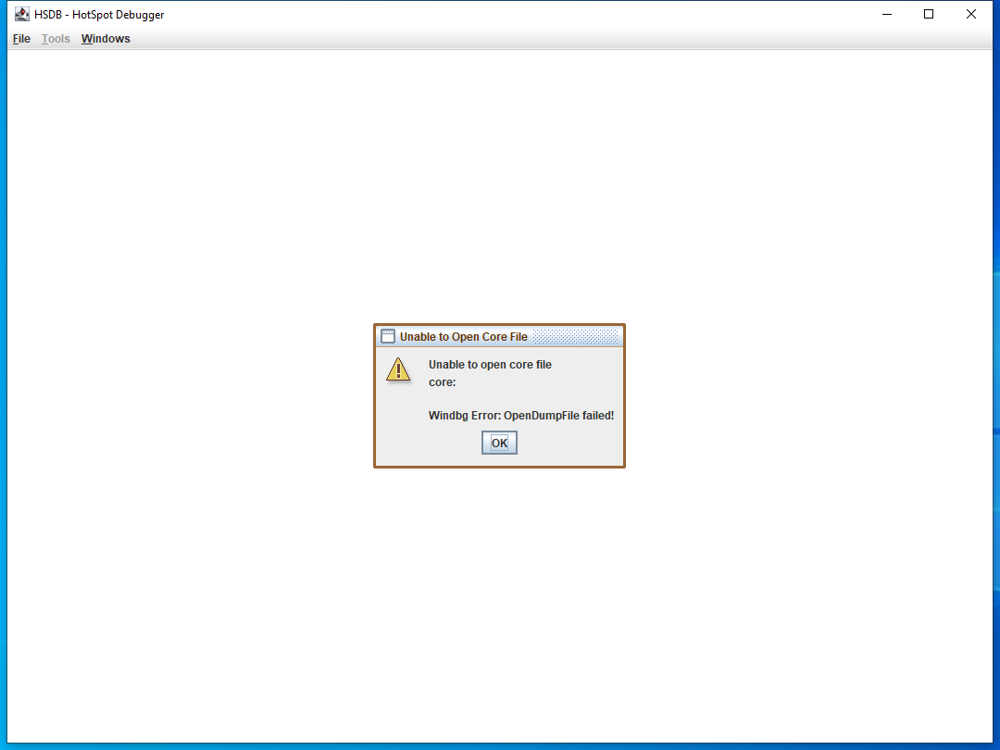

---
title: hsdb.exe | OpenJDK Platform binary
---

# hsdb.exe 

* File Path: `C:\Program Files (x86)\Amazon Corretto\jdk1.8.0_265\bin\hsdb.exe`
* Description: OpenJDK Platform binary

## Screenshot



## Hashes

Type | Hash
-- | --
MD5 | `7F335E40D9BD7CE769BCD22ED86643F2`
SHA1 | `A8A604626E133060634F58216906A9A7CC80661D`
SHA256 | `36C7CD71D5F5717322E366B9CBDA376E723D8405FCC219F5397D2E71201833F7`
SHA384 | `6B60BCB936A060AB4F14D14712C6A9A6B959932BDEF6A3A424ACE955658401496C0654CB3E5508617D097C942A3771D0`
SHA512 | `E9A20D08B3876D46D09C52F35EAFAC88C09D251569C1D252CFDACD18B9FD38541FE1613C5C3DBF81B3D8E67509424A8D43C9096B7F0FD341BA9E25A66AF0C537`
SSDEEP | `384:GpsoJRnmq8mSHhV83AeeDclK6jS52UDgf2hc:GpsqnJS/831ewKgs2UUf2hc`

## Runtime Data

### Usage (stdout):
```Batchfile
Usage:  hsdb [[pid] | [path-to-java-executable [path-to-corefile]] | help | -help ]
           pid:                     attach to the process whose id is 'pid'
           path-to-java-executable: Debug a core file produced by this program
           path-to-corefile:        Debug this corefile.  The default is 'core'
        If no arguments are specified, you can select what to do from the GUI.


```

### Child Processes:
conhost.exe

## Signature

* Status: Signature verified.
* Serial: `2F83C35B5136353D68CE9EB669FD1B0B`
* Thumbprint: `4BAD227329ADEF18F215B6475FB7948E1629B505`
* Issuer: CN=Symantec Class 3 SHA256 Code Signing CA, OU=Symantec Trust Network, O=Symantec Corporation, C=US
* Subject: CN=Amazon.com Services LLC, OU=Software Services, O=Amazon.com Services LLC, L=Seattle, S=Washington, C=US

## File Metadata

* Original Filename: hsdb.exe
* Product Name: OpenJDK Platform 8
* Company Name: Amazon.com Inc.
* File Version: 8.0.2650.1
* Product Version: 8.0.2650.1
* Language: Language Neutral
* Legal Copyright: Copyright  2020

## File Similarity (ssdeep match)

File | Score
-- | --
[C:\Program Files (x86)\Amazon Corretto\jdk1.8.0_265\bin\jinfo.exe](jinfo.exe-536380B9EDDA1DC69DB259C3D1715DF0.md) | 63
[C:\Program Files (x86)\Amazon Corretto\jdk1.8.0_265\bin\jstatd.exe](jstatd.exe-A53DBF1919BB8F028056008F6F017DF0.md) | 65


MIT License. Copyright (c) 2020 Strontic.


