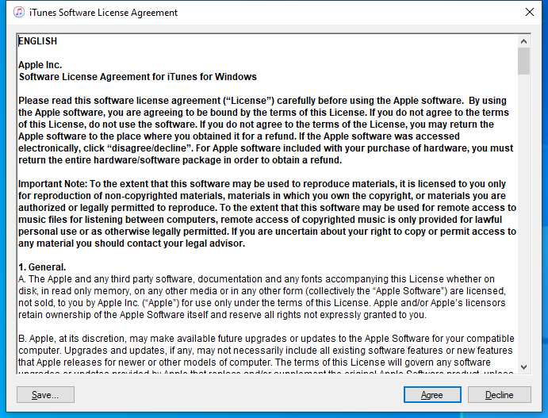

---
title: iTunes.exe | iTunes
---

# iTunes.exe 

* File Path: `C:\Program Files\iTunes\iTunes.exe`
* Description: iTunes

## Screenshot

## Hashes

Type | Hash
-- | --
MD5 | `89A09D30380E27A24A9DA9C6D0DFCFAF`
SHA1 | `14549FCEF38632969397F712768C3DEE438F721C`
SHA256 | `EDB82AF891DD510A6E8D349071AD3E52256D8B3BE938D8E821D4F5980AF4E461`
SHA384 | `550154587E26EF60E3D75C2799B2796038E1D6AF000EDA592F9A105B9F2EF8748A24720C082EDB427DF3FA5B717AD44D`
SHA512 | `1D9855B95AD5A4C634ABFED3B9AC4FE4129868A2E6492AA00E204F5FA87A40EBAAD0D24A58CE5B0C8871A8D6436F2B86273648B87C0A5B1CCE767BE59D5FEB86`
SSDEEP | `393216:URYEo5L/rRap8vHclJ2eFkwBz06faZ+pwvwCgRY1kkQgVqDQMi8Ga1F:URwMgeKZKF`

## Signature

* Status: Signature verified.
* Serial: `4EF16586A2FF12D69C556EC4C91BAEE1`
* Thumbprint: `634A0D892E72161714861C178015AFE9C1832E14`
* Issuer: CN=Symantec Class 3 SHA256 Code Signing CA, OU=Symantec Trust Network, O=Symantec Corporation, C=US
* Subject: CN=Apple Inc., O=Apple Inc., L=Cupertino, S=California, C=US

## File Metadata

* Original Filename: iTunes.exe
* Product Name: iTunes
* Company Name: Apple Inc.
* File Version: 12.10.8.5
* Product Version: 12.10.8.5
* Language: English (United States)
* Legal Copyright:  2000-2020 Apple Inc. All rights reserved.

## Possible Misuse

*The following table contains possible examples of `iTunes.exe` being misused. While `iTunes.exe` is **not** inherently malicious, its legitimate functionality can by abused for malicious purposes.*

Source | Source File | Example | License
-- | -- | -- | --
[signature-base](https://github.com/Neo23x0/signature-base) | [gen_osx_backdoor_bella.yar](https://github.com/Neo23x0/signature-base/blob/master/yara/gen_osx_backdoor_bella.yar) |         $subpart2_c = "iTunes" fullword ascii | [CC BY-NC 4.0](https://github.com/Neo23x0/signature-base/blob/master/LICENSE)

MIT License. Copyright (c) 2020 Strontic.

