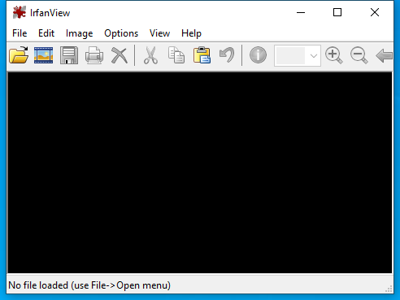

---
title: i_view32.exe | IrfanView 32-bit
---

# i_view32.exe 

* File Path: `C:\Program Files (x86)\IrfanView\i_view32.exe`
* Description: IrfanView 32-bit
* Comments: IrfanView 32-bit for WinXP - Win10

## Screenshot

## Hashes

Type | Hash
-- | --
MD5 | `EA39FDA0014FC6DD21CC55AEEE92ECCD`
SHA1 | `98B902EF1D57FE4A938DC92C943E85A8247CAF9A`
SHA256 | `B5A86E08872A9C3C41FA4418C50F13D7A0876C29CC5376463335768A6E8FFFA0`
SHA384 | `C00D314E373BA7E3E996D3B1936C1CAEE1CF7D7110A41BCE3F7070C3ADFEF8B0C223D09F4D59AFC4F03D6A98FFB6B2A9`
SHA512 | `2DA5C055C5D8534CB0833247CA13F0C4E4F6DB66637581C2DD5186227AFD9E70D936D344A23FE91F07D3C05F2AAAAB7601A740232886C1FFEE81020D719903CB`
SSDEEP | `24576:qw/u6VCaleWmxxACN2kXZN63YZ7S4BquK5ja4ElAvXN5jBA2PIv21w0rCjdJh/5v:BjYxyw6IZ7S4BlK5ja4LjBXPIN3h5jn`

## Signature

* Status: Signature verified.
* Serial: `00E50CACF3CFD70EAEBF28A3A5E04ED4A7`
* Thumbprint: `5CC1EABEF72CF2867FDB4509F0CC13C2CB5C132A`
* Issuer: CN=COMODO RSA Code Signing CA, O=COMODO CA Limited, L=Salford, S=Greater Manchester, C=GB
* Subject: CN=Irfan Skiljan, O=Irfan Skiljan, STREET=Postfach 48, L=Wiener Neustadt, S=NOE, PostalCode=2700, C=AT

## File Metadata

* Original Filename: i_view32.exe
* Product Name: IrfanView 32-bit
* Company Name: Irfan Skiljan
* File Version: 4.54
* Product Version: 4.54
* Language: English (United States)
* Legal Copyright: Copyright  2019 by Irfan Skiljan, Austria

MIT License. Copyright (c) 2020 Strontic.

