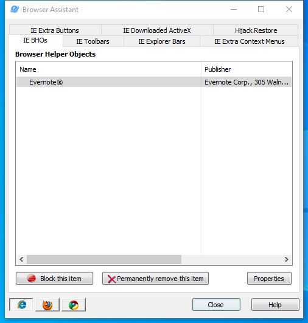

---
title: iehelper.exe | Browser Assistant
---

# iehelper.exe 

* File Path: `C:\Program Files (x86)\Glary Utilities 5\iehelper.exe`
* Description: Browser Assistant

## Screenshot

## Hashes

Type | Hash
-- | --
MD5 | `E354C974FFDAD4E02637215C461110E6`
SHA1 | `2878F16251EBC0A6E2A5258D78AF3FEA9C75823C`
SHA256 | `D7CBE47F901C0057EC7F43F52B0C3D69527346E9D726C41B6A7F9FB9C64BD430`
SHA384 | `DE403C031E7A5407FC20250C5DC26F0414379ADF01B9814ADFE2DC845C3484442AA450E9CE67D1864C00E1A2337FF91C`
SHA512 | `E05B5D5F4A6C3B9C6F54FB42529D3D98588CE5B55D74C08107EBC69657B4569476E8618A154D0C56E128C7FBC87F3C57ABBD153AF129B7415DB1B3AA338FB149`
SSDEEP | `24576:zDohnmwcdFOscZEb+PV0Au0hq7SqjsQ0UMC:FdFOsNAuLmQf`

## Signature

* Status: Signature verified.
* Serial: `0F05AE21CDC17B9F3CF09D7BFC659BA3`
* Thumbprint: `362EBB303E088105BDCC07D94E6B7875D30C0D06`
* Issuer: CN=DigiCert Assured ID Code Signing CA-1, OU=www.digicert.com, O=DigiCert Inc, C=US
* Subject: CN=Glarysoft LTD, O=Glarysoft LTD, S=Beijing, C=CN

## File Metadata

* Original Filename: BrowserHelper.exe
* Product Name: Glary Utilities
* Company Name: Glarysoft Ltd
* File Version: 5, 0, 0, 12
* Product Version: 5.0.0.0
* Language: English (United States)
* Legal Copyright: Copyright (c) 2003-2020 Glarysoft Ltd

## File Similarity (ssdeep match)

File | Score
-- | --
[C:\program files (x86)\Glary Utilities 5\iehelper.exe](iehelper.exe-79EDD0580D1DD4FE483FB803F7D2CFEA.md) | 96

## Possible Misuse

*The following table contains possible examples of `iehelper.exe` being misused. While `iehelper.exe` is **not** inherently malicious, its legitimate functionality can by abused for malicious purposes.*

Source | Source File | Example | License
-- | -- | -- | --
[sigma](https://github.com/Neo23x0/sigma) | [sysmon_apt_turla_namedpipes.yml](https://github.com/Neo23x0/sigma/blob/master/rules/windows/sysmon/sysmon_apt_turla_namedpipes.yml) | `- '\iehelper' # ruag apt case` | [DRL 1.0](https://github.com/Neo23x0/sigma/blob/master/LICENSE.Detection.Rules.md)
[signature-base](https://github.com/Neo23x0/signature-base) | [apt_tidepool.yar](https://github.com/Neo23x0/signature-base/blob/master/yara/apt_tidepool.yar) | 		$x2 = "C:\\PROGRA~2\\IEHelper\\mshtml.dll" fullword wide | [CC BY-NC 4.0](https://github.com/Neo23x0/signature-base/blob/master/LICENSE)
[signature-base](https://github.com/Neo23x0/signature-base) | [apt_tidepool.yar](https://github.com/Neo23x0/signature-base/blob/master/yara/apt_tidepool.yar) | 		$x3 = "C:\\DOCUME~1\\ALLUSE~1\\IEHelper\\mshtml.dll" fullword wide | [CC BY-NC 4.0](https://github.com/Neo23x0/signature-base/blob/master/LICENSE)

MIT License. Copyright (c) 2020 Strontic.

