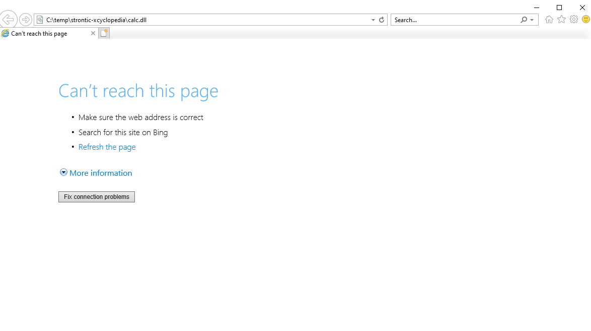

---
title: iexplore.exe | Internet Explorer
excerpt: What is iexplore.exe?
---

# iexplore.exe 

* File Path: `C:\Program Files (x86)\Internet Explorer\iexplore.exe`
* Description: Internet Explorer

## Screenshot

## Hashes

Type | Hash
-- | --
MD5 | `5E5F63CD0CA3EE94C61A2DB20CE33FC9`
SHA1 | `C90EA9645C7CC1AD7553675A7ECDF880B1FB4621`
SHA256 | `219280FFEBD3D771102FC3A7F26529E5E9161366E3A5DE2F8943D81DDA7756BF`
SHA384 | `77269020E70E7FD458A9CB16D175890AAF916B66154F22CECF7B4243438F0A9DA4C7AE25F928E5E9A7A772F7D290E8B1`
SHA512 | `B36DF698F1CBE52DF754DB9FCFBA7E6811B6FC74F44A89378CE29356630F66A10D526402E9D133F8AB608BB614E2214945C0B732B4DB3D0CAD3D3665E062EDCB`
SSDEEP | `24576:bWgqlGLbMMHMMMvMMZMMMKzb6XmMMMiMMMz8JMMHMMM6MMZMMMeXNMMzMMMUMMV+:btMMHMMMvMMZMMMlmMMMiMMMYJMMHMMk`
IMP | `D0D495A9190DAF87667257C480CB8CD5`
PESHA1 | `A1C8295E91538D0209213CF530545DCA0C124F72`
PE256 | `47F61EB945EF655A7E1B01BCCAD6D319FDF943FCEBADE5D162455B4BE4B10CC9`

## Runtime Data

### Child Processes:
iexplore.exe

### Loaded Modules:

Path |
-- |
C:\Program Files (x86)\Internet Explorer\iexplore.exe |
C:\Windows\SYSTEM32\ntdll.dll |
C:\Windows\System32\wow64.dll |
C:\Windows\System32\wow64cpu.dll |
C:\Windows\System32\wow64win.dll |

## Signature

* Status: Signature verified.
* Serial: `33000002EC6579AD1E670890130000000002EC`
* Thumbprint: `F7C2F2C96A328C13CDA8CDB57B715BDEA2CBD1D9`
* Issuer: CN=Microsoft Windows Production PCA 2011, O=Microsoft Corporation, L=Redmond, S=Washington, C=US
* Subject: CN=Microsoft Windows, O=Microsoft Corporation, L=Redmond, S=Washington, C=US

## File Metadata

* Original Filename: IEXPLORE.EXE.MUI
* Product Name: Internet Explorer
* Company Name: Microsoft Corporation
* File Version: 11.00.19041.1 (WinBuild.160101.0800)
* Product Version: 11.00.19041.1
* Language: English (United States)
* Legal Copyright:  Microsoft Corporation. All rights reserved.
* Machine Type: 32-bit

## File Scan

* VirusTotal Detections: 0/73
* VirusTotal Link: https://www.virustotal.com/gui/file/219280ffebd3d771102fc3a7f26529e5e9161366e3a5de2f8943d81dda7756bf/detection

## File Similarity (ssdeep match)

File | Score
-- | --
[C:\Program Files (x86)\Internet Explorer\iexplore.exe](iexplore.exe-2E414291458B49ACDA42C80A4C10DE7E.md) | 94
[C:\Program Files (x86)\Internet Explorer\iexplore.exe](iexplore.exe-A2CD9CF67DEB267D7A2813F00D47245C.md) | 94
[C:\Program Files\Internet Explorer\iexplore.exe](iexplore.exe-6BFE7CA23C89FD5809A48355EC5625EE.md) | 93
[C:\Program Files\Internet Explorer\iexplore.exe](iexplore.exe-AA094DE5B8EF17848A5926C13EB67E26.md) | 93
[C:\Program Files\internet explorer\iexplore.exe](iexplore.exe-F640445694FD65DEC07CA3A84F560534.md) | 93

## Possible Misuse

*The following table contains possible examples of `iexplore.exe` being misused. While `iexplore.exe` is **not** inherently malicious, its legitimate functionality can be abused for malicious purposes.*

Source | Source File | Example | License
-- | -- | -- | --
[sigma](https://github.com/Neo23x0/sigma) | [net_susp_ipify.yml](https://github.com/Neo23x0/sigma/blob/master/rules/network/net_susp_ipify.yml) | `- \iexplore.exe`{:.highlight .language-yaml} | [DRL 1.0](https://github.com/Neo23x0/sigma/blob/master/LICENSE.Detection.Rules.md)
[sigma](https://github.com/Neo23x0/sigma) | [sysmon_suspicious_remote_thread.yml](https://github.com/Neo23x0/sigma/blob/master/rules/windows/create_remote_thread/sysmon_suspicious_remote_thread.yml) | `- '\iexplore.exe'`{:.highlight .language-yaml} | [DRL 1.0](https://github.com/Neo23x0/sigma/blob/master/LICENSE.Detection.Rules.md)
[sigma](https://github.com/Neo23x0/sigma) | [sysmon_abusing_azure_browser_sso.yml](https://github.com/Neo23x0/sigma/blob/master/rules/windows/image_load/sysmon_abusing_azure_browser_sso.yml) | `- iexplore.exe`{:.highlight .language-yaml} | [DRL 1.0](https://github.com/Neo23x0/sigma/blob/master/LICENSE.Detection.Rules.md)
[sigma](https://github.com/Neo23x0/sigma) | [win_exploit_cve_2019_1388.yml](https://github.com/Neo23x0/sigma/blob/master/rules/windows/process_creation/win_exploit_cve_2019_1388.yml) | `Image\|endswith: '\iexplore.exe'`{:.highlight .language-yaml} | [DRL 1.0](https://github.com/Neo23x0/sigma/blob/master/LICENSE.Detection.Rules.md)
[sigma](https://github.com/Neo23x0/sigma) | [win_susp_powershell_parent_process.yml](https://github.com/Neo23x0/sigma/blob/master/rules/windows/process_creation/win_susp_powershell_parent_process.yml) | `- '\iexplore.exe'`{:.highlight .language-yaml} | [DRL 1.0](https://github.com/Neo23x0/sigma/blob/master/LICENSE.Detection.Rules.md)
[sigma](https://github.com/Neo23x0/sigma) | [sysmon_dcom_iertutil_dll_hijack.yml](https://github.com/Neo23x0/sigma/blob/master/rules/windows/sysmon/sysmon_dcom_iertutil_dll_hijack.yml) | `Image\|endswith: '\Internet Explorer\iexplore.exe'`{:.highlight .language-yaml} | [DRL 1.0](https://github.com/Neo23x0/sigma/blob/master/LICENSE.Detection.Rules.md)
[malware-ioc](https://github.com/eset/malware-ioc) | [rtm](https://github.com/eset/malware-ioc/blob/master/rtm/README.adoc) | `IExplore`{:.highlight .language-cmhg} | [© ESET 2014-2018](https://github.com/eset/malware-ioc/blob/master/LICENSE)
[malware-ioc](https://github.com/eset/malware-ioc) | [rtm](https://github.com/eset/malware-ioc/blob/master/rtm/README.adoc) | `iexplore.exe`{:.highlight .language-cmhg} | [© ESET 2014-2018](https://github.com/eset/malware-ioc/blob/master/LICENSE)
[atomic-red-team](https://github.com/redcanaryco/atomic-red-team) | [T1134.004.md](https://github.com/redcanaryco/atomic-red-team/blob/master/atomics/T1134.004/T1134.004.md) | Upon execution, "Process C:\Program Files\Internet Explorer\iexplore.exe is spawned with pid ####" will be displayed and | [MIT License. © 2018 Red Canary](https://github.com/redcanaryco/atomic-red-team/blob/master/LICENSE.txt)
[atomic-red-team](https://github.com/redcanaryco/atomic-red-team) | [T1134.004.md](https://github.com/redcanaryco/atomic-red-team/blob/master/atomics/T1134.004/T1134.004.md) | \| spawnto_process_path \| Path of the process to spawn \| Path \| C:&#92;Program Files&#92;Internet Explorer&#92;iexplore.exe\| | [MIT License. © 2018 Red Canary](https://github.com/redcanaryco/atomic-red-team/blob/master/LICENSE.txt)
[atomic-red-team](https://github.com/redcanaryco/atomic-red-team) | [T1134.004.md](https://github.com/redcanaryco/atomic-red-team/blob/master/atomics/T1134.004/T1134.004.md) | \| spawnto_process_name \| Name of the process to spawn \| String \| iexplore\| | [MIT License. © 2018 Red Canary](https://github.com/redcanaryco/atomic-red-team/blob/master/LICENSE.txt)
[signature-base](https://github.com/Neo23x0/signature-base) | [apt_apt30_backspace.yar](https://github.com/Neo23x0/signature-base/blob/master/yara/apt_apt30_backspace.yar) | $s10 = "iexplore." ascii | [CC BY-NC 4.0](https://github.com/Neo23x0/signature-base/blob/master/LICENSE)
[signature-base](https://github.com/Neo23x0/signature-base) | [apt_apt30_backspace.yar](https://github.com/Neo23x0/signature-base/blob/master/yara/apt_apt30_backspace.yar) | $s8 = "iexplore." fullword ascii | [CC BY-NC 4.0](https://github.com/Neo23x0/signature-base/blob/master/LICENSE)
[signature-base](https://github.com/Neo23x0/signature-base) | [apt_apt30_backspace.yar](https://github.com/Neo23x0/signature-base/blob/master/yara/apt_apt30_backspace.yar) | $s1 = "iexplore.exe" fullword ascii | [CC BY-NC 4.0](https://github.com/Neo23x0/signature-base/blob/master/LICENSE)
[signature-base](https://github.com/Neo23x0/signature-base) | [apt_bronze_butler.yar](https://github.com/Neo23x0/signature-base/blob/master/yara/apt_bronze_butler.yar) | $s4 = "iexplore.exe" ascii fullword | [CC BY-NC 4.0](https://github.com/Neo23x0/signature-base/blob/master/LICENSE)
[signature-base](https://github.com/Neo23x0/signature-base) | [apt_eternalblue_non_wannacry.yar](https://github.com/Neo23x0/signature-base/blob/master/yara/apt_eternalblue_non_wannacry.yar) | $s1 = "\\Program Files\\Internet Explorer\\iexplore.exe" fullword ascii | [CC BY-NC 4.0](https://github.com/Neo23x0/signature-base/blob/master/LICENSE)
[signature-base](https://github.com/Neo23x0/signature-base) | [apt_unit78020_malware.yar](https://github.com/Neo23x0/signature-base/blob/master/yara/apt_unit78020_malware.yar) | $s1 = "%ProgramFiles%\\Internet Explorer\\iexplore.exe" fullword ascii | [CC BY-NC 4.0](https://github.com/Neo23x0/signature-base/blob/master/LICENSE)
[signature-base](https://github.com/Neo23x0/signature-base) | [crime_dexter_trojan.yar](https://github.com/Neo23x0/signature-base/blob/master/yara/crime_dexter_trojan.yar) | $s3 = "\\Internet Explorer\\iexplore.exe" fullword wide | [CC BY-NC 4.0](https://github.com/Neo23x0/signature-base/blob/master/LICENSE)
[signature-base](https://github.com/Neo23x0/signature-base) | [generic_anomalies.yar](https://github.com/Neo23x0/signature-base/blob/master/yara/generic_anomalies.yar) | description = "Detects uncommon file size of iexplore.exe" | [CC BY-NC 4.0](https://github.com/Neo23x0/signature-base/blob/master/LICENSE)
[signature-base](https://github.com/Neo23x0/signature-base) | [generic_anomalies.yar](https://github.com/Neo23x0/signature-base/blob/master/yara/generic_anomalies.yar) | and filename == "iexplore.exe" | [CC BY-NC 4.0](https://github.com/Neo23x0/signature-base/blob/master/LICENSE)
[signature-base](https://github.com/Neo23x0/signature-base) | [gen_malware_set_qa.yar](https://github.com/Neo23x0/signature-base/blob/master/yara/gen_malware_set_qa.yar) | $s5 = "\\Internet Explorer\\iexplore.exe" fullword ascii | [CC BY-NC 4.0](https://github.com/Neo23x0/signature-base/blob/master/LICENSE)
[signature-base](https://github.com/Neo23x0/signature-base) | [thor-hacktools.yar](https://github.com/Neo23x0/signature-base/blob/master/yara/thor-hacktools.yar) | $s5 = "!&start iexplore http://www.crsky.com/soft/4818.html)" fullword ascii | [CC BY-NC 4.0](https://github.com/Neo23x0/signature-base/blob/master/LICENSE)
[signature-base](https://github.com/Neo23x0/signature-base) | [thor_inverse_matches.yar](https://github.com/Neo23x0/signature-base/blob/master/yara/thor_inverse_matches.yar) | description = "Abnormal iexplore.exe - typical strings not found in file" | [CC BY-NC 4.0](https://github.com/Neo23x0/signature-base/blob/master/LICENSE)
[signature-base](https://github.com/Neo23x0/signature-base) | [thor_inverse_matches.yar](https://github.com/Neo23x0/signature-base/blob/master/yara/thor_inverse_matches.yar) | $win2003_win7_u1 = "IEXPLORE.EXE" wide nocase | [CC BY-NC 4.0](https://github.com/Neo23x0/signature-base/blob/master/LICENSE)
[signature-base](https://github.com/Neo23x0/signature-base) | [thor_inverse_matches.yar](https://github.com/Neo23x0/signature-base/blob/master/yara/thor_inverse_matches.yar) | filename == "iexplore.exe" | [CC BY-NC 4.0](https://github.com/Neo23x0/signature-base/blob/master/LICENSE)

MIT License. Copyright (c) 2020-2021 Strontic.

