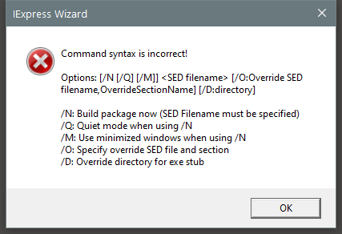

---
title: iexpress.exe | Wizard
---

# iexpress.exe 

* File Path: `C:\Windows\SysWOW64\iexpress.exe`
* Description: Wizard

## Screenshot

## Hashes

Type | Hash
-- | --
MD5 | `82D7A8C4A67BA56A24CEAB1C1114F4CD`
SHA1 | `5470CE7E25B1C1C1000289271117A52A290F1B74`
SHA256 | `DDCBFC5CC1AEDB026C53FDC334D5D03250BE9748861DA72F6E22CB723F756D86`
SHA384 | `983DA9AFCA311BC988AFAAEA6A8BF77309001A49E6B46DD8E4C3749C7B577B208CCE4CB99BFCB30089D1EB425278C8FD`
SHA512 | `3EF94FCE44A727B9FFBC9BD3746734B9CC2BE4660E99171A6BEC6D887736746750DAA6EF7E05A4C901CDC35F63298D170D0381AEAF9F249351829EBCC02F0043`
SSDEEP | `3072:SaBIhefZ3pCAJygxKSgVfHiG4S1rNDnGOb+ahXNqJohePnq45L84IP7:nlxKSggMNDGOb+asEwv5Li`

## Signature

* Status: Signature verified.
* Serial: `3300000266BD1580EFA75CD6D3000000000266`
* Thumbprint: `A4341B9FD50FB9964283220A36A1EF6F6FAA7840`
* Issuer: CN=Microsoft Windows Production PCA 2011, O=Microsoft Corporation, L=Redmond, S=Washington, C=US
* Subject: CN=Microsoft Windows, O=Microsoft Corporation, L=Redmond, S=Washington, C=US

## File Metadata

* Original Filename: IEXPRESS.EXE.MUI
* Product Name: Internet Explorer
* Company Name: Microsoft Corporation
* File Version: 11.00.14393.0 (rs1_release.160715-1616)
* Product Version: 11.00.14393.0
* Language: English (United States)
* Legal Copyright:  Microsoft Corporation. All rights reserved.

## File Similarity (ssdeep match)

File | Score
-- | --
[C:\Windows\system32\iexpress.exe](iexpress.exe-17B93A43E25D821D01AF40BA6BABCC8C.md) | 57
[C:\Windows\system32\iexpress.exe](iexpress.exe-81DE6E1BC6067389835A8A56A5BAE61C.md) | 65
[C:\windows\system32\iexpress.exe](iexpress.exe-CA2F3153EF3BCB0BD3A8984C933DF604.md) | 58
[C:\WINDOWS\system32\iexpress.exe](iexpress.exe-CFCE9FDAC8DD2A4E5209B772CF843E89.md) | 68
[C:\Windows\system32\iexpress.exe](iexpress.exe-F2B70A9C54BC8ECC299942E718ACB785.md) | 71
[C:\windows\SysWOW64\iexpress.exe](iexpress.exe-159199095C9959BE75E61C0FF947708F.md) | 66
[C:\WINDOWS\SysWOW64\iexpress.exe](iexpress.exe-15F76E09BBD08461D288B17514B39051.md) | 65
[C:\Windows\SysWOW64\iexpress.exe](iexpress.exe-D594B2A33EFAFD0EABF09E3FDC05FCEA.md) | 71
[C:\Windows\SysWOW64\iexpress.exe](iexpress.exe-D96FCBCCB9CCE01ED1F35DBDAF6D1FE4.md) | 58

MIT License. Copyright (c) 2020 Strontic.

