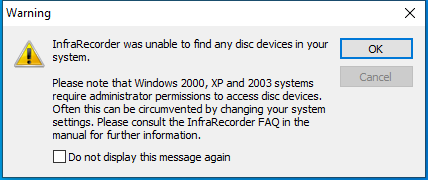

---
title: infrarecorder.exe | InfraRecorder
excerpt: What is infrarecorder.exe?
---

# infrarecorder.exe 

* File Path: `C:\program files\InfraRecorder\infrarecorder.exe`
* Description: InfraRecorder

## Screenshot

## Hashes

Type | Hash
-- | --
MD5 | `44035813EE91CECE0C14D80F0FF2EEC4`
SHA1 | `0B46870B9200711908A98C066101D08469318BC1`
SHA256 | `06E651568150E57F2779EF21692D29A093AD17C18C8233A80BE89DE87E59E37E`
SHA384 | `12E235AC9D2DE1EEB2D6992F8735A5C7265BE61A338772DEA06805944F55E4C4EE52D61B07F8E520372D104181B5586B`
SHA512 | `509D9750A7366651CEAEDF87A2AE877DD2B8E828CB30F83C6ECCA933545DD73A799F8B10ADA0CF3B70097A91FE68F4EDC0E62381F3C5C616BB0DB12C6610BDC8`
SSDEEP | `49152:6GvqU+KfW2E6mjCbRBJnQeuu/X10tTkdYaK:te2HSczWa`

## Runtime Data

### Window Title:
Warning

### Open Handles:

Path | Type
-- | --
(R--)   C:\Users\user\AppData\Roaming\InfraRecorder\logs\200830.log | File
(R-D)   C:\Windows\Fonts\StaticCache.dat | File
(R-D)   C:\Windows\System32\en-US\KernelBase.dll.mui | File
(R-D)   C:\Windows\System32\en-US\shlwapi.dll.mui | File
(R-D)   C:\Windows\System32\en-US\user32.dll.mui | File
(R-D)   C:\Windows\WinSxS\amd64_microsoft.windows.c..-controls.resources_6595b64144ccf1df_6.0.19041.1_en-us_cb612d02732b0fd9\comctl32.dll.mui | File
(RW-)   C:\Users\user\Documents | File
(RW-)   C:\Windows\WinSxS\amd64_microsoft.windows.c..-controls.resources_6595b64144ccf1df_6.0.19041.1_en-us_cb612d02732b0fd9 | File
(RW-)   C:\Windows\WinSxS\amd64_microsoft.windows.common-controls_6595b64144ccf1df_6.0.19041.1_none_b555e41d4684ddec | File
\BaseNamedObjects\NLS_CodePage_1252_3_2_0_0 | Section
\BaseNamedObjects\NLS_CodePage_437_3_2_0_0 | Section
\Sessions\1\BaseNamedObjects\windows_shell_global_counters | Section
\Sessions\1\Windows\Theme4048709601 | Section
\Windows\Theme603176458 | Section

### Loaded Modules:

Path |
-- |
C:\program files\InfraRecorder\infrarecorder.exe |
C:\Windows\System32\ADVAPI32.dll |
C:\Windows\System32\bcryptPrimitives.dll |
C:\Windows\System32\combase.dll |
C:\Windows\System32\COMDLG32.dll |
C:\Windows\System32\GDI32.dll |
C:\Windows\System32\gdi32full.dll |
C:\Windows\System32\IMM32.DLL |
C:\Windows\SYSTEM32\kernel.appcore.dll |
C:\Windows\System32\KERNEL32.DLL |
C:\Windows\System32\KERNELBASE.dll |
C:\Windows\SYSTEM32\MSIMG32.dll |
C:\Windows\System32\msvcp_win.dll |
C:\Windows\System32\msvcrt.dll |
C:\Windows\SYSTEM32\ntdll.dll |
C:\Windows\System32\ole32.dll |
C:\Windows\System32\OLEAUT32.dll |
C:\Windows\SYSTEM32\profapi.dll |
C:\Windows\System32\RPCRT4.dll |
C:\Windows\System32\sechost.dll |
C:\Windows\System32\shcore.dll |
C:\Windows\System32\SHELL32.dll |
C:\Windows\System32\SHLWAPI.dll |
C:\Windows\System32\ucrtbase.dll |
C:\Windows\System32\USER32.dll |
C:\Windows\SYSTEM32\uxtheme.dll |
C:\Windows\SYSTEM32\VERSION.dll |
C:\Windows\System32\win32u.dll |
C:\Windows\SYSTEM32\windows.storage.dll |
C:\Windows\SYSTEM32\WINMM.dll |
C:\Windows\SYSTEM32\Wldp.dll |
C:\Windows\WinSxS\amd64_microsoft.windows.common-controls_6595b64144ccf1df_6.0.19041.1_none_b555e41d4684ddec\COMCTL32.dll |

## Signature

* Status: The file C:\program files\InfraRecorder\infrarecorder.exe is not digitally signed. You cannot run this script on the current system. For more information about running scripts and setting execution policy, see about_Execution_Policies at https:/go.microsoft.com/fwlink/?LinkID=135170
* Serial: ``
* Thumbprint: ``
* Issuer: 
* Subject: 

## File Metadata

* Original Filename: InfraRecorder.exe
* Product Name: InfraRecorder
* Company Name: Christian Kindahl
* File Version: 0.53.0.0
* Product Version: 0.53.0.0
* Language: English (United States)
* Legal Copyright: Copyright  2006-2012 Christian Kindahl

MIT License. Copyright (c) 2020 Strontic.

