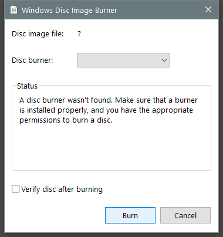

---
title: isoburn.exe | Windows Disc Image Burning Tool
excerpt: What is isoburn.exe?
---

# isoburn.exe 

* File Path: `C:\Windows\SysWOW64\isoburn.exe`
* Description: Windows Disc Image Burning Tool

## Screenshot

## Hashes

Type | Hash
-- | --
MD5 | `4133422034F384BC58988D75844A4BD5`
SHA1 | `491EA265E40900FDCEDE637919E8A3FC11EB08EF`
SHA256 | `1CCA7028745528DD38CE2A385F5DAD4EF6BE6B4A5E2D31C760CF9F21A0510774`
SHA384 | `174B4B5E6A481B36CCEF0FB9A808D46F646CECC2FE60ED468852D81AA02BC7A5D2D19920CAEE5C8F6F87355ABFBE3832`
SHA512 | `F16D79A84EECC7E991D892564FF5A695507B76CCDCAFFDB7A91EF979A76A312755F7D4714E4109E99591B9CA8E67F74D76A28369C45E20ED18D3ECA25F297FC8`
SSDEEP | `768:aByiST623T40hbYDD2Ng7vj8VHRMkL+dlzYa5Kiyk/g3qmPerYon2OwLHha2m0Jv:tT6gmD4gTGHR7aJyk/YAbeHZrQqf`
IMP | `DC797046CC7D70AD1A7A33DAFA70C466`
PESHA1 | `CA3E4A478007AC2AC8B95776C9FB6A8E28285194`
PE256 | `699477D58048B9E47F34F68F53C9B4AD438F8E43485807B94A86C7E70174DFB7`

## Runtime Data

### Window Title:
Windows Disc Image Burner

### Open Handles:

Path | Type
-- | --
(R-D)   C:\Windows\Fonts\StaticCache.dat | File
(R-D)   C:\Windows\SysWOW64\en-US\isoburn.exe.mui | File
(RW-)   C:\Users\user | File
(RW-)   C:\Windows | File
(RW-)   C:\Windows\WinSxS\x86_microsoft.windows.common-controls_6595b64144ccf1df_6.0.17763.1518_none_261b62a767ca4e6d | File
\BaseNamedObjects\C:\*ProgramData\*Microsoft\*Windows\*Caches\*{6AF0698E-D558-4F6E-9B3C-3716689AF493}.2.ver0x0000000000000004.db | Section
\BaseNamedObjects\C:\*ProgramData\*Microsoft\*Windows\*Caches\*{DDF571F2-BE98-426D-8288-1A9A39C3FDA2}.2.ver0x0000000000000004.db | Section
\BaseNamedObjects\C:\*ProgramData\*Microsoft\*Windows\*Caches\*cversions.2.ro | Section
\BaseNamedObjects\NLS_CodePage_1252_3_2_0_0 | Section
\BaseNamedObjects\NLS_CodePage_437_3_2_0_0 | Section
\Sessions\2\Windows\Theme2131664586 | Section
\Windows\Theme966197582 | Section

### Loaded Modules:

Path |
-- |
C:\Windows\SYSTEM32\ntdll.dll |
C:\Windows\System32\wow64.dll |
C:\Windows\System32\wow64cpu.dll |
C:\Windows\System32\wow64win.dll |
C:\Windows\SysWOW64\isoburn.exe |

## Signature

* Status: Signature verified.
* Serial: `33000001C422B2F79B793DACB20000000001C4`
* Thumbprint: `AE9C1AE54763822EEC42474983D8B635116C8452`
* Issuer: CN=Microsoft Windows Production PCA 2011, O=Microsoft Corporation, L=Redmond, S=Washington, C=US
* Subject: CN=Microsoft Windows, O=Microsoft Corporation, L=Redmond, S=Washington, C=US

## File Metadata

* Original Filename: ISOBURN.EXE.MUI
* Product Name: Microsoft Windows Operating System
* Company Name: Microsoft Corporation
* File Version: 10.0.17763.1 (WinBuild.160101.0800)
* Product Version: 10.0.17763.1
* Language: English (United States)
* Legal Copyright:  Microsoft Corporation. All rights reserved.
* Machine Type: 32-bit

## File Scan

* VirusTotal Detections: 0/69
* VirusTotal Link: https://www.virustotal.com/gui/file/1cca7028745528dd38ce2a385f5dad4ef6be6b4a5e2d31c760cf9f21a0510774/detection/

## File Similarity (ssdeep match)

File | Score
-- | --
[C:\Windows\system32\isoburn.exe](isoburn.exe-13D374B961671151002FD0BC062621EF.md) | 32
[C:\Windows\system32\isoburn.exe](isoburn.exe-2853B9F80D6B8309759CC20D5540BF87.md) | 40
[C:\Windows\system32\isoburn.exe](isoburn.exe-68078583D028A4873399AE7F25F64BAD.md) | 33
[C:\WINDOWS\system32\isoburn.exe](isoburn.exe-78164919675FD6B09CDE384C2A3310BC.md) | 33
[C:\Windows\system32\isoburn.exe](isoburn.exe-C03E53FF88AEE435050361147F76FF75.md) | 44
[C:\WINDOWS\SysWOW64\isoburn.exe](isoburn.exe-022E216F1DA247426B2E56C73BEE14F6.md) | 41
[C:\Windows\SysWOW64\isoburn.exe](isoburn.exe-BDC61F9F6F634563BF1DB9C6F92C1DF5.md) | 36
[C:\Windows\SysWOW64\isoburn.exe](isoburn.exe-BF19DD525C7D23CAFC086E9CCB9C06C6.md) | 41
[C:\Windows\SysWOW64\isoburn.exe](isoburn.exe-C599384D60BD0D4609004177762F2480.md) | 33

MIT License. Copyright (c) 2020-2021 Strontic.

