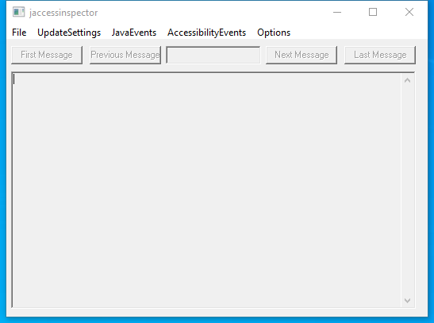

---
title: jaccessinspector.exe | OpenJDK Platform binary
excerpt: What is jaccessinspector.exe?
---

# jaccessinspector.exe 

* File Path: `C:\program files\Amazon Corretto\jdk11.0.8_10\bin\jaccessinspector.exe`
* Description: OpenJDK Platform binary

## Screenshot

## Hashes

Type | Hash
-- | --
MD5 | `F7D693AEA320340B87399B0936891FAC`
SHA1 | `89DAC1C75CD708009E4D3480424AE7AE20722E42`
SHA256 | `362AB5A4E0ED6080237161524E054446BA328D18E13B8A7C7EA44AF5DC2F5B63`
SHA384 | `A522119AF663C391CBAE6717CAF3AA421AE9014AC93CCCBBBE80F263C5B3AB4330F22A3650C718E844558F19AB285DD3`
SHA512 | `E42F01BF30EE79182CC6346E18F30CB1F0D997ABEDC249E4FCC5A9F5DE7DA657CC515C0E1BB97EAC92154C715502A7C905A9190EC7A12FC88725004D1CB8BE36`
SSDEEP | `3072:yEXg/CkuE45+LqzVRftzTedtnfru8KE0dfDHrN+dBRpSHHiqVNozmpu9G2QEqhYS:yGg/CkuE45+LqzVRftzTedtnfru8KE0h`

## Runtime Data

### Window Title:
jaccessinspector

### Open Handles:

Path | Type
-- | --
(R-D)   C:\Windows\Fonts\StaticCache.dat | File
(R-D)   C:\Windows\System32\en-US\user32.dll.mui | File
(RW-)   C:\Users\user\Documents | File
(RW-)   C:\Users\user\Documents\jaccessinspector.log | File
(RW-)   C:\Windows\WinSxS\amd64_microsoft.windows.common-controls_6595b64144ccf1df_6.0.19041.1_none_b555e41d4684ddec | File
\BaseNamedObjects\NLS_CodePage_1252_3_2_0_0 | Section
\BaseNamedObjects\NLS_CodePage_437_3_2_0_0 | Section
\Sessions\1\Windows\Theme4048709601 | Section
\Windows\Theme603176458 | Section

### Loaded Modules:

Path |
-- |
C:\program files\Amazon Corretto\jdk11.0.8_10\bin\jaccessinspector.exe |
C:\program files\Amazon Corretto\jdk11.0.8_10\bin\MSVCP140.dll |
C:\program files\Amazon Corretto\jdk11.0.8_10\bin\VCRUNTIME140.dll |
C:\Windows\System32\ADVAPI32.dll |
C:\Windows\System32\combase.dll |
C:\Windows\System32\GDI32.dll |
C:\Windows\System32\gdi32full.dll |
C:\Windows\System32\IMM32.DLL |
C:\Windows\System32\KERNEL32.DLL |
C:\Windows\System32\KERNELBASE.dll |
C:\Windows\System32\msvcp_win.dll |
C:\Windows\System32\msvcrt.dll |
C:\Windows\SYSTEM32\ntdll.dll |
C:\Windows\System32\RPCRT4.dll |
C:\Windows\System32\sechost.dll |
C:\Windows\System32\ucrtbase.dll |
C:\Windows\System32\USER32.dll |
C:\Windows\system32\uxtheme.dll |
C:\Windows\System32\win32u.dll |

## Signature

* Status: Signature verified.
* Serial: `2F83C35B5136353D68CE9EB669FD1B0B`
* Thumbprint: `4BAD227329ADEF18F215B6475FB7948E1629B505`
* Issuer: CN=Symantec Class 3 SHA256 Code Signing CA, OU=Symantec Trust Network, O=Symantec Corporation, C=US
* Subject: CN=Amazon.com Services LLC, OU=Software Services, O=Amazon.com Services LLC, L=Seattle, S=Washington, C=US

## File Metadata

* Original Filename: jaccessinspector.exe
* Product Name: OpenJDK Platform 11
* Company Name: Amazon.com Inc.
* File Version: 11.0.8
* Product Version: 11.0.8
* Language: Language Neutral
* Legal Copyright: Copyright  2020

## File Similarity (ssdeep match)

File | Score
-- | --
[C:\program files\AdoptOpenJDK\jdk-11.0.8.10-hotspot\bin\jaccessinspector.exe](jaccessinspector.exe-E207EAEA96E647665F9521B771FBE71D.md) | 97
[C:\program files\AdoptOpenJDK\jre-11.0.8.10-hotspot\bin\jaccessinspector.exe](jaccessinspector.exe-7390896659093D8A6FD809383557FAB1.md) | 97

MIT License. Copyright (c) 2020-2021 Strontic.

