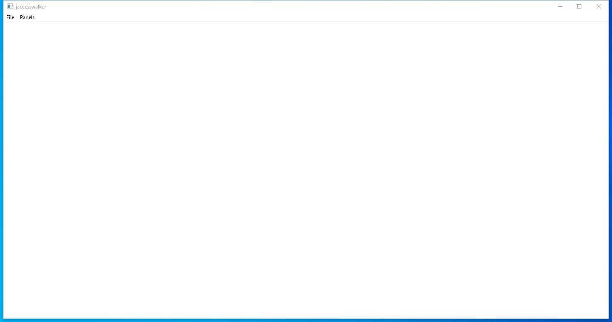

---
title: jaccesswalker.exe | OpenJDK Platform binary
excerpt: What is jaccesswalker.exe?
---

# jaccesswalker.exe 

* File Path: `C:\program files\AdoptOpenJDK\jre-11.0.8.10-hotspot\bin\jaccesswalker.exe`
* Description: OpenJDK Platform binary

## Screenshot

## Hashes

Type | Hash
-- | --
MD5 | `2DFEB79AB555F30720EC0318639D4E35`
SHA1 | `B352AD01D02B8675EC10E8DB0CD3C677B9BD6B76`
SHA256 | `2F28A1A6AE3B6CCED64674737281A2636A8038F0D07F72CC24877CABF54D731C`
SHA384 | `C118604262E9109164BEA1C6C8CD915211D763951DD0472BB4D0541C671D1632FBC8798A48C756387BDCBA39E8D51807`
SHA512 | `9A9EACB49585C39FF8AAC621A3F350733DE12993939F7A5FE2ADA833A89FF4947A05D681FAF2644AD2ECD387923A81C7AE17C5AFB9C1120995DDA8EA308780D4`
SSDEEP | `1536:54HVSP5rZtkuOX2FBPdDjOwSAYEZvU6UpIym6uGF2iSqR63vXVY9C35++t8ktDQb:KVSP5rZtkuOX2FBPdDjOwSAYEZM6UpIC`

## Runtime Data

### Window Title:
jaccesswalker

### Open Handles:

Path | Type
-- | --
(R-D)   C:\Windows\Fonts\StaticCache.dat | File
(RW-)   C:\Users\user\Documents | File
(RW-)   C:\Users\user\Documents\jaccesswalker.log | File
(RW-)   C:\Windows\WinSxS\amd64_microsoft.windows.common-controls_6595b64144ccf1df_5.82.19041.1_none_4b395a7b3c8e63ab | File
(RW-)   C:\Windows\WinSxS\amd64_microsoft.windows.common-controls_6595b64144ccf1df_6.0.19041.1_none_b555e41d4684ddec | File
\BaseNamedObjects\NLS_CodePage_1252_3_2_0_0 | Section
\BaseNamedObjects\NLS_CodePage_437_3_2_0_0 | Section
\Sessions\1\Windows\Theme4048709601 | Section
\Windows\Theme603176458 | Section

### Loaded Modules:

Path |
-- |
C:\program files\AdoptOpenJDK\jre-11.0.8.10-hotspot\bin\jaccesswalker.exe |
C:\program files\AdoptOpenJDK\jre-11.0.8.10-hotspot\bin\MSVCP140.dll |
C:\program files\AdoptOpenJDK\jre-11.0.8.10-hotspot\bin\VCRUNTIME140.dll |
C:\Windows\System32\ADVAPI32.dll |
C:\Windows\System32\combase.dll |
C:\Windows\System32\GDI32.dll |
C:\Windows\System32\gdi32full.dll |
C:\Windows\System32\IMM32.DLL |
C:\Windows\System32\KERNEL32.DLL |
C:\Windows\System32\KERNELBASE.dll |
C:\Windows\System32\MSCTF.dll |
C:\Windows\System32\msvcp_win.dll |
C:\Windows\System32\msvcrt.dll |
C:\Windows\SYSTEM32\ntdll.dll |
C:\Windows\System32\OLEAUT32.dll |
C:\Windows\System32\RPCRT4.dll |
C:\Windows\System32\sechost.dll |
C:\Windows\System32\ucrtbase.dll |
C:\Windows\System32\USER32.dll |
C:\Windows\system32\uxtheme.dll |
C:\Windows\System32\win32u.dll |
C:\Windows\WinSxS\amd64_microsoft.windows.common-controls_6595b64144ccf1df_5.82.19041.1_none_4b395a7b3c8e63ab\COMCTL32.dll |

## Signature

* Status: Signature verified.
* Serial: `0F8CE162B26B70AE59D17A0B2A93AB3A`
* Thumbprint: `0180ED75D6615415E4D6C6C217613B4134F5745E`
* Issuer: CN=DigiCert SHA2 Assured ID Code Signing CA, OU=www.digicert.com, O=DigiCert Inc, C=US
* Subject: CN=London Jamocha Community CIC, O=London Jamocha Community CIC, L=London, C=GB

## File Metadata

* Original Filename: jaccesswalker.exe
* Product Name: OpenJDK Platform 11
* Company Name: AdoptOpenJDK
* File Version: 11.0.8
* Product Version: 11.0.8
* Language: Language Neutral
* Legal Copyright: Copyright  2020

## File Similarity (ssdeep match)

File | Score
-- | --
[C:\program files\AdoptOpenJDK\jdk-11.0.8.10-hotspot\bin\jaccesswalker.exe](jaccesswalker.exe-477AFD0E9EED81D5174F4F6BC868332E.md) | 97
[C:\program files\Amazon Corretto\jdk11.0.8_10\bin\jaccesswalker.exe](jaccesswalker.exe-69C66E9129E5F4102EDC330462B9878B.md) | 97

MIT License. Copyright (c) 2020-2021 Strontic.

