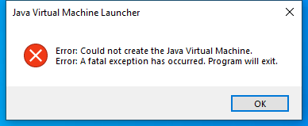

---
title: javaw.exe | OpenJDK Platform binary
excerpt: What is javaw.exe?
---

# javaw.exe 

* File Path: `C:\Program Files\AdoptOpenJDK\jdk-8.0.265.01-hotspot\bin\javaw.exe`
* Description: OpenJDK Platform binary

## Screenshot



## Hashes

Type | Hash
-- | --
MD5 | `725B4D061520D66C1A34A12C66659D00`
SHA1 | `E413B27C77EACBA94A5C6041BB1BFC028B5F0589`
SHA256 | `A18B9688D28DFFBA4970B7D819C2D128C3B760C6F6852E3D340CBC3AF71A261B`
SHA384 | `308EE6FA6E3A68A4C324425CB4B4BC45CD649ED9F72166A7715D39BB5226990A8F61E63E694E8C370E6BDD71C494C742`
SHA512 | `CC763C595FBC819D1E39B8DC4F9E1F6D94E62AE29B160DDE90EBA34845E84E1CA4E42F97DC8C5E7D62E51B905163DB31CB6E8B2827AAD9050E34C0F18AF5F951`
SSDEEP | `6144:DoYCzfmQKiU/HTj2JDOHfFsozseI9TB9naZ67k/iAo:Dovzfm1ikSD4tZI9Tfc1KAo`
IMP | `0F5CC683FA39EDBE3CA8321B37BF56BC`
PESHA1 | `84D16B01A57D47A4656EAD27B71618807C6DBE86`
PE256 | `EF9C3B2ECA8DD5D7A247090C9BFCED8EF22B9AC041E9734046B003E7425E77D5`

## Runtime Data

### Usage (stderr):
```cmhg
Usage: javaw [-options] class [args...]
           (to execute a class)
   or  javaw [-options] -jar jarfile [args...]
           (to execute a jar file)
where options include:
    -d32	  use a 32-bit data model if available
    -d64	  use a 64-bit data model if available
    -server	  to select the "server" VM
                  The default VM is server.

    -cp <class search path of directories and zip/jar files>
    -classpath <class search path of directories and zip/jar files>
                  A ; separated list of directories, JAR archives,
                  and ZIP archives to search for class files.
    -D<name>=<value>
                  set a system property
    -verbose:[class|gc|jni]
                  enable verbose output
    -version      print product version and exit
    -version:<value>
                  Warning: this feature is deprecated and will be removed
                  in a future release.
                  require the specified version to run
    -showversion  print product version and continue
    -jre-restrict-search | -no-jre-restrict-search
                  Warning: this feature is deprecated and will be removed
                  in a future release.
                  include/exclude user private JREs in the version search
    -? -help      print this help message
    -X            print help on non-standard options
    -ea[:<packagename>...|:<classname>]
    -enableassertions[:<packagename>...|:<classname>]
                  enable assertions with specified granularity
    -da[:<packagename>...|:<classname>]
    -disableassertions[:<packagename>...|:<classname>]
                  disable assertions with specified granularity
    -esa | -enablesystemassertions
                  enable system assertions
    -dsa | -disablesystemassertions
                  disable system assertions
    -agentlib:<libname>[=<options>]
                  load native agent library <libname>, e.g. -agentlib:hprof
                  see also, -agentlib:jdwp=help and -agentlib:hprof=help
    -agentpath:<pathname>[=<options>]
                  load native agent library by full pathname
    -javaagent:<jarpath>[=<options>]
                  load Java programming language agent, see java.lang.instrument
    -splash:<imagepath>
                  show splash screen with specified image
See http://www.oracle.com/technetwork/java/javase/documentation/index.html for more details.

```

### Window Title:
Java Virtual Machine Launcher

### Open Handles:

Path | Type
-- | --
(R-D)   C:\Windows\Fonts\StaticCache.dat | File
(R-D)   C:\Windows\SystemResources\imageres.dll.mun | File
(RW-)   C:\Windows\WinSxS\amd64_microsoft.windows.common-controls_6595b64144ccf1df_6.0.19041.488_none_ca04af081b815d21 | File
(RW-)   C:\xCyclopedia | File
\BaseNamedObjects\NLS_CodePage_1252_3_2_0_0 | Section
\BaseNamedObjects\NLS_CodePage_437_3_2_0_0 | Section
\Sessions\1\Windows\Theme2547664911 | Section
\Windows\Theme3854699184 | Section


### Loaded Modules:

Path |
-- |
C:\Program Files\AdoptOpenJDK\jdk-8.0.265.01-hotspot\bin\javaw.exe |
C:\Windows\System32\ADVAPI32.dll |
C:\Windows\System32\GDI32.dll |
C:\Windows\System32\gdi32full.dll |
C:\Windows\System32\KERNEL32.DLL |
C:\Windows\System32\KERNELBASE.dll |
C:\Windows\System32\msvcp_win.dll |
C:\Windows\System32\msvcrt.dll |
C:\Windows\SYSTEM32\ntdll.dll |
C:\Windows\System32\RPCRT4.dll |
C:\Windows\System32\sechost.dll |
C:\Windows\System32\ucrtbase.dll |
C:\Windows\System32\USER32.dll |
C:\Windows\System32\win32u.dll |


## Signature

* Status: Signature verified.
* Serial: `0F8CE162B26B70AE59D17A0B2A93AB3A`
* Thumbprint: `0180ED75D6615415E4D6C6C217613B4134F5745E`
* Issuer: CN=DigiCert SHA2 Assured ID Code Signing CA, OU=www.digicert.com, O=DigiCert Inc, C=US
* Subject: CN=London Jamocha Community CIC, O=London Jamocha Community CIC, L=London, C=GB

## File Metadata

* Original Filename: javaw.exe
* Product Name: OpenJDK Platform 8
* Company Name: AdoptOpenJDK
* File Version: 8.0.2650.1
* Product Version: 8.0.2650.1
* Language: Language Neutral
* Legal Copyright: Copyright  2020
* Machine Type: 64-bit

## File Scan

* VirusTotal Detections: 0/70
* VirusTotal Link: https://www.virustotal.com/gui/file/a18b9688d28dffba4970b7d819c2d128c3b760c6f6852e3d340cbc3af71a261b/detection/

## File Similarity (ssdeep match)

File | Score
-- | --
[C:\Program Files\AdoptOpenJDK\jdk-8.0.265.01-hotspot\jre\bin\javaw.exe](javaw.exe-6EEAF0FBE28B66421603A4D4CB6C8FDE.md) | 96
[C:\Program Files\AdoptOpenJDK\jre-8.0.265.01-hotspot\bin\javaw.exe](javaw.exe-6EF1E54DE872CC3F595E8F0CA1EF4873.md) | 96

## Possible Misuse

*The following table contains possible examples of `javaw.exe` being misused. While `javaw.exe` is **not** inherently malicious, its legitimate functionality can be abused for malicious purposes.*

Source | Source File | Example | License
-- | -- | -- | --
[sigma](https://github.com/Neo23x0/sigma) | [win_mal_adwind.yml](https://github.com/Neo23x0/sigma/blob/master/rules/windows/process_creation/win_mal_adwind.yml) | `description: Detects javaw.exe in AppData folder as used by Adwind / JRAT`{:.highlight .language-yaml} | [DRL 1.0](https://github.com/Neo23x0/sigma/blob/master/LICENSE.Detection.Rules.md)


MIT License. Copyright (c) 2020-2021 Strontic.


