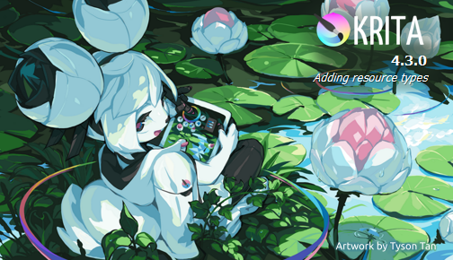

---
title: krita.exe | 
excerpt: What is krita.exe?
---

# krita.exe 

* File Path: `C:\Program Files\Krita (x64)\bin\krita.exe`
* Description: Krita (Window Title)

## Screenshot



## Hashes

Type | Hash
-- | --
MD5 | `32B22B703D7E37C4B2B8806907B17922`
SHA1 | `2B854A9448015D861B9F4DD1EC99CEA86FA7E46C`
SHA256 | `25E068841BA2C77061DEEE863E3E7905150EA5DBBD691419A5059DCAF58EF8EC`
SHA384 | `E177FE7FBF5BB67DED674B764BE7A9B36EA85EB83E68E9D851C28F974C1347DD766A11A8FA2266C1AF008F988A8527F8`
SHA512 | `206ABE311C1C6E0D4CB0C6EEDD1C12AB0B3195652C9DE58FF2652BF999A86F2D98BF0159A498E55E031684B6C1A4F28B7D9584320C72635E605039B18F19EC5B`
SSDEEP | `49152:QHcM3WZrahv5v8+eLOKTgxfbuHscERn6hjPW5c0Q7xB4157k8hd4gXFGjtSbPSvf:QHck4k5v8+eygcCHjlezVzZw`
IMP | `5A8E48F907784953939EEEEA290AD080`
PESHA1 | `FF0BA0DECD486B088444DEA9CC004977C4154882`
PE256 | `F3126975AC34570913DD74A42721176AB8A03845299D453DD6E77C95CFE5B0EA`

## Runtime Data

### Usage (stdout):
```cmhg
*** EGL colorSpace: 0x308A
*** EGL format: 0x93A1
*** Native format: 0x57
*** EGL colorSpace: 0x308A
*** EGL format: 0x93A1
*** Native format: 0x57
*** EGL colorSpace: 0x308A
*** EGL format: 0x93A1
*** Native format: 0x57
*** EGL colorSpace: 0x308A
*** EGL format: 0x93A1
*** Native format: 0x57
Usage: C:\Program Files\Krita (x64)\bin\krita.exe [options] [file(s)]

Options:
  -v, --version                                Displays version information.
  -?, -h, --help                               Displays this help.
  --template                                   Open a new document with a
                                               template
  --new-image <colorspace,depth,width,height>  Create a new image.
                                               Possible colorspace values are:
                                                  * RGBA
                                                  * XYZA
                                                  * LABA
                                                  * CMYKA
                                                  * GRAY
                                                  * YCbCrA
                                               Possible channel depth arguments
                                               are
                                                  * U8 (8 bits integer)
                                                  * U16 (16 bits integer)
                                                  * F16 (16 bits floating point)
                                                  * F32 (32 bits floating point)
  --workspace <workspace>                      The name of the workspace to
                                               open Krita with
  --windowlayout <windowlayout>                The name of the window layout to
                                               open Krita with
  --load-session <load-session>                The name of the session to open
                                               Krita with
  --canvasonly                                 Start Krita in canvas-only mode
  --nosplash                                   Do not show the splash screen
  --fullscreen                                 Start Krita in full-screen mode
  --dpi <dpiX,dpiY>                            Override display DPI
  --export                                     Export to the given filename and
                                               exit
  --export-sequence                            Export animation to the given
                                               filename and exit
  --export-filename <filename>                 Filename for export
  --file-layer <file-layer>                    File layer to be added to
                                               existing or new file

Arguments:
  [file(s)]                                    File(s) or URL(s) to open

```

### Usage (stderr):
```cmhg
Unknown options: e, l, p.

```

### Window Title:
Krita

### Open Handles:

Path | Type
-- | --
(R-D)   C:\Windows\apppatch\DirectXApps_FOD.sdb | File
(R-D)   C:\Windows\System32\en-US\KernelBase.dll.mui | File
(R-D)   C:\Windows\System32\en-US\UIAutomationCore.dll.mui | File
(R-D)   C:\Windows\System32\en-US\user32.dll.mui | File
(RW-)   C:\Users\user\AppData\Local\krita.log | File
(RW-)   C:\Users\user\AppData\Local\krita-sysinfo.log | File
(RW-)   C:\Users\user\AppData\Local\Temp\qtsingleapplication-620b-1-lockfile | File
(RW-)   C:\Windows\System32 | File
(RW-)   C:\Windows\WinSxS\amd64_microsoft.windows.common-controls_6595b64144ccf1df_5.82.19041.488_none_4238de57f6b64d28 | File
(RW-)   C:\xCyclopedia | File
\BaseNamedObjects\__ComCatalogCache__ | Section
\BaseNamedObjects\NLS_CodePage_1252_3_2_0_0 | Section
\BaseNamedObjects\NLS_CodePage_437_3_2_0_0 | Section
\Sessions\1\BaseNamedObjects\qipc_sharedmemory_qtsingleapplicationbbd57ba70f9332ce84eafd5e7cb288c90bcc35d56 | Section
\Sessions\1\BaseNamedObjects\windows_shell_global_counters | Section
\Sessions\1\Windows\Theme2547664911 | Section
\Windows\Theme3854699184 | Section


### Loaded Modules:

Path |
-- |
C:\Program Files\Krita (x64)\bin\krita.exe |
C:\Program Files\Krita (x64)\bin\libexiv2.dll |
C:\Program Files\Krita (x64)\bin\libfftw3.dll |
C:\Program Files\Krita (x64)\bin\libgcc_s_seh-1.dll |
C:\Program Files\Krita (x64)\bin\libHalf-2_4.dll |
C:\Program Files\Krita (x64)\bin\libintl.DLL |
C:\Program Files\Krita (x64)\bin\libKF5Completion.dll |
C:\Program Files\Krita (x64)\bin\libKF5ConfigCore.dll |
C:\Program Files\Krita (x64)\bin\libKF5ConfigGui.dll |
C:\Program Files\Krita (x64)\bin\libKF5CoreAddons.dll |
C:\Program Files\Krita (x64)\bin\libKF5GuiAddons.dll |
C:\Program Files\Krita (x64)\bin\libKF5I18n.dll |
C:\Program Files\Krita (x64)\bin\libKF5ItemViews.dll |
C:\Program Files\Krita (x64)\bin\libKF5WidgetsAddons.dll |
C:\Program Files\Krita (x64)\bin\libKF5WindowSystem.dll |
C:\Program Files\Krita (x64)\bin\libkritacolor.dll |
C:\Program Files\Krita (x64)\bin\libkritacommand.dll |
C:\Program Files\Krita (x64)\bin\libkritaflake.dll |
C:\Program Files\Krita (x64)\bin\libkritaglobal.dll |
C:\Program Files\Krita (x64)\bin\libkritaimage.dll |
C:\Program Files\Krita (x64)\bin\libkritaimpex.dll |
C:\Program Files\Krita (x64)\bin\libkritalibbrush.dll |
C:\Program Files\Krita (x64)\bin\libkritametadata.dll |
C:\Program Files\Krita (x64)\bin\libkritaodf.dll |
C:\Program Files\Krita (x64)\bin\libkritapigment.dll |
C:\Program Files\Krita (x64)\bin\libkritaplugin.dll |
C:\Program Files\Krita (x64)\bin\libkritapsd.dll |
C:\Program Files\Krita (x64)\bin\libkritastore.dll |
C:\Program Files\Krita (x64)\bin\libkritaui.dll |
C:\Program Files\Krita (x64)\bin\libkritaversion.dll |
C:\Program Files\Krita (x64)\bin\libkritawidgets.dll |
C:\Program Files\Krita (x64)\bin\libkritawidgetutils.dll |
C:\Program Files\Krita (x64)\bin\libpng16.dll |
C:\Program Files\Krita (x64)\bin\libstdc++-6.dll |
C:\Program Files\Krita (x64)\bin\libwinpthread-1.dll |
C:\Program Files\Krita (x64)\bin\Qt5Core.dll |
C:\Program Files\Krita (x64)\bin\Qt5Gui.dll |
C:\Program Files\Krita (x64)\bin\Qt5Multimedia.dll |
C:\Program Files\Krita (x64)\bin\Qt5Network.dll |
C:\Program Files\Krita (x64)\bin\Qt5PrintSupport.dll |
C:\Program Files\Krita (x64)\bin\Qt5Widgets.dll |
C:\Program Files\Krita (x64)\bin\Qt5Xml.dll |
C:\Windows\System32\ADVAPI32.dll |
C:\Windows\System32\combase.dll |
C:\Windows\System32\comdlg32.dll |
C:\Windows\System32\CRYPT32.dll |
C:\Windows\SYSTEM32\dwmapi.dll |
C:\Windows\System32\GDI32.dll |
C:\Windows\System32\gdi32full.dll |
C:\Windows\System32\KERNEL32.DLL |
C:\Windows\System32\KERNELBASE.dll |
C:\Windows\SYSTEM32\MPR.dll |
C:\Windows\System32\msvcp_win.dll |
C:\Windows\System32\msvcrt.dll |
C:\Windows\SYSTEM32\NETAPI32.dll |
C:\Windows\SYSTEM32\ntdll.dll |
C:\Windows\System32\ole32.dll |
C:\Windows\System32\PSAPI.DLL |
C:\Windows\System32\RPCRT4.dll |
C:\Windows\System32\sechost.dll |
C:\Windows\System32\shcore.dll |
C:\Windows\System32\SHELL32.dll |
C:\Windows\System32\SHLWAPI.dll |
C:\Windows\System32\ucrtbase.dll |
C:\Windows\System32\USER32.dll |
C:\Windows\SYSTEM32\USERENV.dll |
C:\Windows\SYSTEM32\UxTheme.dll |
C:\Windows\SYSTEM32\VERSION.dll |
C:\Windows\System32\win32u.dll |
C:\Windows\SYSTEM32\WINMM.dll |
C:\Windows\System32\WS2_32.dll |


## Signature

* Status: Signature verified.
* Serial: `087CF87879FAA94B9DCABA3C3A8B0D88`
* Thumbprint: `B3C0F5F192924AEBED669F1D180279A954A066B3`
* Issuer: CN=DigiCert SHA2 Assured ID Code Signing CA, OU=www.digicert.com, O=DigiCert Inc, C=US
* Subject: CN=K Desktop Environment e.V., O=K Desktop Environment e.V., L=Berlin, C=DE

## File Metadata

* Original Filename: 
* Product Name: 
* Company Name: 
* File Version: 
* Product Version: 
* Language: 
* Legal Copyright: 
* Machine Type: 64-bit

## File Scan

* VirusTotal Detections: 0/69
* VirusTotal Link: https://www.virustotal.com/gui/file/25e068841ba2c77061deee863e3e7905150ea5dbbd691419a5059dcaf58ef8ec/detection/


MIT License. Copyright (c) 2020-2021 Strontic.


