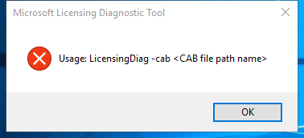

---
title: licensingdiag.exe | Licensing Diagnostic Tool
---

# licensingdiag.exe 

* File Path: `C:\WINDOWS\system32\licensingdiag.exe`
* Description: Licensing Diagnostic Tool

## Screenshot

## Hashes

Type | Hash
-- | --
MD5 | `3B178CA47D045EEF6F29342BD89129BF`
SHA1 | `9893FF874342C657B24E9F77F69D13841C6E56D0`
SHA256 | `E4E1E4BA82EA6F1388F8803A1272794CB44DC820BEED9F668588B3E9CD7454A4`
SHA384 | `3593BA3DE2A55976BD6CC0972AD64F6D58D4977BD3D4D7095527F4DF4DF656FA642290CA4A131E7FF51DB02361BA58A3`
SHA512 | `4DF946929767546FC4798E6292B83C1E9F134E88A94EA8BBD7068528C4E5DECF6884442F300629C00B153A40C2EA8A129CF7C4225795B81BBA3A822A40C7D484`
SSDEEP | `6144:kLG5qsUI0lQc1w+12JmGUR9LUWmwhoXK+fPcvnIka//2BtZGSy:lq3acwYwmGUbLcwhoXKOGIZ/EZGSy`

## Runtime Data

### Child Processes:
conhost.exe

## Signature

* Status: Signature verified.
* Serial: `330000023241FB59996DCC4DFF000000000232`
* Thumbprint: `FF82BC38E1DA5E596DF374C53E3617F7EDA36B06`
* Issuer: CN=Microsoft Windows Production PCA 2011, O=Microsoft Corporation, L=Redmond, S=Washington, C=US
* Subject: CN=Microsoft Windows, O=Microsoft Corporation, L=Redmond, S=Washington, C=US

## File Metadata

* Original Filename: LicensingDiag.exe.mui
* Product Name: Microsoft Windows Operating System
* Company Name: Microsoft Corporation
* File Version: 10.0.18362.1 (WinBuild.160101.0800)
* Product Version: 10.0.18362.1
* Language: English (United States)
* Legal Copyright:  Microsoft Corporation. All rights reserved.

MIT License. Copyright (c) 2020 Strontic.

