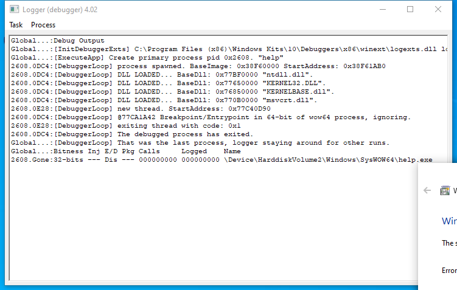

---
title: logger.exe | 
excerpt: What is logger.exe?
---

# logger.exe 

* File Path: `C:\Program Files (x86)\Windows Kits\10\Debuggers\x64\logger.exe`

## Screenshot

## Hashes

Type | Hash
-- | --
MD5 | `5292EA7480417BDFD072BDBDF3E6A0AD`
SHA1 | `56178670CE5C14F59A9AEB24B5BE0209615513B7`
SHA256 | `388767F42AE5FCF196C152C351DF814CE14A85B4AF1EA63ADB10622DE0FF989C`
SHA384 | `EAC30476AD4BE29F8D8930614002C05C798DA20D8E899921CB1194FA31B21D42513FDB8D75DD697315911527FEF3D13A`
SHA512 | `BB277AD59B9CB1CD1124023AA6F09BB72645F86BE0059FF76E9777AD2B56059D082DCD06CF1F810775A4D02D657CB94D4D3BCFC313344BD8651A2534B06AFA06`
SSDEEP | `6144:oyKgLwznzYqesLqpk7wpMLRh71aO1X1zZ/uvlzQI+7kk:sTcqeve5lQlcP`
IMP | `53806EF788FB600B613567AA1B57D6F0`
PESHA1 | `593C1278FD2886DAC7ABC8BD74D3C692B7D2B9A3`
PE256 | `B0DB2826AC8C64459420A35D1B2A9D231D13DE6CC98FC9E475BDDBB5502230F6`

## Runtime Data

### Child Processes:
conhost.exe

### Window Title:
Error

### Open Handles:

Path | Type
-- | --
(R-D)   C:\Windows\Fonts\StaticCache.dat | File
(RW-)   C:\Users\user | File
\BaseNamedObjects\C:\*ProgramData\*Microsoft\*Windows\*Caches\*{6AF0698E-D558-4F6E-9B3C-3716689AF493}.2.ver0x0000000000000002.db | Section
\BaseNamedObjects\C:\*ProgramData\*Microsoft\*Windows\*Caches\*{DDF571F2-BE98-426D-8288-1A9A39C3FDA2}.2.ver0x0000000000000002.db | Section
\BaseNamedObjects\C:\*ProgramData\*Microsoft\*Windows\*Caches\*cversions.2 | Section
\BaseNamedObjects\NLS_CodePage_1252_3_2_0_0 | Section
\BaseNamedObjects\NLS_CodePage_437_3_2_0_0 | Section
\Sessions\1\Windows\Theme1383959086 | Section
\Windows\Theme2042523233 | Section

### Loaded Modules:

Path |
-- |
C:\Program Files (x86)\Windows Kits\10\Debuggers\x64\logger.exe |
C:\Windows\System32\KERNEL32.DLL |
C:\Windows\System32\KERNELBASE.dll |
C:\Windows\SYSTEM32\ntdll.dll |

## Signature

* Status: Signature verified.
* Serial: `33000002CF6D2CC57CAA65A6D80000000002CF`
* Thumbprint: `1A221B3B4FEF088B17BA6704FD088DF192D9E0EF`
* Issuer: CN=Microsoft Code Signing PCA 2010, O=Microsoft Corporation, L=Redmond, S=Washington, C=US
* Subject: CN=Microsoft Corporation, O=Microsoft Corporation, L=Redmond, S=Washington, C=US

## File Metadata

* Original Filename: 
* Product Name: 
* Company Name: 
* File Version: 
* Product Version: 
* Language: 
* Legal Copyright: 
* Machine Type: 64-bit

## File Scan

* VirusTotal Detections: 0/75
* VirusTotal Link: https://www.virustotal.com/gui/file/388767f42ae5fcf196c152c351df814ce14a85b4af1ea63adb10622de0ff989c/detection

## Possible Misuse

*The following table contains possible examples of `logger.exe` being misused. While `logger.exe` is **not** inherently malicious, its legitimate functionality can be abused for malicious purposes.*

Source | Source File | Example | License
-- | -- | -- | --
[sigma](https://github.com/Neo23x0/sigma) | [lnx_shell_clear_cmd_history.yml](https://github.com/Neo23x0/sigma/blob/master/rules/linux/lnx_shell_clear_cmd_history.yml) | `# (is_empty=false; inotifywait -m .bash_history \| while read file; do if [ $(wc -l <.bash_history) -lt 1  ]; then if  [ "$is_empty" = false ]; then logger -i -p local5.info -t empty_bash_history "$USER : ~/.bash_history is empty "; is_empty=true; fi; else is_empty=false;  fi;  done ) &` | [DRL 1.0](https://github.com/Neo23x0/sigma/blob/master/LICENSE.Detection.Rules.md)
[malware-ioc](https://github.com/eset/malware-ioc) | [attor](https://github.com/eset/malware-ioc/blob/master/attor/README.adoc) | `==== Key/clipboard logger plugin` | [© ESET 2014-2018](https://github.com/eset/malware-ioc/blob/master/LICENSE)
[signature-base](https://github.com/Neo23x0/signature-base) | [apt_op_wocao.yar](https://github.com/Neo23x0/signature-base/blob/master/yara/apt_op_wocao.yar) | $ = "Logger PingConnect" | [CC BY-NC 4.0](https://github.com/Neo23x0/signature-base/blob/master/LICENSE)
[signature-base](https://github.com/Neo23x0/signature-base) | [apt_op_wocao.yar](https://github.com/Neo23x0/signature-base/blob/master/yara/apt_op_wocao.yar) | $ = "Logger GetAdmins" | [CC BY-NC 4.0](https://github.com/Neo23x0/signature-base/blob/master/LICENSE)
[signature-base](https://github.com/Neo23x0/signature-base) | [apt_op_wocao.yar](https://github.com/Neo23x0/signature-base/blob/master/yara/apt_op_wocao.yar) | $ = "Logger InstallPro" | [CC BY-NC 4.0](https://github.com/Neo23x0/signature-base/blob/master/LICENSE)
[signature-base](https://github.com/Neo23x0/signature-base) | [apt_op_wocao.yar](https://github.com/Neo23x0/signature-base/blob/master/yara/apt_op_wocao.yar) | $ = "Logger Exec" | [CC BY-NC 4.0](https://github.com/Neo23x0/signature-base/blob/master/LICENSE)
[signature-base](https://github.com/Neo23x0/signature-base) | [apt_op_wocao.yar](https://github.com/Neo23x0/signature-base/blob/master/yara/apt_op_wocao.yar) | $ = "Logger VolumeName & \" (\" & objDrive.DriveLetter & \":)\" _" | [CC BY-NC 4.0](https://github.com/Neo23x0/signature-base/blob/master/LICENSE)
[signature-base](https://github.com/Neo23x0/signature-base) | [crime_fireball.yar](https://github.com/Neo23x0/signature-base/blob/master/yara/crime_fireball.yar) | $s5 = "Logger Name:" fullword ascii | [CC BY-NC 4.0](https://github.com/Neo23x0/signature-base/blob/master/LICENSE)
[signature-base](https://github.com/Neo23x0/signature-base) | [gen_github_net_redteam_tools_guids.yara](https://github.com/Neo23x0/signature-base/blob/master/yara/gen_github_net_redteam_tools_guids.yara) | reference = "https://github.com/xxczaki/logger" | [CC BY-NC 4.0](https://github.com/Neo23x0/signature-base/blob/master/LICENSE)
[signature-base](https://github.com/Neo23x0/signature-base) | [spy_equation_fiveeyes.yar](https://github.com/Neo23x0/signature-base/blob/master/yara/spy_equation_fiveeyes.yar) | description = "EquationDrug - Key/clipboard logger driver - msrtvd.sys" | [CC BY-NC 4.0](https://github.com/Neo23x0/signature-base/blob/master/LICENSE)
[signature-base](https://github.com/Neo23x0/signature-base) | [spy_querty_fiveeyes.yar](https://github.com/Neo23x0/signature-base/blob/master/yara/spy_querty_fiveeyes.yar) | $s3 = "This command will return the current status of the Keyboard Logger (Whether it i" ascii | [CC BY-NC 4.0](https://github.com/Neo23x0/signature-base/blob/master/LICENSE)
[signature-base](https://github.com/Neo23x0/signature-base) | [spy_querty_fiveeyes.yar](https://github.com/Neo23x0/signature-base/blob/master/yara/spy_querty_fiveeyes.yar) | $s7 = "<description>Keystroke Logger Lp Plugin</description>" fullword ascii | [CC BY-NC 4.0](https://github.com/Neo23x0/signature-base/blob/master/LICENSE)
[signature-base](https://github.com/Neo23x0/signature-base) | [spy_querty_fiveeyes.yar](https://github.com/Neo23x0/signature-base/blob/master/yara/spy_querty_fiveeyes.yar) | $s0 = "<shortDescription>Keystroke Logger Plugin.</shortDescription>" fullword ascii | [CC BY-NC 4.0](https://github.com/Neo23x0/signature-base/blob/master/LICENSE)
[signature-base](https://github.com/Neo23x0/signature-base) | [spy_querty_fiveeyes.yar](https://github.com/Neo23x0/signature-base/blob/master/yara/spy_querty_fiveeyes.yar) | $s2 = "<description>Keystroke Logger Plugin.</description>" fullword ascii | [CC BY-NC 4.0](https://github.com/Neo23x0/signature-base/blob/master/LICENSE)

MIT License. Copyright (c) 2020 Strontic.

