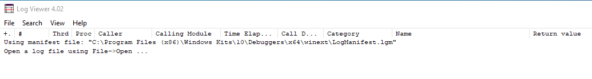

---
title: logviewer.exe | Win32 API Log Viewer
excerpt: What is logviewer.exe?
---

# logviewer.exe 

* File Path: `C:\Program Files (x86)\Windows Kits\10\Debuggers\x86\logviewer.exe`
* Description: Win32 API Log Viewer

## Screenshot

## Hashes

Type | Hash
-- | --
MD5 | `91C40004502F4663585680165766E1D4`
SHA1 | `09DFC9EA557CEAAD4DC9E0A8827203B105C906FA`
SHA256 | `CAE4E16B99E45ED28EE96E5749B0D279FD754B559BE91B6EC238FD7B7186327D`
SHA384 | `D4F25B0208E3E4B98058EC68AD9F615B664B5A525D41BB4D1DA3DFF3151C180B893F516CAEA5D22EC87BE830AE352961`
SHA512 | `7F2BB20ED12B91C31D80DEBD8BFD40055C1896984339421CE2404E1FBA7EEF2EC693466CE2336A8C7FB9B9C359AD199DE59BF502E20DB94173E105CD3BF02960`
SSDEEP | `6144:qvr/WG7aCyftsLaXr+SW3PR6ytIFAd2F/s/UsEK:qvB+jW3syKFAdSUMK`
IMP | `331C84F694AC087D09B8950C3FA0ABB2`
PESHA1 | `9183D15A1B33A98759760A27CED7FADB64BF2A85`
PE256 | `67EDBE20D5FB181F241BE223AE6FF95C6A2A3604E3E27831F651A029E08640AC`

## Runtime Data

### Window Title:
Error

### Open Handles:

Path | Type
-- | --
(R-D)   C:\Windows\Fonts\StaticCache.dat | File
(R-D)   C:\Windows\SystemResources\imageres.dll.mun | File
(RW-)   C:\Users\user | File
(RW-)   C:\Users\user\--help | File
(RW-)   C:\Windows | File
(RW-)   C:\Windows\WinSxS\x86_microsoft.windows.common-controls_6595b64144ccf1df_6.0.19041.488_none_11b1e5df2ffd8627 | File
\BaseNamedObjects\C:\*ProgramData\*Microsoft\*Windows\*Caches\*{6AF0698E-D558-4F6E-9B3C-3716689AF493}.2.ver0x0000000000000002.db | Section
\BaseNamedObjects\C:\*ProgramData\*Microsoft\*Windows\*Caches\*{DDF571F2-BE98-426D-8288-1A9A39C3FDA2}.2.ver0x0000000000000002.db | Section
\BaseNamedObjects\C:\*ProgramData\*Microsoft\*Windows\*Caches\*cversions.2 | Section
\BaseNamedObjects\NLS_CodePage_1252_3_2_0_0 | Section
\BaseNamedObjects\NLS_CodePage_437_3_2_0_0 | Section
\Sessions\1\Windows\Theme1383959086 | Section
\Windows\Theme2042523233 | Section

### Loaded Modules:

Path |
-- |
C:\Program Files (x86)\Windows Kits\10\Debuggers\x86\logviewer.exe |
C:\Windows\SYSTEM32\ntdll.dll |
C:\Windows\System32\wow64.dll |
C:\Windows\System32\wow64cpu.dll |
C:\Windows\System32\wow64win.dll |

## Signature

* Status: The file C:\Program Files (x86)\Windows Kits\10\Debuggers\x86\logviewer.exe is not digitally signed. You cannot run this script on the current system. For more information about running scripts and setting execution policy, see about_Execution_Policies at https:/go.microsoft.com/fwlink/?LinkID=135170
* Serial: ``
* Thumbprint: ``
* Issuer: 
* Subject: 

## File Metadata

* Original Filename: LogViewer.exe
* Product Name: Logging/Debugging Tools for Windows(R)
* Company Name: Microsoft Corporation
* File Version: 4.02 (WinBuild.160101.0800)
* Product Version: 10.0.19041.1
* Language: English (United States)
* Legal Copyright:  Microsoft Corporation. All rights reserved.
* Machine Type: 32-bit

## File Scan

* VirusTotal Detections: 0/76
* VirusTotal Link: https://www.virustotal.com/gui/file/cae4e16b99e45ed28ee96e5749b0d279fd754b559be91b6ec238fd7b7186327d/detection

MIT License. Copyright (c) 2020 Strontic.

