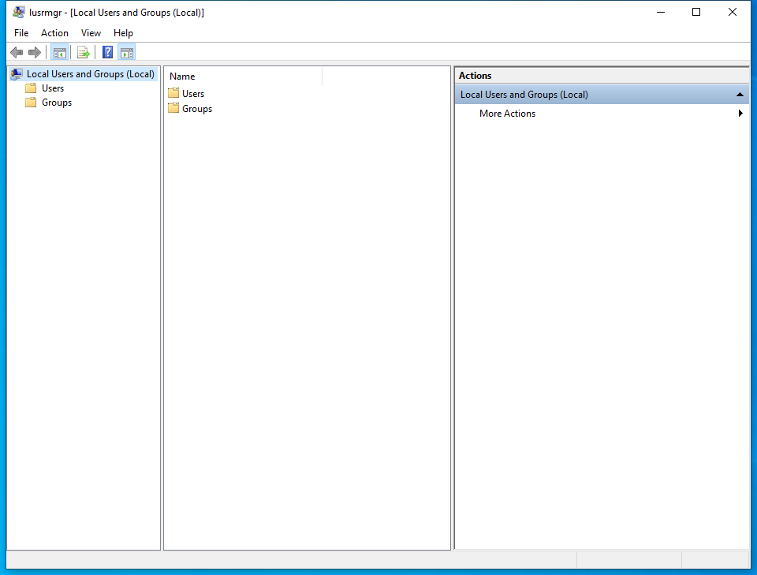

---
title: lusrmgr.msc | 
excerpt: What is lusrmgr.msc?
---

# lusrmgr.msc 

* File Path: `C:\Windows\system32\lusrmgr.msc`
* Description: lusrmgr - [Local Users and Groups (Local)] (Window Title)

## Screenshot

## Hashes

Type | Hash
-- | --
MD5 | `3279476E39DE235B426D69CFE8DEBF55`
SHA1 | `921CA2B3293F3FCB905B24A9536D8525461DE2A3`
SHA256 | `C328EA040E816B77F03D14BB2D6EFB63FF4DA5F34C45272B56DC07E5034F2BC1`
SHA384 | `AA530A0763632FC230FE5C46AE319A00C23155B6908CBCF0A9FB91492BF909CF5C1B0A823CAA9AA9FE9CBAB6ED2B7006`
SHA512 | `765E048B711922D9754C6B8103B8602C55A70011C46ADAFD12F7A9294CE43D476A8C6F0836523B0EBA48AA957B95C28289FA068150A63D69128BEF3CB2977210`
SSDEEP | `384:v81U6142JdMwPGZI1hZoPZspvWMS2OWMzVZL8ewSF25YwJDXFgKlJdMwPGZI1PV:E1UuLeweZIfpverd925NJjXLeweZIhV`
PESHA1 | `921CA2B3293F3FCB905B24A9536D8525461DE2A3`
PE256 | `C328EA040E816B77F03D14BB2D6EFB63FF4DA5F34C45272B56DC07E5034F2BC1`

## Runtime Data

### Window Title:
lusrmgr - [Local Users and Groups (Local)]

### Open Handles:

Path | Type
-- | --
(R-D)   C:\Windows\Fonts\StaticCache.dat | File
(R-D)   C:\Windows\System32\en-US\KernelBase.dll.mui | File
(R-D)   C:\Windows\System32\en-US\localsec.dll.mui | File
(R-D)   C:\Windows\System32\en-US\MFC42u.dll.mui | File
(R-D)   C:\Windows\System32\en-US\mmc.exe.mui | File
(R-D)   C:\Windows\System32\en-US\mmcbase.dll.mui | File
(R-D)   C:\Windows\System32\en-US\mmcndmgr.dll.mui | File
(R-D)   C:\Windows\System32\en-US\user32.dll.mui | File
(R-D)   C:\Windows\SystemResources\mmcbase.dll.mun | File
(R-D)   C:\Windows\SystemResources\mmcndmgr.dll.mun | File
(RW-)   C:\Users\user | File
(RW-)   C:\Windows\WinSxS\amd64_microsoft.windows.common-controls_6595b64144ccf1df_5.82.19041.488_none_4238de57f6b64d28 | File
(RW-)   C:\Windows\WinSxS\amd64_microsoft.windows.common-controls_6595b64144ccf1df_6.0.19041.746_none_ca02b4b61b8320a4 | File
\BaseNamedObjects\__ComCatalogCache__ | Section
\BaseNamedObjects\C:\*ProgramData\*Microsoft\*Windows\*Caches\*{6AF0698E-D558-4F6E-9B3C-3716689AF493}.2.ver0x0000000000000002.db | Section
\BaseNamedObjects\C:\*ProgramData\*Microsoft\*Windows\*Caches\*{DDF571F2-BE98-426D-8288-1A9A39C3FDA2}.2.ver0x0000000000000002.db | Section
\BaseNamedObjects\C:\*ProgramData\*Microsoft\*Windows\*Caches\*cversions.2 | Section
\BaseNamedObjects\NLS_CodePage_1252_3_2_0_0 | Section
\BaseNamedObjects\NLS_CodePage_437_3_2_0_0 | Section
\BaseNamedObjects\windows_shell_global_counters | Section
\Sessions\1\BaseNamedObjects\1e24HWNDInterface:3b059c | Section
\Sessions\1\BaseNamedObjects\1e24HWNDInterface:470598 | Section
\Sessions\1\BaseNamedObjects\SessionImmersiveColorPreference | Section
\Sessions\1\BaseNamedObjects\windows_shell_global_counters | Section
\Sessions\1\Windows\Theme3205582532 | Section
\Windows\Theme3800351183 | Section

### Loaded Modules:

Path |
-- |
C:\Windows\SYSTEM32\AcGenral.dll |
C:\Windows\System32\ADVAPI32.dll |
C:\Windows\SYSTEM32\apphelp.dll |
C:\Windows\System32\combase.dll |
C:\Windows\System32\GDI32.dll |
C:\Windows\System32\gdi32full.dll |
C:\Windows\System32\KERNEL32.DLL |
C:\Windows\System32\KERNELBASE.dll |
C:\Windows\SYSTEM32\mmc.exe |
C:\Windows\System32\msvcp_win.dll |
C:\Windows\System32\msvcrt.dll |
C:\Windows\SYSTEM32\ntdll.dll |
C:\Windows\System32\ole32.dll |
C:\Windows\System32\RPCRT4.dll |
C:\Windows\System32\sechost.dll |
C:\Windows\System32\SHELL32.dll |
C:\Windows\System32\SHLWAPI.dll |
C:\Windows\System32\ucrtbase.dll |
C:\Windows\System32\USER32.dll |
C:\Windows\SYSTEM32\USERENV.dll |
C:\Windows\System32\win32u.dll |

## Signature

* Status: Signature verified.
* Serial: `3300000266BD1580EFA75CD6D3000000000266`
* Thumbprint: `A4341B9FD50FB9964283220A36A1EF6F6FAA7840`
* Issuer: CN=Microsoft Windows Production PCA 2011, O=Microsoft Corporation, L=Redmond, S=Washington, C=US
* Subject: CN=Microsoft Windows, O=Microsoft Corporation, L=Redmond, S=Washington, C=US

## File Metadata

* Original Filename: 
* Product Name: 
* Company Name: 
* File Version: 
* Product Version: 
* Language: 
* Legal Copyright: 

## File Scan

* VirusTotal Detections: 0/75
* VirusTotal Link: https://www.virustotal.com/gui/file/c328ea040e816b77f03d14bb2d6efb63ff4da5f34c45272b56dc07e5034f2bc1/detection

## File Similarity (ssdeep match)

File | Score
-- | --
[C:\Windows\system32\en-US\lusrmgr.msc](lusrmgr.msc-3279476E39DE235B426D69CFE8DEBF55.md) | 100
[C:\Windows\SysWOW64\lusrmgr.msc](lusrmgr.msc-3279476E39DE235B426D69CFE8DEBF55.md) | 100

MIT License. Copyright (c) 2020-2021 Strontic.

