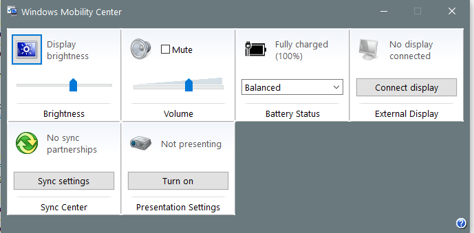

---
title: mblctr.exe | Windows Mobility Center
---

# mblctr.exe 

* File Path: `C:\Windows\system32\mblctr.exe`
* Description: Windows Mobility Center

## Screenshot

## Hashes

Type | Hash
-- | --
MD5 | `0EC4ADC3149C9F85BF96B83C6AD174F5`
SHA1 | `F053C88F40E68BEA6442E384429963CFDBA4F4BB`
SHA256 | `8232A606889BBE9719ADE8104CF314596CFFBC8A28060D27373C527DA83C340C`
SHA384 | `FAFB79478C369E67D25994B348B9C60EB18F6CA37F95FC0D9C5344071FD8B45894F838076C24E96C9A2B155979D3A1B9`
SHA512 | `3F8895EEF6BC42020C05CEBC130D907BEB59A69913C4B2422ED35718E31289B67355F6F90B05417D667E77AA071B8D6D7A0F587FEB4A7A1012E161E460948CD3`
SSDEEP | `12288:TGkJjCh6BMZLpgdc5geSMO4nu451qviizQBODAKylkm5ZUxXrc5Zh5ZG5Ze:TjMZLp4cq2u45kRzAKcjY8poA`

## Signature

* Status: Signature verified.
* Serial: `33000000BCE120FDD27CC8EE930000000000BC`
* Thumbprint: `E85459B23C232DB3CB94C7A56D47678F58E8E51E`
* Issuer: CN=Microsoft Windows Production PCA 2011, O=Microsoft Corporation, L=Redmond, S=Washington, C=US
* Subject: CN=Microsoft Windows, O=Microsoft Corporation, L=Redmond, S=Washington, C=US

## File Metadata

* Original Filename: MBLCTR.EXE.MUI
* Product Name: Microsoft Windows Operating System
* Company Name: Microsoft Corporation
* File Version: 10.0.14393.0 (rs1_release.160715-1616)
* Product Version: 10.0.14393.0
* Language: English (United States)
* Legal Copyright: Copyright (C) Microsoft. All rights reserved.

## File Similarity (ssdeep match)

File | Score
-- | --
[C:\WINDOWS\system32\mblctr.exe](mblctr.exe-4E49EEB5BAE4BDB35A7C3F1C853DD76D.md) | 63
[C:\Windows\system32\mblctr.exe](mblctr.exe-BF6E710F30D7981EF0F90225D9C51001.md) | 65
[C:\Windows\system32\mblctr.exe](mblctr.exe-D3DB14EABB2679E08020BCD0C96FA9F6.md) | 63

MIT License. Copyright (c) 2020 Strontic.

