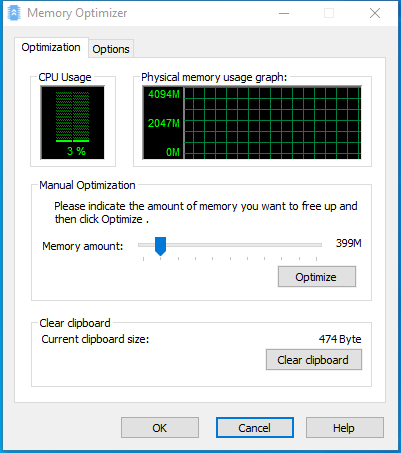

---
title: memdefrag.exe | Memory Defrager
---

# memdefrag.exe 

* File Path: `C:\program files (x86)\Glary Utilities 5\memdefrag.exe`
* Description: Memory Defrager

## Screenshot

## Hashes

Type | Hash
-- | --
MD5 | `5654E29A40CE4A4D2E578F83344B14D5`
SHA1 | `9EC8F6EAA4DCB42CD07729C39B56312D82F2E0FA`
SHA256 | `ABCAD5805BE50372328D7C1EF4CE439CC11460F625091B70C82CEEFC510C8593`
SHA384 | `CB73FE9835262FDC7BB0BD973AA62D9F113E6557D5F95E1DA0FD1EAEE97910247FB623C6C60B64E665EC8BF4D7ECE696`
SHA512 | `CCBB151A10A43C60A70F5761FFB0AC76B2E3C7C2F4E1A81993C66B80769FCA1285E5F3CB136EEDE6E32D4C3D6E4491CFC7A536DAFAA12E1F1A8E07607071A58E`
SSDEEP | `3072:O+YTUhpCC71f7RWOoXpjfffffffffffffffffffffffffffffffffffffffffffM:O+YHCx7RWOoXpjfffffffffffffffff8`

## Runtime Data

### Window Title:
Memory Optimizer

### Open Handles:

Path | Type
-- | --
(R-D)   C:\Windows\Fonts\StaticCache.dat | File
(R-D)   C:\Windows\SysWOW64\en-US\user32.dll.mui | File
(RW-)   C:\Program Files (x86)\Glary Utilities 5 | File
(RW-)   C:\Users\user\Documents | File
(RW-)   C:\Windows | File
(RW-)   C:\Windows\WinSxS\x86_microsoft.vc90.crt_1fc8b3b9a1e18e3b_9.0.30729.9625_none_508ef7e4bcbbe589 | File
(RW-)   C:\Windows\WinSxS\x86_microsoft.windows.common-controls_6595b64144ccf1df_6.0.19041.1_none_fd031af45b0106f2 | File
(RW-)   C:\Windows\WinSxS\x86_microsoft.windows.gdiplus_6595b64144ccf1df_1.1.19041.450_none_4294d6e08a97344a | File
\BaseNamedObjects\NLS_CodePage_1252_3_2_0_0 | Section
\BaseNamedObjects\NLS_CodePage_437_3_2_0_0 | Section
\Sessions\1\BaseNamedObjects\windows_shell_global_counters | Section
\Sessions\1\Windows\Theme4048709601 | Section
\Windows\Theme603176458 | Section

### Loaded Modules:

Path |
-- |
C:\program files (x86)\Glary Utilities 5\memdefrag.exe |
C:\Windows\SYSTEM32\ntdll.dll |
C:\Windows\System32\wow64.dll |
C:\Windows\System32\wow64cpu.dll |
C:\Windows\System32\wow64win.dll |

## Signature

* Status: Signature verified.
* Serial: `0F05AE21CDC17B9F3CF09D7BFC659BA3`
* Thumbprint: `362EBB303E088105BDCC07D94E6B7875D30C0D06`
* Issuer: CN=DigiCert Assured ID Code Signing CA-1, OU=www.digicert.com, O=DigiCert Inc, C=US
* Subject: CN=Glarysoft LTD, O=Glarysoft LTD, S=Beijing, C=CN

## File Metadata

* Original Filename: memdefrag.exe
* Product Name: Glary Utilities
* Company Name: Glarysoft Ltd
* File Version: 5, 0, 0, 4
* Product Version: 5.0.0.0
* Language: Chinese (Simplified, China)
* Legal Copyright: Copyright (c) 2003-2019 Glarysoft Ltd

## File Similarity (ssdeep match)

File | Score
-- | --
[C:\Program Files (x86)\Glary Utilities 5\memdefrag.exe](memdefrag.exe-9F5A8314BA082B233EC525E67B618C3B.md) | 93

MIT License. Copyright (c) 2020 Strontic.

