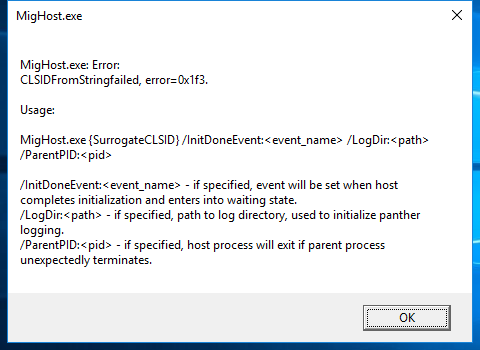

---
title: mighost.exe | Migration Plugins host program
excerpt: What is mighost.exe?
---

# mighost.exe 

* File Path: `C:\WINDOWS\system32\migwiz\mighost.exe`
* Description: Migration Plugins host program

## Screenshot

## Hashes

Type | Hash
-- | --
MD5 | `2EE2E416B39FEC55EC78CAF390A0E465`
SHA1 | `FDE7A1A892E7D9033B52754EF6BA12E025138508`
SHA256 | `4D87112221068ABCDF9E73B3207F50F92F3728F0D054505107C597A4C1C10FE2`
SHA384 | `42D719527F44296938D02D867350FF31C6AA38FDF56A46C9951B025D87EE415A6CFD041210F70AD27167BDED85229ACC`
SHA512 | `BB41B7DEE2207108484C42F7ED2529A95ADDA750209F550BD15963F5CCBA6A5D1A67887FE62A5FA87B3386F40BC815D18169FA2F891079430FC641DC63D3DFF5`
SSDEEP | `6144:QYUid24ojDuUlMtq10Q8m7NNqM9N+hN1UFpfNS5iXjD56Gpovgp2H32nq5494FZs:QYveDuUlEqatglsLbs`

## Runtime Data

### Child Processes:
conhost.exe

## Signature

* Status: Signature verified.
* Serial: `330000023241FB59996DCC4DFF000000000232`
* Thumbprint: `FF82BC38E1DA5E596DF374C53E3617F7EDA36B06`
* Issuer: CN=Microsoft Windows Production PCA 2011, O=Microsoft Corporation, L=Redmond, S=Washington, C=US
* Subject: CN=Microsoft Windows, O=Microsoft Corporation, L=Redmond, S=Washington, C=US

## File Metadata

* Original Filename: MigHost.exe
* Product Name: Microsoft Windows Operating System
* Company Name: Microsoft Corporation
* File Version: 10.0.18362.778 (WinBuild.160101.0800)
* Product Version: 10.0.18362.778
* Language: English (United States)
* Legal Copyright:  Microsoft Corporation. All rights reserved.

## File Similarity (ssdeep match)

File | Score
-- | --
[C:\Windows\system32\migwiz\mighost.exe](mighost.exe-79BBFF97E65EED53564150A9B4CE1372.md) | 82
[C:\Windows\system32\migwiz\mighost.exe](mighost.exe-89C50106DF2063F9918622E2042437C8.md) | 40
[C:\Windows\system32\migwiz\mighost.exe](mighost.exe-89E9A60DE70C1139BE669DA65A17A9F4.md) | 82
[C:\Windows\system32\migwiz\mighost.exe](mighost.exe-91CFBA2810448592EB63F04A8E0C0805.md) | 90
[C:\Windows\system32\migwiz\mighost.exe](mighost.exe-BAD04F25F7495A2CCB0CE1E8F043D748.md) | 83

MIT License. Copyright (c) 2020 Strontic.

