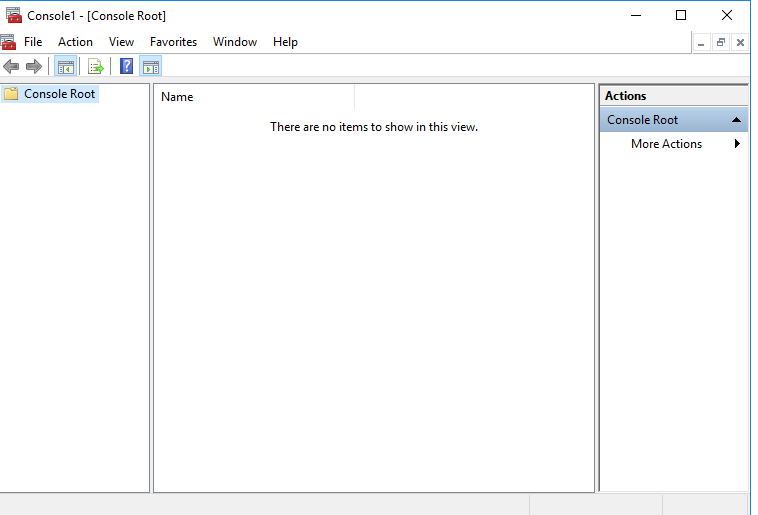
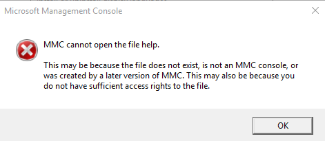

---
title: mmc.exe | Microsoft Management Console
excerpt: What is mmc.exe?
---

# mmc.exe 

* File Path: `C:\Windows\system32\mmc.exe`
* Description: Microsoft Management Console

## Screenshot




## Hashes

Type | Hash
-- | --
MD5 | `9317AC7FF7ED5E614E17E49D1EB474CB`
SHA1 | `5A819AF29BA9567E701BA0F1D60B7269A4125AF6`
SHA256 | `B82E5D5E2EEBE6EE0AFD1C233148BF5A46DC83A7358FEB86C83E46A388D23B13`
SHA384 | `AB9C6CB001538BDD48D8C352B5DB7567B146D337929B4DB59057F7E837EB3A1D9F88C4EA8B79918C415B3C9B0257947C`
SHA512 | `D88B56A8E57B28FAA2735B10340BDFAABE849BA3200AD3FBF92385A30BBCBE07A639F1E73318D322A57BE95622E058B3FB1F09FCE524EC639F95F7AE0705EF93`
SSDEEP | `24576:sd4qiadffSbED3FULzf+WbnIVqiSdrvMo7wMo7DHO:sOQdffPD3FYfTbYqiSdr77e7DHO`
IMP | `B8EE2D6252332A68B70B22E3D6E377D2`
PESHA1 | `EBC3A0429E5B44BDDCB4EADAD12F78AACCD759C5`
PE256 | `7DCA8CDC524AF33333145710A984D183BB36A12C82E976E2DD20B96E698CA9DF`

## Runtime Data

### Window Title:
Console1 - [Console Root]

### Open Handles:

Path | Type
-- | --
(R-D)   C:\Windows\Fonts\StaticCache.dat | File
(R-D)   C:\Windows\System32\en-US\MFC42u.dll.mui | File
(R-D)   C:\Windows\System32\en-US\mmc.exe.mui | File
(R-D)   C:\Windows\System32\en-US\mmcbase.dll.mui | File
(R-D)   C:\Windows\System32\en-US\mmcndmgr.dll.mui | File
(R-D)   C:\Windows\System32\en-US\user32.dll.mui | File
(RW-)   C:\Users\user | File
(RW-)   C:\Windows\WinSxS\amd64_microsoft.windows.common-controls_6595b64144ccf1df_5.82.17763.1518_none_6d08fefc59f73326 | File
(RW-)   C:\Windows\WinSxS\amd64_microsoft.windows.common-controls_6595b64144ccf1df_6.0.17763.1518_none_de6e2bd0534e2567 | File
\BaseNamedObjects\__ComCatalogCache__ | Section
\BaseNamedObjects\C:\*ProgramData\*Microsoft\*Windows\*Caches\*{6AF0698E-D558-4F6E-9B3C-3716689AF493}.2.ver0x0000000000000004.db | Section
\BaseNamedObjects\C:\*ProgramData\*Microsoft\*Windows\*Caches\*{DDF571F2-BE98-426D-8288-1A9A39C3FDA2}.2.ver0x0000000000000004.db | Section
\BaseNamedObjects\C:\*ProgramData\*Microsoft\*Windows\*Caches\*cversions.2.ro | Section
\BaseNamedObjects\NLS_CodePage_1252_3_2_0_0 | Section
\BaseNamedObjects\NLS_CodePage_437_3_2_0_0 | Section
\RPC Control\DSEC10C8 | Section
\Sessions\2\BaseNamedObjects\10c8HWNDInterface:802fa | Section
\Sessions\2\BaseNamedObjects\10c8HWNDInterface:a02e6 | Section
\Sessions\2\BaseNamedObjects\SessionImmersiveColorPreference | Section
\Sessions\2\BaseNamedObjects\windows_shell_global_counters | Section
\Sessions\2\Windows\Theme2131664586 | Section
\Windows\Theme966197582 | Section


### Loaded Modules:

Path |
-- |
C:\Windows\SYSTEM32\AcGenral.dll |
C:\Windows\System32\advapi32.dll |
C:\Windows\SYSTEM32\apphelp.dll |
C:\Windows\System32\bcryptPrimitives.dll |
C:\Windows\System32\cfgmgr32.dll |
C:\Windows\System32\combase.dll |
C:\Windows\System32\cryptsp.dll |
C:\Windows\system32\DUser.dll |
C:\Windows\System32\GDI32.dll |
C:\Windows\System32\gdi32full.dll |
C:\Windows\System32\IMM32.DLL |
C:\Windows\System32\kernel.appcore.dll |
C:\Windows\System32\KERNEL32.DLL |
C:\Windows\System32\KERNELBASE.dll |
C:\Windows\system32\MFC42u.dll |
C:\Windows\system32\mmc.exe |
C:\Windows\system32\mmcbase.DLL |
C:\Windows\SYSTEM32\MPR.dll |
C:\Windows\System32\msvcp_win.dll |
C:\Windows\System32\msvcrt.dll |
C:\Windows\SYSTEM32\ninput.dll |
C:\Windows\SYSTEM32\ntdll.dll |
C:\Windows\System32\ole32.dll |
C:\Windows\System32\OLEAUT32.dll |
C:\Windows\System32\powrprof.dll |
C:\Windows\System32\profapi.dll |
C:\Windows\System32\RPCRT4.dll |
C:\Windows\System32\sechost.dll |
C:\Windows\System32\shcore.dll |
C:\Windows\System32\SHELL32.dll |
C:\Windows\System32\SHLWAPI.dll |
C:\Windows\SYSTEM32\SspiCli.dll |
C:\Windows\System32\ucrtbase.dll |
C:\Windows\System32\USER32.dll |
C:\Windows\SYSTEM32\USERENV.dll |
C:\Windows\system32\UxTheme.dll |
C:\Windows\System32\win32u.dll |
C:\Windows\System32\windows.storage.dll |


## Signature

* Status: Signature verified.
* Serial: `3300000266BD1580EFA75CD6D3000000000266`
* Thumbprint: `A4341B9FD50FB9964283220A36A1EF6F6FAA7840`
* Issuer: CN=Microsoft Windows Production PCA 2011, O=Microsoft Corporation, L=Redmond, S=Washington, C=US
* Subject: CN=Microsoft Windows, O=Microsoft Corporation, L=Redmond, S=Washington, C=US

## File Metadata

* Original Filename: mmc.exe.mui
* Product Name: Microsoft Windows Operating System
* Company Name: Microsoft Corporation
* File Version: 10.0.17763.1 (WinBuild.160101.0800)
* Product Version: 10.0.17763.1
* Language: English (United States)
* Legal Copyright:  Microsoft Corporation. All rights reserved.
* Machine Type: 64-bit

## File Scan

* VirusTotal Detections: 0/71
* VirusTotal Link: https://www.virustotal.com/gui/file/b82e5d5e2eebe6ee0afd1c233148bf5a46dc83a7358feb86c83e46a388d23b13/detection/

## File Similarity (ssdeep match)

File | Score
-- | --
[C:\WINDOWS\system32\mmc.exe](mmc.exe-26F0B79F5A4797E4D06D164E650FC872.md) | 36
[C:\windows\system32\mmc.exe](mmc.exe-3E4EAD40B4F45F956354569B75FFDEEA.md) | 38
[C:\Windows\system32\mmc.exe](mmc.exe-8C86B80518406F14A4952D67185032D6.md) | 40
[C:\Windows\system32\mmc.exe](mmc.exe-C51BACB9B93CA44254BE462516C6BEE0.md) | 35
[C:\Windows\system32\mmc.exe](mmc.exe-E1328E5A4A87C376927DB685110F8D6F.md) | 32
[C:\Windows\SysWOW64\mmc.exe](mmc.exe-08CA3F1D18A0B8F55098C3940AFD088E.md) | 40
[C:\Windows\SysWOW64\mmc.exe](mmc.exe-258D0788201374F240CD4A7D97968217.md) | 32
[C:\Windows\SysWOW64\mmc.exe](mmc.exe-2E79501B1C8231FCB65785F2592468CA.md) | 30
[C:\windows\SysWOW64\mmc.exe](mmc.exe-8096658A9A034257022ADF125B85F904.md) | 36
[C:\Windows\SysWOW64\mmc.exe](mmc.exe-9012E43AD3F261742257A1234A006746.md) | 33
[C:\Windows\SysWOW64\mmc.exe](mmc.exe-A40546440A81D2E36FB1F6F18AC376BC.md) | 29
[C:\WINDOWS\SysWOW64\mmc.exe](mmc.exe-BA18900E566A9BDC1330E5ADE7BF4590.md) | 38
[C:\WINDOWS\SysWOW64\mmc.exe](mmc.exe-E92C9CCE925FAF5CF45308F855F10016.md) | 33

## Possible Misuse

*The following table contains possible examples of `mmc.exe` being misused. While `mmc.exe` is **not** inherently malicious, its legitimate functionality can be abused for malicious purposes.*

Source | Source File | Example | License
-- | -- | -- | --
[sigma](https://github.com/Neo23x0/sigma) | [win_mmc20_lateral_movement.yml](https://github.com/Neo23x0/sigma/blob/master/rules/windows/builtin/win_mmc20_lateral_movement.yml) | `description: Detects MMC20.Application Lateral Movement; specifically looks for the spawning of the parent MMC.exe with a command line of "-Embedding" as a child of svchost.exe`{:.highlight .language-yaml} | [DRL 1.0](https://github.com/Neo23x0/sigma/blob/master/LICENSE.Detection.Rules.md)
[sigma](https://github.com/Neo23x0/sigma) | [win_mmc20_lateral_movement.yml](https://github.com/Neo23x0/sigma/blob/master/rules/windows/builtin/win_mmc20_lateral_movement.yml) | `Image\|endswith: '\mmc.exe'`{:.highlight .language-yaml} | [DRL 1.0](https://github.com/Neo23x0/sigma/blob/master/LICENSE.Detection.Rules.md)
[sigma](https://github.com/Neo23x0/sigma) | [win_user_driver_loaded.yml](https://github.com/Neo23x0/sigma/blob/master/rules/windows/builtin/win_user_driver_loaded.yml) | `- '\Windows\System32\mmc.exe'`{:.highlight .language-yaml} | [DRL 1.0](https://github.com/Neo23x0/sigma/blob/master/LICENSE.Detection.Rules.md)
[sigma](https://github.com/Neo23x0/sigma) | [sysmon_susp_adsi_cache_usage.yml](https://github.com/Neo23x0/sigma/blob/master/rules/windows/file_event/sysmon_susp_adsi_cache_usage.yml) | `- 'C:\windows\system32\mmc.exe'`{:.highlight .language-yaml} | [DRL 1.0](https://github.com/Neo23x0/sigma/blob/master/LICENSE.Detection.Rules.md)
[sigma](https://github.com/Neo23x0/sigma) | [sysmon_susp_desktop_ini.yml](https://github.com/Neo23x0/sigma/blob/master/rules/windows/file_event/sysmon_susp_desktop_ini.yml) | `- 'C:\Windows\System32\mmc.exe'`{:.highlight .language-yaml} | [DRL 1.0](https://github.com/Neo23x0/sigma/blob/master/LICENSE.Detection.Rules.md)
[sigma](https://github.com/Neo23x0/sigma) | [sysmon_uac_bypass_dotnet_profiler.yml](https://github.com/Neo23x0/sigma/blob/master/rules/windows/file_event/sysmon_uac_bypass_dotnet_profiler.yml) | `description: Detects the pattern of UAC Bypass using .NET Code Profiler and mmc.exe DLL hijacking (UACMe 39)`{:.highlight .language-yaml} | [DRL 1.0](https://github.com/Neo23x0/sigma/blob/master/LICENSE.Detection.Rules.md)
[sigma](https://github.com/Neo23x0/sigma) | [sysmon_susp_adfs_namedpipe_connection.yml](https://github.com/Neo23x0/sigma/blob/master/rules/windows/pipe_created/sysmon_susp_adfs_namedpipe_connection.yml) | `- 'mmc.exe'`{:.highlight .language-yaml} | [DRL 1.0](https://github.com/Neo23x0/sigma/blob/master/LICENSE.Detection.Rules.md)
[sigma](https://github.com/Neo23x0/sigma) | [process_creation_sysmon_uac_bypass_eventvwr.yml](https://github.com/Neo23x0/sigma/blob/master/rules/windows/process_creation/process_creation_sysmon_uac_bypass_eventvwr.yml) | `Image\|endswith: '\mmc.exe'`{:.highlight .language-yaml} | [DRL 1.0](https://github.com/Neo23x0/sigma/blob/master/LICENSE.Detection.Rules.md)
[sigma](https://github.com/Neo23x0/sigma) | [win_impacket_lateralization.yml](https://github.com/Neo23x0/sigma/blob/master/rules/windows/process_creation/win_impacket_lateralization.yml) | `#   parent is mmc.exe`{:.highlight .language-yaml} | [DRL 1.0](https://github.com/Neo23x0/sigma/blob/master/LICENSE.Detection.Rules.md)
[sigma](https://github.com/Neo23x0/sigma) | [win_impacket_lateralization.yml](https://github.com/Neo23x0/sigma/blob/master/rules/windows/process_creation/win_impacket_lateralization.yml) | `- '\mmc.exe'  # dcomexec MMC`{:.highlight .language-yaml} | [DRL 1.0](https://github.com/Neo23x0/sigma/blob/master/LICENSE.Detection.Rules.md)
[sigma](https://github.com/Neo23x0/sigma) | [win_mmc_spawn_shell.yml](https://github.com/Neo23x0/sigma/blob/master/rules/windows/process_creation/win_mmc_spawn_shell.yml) | `ParentImage\|endswith: '\mmc.exe'`{:.highlight .language-yaml} | [DRL 1.0](https://github.com/Neo23x0/sigma/blob/master/LICENSE.Detection.Rules.md)
[sigma](https://github.com/Neo23x0/sigma) | [win_susp_taskmgr_parent.yml](https://github.com/Neo23x0/sigma/blob/master/rules/windows/process_creation/win_susp_taskmgr_parent.yml) | `- '\mmc.exe'`{:.highlight .language-yaml} | [DRL 1.0](https://github.com/Neo23x0/sigma/blob/master/LICENSE.Detection.Rules.md)
[sigma](https://github.com/Neo23x0/sigma) | [win_uac_bypass_wmp.yml](https://github.com/Neo23x0/sigma/blob/master/rules/windows/process_creation/win_uac_bypass_wmp.yml) | `ParentCommandLine: '"C:\Windows\system32\mmc.exe" "C:\Windows\system32\eventvwr.msc" /s'`{:.highlight .language-yaml} | [DRL 1.0](https://github.com/Neo23x0/sigma/blob/master/LICENSE.Detection.Rules.md)
[LOLBAS](https://github.com/LOLBAS-Project/LOLBAS) | [Eventvwr.yml](https://github.com/LOLBAS-Project/LOLBAS/blob/master/yml/OSBinaries/Eventvwr.yml) | `Description: During startup, eventvwr.exe checks the registry value HKCU\Software\Classes\mscfile\shell\open\command for the location of mmc.exe, which is used to open the eventvwr.msc saved console file. If the location of another binary or script is added to this registry value, it will be executed as a high-integrity process without a UAC prompt being displayed to the user.`{:.highlight .language-yaml} | 
[LOLBAS](https://github.com/LOLBAS-Project/LOLBAS) | [Eventvwr.yml](https://github.com/LOLBAS-Project/LOLBAS/blob/master/yml/OSBinaries/Eventvwr.yml) | `- IOC: eventvwr.exe launching child process other than mmc.exe`{:.highlight .language-yaml} | 
[LOLBAS](https://github.com/LOLBAS-Project/LOLBAS) | [Mmc.yml](https://github.com/LOLBAS-Project/LOLBAS/blob/master/yml/OSBinaries/Mmc.yml) | `Name: Mmc.exe`{:.highlight .language-yaml} | 
[LOLBAS](https://github.com/LOLBAS-Project/LOLBAS) | [Mmc.yml](https://github.com/LOLBAS-Project/LOLBAS/blob/master/yml/OSBinaries/Mmc.yml) | `- Command: mmc.exe -Embedding c:\path\to\test.msc`{:.highlight .language-yaml} | 
[LOLBAS](https://github.com/LOLBAS-Project/LOLBAS) | [Mmc.yml](https://github.com/LOLBAS-Project/LOLBAS/blob/master/yml/OSBinaries/Mmc.yml) | `- Path: C:\Windows\System32\mmc.exe`{:.highlight .language-yaml} | 
[LOLBAS](https://github.com/LOLBAS-Project/LOLBAS) | [Mmc.yml](https://github.com/LOLBAS-Project/LOLBAS/blob/master/yml/OSBinaries/Mmc.yml) | `- Path: C:\Windows\SysWOW64\mmc.exe`{:.highlight .language-yaml} | 
[LOLBAS](https://github.com/LOLBAS-Project/LOLBAS) | [Wsreset.yml](https://github.com/LOLBAS-Project/LOLBAS/blob/master/yml/OSBinaries/Wsreset.yml) | `- IOC: wsreset.exe launching child process other than mmc.exe`{:.highlight .language-yaml} | 
[malware-ioc](https://github.com/eset/malware-ioc) | [nukesped_lazarus](https://github.com/eset/malware-ioc/blob/master/nukesped_lazarus/README.adoc) | `.`mmc.exe``{:.highlight .language-cmhg} | [© ESET 2014-2018](https://github.com/eset/malware-ioc/blob/master/LICENSE)
[atomic-red-team](https://github.com/redcanaryco/atomic-red-team) | [T1548.002.md](https://github.com/redcanaryco/atomic-red-team/blob/master/atomics/T1548.002/T1548.002.md) | copy "#{executable_binary}" "\\?\C:\Windows \System32\mmc.exe" | [MIT License. © 2018 Red Canary](https://github.com/redcanaryco/atomic-red-team/blob/master/LICENSE.txt)
[atomic-red-team](https://github.com/redcanaryco/atomic-red-team) | [T1548.002.md](https://github.com/redcanaryco/atomic-red-team/blob/master/atomics/T1548.002/T1548.002.md) | mklink c:\testbypass.exe "\\?\C:\Windows \System32\mmc.exe" | [MIT License. © 2018 Red Canary](https://github.com/redcanaryco/atomic-red-team/blob/master/LICENSE.txt)
[atomic-red-team](https://github.com/redcanaryco/atomic-red-team) | [T1548.002.md](https://github.com/redcanaryco/atomic-red-team/blob/master/atomics/T1548.002/T1548.002.md) | Target:	\system32\mmc.exe | [MIT License. © 2018 Red Canary](https://github.com/redcanaryco/atomic-red-team/blob/master/LICENSE.txt)
[atomic-red-team](https://github.com/redcanaryco/atomic-red-team) | [T1574.012.md](https://github.com/redcanaryco/atomic-red-team/blob/master/atomics/T1574.012/T1574.012.md) | START MMC.EXE EVENTVWR.MSC | [MIT License. © 2018 Red Canary](https://github.com/redcanaryco/atomic-red-team/blob/master/LICENSE.txt)
[signature-base](https://github.com/Neo23x0/signature-base) | [crime_cn_campaign_njrat.yar](https://github.com/Neo23x0/signature-base/blob/master/yara/crime_cn_campaign_njrat.yar) | $a5 = "taskkill /f /im mmc.exe" fullword ascii | [CC BY-NC 4.0](https://github.com/Neo23x0/signature-base/blob/master/LICENSE)

## Additional Info*

**The information below is copied from [MicrosoftDocs](https://github.com/MicrosoftDocs/windowsserverdocs), which is maintained by [Microsoft](https://opensource.microsoft.com/codeofconduct/). Available under [CC BY 4.0](https://creativecommons.org/licenses/by/4.0/) license.*

---

## mmc

>Applies to: Windows Server 2022, Windows Server 2019, Windows Server 2016, Windows Server 2012 R2, Windows Server 2012

Using mmc command-line options, you can open a specific **mmc** console, open **mmc** in author mode, or specify that the 32-bit or 64-bit version of **mmc** is opened.

### Syntax

```
mmc <path>\<filename>.msc [/a] [/64] [/32]
```

#### Parameters

| Parameter | Description |
| --------- | ----------- |
| `<path>\<filename>.msc` | starts **mmc** and opens a saved console. You need to specify the complete path and file name for the saved console file. If you do not specify a console file, **mmc** opens a new console. |
| /a | Opens a saved console in author mode.  Used to make changes to saved consoles. |
| /64 | Opens the 64-bit version of **mmc** (mmc64). Use this option only if you are running a Microsoft 64-bit operating system and want to use a 64-bit snap-in. |
| /32 | Opens the 32-bit version of **mmc** (mmc32). When running a Microsoft 64-bit operating system, you can run 32-bit snap-ins by opening mmc with this command-line option when you have 32-bit only snap-ins. |

### Remarks

- You can use environment variables to create command lines or shortcuts that don't depend on the explicit location of console files. For instance, if the path to a console file is in the system folder (for example, **mmc c:\winnt\system32\console_name.msc**), you can use the expandable data string **%systemroot%** to specify the location (**mmc%systemroot%\system32\console_name.msc**). This may be useful if you're delegating tasks to people in your organization who are working on different computers.

- When consoles are opened using the **/a** option, they're opened in author mode, regardless of their default mode. This doesn't permanently change the default mode setting for files; when you omit this option, mmc opens console files according to their default mode settings.

- After you open **mmc** or a console file in author mode, you can open any existing console by clicking **Open** on the **Console** menu.

- You can use the command line to create shortcuts for opening **mmc** and saved consoles. A command-line command works with the **Run** command on the **Start** menu, in any command-prompt window, in shortcuts, or in any batch file or program that calls the command.

### Additional References

- [Command-Line Syntax Key](https://github.com/MicrosoftDocs/windowsserverdocs/tree/master/WindowsServerDocs/administration/windows-commands/command-line-syntax-key.md)

---


MIT License. Copyright (c) 2020-2021 Strontic.


