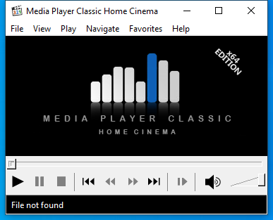

---
title: mpc-hc64.exe | MPC-HC (x64)
excerpt: What is mpc-hc64.exe?
---

# mpc-hc64.exe 

* File Path: `C:\Program Files (x86)\K-Lite Codec Pack\MPC-HC64\mpc-hc64.exe`
* Description: MPC-HC (x64)
* Comments: Based on the original Media Player Classic v6.4.9.0  Gabest

## Screenshot

## Hashes

Type | Hash
-- | --
MD5 | `0D1D90594C9951344939DCBBB58EC9E2`
SHA1 | `1E1651BB9BAB2BB28D9A8FFBB7779FDFF9E08C93`
SHA256 | `DE57D419CC9DAE1D08A06AF03B0C199DF47C5BE3B7AAA0750E7B267571DEA431`
SHA384 | `E8E258CD23748C6F36F884CCD75EE3FDDF355EEC76C681EF579C4D112FA53F627AEEEE91CE93CFB5D10663C922669F6E`
SHA512 | `04D9EBE30D839E09B1EC3D61F3118B5A597FE3C052583FF706A862B0E71BC39BFD1AACF3CA7EB321DBA915CF6CAFEBDD8F29293553FA1061EF380B7A2D870585`
SSDEEP | `98304:s9FJ0k9Unr93KMyyu2s6uuGHsBxYzGFs6p1xxxpDGWpO:CnLq93KMhun6HwbaskbQ`
IMP | `0B2116C07BA9B619EB9CCF23FA81341F`
PESHA1 | `A2469986492D9C5CA45395CA348A39A79E014560`
PE256 | `823443C68271339E9C8261FA6AD18A8A99D63121B278D81B7FEF3238419FF852`

## Runtime Data

### Window Title:
Media Player Classic Home Cinema

### Open Handles:

Path | Type
-- | --
(R-D)   C:\Windows\Fonts\StaticCache.dat | File
(R-D)   C:\Windows\System32\en-US\user32.dll.mui | File
(RW-)   C:\Program Files (x86)\K-Lite Codec Pack\MPC-HC64 | File
(RW-)   C:\Windows\WinSxS\amd64_microsoft.windows.common-controls_6595b64144ccf1df_6.0.19041.488_none_ca04af081b815d21 | File
(RW-)   C:\Windows\WinSxS\amd64_microsoft.windows.gdiplus_6595b64144ccf1df_1.1.19041.508_none_faefa4f37613d18e | File
\BaseNamedObjects\__ComCatalogCache__ | Section
\BaseNamedObjects\F932B6C7-3A20-46A0-B8A0-8894AA421973 | Section
\BaseNamedObjects\NLS_CodePage_1252_3_2_0_0 | Section
\BaseNamedObjects\NLS_CodePage_437_3_2_0_0 | Section
\Sessions\1\BaseNamedObjects\21e8HWNDInterface:12408b8 | Section
\Sessions\1\BaseNamedObjects\21e8HWNDInterface:750722 | Section
\Sessions\1\BaseNamedObjects\windows_shell_global_counters | Section
\Sessions\1\BaseNamedObjects\windows_webcache_counters_{9B6AB5B3-91BC-4097-835C-EA2DEC95E9CC}_S-1-5-21-2047949552-857980807-821054962-504 | Section
\Sessions\1\Windows\Theme2547664911 | Section
\Windows\Theme3854699184 | Section

### Loaded Modules:

Path |
-- |
C:\Program Files (x86)\K-Lite Codec Pack\MPC-HC64\mpc-hc64.exe |
C:\Windows\System32\ADVAPI32.dll |
C:\Windows\SYSTEM32\avrt.dll |
C:\Windows\System32\combase.dll |
C:\Windows\SYSTEM32\d3d9.dll |
C:\Windows\SYSTEM32\dwmapi.dll |
C:\Windows\System32\GDI32.dll |
C:\Windows\System32\gdi32full.dll |
C:\Windows\System32\IMM32.dll |
C:\Windows\SYSTEM32\kernel.appcore.dll |
C:\Windows\System32\KERNEL32.DLL |
C:\Windows\System32\KERNELBASE.dll |
C:\Windows\SYSTEM32\MSIMG32.dll |
C:\Windows\System32\msvcp_win.dll |
C:\Windows\System32\msvcrt.dll |
C:\Windows\SYSTEM32\ntdll.dll |
C:\Windows\System32\ole32.dll |
C:\Windows\SYSTEM32\OLEACC.dll |
C:\Windows\System32\OLEAUT32.dll |
C:\Windows\SYSTEM32\oledlg.dll |
C:\Windows\System32\PSAPI.DLL |
C:\Windows\System32\RPCRT4.dll |
C:\Windows\System32\sechost.dll |
C:\Windows\System32\SHELL32.dll |
C:\Windows\System32\SHLWAPI.dll |
C:\Windows\System32\ucrtbase.dll |
C:\Windows\System32\USER32.dll |
C:\Windows\SYSTEM32\UxTheme.dll |
C:\Windows\SYSTEM32\VERSION.dll |
C:\Windows\System32\win32u.dll |
C:\Windows\SYSTEM32\windows.storage.dll |
C:\Windows\SYSTEM32\WININET.dll |
C:\Windows\SYSTEM32\WINMM.dll |
C:\Windows\SYSTEM32\WINSPOOL.DRV |
C:\Windows\SYSTEM32\Wldp.dll |
C:\Windows\System32\WS2_32.dll |
C:\Windows\WinSxS\amd64_microsoft.windows.common-controls_6595b64144ccf1df_6.0.19041.488_none_ca04af081b815d21\COMCTL32.dll |
C:\Windows\WinSxS\amd64_microsoft.windows.gdiplus_6595b64144ccf1df_1.1.19041.508_none_faefa4f37613d18e\gdiplus.dll |

## Signature

* Status: The file C:\Program Files (x86)\K-Lite Codec Pack\MPC-HC64\mpc-hc64.exe is not digitally signed. You cannot run this script on the current system. For more information about running scripts and setting execution policy, see about_Execution_Policies at https:/go.microsoft.com/fwlink/?LinkID=135170
* Serial: ``
* Thumbprint: ``
* Issuer: 
* Subject: 

## File Metadata

* Original Filename: mpc-hc64.exe
* Product Name: MPC-HC
* Company Name: MPC-HC Team
* File Version: 1.9.7.55 (c99c42a65)
* Product Version: 1.9.7.55 (c99c42a65)
* Language: English (United States)
* Legal Copyright: Copyright 2002-2020 all contributors, see Authors.txt
* Machine Type: 64-bit

## File Scan

* VirusTotal Detections: 0/71
* VirusTotal Link: https://www.virustotal.com/gui/file/de57d419cc9dae1d08a06af03b0c199df47c5be3b7aaa0750e7b267571dea431/detection/

MIT License. Copyright (c) 2020-2021 Strontic.

