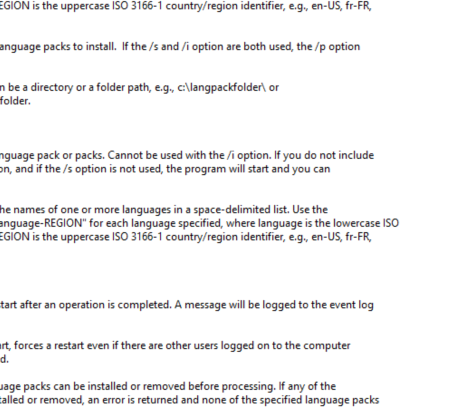

---
title: msconfig.exe | System Configuration Utility
---

# msconfig.exe 

* File Path: `C:\windows\system32\msconfig.exe`
* Description: System Configuration Utility

## Screenshot

## Hashes

Type | Hash
-- | --
MD5 | `FA81544250A477790C003D6D88256078`
SHA1 | `E5BA6703A3F6DA5C6B80A890CD78A9F909F3A9C3`
SHA256 | `2782A7F6336DAF4CC25A88995456678F02AFE0F01C86D24EF75CF54996710A75`
SHA384 | `AEA25702129EB5012FC4B08818369A23F27EBFC24AD79DED31D96F7D696511FAB0AA9544BB3369A27A103CC1B19921A8`
SHA512 | `E06475AE7C045E265BBA0FE3938D4DDEB43A2B4541BCFBF78243BC5BD389FEBAB3EB225C1BAEBC57D80BF9CE558C823360A96B50B687B70D54051B4C83B55E6F`
SSDEEP | `3072:hqEa1DAvAaBSChjo4nZYRywPeChrL5fUd0/HlGJRA18:3eAjj9nO9mCFJUdSGJRW`

## Signature

* Status: Signature verified.
* Serial: `33000001C422B2F79B793DACB20000000001C4`
* Thumbprint: `AE9C1AE54763822EEC42474983D8B635116C8452`
* Issuer: CN=Microsoft Windows Production PCA 2011, O=Microsoft Corporation, L=Redmond, S=Washington, C=US
* Subject: CN=Microsoft Windows, O=Microsoft Corporation, L=Redmond, S=Washington, C=US

## File Metadata

* Original Filename: msconfig.EXE.MUI
* Product Name: Microsoft Windows Operating System
* Company Name: Microsoft Corporation
* File Version: 10.0.17763.1 (WinBuild.160101.0800)
* Product Version: 10.0.17763.1
* Language: English (United States)
* Legal Copyright:  Microsoft Corporation. All rights reserved.

## File Similarity (ssdeep match)

File | Score
-- | --
[C:\windows\system32\msconfig.exe](msconfig.exe-9115A4002D040BF7F16AC1E29F353FB9.md) | 46
[C:\Windows\system32\msconfig.exe](msconfig.exe-C39148DD0D650E2C49095237998218F2.md) | 41
[C:\Windows\system32\msconfig.exe](msconfig.exe-EA390568A41C03B6327AAE1873664B45.md) | 46
[C:\WINDOWS\system32\msconfig.exe](msconfig.exe-EC284B6D1AFBBA44211F4F0C3EA44838.md) | 43

## Possible Misuse

*The following table contains possible examples of `msconfig.exe` being misused. While `msconfig.exe` is **not** inherently malicious, its legitimate functionality can by abused for malicious purposes.*

Source | Source File | Example | License
-- | -- | -- | --
[LOLBAS](https://github.com/LOLBAS-Project/LOLBAS) | [Msconfig.yml](https://github.com/LOLBAS-Project/LOLBAS/blob/master/yml/OSBinaries/Msconfig.yml) | `Name: Msconfig.exe` | 
[LOLBAS](https://github.com/LOLBAS-Project/LOLBAS) | [Msconfig.yml](https://github.com/LOLBAS-Project/LOLBAS/blob/master/yml/OSBinaries/Msconfig.yml) | `Description: MSConfig is a troubleshooting tool which is used to temporarily disable or re-enable software, device drivers or Windows services that run during startup process to help the user determine the cause of a problem with Windows` | 
[LOLBAS](https://github.com/LOLBAS-Project/LOLBAS) | [Msconfig.yml](https://github.com/LOLBAS-Project/LOLBAS/blob/master/yml/OSBinaries/Msconfig.yml) | `  - Command: Msconfig.exe -5` | 
[LOLBAS](https://github.com/LOLBAS-Project/LOLBAS) | [Msconfig.yml](https://github.com/LOLBAS-Project/LOLBAS/blob/master/yml/OSBinaries/Msconfig.yml) | `    Usecase: Code execution using Msconfig.exe` | 
[LOLBAS](https://github.com/LOLBAS-Project/LOLBAS) | [Msconfig.yml](https://github.com/LOLBAS-Project/LOLBAS/blob/master/yml/OSBinaries/Msconfig.yml) | `  - Path: C:\Windows\System32\msconfig.exe` | 
[LOLBAS](https://github.com/LOLBAS-Project/LOLBAS) | [Msconfig.yml](https://github.com/LOLBAS-Project/LOLBAS/blob/master/yml/OSBinaries/Msconfig.yml) | ` - IOC: msconfig.exe executing` | 
[malware-ioc](https://github.com/eset/malware-ioc) | [nukesped_lazarus](https://github.com/eset/malware-ioc/blob/master/nukesped_lazarus/README.adoc) | `.`msconfig.exe`` | [© ESET 2014-2018](https://github.com/eset/malware-ioc/blob/master/LICENSE)

MIT License. Copyright (c) 2020 Strontic.

