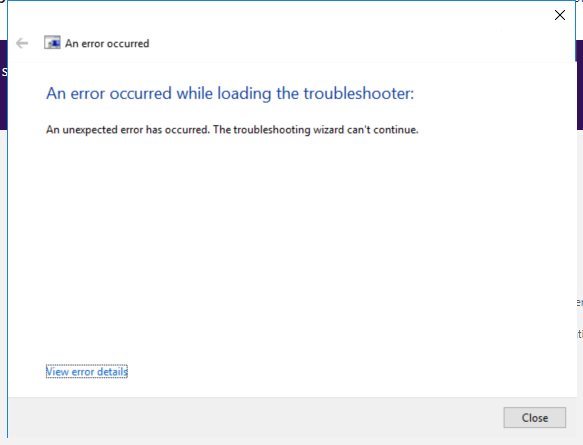

---
title: msdt.exe | Diagnostics Troubleshooting Wizard
excerpt: What is msdt.exe?
---

# msdt.exe 

* File Path: `C:\Windows\SysWOW64\msdt.exe`
* Description: Diagnostics Troubleshooting Wizard

## Screenshot



## Hashes

Type | Hash
-- | --
MD5 | `4EBC38519675FB0BA6915D0D8A7FCD01`
SHA1 | `6C2D11F171754B07FD1975E36B828CDD9A3027A4`
SHA256 | `1BE8AFD2962596807611E6A8836952D6BBDC24BDE52A34905006FF78F1AD5D12`
SHA384 | `50B0CCE6BCB2F7489B7CBE74625E15CF2F9A6AC66885EE68C538CE3AA57522F7BAB842087ACA56642177A919BF6505E0`
SHA512 | `88E41AE4A7D82BD885FBD6619541B5D7558BADB6AA683CB4B7CA702A6283353C3C936C8E6BE3C9AB7AC43727135A690C245C9945D1AF5775736D4B5DF1948E33`
SSDEEP | `24576:PZMSufiUbtkQw03V3hfi6XH4qvIReK1odddGdBnyE0k26kVZnBm4F:GLw03wqNK7utRB`
IMP | `AF42CCE29BF30BC07C0496AF0420FD91`
PESHA1 | `2E806266A61D1986FC2D2B6ECAB55C11B69BB67C`
PE256 | `42DE31905CAC03C74062ECDB8730DB640FA62ABDDDCCE2DB80DA914E05438603`

## Runtime Data

### Window Title:
An error occurred

### Open Handles:

Path | Type
-- | --
(---)   C:\Users\ADMINI~1\AppData\Local\Temp\2\msdtadmin\_B8AF5F4E-2B52-467E-AEDC-CDEF437D5F4F_\inuse | File
(R-D)   C:\Windows\Fonts\StaticCache.dat | File
(R-D)   C:\Windows\System32\en-US\imageres.dll.mui | File
(R-D)   C:\Windows\System32\en-US\msdt.exe.mui | File
(R-D)   C:\Windows\SysWOW64\en-US\oleaccrc.dll.mui | File
(R-D)   C:\Windows\WinSxS\x86_microsoft.windows.c..-controls.resources_6595b64144ccf1df_6.0.17763.1518_en-us_3c26ab8c9470805a\comctl32.dll.mui | File
(RW-)   C:\Users\user | File
(RW-)   C:\Windows | File
(RW-)   C:\Windows\WinSxS\x86_microsoft.windows.c..-controls.resources_6595b64144ccf1df_6.0.17763.1518_en-us_3c26ab8c9470805a | File
(RW-)   C:\Windows\WinSxS\x86_microsoft.windows.common-controls_6595b64144ccf1df_6.0.17763.1518_none_261b62a767ca4e6d | File
\BaseNamedObjects\C:\*ProgramData\*Microsoft\*Windows\*Caches\*{6AF0698E-D558-4F6E-9B3C-3716689AF493}.2.ver0x0000000000000004.db | Section
\BaseNamedObjects\C:\*ProgramData\*Microsoft\*Windows\*Caches\*{DDF571F2-BE98-426D-8288-1A9A39C3FDA2}.2.ver0x0000000000000004.db | Section
\BaseNamedObjects\C:\*ProgramData\*Microsoft\*Windows\*Caches\*cversions.2.ro | Section
\BaseNamedObjects\NLS_CodePage_1252_3_2_0_0 | Section
\BaseNamedObjects\NLS_CodePage_437_3_2_0_0 | Section
\Sessions\2\Windows\Theme2131664586 | Section
\Windows\Theme966197582 | Section


### Loaded Modules:

Path |
-- |
C:\Windows\SYSTEM32\ntdll.dll |
C:\Windows\System32\wow64.dll |
C:\Windows\System32\wow64cpu.dll |
C:\Windows\System32\wow64win.dll |
C:\Windows\SysWOW64\msdt.exe |


## Signature

* Status: Signature verified.
* Serial: `33000001C422B2F79B793DACB20000000001C4`
* Thumbprint: `AE9C1AE54763822EEC42474983D8B635116C8452`
* Issuer: CN=Microsoft Windows Production PCA 2011, O=Microsoft Corporation, L=Redmond, S=Washington, C=US
* Subject: CN=Microsoft Windows, O=Microsoft Corporation, L=Redmond, S=Washington, C=US

## File Metadata

* Original Filename: msdt.exe
* Product Name: Microsoft Windows Operating System
* Company Name: Microsoft Corporation
* File Version: 10.0.17763.1 (WinBuild.160101.0800)
* Product Version: 10.0.17763.1
* Language: English (United States)
* Legal Copyright:  Microsoft Corporation. All rights reserved.
* Machine Type: 32-bit

## File Scan

* VirusTotal Detections: 0/72
* VirusTotal Link: https://www.virustotal.com/gui/file/1be8afd2962596807611e6a8836952d6bbdc24bde52a34905006ff78f1ad5d12/detection/

## File Similarity (ssdeep match)

File | Score
-- | --
[C:\windows\system32\msdt.exe](msdt.exe-71F99D108A429C131E8335B5E4FE01F9.md) | 66
[C:\Windows\system32\msdt.exe](msdt.exe-728A1A72370AF1A7641650FD43DB7DBE.md) | 69
[C:\Windows\system32\msdt.exe](msdt.exe-BB98CE2BD520AC69CB3D2F830974CABE.md) | 71
[C:\windows\SysWOW64\msdt.exe](msdt.exe-3AAB3F3107C0F2FDE2AD082EB98A84EA.md) | 63
[C:\Windows\SysWOW64\msdt.exe](msdt.exe-7FF1826697BAC1F6414FEF5A12D5A930.md) | 69

## Possible Misuse

*The following table contains possible examples of `msdt.exe` being misused. While `msdt.exe` is **not** inherently malicious, its legitimate functionality can be abused for malicious purposes.*

Source | Source File | Example | License
-- | -- | -- | --
[sigma](https://github.com/Neo23x0/sigma) | [win_possible_applocker_bypass.yml](https://github.com/Neo23x0/sigma/blob/master/rules/windows/process_creation/win_possible_applocker_bypass.yml) | `- '\msdt.exe'`{:.highlight .language-yaml} | [DRL 1.0](https://github.com/Neo23x0/sigma/blob/master/LICENSE.Detection.Rules.md)
[LOLBAS](https://github.com/LOLBAS-Project/LOLBAS) | [Msdt.yml](https://github.com/LOLBAS-Project/LOLBAS/blob/master/yml/OSBinaries/Msdt.yml) | `Name: Msdt.exe`{:.highlight .language-yaml} | 
[LOLBAS](https://github.com/LOLBAS-Project/LOLBAS) | [Msdt.yml](https://github.com/LOLBAS-Project/LOLBAS/blob/master/yml/OSBinaries/Msdt.yml) | `- Command: msdt.exe -path C:\WINDOWS\diagnostics\index\PCWDiagnostic.xml -af C:\PCW8E57.xml /skip TRUE`{:.highlight .language-yaml} | 
[LOLBAS](https://github.com/LOLBAS-Project/LOLBAS) | [Msdt.yml](https://github.com/LOLBAS-Project/LOLBAS/blob/master/yml/OSBinaries/Msdt.yml) | `- Path: C:\Windows\System32\Msdt.exe`{:.highlight .language-yaml} | 
[LOLBAS](https://github.com/LOLBAS-Project/LOLBAS) | [Msdt.yml](https://github.com/LOLBAS-Project/LOLBAS/blob/master/yml/OSBinaries/Msdt.yml) | `- Path: C:\Windows\SysWOW64\Msdt.exe`{:.highlight .language-yaml} | 

## Additional Info*

**The information below is copied from [MicrosoftDocs](https://github.com/MicrosoftDocs/windowsserverdocs), which is maintained by [Microsoft](https://opensource.microsoft.com/codeofconduct/). Available under [CC BY 4.0](https://creativecommons.org/licenses/by/4.0/) license.*

---

## msdt

Invokes a troubleshooting pack at the command line or as part of an automated script, and enables additional options without user input.

### Syntax

```
msdt </id <name> | /path <name> | /cab < name>> <</parameter> [options] … <parameter> [options]>>
```

#### Parameters

| Parameter | Description |
| --------- | ----------- |
| /id `<packagename>` | Specifies which diagnostic package to run. For a list of available packages, see [Available Troubleshooting packs](/previous-versions/windows/it-pro/windows-server-2012-r2-and-2012/ee424379(v=ws.11)#available-troubleshooting-packs). |
| /path `<directory|.diagpkg file|.diagcfg file>` | Specifies the full path to a diagnostic package. If you specify a directory, the directory must contain a diagnostic package. You cannot use the **/path** parameter in conjunction with the** /id**, **/dci**, or **/cab** parameters. |
| /dci `<passkey>` | Prepopulates the passkey field. This parameter is only used when a support provider has supplied a passkey. |
| /dt `<directory>` | Displays the troubleshooting history in the specified directory. Diagnostic results are stored in the user’s **%LOCALAPPDATA%\Diagnostics** or **%LOCALAPPDATA%\ElevatedDiagnostics** directories. |
| /af `<answerfile>` | Specifies an answer file in XML format that contains responses to one or more diagnostic interactions. |
| /modal `<ownerHWND>` | Makes the troubleshooting pack modal to a window designated by the parent Console Window Handle (HWND), in decimal. This parameter is typically used by applications that launch a troubleshooting pack. For more information about obtaining Console Window Handles, see [How to Obtain a Console Window Handle (HWND)](https://support.microsoft.com/help/124103/how-to-obtain-a-console-window-handle-hwnd). |
| /moreoptions `<true|false>` | Enables (true) or suppresses (false) the final troubleshooting screen that asks if the user wants to explore additional options. This parameter is typically used when the troubleshooting pack is launched by a troubleshooter that isn't part of the operating system. |
| /param `<parameters>` | Specifies a set of interaction responses at the command line, similar to an answer file. This parameter isn't typically used within the context of troubleshooting packs created with TSP Designer. For more information about developing custom parameters, see [Windows Troubleshooting Platform](/previous-versions/windows/desktop/wintt/windows-troubleshooting-toolkit-portal). |
| /advanced | Expands the advanced link on the Welcome page by default when the troubleshooting pack is started. |
| /custom | Prompts the user to confirm each possible resolution before it is applied. |

#### Return codes

Troubleshooting packs comprise a set of root causes, each of which describes a specific technical problem. After completing the troubleshooting pack tasks, each root cause returns a state of fixed, not fixed, detected (but not fixable), or not found. In addition to specific results reported in the troubleshooter user interface, the troubleshooting engine returns a code in the results describing, in general terms, whether or not the troubleshooter fixed the original problem. The codes are:

| Code | Description |
| ---- | ----------- |
| -1 | **Interruption:** The troubleshooter was closed before the troubleshooting tasks were completed. |
| 0 | **Fixed:** The troubleshooter identified and fixed at least one root cause, and no root causes remain in a not fixed state. |
| 1 | **Present, but not fixed:** The troubleshooter identified one or more root causes that remain in a not fixed state. This code is returned even if another root cause was fixed. |
| 2 | **Not found:** The troubleshooter did not identify any root causes. |

### Additional References

- [Command-Line Syntax Key](https://github.com/MicrosoftDocs/windowsserverdocs/tree/master/WindowsServerDocs/administration/windows-commands/command-line-syntax-key.md)

- [Available troubleshooting packs](/previous-versions/windows/it-pro/windows-server-2012-r2-and-2012/ee424379(v=ws.11)#available-troubleshooting-packs)

- [TroubleshootingPack Powershell reference](/powershell/module/troubleshootingpack/)

---


MIT License. Copyright (c) 2020-2021 Strontic.


