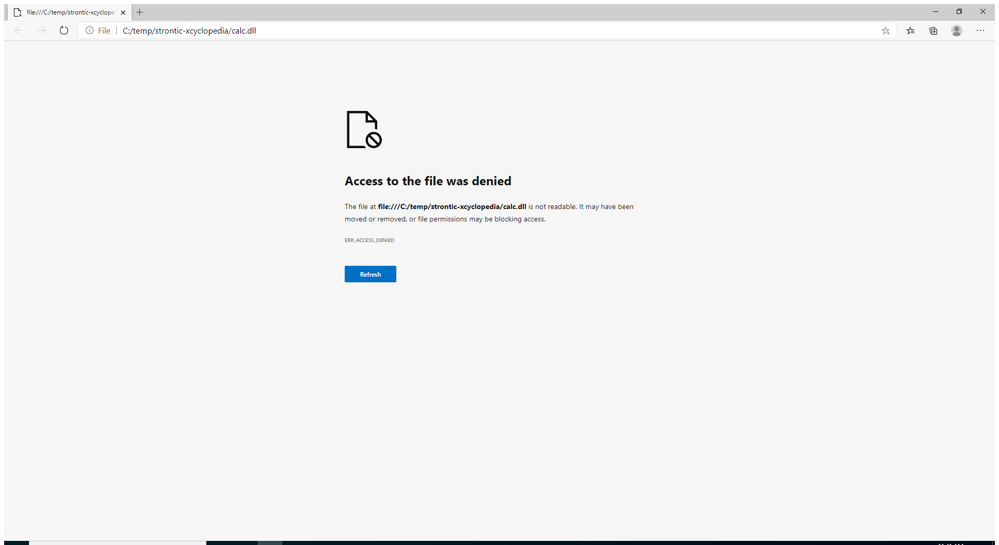

---
title: msedge.exe | Microsoft Edge
excerpt: What is msedge.exe?
---

# msedge.exe 

* File Path: `C:\Program Files (x86)\Microsoft\Edge\Application\msedge.exe`
* Description: Microsoft Edge

## Screenshot



## Hashes

Type | Hash
-- | --
MD5 | `EABEB6BDCE61B1A5670B19E4180BC753`
SHA1 | `ED9939B3411BE1C1A9A1B27F5585E30BA0F02163`
SHA256 | `31284BAB2FBE9C7CB04145D165E81FFC8096838196399902015769EDA9B053A3`
SHA384 | `71DEB4527072A52F5F9FD0FCEEA7D081053C6A63C8EDD4588D4AAA5774D14A0CED2756C27D74A0239C2D29C88BB2D042`
SHA512 | `03193956AF69AC4F652EA6133C725BAD19AF43679E9DC5490F1958CA2B300CB155691DDAB63D06C88E445787081A502CEF9AE43CB144A513D3D8815C5C2A6636`
SSDEEP | `49152:AhphrQ2Zslm/JkU3dIeT/NXI6NXBBorlmWziKbwYWI/TX72q/BX:m0+NXBrPWz1x`
IMP | `C1A6E5EF5DF31E1F0E2FBE5A950AFAB2`
PESHA1 | `9187E51DD57A1DF30EE5C5D6FB24AFA6DA9D5C03`
PE256 | `EB7EF956C5B68F3E09B97EE960DFD2D4335EE696B16D2AC6BD5B813C5F0C648F`

## Runtime Data

### Usage (stderr):
```cmhg
[3316:5052:1004/114038.007:ERROR:edge_auth_errors.cc(374)] EDGE_IDENTITY: Get Default OS Account failed: Error: Primary Error: kImplicitSignInFailure, Secondary Error: kAccountProviderFetchError, Platform error: 0, Error string: 

[3316:5052:1004/114038.506:ERROR:device_event_log_impl.cc(208)] [11:40:38.500] Bluetooth: bluetooth_adapter_winrt.cc:1074 Getting Default Adapter failed.

```

### Child Processes:
msedge.exe msedge.exe msedge.exe msedge.exe msedge.exe

### Window Title:
file:///C:/temp/strontic-xcyclopedia/calc.dll - Profile 1 - Microsoft Edge

### Open Handles:

Path | Type
-- | --
(---)   C:\Users\user\AppData\Local\Microsoft\Edge\User Data\Default\Current Tabs | File
(R--)   C:\Users\user\AppData\Local\Microsoft\Edge\User Data\lockfile | File
(R-D)   C:\Program Files (x86)\Microsoft\Edge\Application\85.0.564.68\Locales\en-US.pak | File
(R-D)   C:\Program Files (x86)\Microsoft\Edge\Application\85.0.564.68\msedge_100_percent.pak | File
(R-D)   C:\Program Files (x86)\Microsoft\Edge\Application\85.0.564.68\msedge_200_percent.pak | File
(R-D)   C:\Program Files (x86)\Microsoft\Edge\Application\85.0.564.68\resources.pak | File
(R-D)   C:\Windows\System32\en-US\crypt32.dll.mui | File
(R-D)   C:\Windows\System32\en-US\KernelBase.dll.mui | File
(R-D)   C:\Windows\System32\en-US\mswsock.dll.mui | File
(R-D)   C:\Windows\System32\en-US\propsys.dll.mui | File
(R-D)   C:\Windows\System32\en-US\user32.dll.mui | File
(R-D)   C:\Windows\System32\en-US\Windows.Security.Authentication.Web.Core.dll.mui | File
(R-D)   C:\Windows\System32\en-US\winnlsres.dll.mui | File
(RW-)   C:\Program Files (x86)\Microsoft\Edge\Application\85.0.564.68 | File
(RW-)   C:\Program Files (x86)\Microsoft\Edge\Application\85.0.564.68\icudtl.dat | File
(RW-)   C:\Program Files (x86)\Microsoft\Edge\Application\85.0.564.68\v8_context_snapshot.bin | File
(RW-)   C:\Users\user\AppData\Local\Microsoft\Edge\User Data\Default\Extension State\000003.log | File
(RW-)   C:\Users\user\AppData\Local\Microsoft\Edge\User Data\Default\Extension State\LOCK | File
(RW-)   C:\Users\user\AppData\Local\Microsoft\Edge\User Data\Default\Extension State\LOG | File
(RW-)   C:\Users\user\AppData\Local\Microsoft\Edge\User Data\Default\Extension State\MANIFEST-000001 | File
(RW-)   C:\Users\user\AppData\Local\Microsoft\Edge\User Data\Default\Favicons | File
(RW-)   C:\Users\user\AppData\Local\Microsoft\Edge\User Data\Default\History | File
(RW-)   C:\Users\user\AppData\Local\Microsoft\Edge\User Data\Default\Local Storage\leveldb\000005.ldb | File
(RW-)   C:\Users\user\AppData\Local\Microsoft\Edge\User Data\Default\Local Storage\leveldb\000016.ldb | File
(RW-)   C:\Users\user\AppData\Local\Microsoft\Edge\User Data\Default\Local Storage\leveldb\000018.ldb | File
(RW-)   C:\Users\user\AppData\Local\Microsoft\Edge\User Data\Default\Local Storage\leveldb\000021.ldb | File
(RW-)   C:\Users\user\AppData\Local\Microsoft\Edge\User Data\Default\Local Storage\leveldb\000023.ldb | File
(RW-)   C:\Users\user\AppData\Local\Microsoft\Edge\User Data\Default\Local Storage\leveldb\000024.log | File
(RW-)   C:\Users\user\AppData\Local\Microsoft\Edge\User Data\Default\Local Storage\leveldb\LOCK | File
(RW-)   C:\Users\user\AppData\Local\Microsoft\Edge\User Data\Default\Local Storage\leveldb\LOG | File
(RW-)   C:\Users\user\AppData\Local\Microsoft\Edge\User Data\Default\Local Storage\leveldb\MANIFEST-000001 | File
(RW-)   C:\Users\user\AppData\Local\Microsoft\Edge\User Data\Default\Login Data | File
(RW-)   C:\Users\user\AppData\Local\Microsoft\Edge\User Data\Default\Platform Notifications\000003.log | File
(RW-)   C:\Users\user\AppData\Local\Microsoft\Edge\User Data\Default\Platform Notifications\LOCK | File
(RW-)   C:\Users\user\AppData\Local\Microsoft\Edge\User Data\Default\Platform Notifications\LOG | File
(RW-)   C:\Users\user\AppData\Local\Microsoft\Edge\User Data\Default\Platform Notifications\MANIFEST-000001 | File
(RW-)   C:\Users\user\AppData\Local\Microsoft\Edge\User Data\Default\Service Worker\Database\000003.log | File
(RW-)   C:\Users\user\AppData\Local\Microsoft\Edge\User Data\Default\Service Worker\Database\LOCK | File
(RW-)   C:\Users\user\AppData\Local\Microsoft\Edge\User Data\Default\Service Worker\Database\LOG | File
(RW-)   C:\Users\user\AppData\Local\Microsoft\Edge\User Data\Default\Service Worker\Database\MANIFEST-000001 | File
(RW-)   C:\Users\user\AppData\Local\Microsoft\Edge\User Data\Default\Session Storage\000005.ldb | File
(RW-)   C:\Users\user\AppData\Local\Microsoft\Edge\User Data\Default\Session Storage\000007.ldb | File
(RW-)   C:\Users\user\AppData\Local\Microsoft\Edge\User Data\Default\Session Storage\000009.ldb | File
(RW-)   C:\Users\user\AppData\Local\Microsoft\Edge\User Data\Default\Session Storage\000011.ldb | File
(RW-)   C:\Users\user\AppData\Local\Microsoft\Edge\User Data\Default\Session Storage\000012.log | File
(RW-)   C:\Users\user\AppData\Local\Microsoft\Edge\User Data\Default\Session Storage\000013.ldb | File
(RW-)   C:\Users\user\AppData\Local\Microsoft\Edge\User Data\Default\Session Storage\LOCK | File
(RW-)   C:\Users\user\AppData\Local\Microsoft\Edge\User Data\Default\Session Storage\LOG | File
(RW-)   C:\Users\user\AppData\Local\Microsoft\Edge\User Data\Default\Session Storage\MANIFEST-000001 | File
(RW-)   C:\Users\user\AppData\Local\Microsoft\Edge\User Data\Default\Site Characteristics Database\000003.log | File
(RW-)   C:\Users\user\AppData\Local\Microsoft\Edge\User Data\Default\Site Characteristics Database\LOCK | File
(RW-)   C:\Users\user\AppData\Local\Microsoft\Edge\User Data\Default\Site Characteristics Database\LOG | File
(RW-)   C:\Users\user\AppData\Local\Microsoft\Edge\User Data\Default\Site Characteristics Database\MANIFEST-000001 | File
(RW-)   C:\Users\user\AppData\Local\Microsoft\Edge\User Data\Default\Sync Data\LevelDB\000003.log | File
(RW-)   C:\Users\user\AppData\Local\Microsoft\Edge\User Data\Default\Sync Data\LevelDB\LOCK | File
(RW-)   C:\Users\user\AppData\Local\Microsoft\Edge\User Data\Default\Sync Data\LevelDB\LOG | File
(RW-)   C:\Users\user\AppData\Local\Microsoft\Edge\User Data\Default\Sync Data\LevelDB\MANIFEST-000001 | File
(RW-)   C:\Users\user\AppData\Local\Microsoft\Edge\User Data\Default\Top Sites | File
(RW-)   C:\Users\user\AppData\Local\Microsoft\Edge\User Data\Default\Visited Links | File
(RW-)   C:\Users\user\AppData\Local\Microsoft\Edge\User Data\Default\Web Data | File
(RW-)   C:\Users\user\AppData\Local\Microsoft\Edge\User Data\Default\Web Data-journal | File
(RW-)   C:\Users\user\AppData\Local\Microsoft\Edge\User Data\SmartScreen\local\cache | File
(RW-)   C:\Users\user\AppData\Local\Microsoft\Edge\User Data\SmartScreen\local\download_cache | File
(RW-)   C:\Users\user\AppData\Local\Microsoft\Edge\User Data\SmartScreen\local\warnStateCache | File
(RW-)   C:\Windows\WinSxS\amd64_microsoft.windows.common-controls_6595b64144ccf1df_6.0.19041.488_none_ca04af081b815d21 | File
(RWD)   C:\Users\user\AppData\Local\Microsoft\Edge\User Data\BrowserMetrics\BrowserMetrics-5F79ED03-980.pma | File
(RWD)   C:\Users\user\AppData\Local\Microsoft\Edge\User Data\Default\GPUCache\data_0 | File
(RWD)   C:\Users\user\AppData\Local\Microsoft\Edge\User Data\Default\GPUCache\data_1 | File
(RWD)   C:\Users\user\AppData\Local\Microsoft\Edge\User Data\Default\GPUCache\data_2 | File
(RWD)   C:\Users\user\AppData\Local\Microsoft\Edge\User Data\Default\GPUCache\data_3 | File
(RWD)   C:\Users\user\AppData\Local\Microsoft\Edge\User Data\Default\GPUCache\index | File
(RWD)   C:\Users\user\AppData\Local\Microsoft\Edge\User Data\ShaderCache\GPUCache\data_0 | File
(RWD)   C:\Users\user\AppData\Local\Microsoft\Edge\User Data\ShaderCache\GPUCache\data_1 | File
(RWD)   C:\Users\user\AppData\Local\Microsoft\Edge\User Data\ShaderCache\GPUCache\data_2 | File
(RWD)   C:\Users\user\AppData\Local\Microsoft\Edge\User Data\ShaderCache\GPUCache\data_3 | File
(RWD)   C:\Users\user\AppData\Local\Microsoft\Edge\User Data\ShaderCache\GPUCache\index | File
(RWD)   C:\Users\user\AppData\Local\Microsoft\Edge\User Data\Subresource Filter\Indexed Rules\27\9.17.0\Ruleset Data | File
(RWD)   C:\Users\user\AppData\Roaming\Microsoft\Spelling | File
(RWD)   C:\Windows\Fonts | File
(RWD)   C:\Windows\Fonts\segoeui.ttf | File
(RWD)   C:\Windows\Fonts\segoeuib.ttf | File
(RWD)   C:\Windows\Fonts\seguisb.ttf | File
(RWD)   C:\Windows\Fonts\seguisbi.ttf | File
(RWD)   C:\Windows\System32\drivers\etc | File
\BaseNamedObjects\__ComCatalogCache__ | Section
\BaseNamedObjects\C:\*ProgramData\*Microsoft\*Windows\*Caches\*{6AF0698E-D558-4F6E-9B3C-3716689AF493}.2.ver0x0000000000000006.db | Section
\BaseNamedObjects\C:\*ProgramData\*Microsoft\*Windows\*Caches\*{DDF571F2-BE98-426D-8288-1A9A39C3FDA2}.2.ver0x0000000000000002.db | Section
\BaseNamedObjects\C:\*ProgramData\*Microsoft\*Windows\*Caches\*cversions.2 | Section
\BaseNamedObjects\F932B6C7-3A20-46A0-B8A0-8894AA421973 | Section
\BaseNamedObjects\NLS_CodePage_1252_3_2_0_0 | Section
\BaseNamedObjects\NLS_CodePage_437_3_2_0_0 | Section
\BaseNamedObjects\windows_shell_global_counters | Section
\Sessions\1\BaseNamedObjects\980HWNDInterface:4403a6 | Section
\Sessions\1\BaseNamedObjects\980HWNDInterface:4e0432 | Section
\Sessions\1\BaseNamedObjects\windows_shell_global_counters | Section
\Sessions\1\Windows\Theme64749523 | Section
\Windows\Theme1120315852 | Section


### Loaded Modules:

Path |
-- |
C:\Program Files (x86)\Microsoft\Edge\Application\85.0.564.68\msedge_elf.dll |
C:\Program Files (x86)\Microsoft\Edge\Application\msedge.exe |
C:\Windows\System32\KERNEL32.DLL |
C:\Windows\System32\KERNELBASE.dll |
C:\Windows\SYSTEM32\ntdll.dll |


## Signature

* Status: Signature verified.
* Serial: `330000018A073733CF2048893C00000000018A`
* Thumbprint: `640386795F1D21244E7EA6E7A6E69E9C5B0A4F3E`
* Issuer: CN=Microsoft Code Signing PCA 2011, O=Microsoft Corporation, L=Redmond, S=Washington, C=US
* Subject: CN=Microsoft Corporation, O=Microsoft Corporation, L=Redmond, S=Washington, C=US

## File Metadata

* Original Filename: msedge.exe
* Product Name: Microsoft Edge
* Company Name: Microsoft Corporation
* File Version: 85.0.564.68
* Product Version: 85.0.564.68
* Language: English (United States)
* Legal Copyright: Copyright Microsoft Corporation. All rights reserved.
* Machine Type: 64-bit

## File Scan

* VirusTotal Detections: 0/70
* VirusTotal Link: https://www.virustotal.com/gui/file/31284bab2fbe9c7cb04145d165e81ffc8096838196399902015769eda9b053a3/detection/

## File Similarity (ssdeep match)

File | Score
-- | --
[C:\Program Files (x86)\Microsoft\Edge\Application\85.0.564.68\msedge.exe](msedge.exe-EABEB6BDCE61B1A5670B19E4180BC753.md) | 100


MIT License. Copyright (c) 2020 Strontic.


