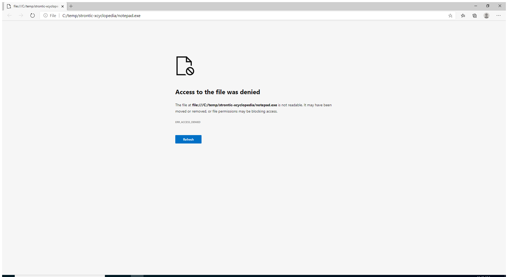

---
title: msedgewebview2.exe | Microsoft Edge WebView2
excerpt: What is msedgewebview2.exe?
---

# msedgewebview2.exe 

* File Path: `C:\Program Files (x86)\Microsoft\Edge\Application\85.0.564.68\msedgewebview2.exe`
* Description: Microsoft Edge WebView2

## Screenshot



## Hashes

Type | Hash
-- | --
MD5 | `8A40B7CC24B0ED4FBF664853585D1793`
SHA1 | `A751A6297A3C97E194DE217CD799CC23C1B6AEBE`
SHA256 | `E97DA08DE8E6D7B2E6B6A710633FD9CC012B6DBD5FD6384BA9AAC0581B55715F`
SHA384 | `945E4C88986A2515AEF71E11E57B351D7B73164FA5D1507E129698A07C606C27B5E788FA2D6DABF3BB6DAE82E8C1D08E`
SHA512 | `7CFB785E5D1397D3D75174856EF297A82F386722BBBB1296D4455367EF5A29BCC642890EACB33ADE8F422B5A543FBA9E32F24EA840FA522041932E7D0814C629`
SSDEEP | `49152:9LJq79KsMEG0JL0n9ZeK/tt8VYX+For9FWCBqkwYpIPTcn+o:FCI9RDE4WCGo`
IMP | `C1A6E5EF5DF31E1F0E2FBE5A950AFAB2`
PESHA1 | `6C30B6BB750A3BE1D6015136BCA7B8CFED7BBFF2`
PE256 | `348EE340441AA95DF646206CF41641AABFB89322E315E3B573E39F9C788D0F44`

## Runtime Data

### Usage (stderr):
```cmhg
[5588:6324:1004/114141.586:ERROR:edge_auth_errors.cc(374)] EDGE_IDENTITY: Get Default OS Account failed: Error: Primary Error: kImplicitSignInFailure, Secondary Error: kAccountProviderFetchError, Platform error: 0, Error string: 

[5588:6324:1004/114142.093:ERROR:device_event_log_impl.cc(208)] [11:41:42.091] Bluetooth: bluetooth_adapter_winrt.cc:1074 Getting Default Adapter failed.

```

### Child Processes:
msedgewebview2.exe msedgewebview2.exe msedgewebview2.exe msedgewebview2.exe msedgewebview2.exe

### Window Title:
file:///C:/temp/strontic-xcyclopedia/calc.dll - Profile 1 - Microsoft Edge

### Open Handles:

Path | Type
-- | --
(---)   C:\Users\user\AppData\Local\Microsoft\Edge\User Data\Default\Current Tabs | File
(R--)   C:\Users\user\AppData\Local\Microsoft\Edge\User Data\lockfile | File
(R-D)   C:\Program Files (x86)\Microsoft\Edge\Application\85.0.564.68\Locales\en-US.pak | File
(R-D)   C:\Program Files (x86)\Microsoft\Edge\Application\85.0.564.68\msedge_100_percent.pak | File
(R-D)   C:\Program Files (x86)\Microsoft\Edge\Application\85.0.564.68\msedge_200_percent.pak | File
(R-D)   C:\Program Files (x86)\Microsoft\Edge\Application\85.0.564.68\resources.pak | File
(R-D)   C:\Windows\System32\en-US\crypt32.dll.mui | File
(R-D)   C:\Windows\System32\en-US\kernel32.dll.mui | File
(R-D)   C:\Windows\System32\en-US\KernelBase.dll.mui | File
(R-D)   C:\Windows\System32\en-US\mswsock.dll.mui | File
(R-D)   C:\Windows\System32\en-US\propsys.dll.mui | File
(R-D)   C:\Windows\System32\en-US\user32.dll.mui | File
(R-D)   C:\Windows\System32\en-US\Windows.Security.Authentication.Web.Core.dll.mui | File
(R-D)   C:\Windows\System32\en-US\winnlsres.dll.mui | File
(RW-)   C:\Program Files (x86)\Microsoft\Edge\Application\85.0.564.68 | File
(RW-)   C:\Program Files (x86)\Microsoft\Edge\Application\85.0.564.68\icudtl.dat | File
(RW-)   C:\Program Files (x86)\Microsoft\Edge\Application\85.0.564.68\v8_context_snapshot.bin | File
(RW-)   C:\Users\user\AppData\Local\Microsoft\Edge\User Data\Default\AutofillStrikeDatabase\000003.log | File
(RW-)   C:\Users\user\AppData\Local\Microsoft\Edge\User Data\Default\AutofillStrikeDatabase\LOCK | File
(RW-)   C:\Users\user\AppData\Local\Microsoft\Edge\User Data\Default\AutofillStrikeDatabase\LOG | File
(RW-)   C:\Users\user\AppData\Local\Microsoft\Edge\User Data\Default\AutofillStrikeDatabase\MANIFEST-000001 | File
(RW-)   C:\Users\user\AppData\Local\Microsoft\Edge\User Data\Default\BudgetDatabase\000003.log | File
(RW-)   C:\Users\user\AppData\Local\Microsoft\Edge\User Data\Default\BudgetDatabase\LOCK | File
(RW-)   C:\Users\user\AppData\Local\Microsoft\Edge\User Data\Default\BudgetDatabase\LOG | File
(RW-)   C:\Users\user\AppData\Local\Microsoft\Edge\User Data\Default\BudgetDatabase\MANIFEST-000001 | File
(RW-)   C:\Users\user\AppData\Local\Microsoft\Edge\User Data\Default\data_reduction_proxy_leveldb\000013.log | File
(RW-)   C:\Users\user\AppData\Local\Microsoft\Edge\User Data\Default\data_reduction_proxy_leveldb\LOCK | File
(RW-)   C:\Users\user\AppData\Local\Microsoft\Edge\User Data\Default\data_reduction_proxy_leveldb\LOG | File
(RW-)   C:\Users\user\AppData\Local\Microsoft\Edge\User Data\Default\data_reduction_proxy_leveldb\MANIFEST-000012 | File
(RW-)   C:\Users\user\AppData\Local\Microsoft\Edge\User Data\Default\Extension State\000003.log | File
(RW-)   C:\Users\user\AppData\Local\Microsoft\Edge\User Data\Default\Extension State\LOCK | File
(RW-)   C:\Users\user\AppData\Local\Microsoft\Edge\User Data\Default\Extension State\LOG | File
(RW-)   C:\Users\user\AppData\Local\Microsoft\Edge\User Data\Default\Extension State\MANIFEST-000001 | File
(RW-)   C:\Users\user\AppData\Local\Microsoft\Edge\User Data\Default\Favicons | File
(RW-)   C:\Users\user\AppData\Local\Microsoft\Edge\User Data\Default\Feature Engagement Tracker\EventDB\000003.log | File
(RW-)   C:\Users\user\AppData\Local\Microsoft\Edge\User Data\Default\Feature Engagement Tracker\EventDB\LOCK | File
(RW-)   C:\Users\user\AppData\Local\Microsoft\Edge\User Data\Default\Feature Engagement Tracker\EventDB\LOG | File
(RW-)   C:\Users\user\AppData\Local\Microsoft\Edge\User Data\Default\Feature Engagement Tracker\EventDB\MANIFEST-000001 | File
(RW-)   C:\Users\user\AppData\Local\Microsoft\Edge\User Data\Default\heavy_ad_intervention_opt_out.db | File
(RW-)   C:\Users\user\AppData\Local\Microsoft\Edge\User Data\Default\History | File
(RW-)   C:\Users\user\AppData\Local\Microsoft\Edge\User Data\Default\Local Storage\leveldb\000005.ldb | File
(RW-)   C:\Users\user\AppData\Local\Microsoft\Edge\User Data\Default\Local Storage\leveldb\000016.ldb | File
(RW-)   C:\Users\user\AppData\Local\Microsoft\Edge\User Data\Default\Local Storage\leveldb\000018.ldb | File
(RW-)   C:\Users\user\AppData\Local\Microsoft\Edge\User Data\Default\Local Storage\leveldb\000021.ldb | File
(RW-)   C:\Users\user\AppData\Local\Microsoft\Edge\User Data\Default\Local Storage\leveldb\000023.ldb | File
(RW-)   C:\Users\user\AppData\Local\Microsoft\Edge\User Data\Default\Local Storage\leveldb\000024.log | File
(RW-)   C:\Users\user\AppData\Local\Microsoft\Edge\User Data\Default\Local Storage\leveldb\LOCK | File
(RW-)   C:\Users\user\AppData\Local\Microsoft\Edge\User Data\Default\Local Storage\leveldb\LOG | File
(RW-)   C:\Users\user\AppData\Local\Microsoft\Edge\User Data\Default\Local Storage\leveldb\MANIFEST-000001 | File
(RW-)   C:\Users\user\AppData\Local\Microsoft\Edge\User Data\Default\Login Data | File
(RW-)   C:\Users\user\AppData\Local\Microsoft\Edge\User Data\Default\Network Action Predictor | File
(RW-)   C:\Users\user\AppData\Local\Microsoft\Edge\User Data\Default\Platform Notifications\000003.log | File
(RW-)   C:\Users\user\AppData\Local\Microsoft\Edge\User Data\Default\Platform Notifications\LOCK | File
(RW-)   C:\Users\user\AppData\Local\Microsoft\Edge\User Data\Default\Platform Notifications\LOG | File
(RW-)   C:\Users\user\AppData\Local\Microsoft\Edge\User Data\Default\Platform Notifications\MANIFEST-000001 | File
(RW-)   C:\Users\user\AppData\Local\Microsoft\Edge\User Data\Default\previews_opt_out.db | File
(RW-)   C:\Users\user\AppData\Local\Microsoft\Edge\User Data\Default\Service Worker\Database\000003.log | File
(RW-)   C:\Users\user\AppData\Local\Microsoft\Edge\User Data\Default\Service Worker\Database\LOCK | File
(RW-)   C:\Users\user\AppData\Local\Microsoft\Edge\User Data\Default\Service Worker\Database\LOG | File
(RW-)   C:\Users\user\AppData\Local\Microsoft\Edge\User Data\Default\Service Worker\Database\MANIFEST-000001 | File
(RW-)   C:\Users\user\AppData\Local\Microsoft\Edge\User Data\Default\Session Storage\000005.ldb | File
(RW-)   C:\Users\user\AppData\Local\Microsoft\Edge\User Data\Default\Session Storage\000007.ldb | File
(RW-)   C:\Users\user\AppData\Local\Microsoft\Edge\User Data\Default\Session Storage\000009.ldb | File
(RW-)   C:\Users\user\AppData\Local\Microsoft\Edge\User Data\Default\Session Storage\000011.ldb | File
(RW-)   C:\Users\user\AppData\Local\Microsoft\Edge\User Data\Default\Session Storage\000012.log | File
(RW-)   C:\Users\user\AppData\Local\Microsoft\Edge\User Data\Default\Session Storage\000013.ldb | File
(RW-)   C:\Users\user\AppData\Local\Microsoft\Edge\User Data\Default\Session Storage\LOCK | File
(RW-)   C:\Users\user\AppData\Local\Microsoft\Edge\User Data\Default\Session Storage\LOG | File
(RW-)   C:\Users\user\AppData\Local\Microsoft\Edge\User Data\Default\Session Storage\MANIFEST-000001 | File
(RW-)   C:\Users\user\AppData\Local\Microsoft\Edge\User Data\Default\shared_proto_db\metadata\000003.log | File
(RW-)   C:\Users\user\AppData\Local\Microsoft\Edge\User Data\Default\shared_proto_db\metadata\LOCK | File
(RW-)   C:\Users\user\AppData\Local\Microsoft\Edge\User Data\Default\shared_proto_db\metadata\LOG | File
(RW-)   C:\Users\user\AppData\Local\Microsoft\Edge\User Data\Default\shared_proto_db\metadata\MANIFEST-000001 | File
(RW-)   C:\Users\user\AppData\Local\Microsoft\Edge\User Data\Default\Shortcuts | File
(RW-)   C:\Users\user\AppData\Local\Microsoft\Edge\User Data\Default\Site Characteristics Database\000003.log | File
(RW-)   C:\Users\user\AppData\Local\Microsoft\Edge\User Data\Default\Site Characteristics Database\LOCK | File
(RW-)   C:\Users\user\AppData\Local\Microsoft\Edge\User Data\Default\Site Characteristics Database\LOG | File
(RW-)   C:\Users\user\AppData\Local\Microsoft\Edge\User Data\Default\Site Characteristics Database\MANIFEST-000001 | File
(RW-)   C:\Users\user\AppData\Local\Microsoft\Edge\User Data\Default\Sync Data\LevelDB\000003.log | File
(RW-)   C:\Users\user\AppData\Local\Microsoft\Edge\User Data\Default\Sync Data\LevelDB\LOCK | File
(RW-)   C:\Users\user\AppData\Local\Microsoft\Edge\User Data\Default\Sync Data\LevelDB\LOG | File
(RW-)   C:\Users\user\AppData\Local\Microsoft\Edge\User Data\Default\Sync Data\LevelDB\MANIFEST-000001 | File
(RW-)   C:\Users\user\AppData\Local\Microsoft\Edge\User Data\Default\Top Sites | File
(RW-)   C:\Users\user\AppData\Local\Microsoft\Edge\User Data\Default\Visited Links | File
(RW-)   C:\Users\user\AppData\Local\Microsoft\Edge\User Data\Default\Web Data | File
(RW-)   C:\Users\user\AppData\Local\Microsoft\Edge\User Data\Default\Web Data-journal | File
(RW-)   C:\Users\user\AppData\Local\Microsoft\Edge\User Data\SmartScreen\local\cache | File
(RW-)   C:\Users\user\AppData\Local\Microsoft\Edge\User Data\SmartScreen\local\download_cache | File
(RW-)   C:\Users\user\AppData\Local\Microsoft\Edge\User Data\SmartScreen\local\warnStateCache | File
(RW-)   C:\Windows\WinSxS\amd64_microsoft.windows.common-controls_6595b64144ccf1df_6.0.19041.488_none_ca04af081b815d21 | File
(RWD)   C:\Users\user\AppData\Local\Microsoft\Edge\User Data\BrowserMetrics\BrowserMetrics-5F79ED48-66C.pma | File
(RWD)   C:\Users\user\AppData\Local\Microsoft\Edge\User Data\Default\GPUCache\data_0 | File
(RWD)   C:\Users\user\AppData\Local\Microsoft\Edge\User Data\Default\GPUCache\data_1 | File
(RWD)   C:\Users\user\AppData\Local\Microsoft\Edge\User Data\Default\GPUCache\data_2 | File
(RWD)   C:\Users\user\AppData\Local\Microsoft\Edge\User Data\Default\GPUCache\data_3 | File
(RWD)   C:\Users\user\AppData\Local\Microsoft\Edge\User Data\Default\GPUCache\index | File
(RWD)   C:\Users\user\AppData\Local\Microsoft\Edge\User Data\ShaderCache\GPUCache\data_0 | File
(RWD)   C:\Users\user\AppData\Local\Microsoft\Edge\User Data\ShaderCache\GPUCache\data_1 | File
(RWD)   C:\Users\user\AppData\Local\Microsoft\Edge\User Data\ShaderCache\GPUCache\data_2 | File
(RWD)   C:\Users\user\AppData\Local\Microsoft\Edge\User Data\ShaderCache\GPUCache\data_3 | File
(RWD)   C:\Users\user\AppData\Local\Microsoft\Edge\User Data\ShaderCache\GPUCache\index | File
(RWD)   C:\Users\user\AppData\Local\Microsoft\Edge\User Data\Subresource Filter\Indexed Rules\27\9.17.0\Ruleset Data | File
(RWD)   C:\Users\user\AppData\Roaming\Microsoft\Spelling | File
(RWD)   C:\Windows\Fonts | File
(RWD)   C:\Windows\Fonts\segoeui.ttf | File
(RWD)   C:\Windows\Fonts\segoeuib.ttf | File
(RWD)   C:\Windows\Fonts\seguisb.ttf | File
(RWD)   C:\Windows\Fonts\seguisbi.ttf | File
(RWD)   C:\Windows\System32\drivers\etc | File
\BaseNamedObjects\__ComCatalogCache__ | Section
\BaseNamedObjects\C:\*ProgramData\*Microsoft\*Windows\*Caches\*{6AF0698E-D558-4F6E-9B3C-3716689AF493}.2.ver0x0000000000000006.db | Section
\BaseNamedObjects\C:\*ProgramData\*Microsoft\*Windows\*Caches\*{DDF571F2-BE98-426D-8288-1A9A39C3FDA2}.2.ver0x0000000000000002.db | Section
\BaseNamedObjects\C:\*ProgramData\*Microsoft\*Windows\*Caches\*cversions.2 | Section
\BaseNamedObjects\F932B6C7-3A20-46A0-B8A0-8894AA421973 | Section
\BaseNamedObjects\NLS_CodePage_1252_3_2_0_0 | Section
\BaseNamedObjects\NLS_CodePage_437_3_2_0_0 | Section
\BaseNamedObjects\windows_shell_global_counters | Section
\Sessions\1\BaseNamedObjects\66cHWNDInterface:3a0342 | Section
\Sessions\1\BaseNamedObjects\66cHWNDInterface:9a043c | Section
\Sessions\1\BaseNamedObjects\windows_shell_global_counters | Section
\Sessions\1\Windows\Theme64749523 | Section
\Windows\Theme1120315852 | Section


### Loaded Modules:

Path |
-- |
C:\Program Files (x86)\Microsoft\Edge\Application\85.0.564.68\msedge_elf.dll |
C:\Program Files (x86)\Microsoft\Edge\Application\85.0.564.68\msedgewebview2.exe |
C:\Windows\System32\KERNEL32.DLL |
C:\Windows\System32\KERNELBASE.dll |
C:\Windows\SYSTEM32\ntdll.dll |


## Signature

* Status: Signature verified.
* Serial: `330000018A073733CF2048893C00000000018A`
* Thumbprint: `640386795F1D21244E7EA6E7A6E69E9C5B0A4F3E`
* Issuer: CN=Microsoft Code Signing PCA 2011, O=Microsoft Corporation, L=Redmond, S=Washington, C=US
* Subject: CN=Microsoft Corporation, O=Microsoft Corporation, L=Redmond, S=Washington, C=US

## File Metadata

* Original Filename: msedgewebview2.exe
* Product Name: Microsoft Edge WebView2
* Company Name: Microsoft Corporation
* File Version: 85.0.564.68
* Product Version: 85.0.564.68
* Language: English (United States)
* Legal Copyright: Copyright Microsoft Corporation. All rights reserved.
* Machine Type: 64-bit

## File Scan

* VirusTotal Detections: 0/70
* VirusTotal Link: https://www.virustotal.com/gui/file/e97da08de8e6d7b2e6b6a710633fd9cc012b6dbd5fd6384ba9aac0581b55715f/detection/


MIT License. Copyright (c) 2020-2021 Strontic.


