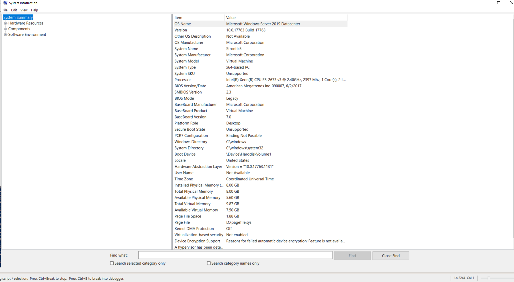

---
title: msinfo32.exe | System Information
excerpt: What is msinfo32.exe?
---

# msinfo32.exe 

* File Path: `C:\Program Files (x86)\Common Files\Microsoft Shared\MSInfo\msinfo32.exe`
* Description: System Information

## Screenshot



## Hashes

Type | Hash
-- | --
MD5 | `E0A7B839C77497E01864479B70ACB5AE`
SHA1 | `74DBDE5817BBCDCA9DBF81CE24461AC7F6AFFDC0`
SHA256 | `7C9587BAD9050E03F13AB1F46E4F02F350CDD0A6EA893F70D52436E3849B2985`
SHA384 | `0A1C265419CEF0C310DB72E768431A4D2C797B1874B072F5C9E44ACD31693FEA0069505AF7779A33F40AFAE1207193C0`
SHA512 | `6D86476E1F1ADAF493063A4AB52128BCDA6CD0D3EFB4D1BD304D55CC9B3697FAC111D816C8BE3BB0FA872ECEB0356A4B1F415E50D88FFF4B4A187B6FF790DBC4`
SSDEEP | `6144:8+Curxrt3aOo/8McrIHxKhph5hphcl1oMtSZEOHHrpm1XUZLxEZEOHHrpm1XUZLp:8HuVgD/LmIHxKhph5hphcl1LOtLpm1E0`
IMP | `B82A7325B56EDAACBA365CDE179A07C8`
PESHA1 | `0F79860591C9CB296F3781D49189669320F3D4DF`
PE256 | `EA416041E0D1B4A0F167FCCAC677752C95F1B8869B0845D940D0E7973DFB058C`

## Runtime Data

### Loaded Modules:

Path |
-- |
C:\Program Files (x86)\Common Files\Microsoft Shared\MSInfo\msinfo32.exe |
C:\Windows\SYSTEM32\ntdll.dll |
C:\Windows\System32\wow64.dll |
C:\Windows\System32\wow64cpu.dll |
C:\Windows\System32\wow64win.dll |


## Signature

* Status: Signature verified.
* Serial: `3300000266BD1580EFA75CD6D3000000000266`
* Thumbprint: `A4341B9FD50FB9964283220A36A1EF6F6FAA7840`
* Issuer: CN=Microsoft Windows Production PCA 2011, O=Microsoft Corporation, L=Redmond, S=Washington, C=US
* Subject: CN=Microsoft Windows, O=Microsoft Corporation, L=Redmond, S=Washington, C=US

## File Metadata

* Original Filename: msinfo.dll
* Product Name: Microsoft Windows Operating System
* Company Name: Microsoft Corporation
* File Version: 10.0.19041.1 (WinBuild.160101.0800)
* Product Version: 10.0.19041.1
* Language: English (United States)
* Legal Copyright:  Microsoft Corporation. All rights reserved.
* Machine Type: 32-bit

## File Scan

* VirusTotal Detections: 0/70
* VirusTotal Link: https://www.virustotal.com/gui/file/7c9587bad9050e03f13ab1f46e4f02f350cdd0a6ea893f70d52436e3849b2985/detection/

## File Similarity (ssdeep match)

File | Score
-- | --
[C:\Program Files (x86)\Common Files\microsoft shared\MSInfo\msinfo32.exe](msinfo32.exe-F589A0D3F0DA328F90A2A9556EF513B5.md) | 55
[C:\Program Files\Common Files\microsoft shared\MSInfo\msinfo32.exe](msinfo32.exe-238137CD0CD9CC74F361BEBD0178F0E6.md) | 54
[C:\Program Files\Common Files\microsoft shared\MSInfo\msinfo32.exe](msinfo32.exe-41AA3C8C427A773B6C08460535EE8070.md) | 58
[C:\Windows\system32\msinfo32.exe](msinfo32.exe-238137CD0CD9CC74F361BEBD0178F0E6.md) | 54
[C:\Windows\system32\msinfo32.exe](msinfo32.exe-41AA3C8C427A773B6C08460535EE8070.md) | 58
[C:\windows\system32\msinfo32.exe](msinfo32.exe-4BA6D7F9032FE80308C0501E087A54F6.md) | 57
[C:\WINDOWS\system32\msinfo32.exe](msinfo32.exe-CE97FD0E2556A49965411764F086CEA8.md) | 55
[C:\Windows\system32\msinfo32.exe](msinfo32.exe-DA35587758FC9C154435FB76C7183BE4.md) | 57
[C:\Windows\SysWOW64\msinfo32.exe](msinfo32.exe-2D3773A656D92C8E4367511AD4DCDD8C.md) | 49
[C:\windows\SysWOW64\msinfo32.exe](msinfo32.exe-54E568D65C876CF31586CCE68F51DEEA.md) | 55
[C:\WINDOWS\SysWOW64\msinfo32.exe](msinfo32.exe-626E3EE8F3DDDA3F44E9E945C54F030D.md) | 65
[C:\Windows\SysWOW64\msinfo32.exe](msinfo32.exe-E0A7B839C77497E01864479B70ACB5AE.md) | 100
[C:\Windows\SysWOW64\msinfo32.exe](msinfo32.exe-F589A0D3F0DA328F90A2A9556EF513B5.md) | 55


## Additional Info*

**The information below is copied from [MicrosoftDocs](https://github.com/MicrosoftDocs/windowsserverdocs), which is maintained by [Microsoft](https://opensource.microsoft.com/codeofconduct/). Available under [CC BY 4.0](https://creativecommons.org/licenses/by/4.0/) license.*

---

## msinfo32

> Applies to: Windows Server (Semi-Annual Channel), Windows Server 2019, Windows Server 2016, Windows Server 2012 R2, Windows Server 2012

Opens the System Information tool to display a comprehensive view of the hardware, system components, and software environment on the local computer.

Some System Information categories contain large amounts of data. You can use the **start /wait** command to optimize reporting performance for these categories. For more information, see [System Information](/previous-versions/windows/it-pro/windows-server-2003/cc783305(v=ws.10)).

### Syntax

```
msinfo32 [/pch] [/nfo <path>] [/report <path>] [/computer <computername>] [/showcategories] [/category <categoryID>] [/categories {+<categoryID>(+<categoryID>)|+all(-<categoryID>)}]
```

#### Parameters

| Parameter | Description |
| --------- | ----------- |
| `<path>` | Specifies the file to be opened in the format *C:\Folder1\File1.xxx*, where *C* is the drive letter, *Folder1* is the folder, *File1* is the file name, and *xxx* is the file name extension.<p>This file can be an **.nfo**, **.xml**, **.txt**, or **.cab** file. |
| `<computername>` | Specifies the name of the target or local computer. This can be a UNC name, an IP address, or a full computer name. |
| `<categoryID>` | Specifies the ID of the category item. You can obtain the category ID by using **/showcategories**. |
| /pch | Displays the System History view in the System Information tool. |
| /nfo | Saves the exported file as an **.nfo** file. If the file name that is specified in *path* does not end in an **.nfo** extension, the **.nfo** extension is automatically appended to the file name. |
| /report | Saves the file in *path* as a text file. The file name is saved exactly as it appears in *path*. The .txt extension is not appended to the file unless it is specified in path. |
| /computer | Starts the System Information tool for the specified remote computer. You must have the appropriate permissions to access the remote computer. |
| /showcategories | Starts the System Information tool with all available category IDs displayed, rather than displaying the friendly or localized names. For example, the Software Environment category is displayed as the **SWEnv** category. |
| /category | Starts System Information with the specified category selected. Use **/showcategories** to display a list of available category IDs. |
| /categories | Starts System Information with only the specified category or categories displayed. It also limits the output to the selected category or categories. Use **/showcategories** to display a list of available category IDs. |
| /? | Displays help at the command prompt. |

#### Examples

To list the available category IDs, type:

```
msinfo32 /showcategories
```

To start the System Information tool with all available information displayed, except Loaded Modules, type:

```
msinfo32 /categories +all -loadedmodules
```

To display **System Summary** information and to create an .nfo file called *syssum.nfo*, which contains information in the **System Summary** category, type:

```
msinfo32 /nfo syssum.nfo /categories +systemsummary
```

To display resource conflict information and to create an .nfo file called *conflicts.nfo*, which contains information about resource conflicts, type:

```
msinfo32 /nfo conflicts.nfo /categories +componentsproblemdevices+resourcesconflicts+resourcesforcedhardware
```

### Additional References

- [Command-Line Syntax Key](https://github.com/MicrosoftDocs/windowsserverdocs/tree/master/WindowsServerDocs/administration/windows-commands/command-line-syntax-key.md)

---


MIT License. Copyright (c) 2020 Strontic.


