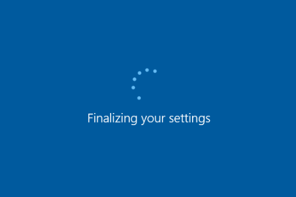

---
title: msoobe.exe | MSOOBE EXE
excerpt: What is msoobe.exe?
---

# msoobe.exe 

* File Path: `C:\Windows\system32\oobe\msoobe.exe`
* Description: MSOOBE EXE

## Screenshot

## Hashes

Type | Hash
-- | --
MD5 | `DA25B57549D0DA2202BFB482C761678F`
SHA1 | `D1E6570E92CE9150CFCD028F59E5713624FAC4EF`
SHA256 | `EE7013246BB3A3E88D8708C1CA498DFA1C4D23DA43DA9251AF02DE1DD2B95BDD`
SHA384 | `CAF15778E9B91C737E8E1D06DDA343DA263ECAE08A729DCE7F1BA5A9DDB1ECC8E8BAB3EB50D67346899584F32AAA9BAF`
SHA512 | `DC5259932B593D1B741D1270B58EACDB4DB08259C38046DF86129F0AEEFB7E8EBCCFCE20C3D16301F23E8BC85140B6C28692CB677A00C050E7FC8BB4604C6E64`
SSDEEP | `3072:wiEY4ayePNAx9J4tlyxHjzxXQwUQzYYNjHeO6AXN+MdAVONVrmwbRZxl:wiEY4aXVu9J4SNmlVYVHeutdXNRZ`
IMP | `5F659A3501BAC3F0F5C7A8E249FF6425`
PESHA1 | `D2586C77FFC8209FAD10D7C7B1D363D078FB5B30`
PE256 | `F61F76C60D21CC6CBA158CA8B1F352BD4A8072DDF067802DF380F652F66982F1`

## Runtime Data

### Loaded Modules:

Path |
-- |
C:\Windows\System32\ADVAPI32.dll |
C:\Windows\System32\KERNEL32.DLL |
C:\Windows\System32\KERNELBASE.dll |
C:\Windows\System32\msvcrt.dll |
C:\Windows\SYSTEM32\ntdll.dll |
C:\Windows\system32\oobe\msoobe.exe |

## Signature

* Status: Signature verified.
* Serial: `330000026551AE1BBD005CBFBD000000000265`
* Thumbprint: `E168609353F30FF2373157B4EB8CD519D07A2BFF`
* Issuer: CN=Microsoft Windows Production PCA 2011, O=Microsoft Corporation, L=Redmond, S=Washington, C=US
* Subject: CN=Microsoft Windows, O=Microsoft Corporation, L=Redmond, S=Washington, C=US

## File Metadata

* Original Filename: msoobe.exe
* Product Name: Microsoft Windows Operating System
* Company Name: Microsoft Corporation
* File Version: 10.0.19041.1 (WinBuild.160101.0800)
* Product Version: 10.0.19041.1
* Language: English (United States)
* Legal Copyright:  Microsoft Corporation. All rights reserved.
* Machine Type: 64-bit

## File Scan

* VirusTotal Detections: 1/65
* VirusTotal Link: https://www.virustotal.com/gui/file/ee7013246bb3a3e88d8708c1ca498dfa1c4d23da43da9251af02de1dd2b95bdd/detection/

MIT License. Copyright (c) 2020-2021 Strontic.

