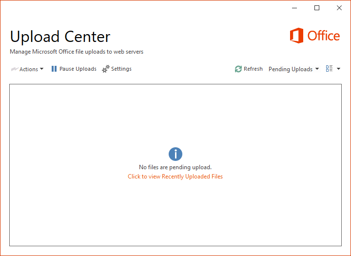

---
title: msouc.exe | Microsoft Office component
excerpt: What is msouc.exe?
---

# msouc.exe 

* File Path: `C:\Program Files (x86)\Microsoft Office\root\vfs\Windows\Installer\{90160000-000F-0000-0000-0000000FF1CE}\msouc.exe`
* Description: Microsoft Office component

## Screenshot

## Hashes

Type | Hash
-- | --
MD5 | `CF596FC931C9F7D40CEB2BBB4C6C8F5A`
SHA1 | `75C93EB5FFB2F5CF15046AF873A9C902B7417404`
SHA256 | `EBC8419AB10034A2E5BD7FEEA9EABD0F4BC612A12A10E042E8A3DF4317F2325D`
SHA384 | `913FD10235835F177B2315F7B25B5669DBDC0EDA6909B4E39BC7D191A4F45D12A5EA36C41DB8A974C315B96F40604606`
SHA512 | `8F0908890168C1175C9413EB9D176FBC223F23E2CADC9FB7D0084016C01C5210EF4F89BD729F773E718AF287659269D591A6C6A001A4333293D1864A86EFFBE3`
SSDEEP | `1536:FxEi2XRmRYBnZjInuYtyOsiexqzrG60PIby:FxL2XyY3InuYtyOsiexqzrp0PD`
IMP | `n/a`
PESHA1 | `A843DB6C1DAB260A5F6391F89A368E43B3AE923C`
PE256 | `9515435DBF0160773BFFD2C7CBA580A4FEB90F1A6E3F83DF16F54A3DFD73C25F`

## Signature

* Status: Signature verified.
* Serial: `33000002CE7C9ACE7D905ED2B70000000002CE`
* Thumbprint: `B10607FB914700B40F794610850C1DE0A21566C1`
* Issuer: CN=Microsoft Code Signing PCA 2010, O=Microsoft Corporation, L=Redmond, S=Washington, C=US
* Subject: CN=Microsoft Corporation, O=Microsoft Corporation, L=Redmond, S=Washington, C=US

## File Metadata

* Original Filename: msouc.exe
* Product Name: Microsoft Office
* Company Name: Microsoft Corporation
* File Version: 16.0.12527.20458
* Product Version: 16.0.12527.20458
* Language: Language Neutral
* Legal Copyright: 
* Machine Type: 32-bit

## File Scan

* VirusTotal Detections: Unknown
* VirusTotal Link: n/a

MIT License. Copyright (c) 2020 Strontic.

