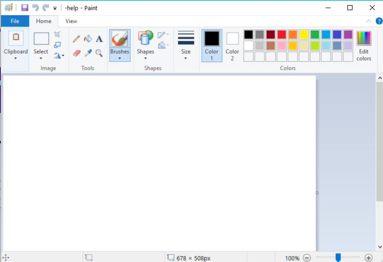

---
title: mspaint.exe | Paint
---

# mspaint.exe 

* File Path: `C:\Windows\SysWOW64\mspaint.exe`
* Description: Paint

## Screenshot

## Hashes

Type | Hash
-- | --
MD5 | `7598568851B293CD82E958C3B9735F7C`
SHA1 | `1585F1047546B6162D8A9ACCA9599BF92EF31986`
SHA256 | `C6CA40EFB55F70C704B7686DE8FF1DB7CC9B1C8DFE1754CB046F77DF73D99FB4`
SHA384 | `A4F69FEEA2765C7EC764DCACEF8311BDEF5F65C1DFE4A25CDE14021A6D19F6F2C34CF7FE136E18D49AA538FA53648CB5`
SHA512 | `D2DBC87814E8ADF1C2E166D3D34C35F967ECEF292871126BFEE4DDD357D6487BA34C4451C2F9C5D51A6ADB91831F8A34C2DDD155EE29FB396037BC92FE55F43E`
SSDEEP | `98304:0mHdN2u7InCOgQwyRPM1mlawYL260GBGrGrGWAub7jPhivQv:0mHdN6n/gQw4MIlawYVb7jP8vE`

## Runtime Data

### Window Title:
Paint

### Open Handles:

Path | Type
-- | --
(R--)   C:\Users\Administrator\Documents\--help | File
(R-D)   C:\Windows\Fonts\StaticCache.dat | File
(R-D)   C:\Windows\System32\en-US\imageres.dll.mui | File
(R-D)   C:\Windows\System32\en-US\MFC42u.dll.mui | File
(R-D)   C:\Windows\SysWOW64\en-US\mspaint.exe.mui | File
(R-D)   C:\Windows\SysWOW64\en-US\UIRibbon.dll.mui | File
(RW-)   C:\Users\Administrator\Documents | File
(RW-)   C:\Windows | File
(RW-)   C:\Windows\debug\WIA\wiatrace.log | File
(RW-)   C:\Windows\WinSxS\x86_microsoft.windows.common-controls_6595b64144ccf1df_6.0.17763.1397_none_26237c0767c2fee2 | File
(RW-)   C:\Windows\WinSxS\x86_microsoft.windows.gdiplus_6595b64144ccf1df_1.1.17763.1397_none_570e6eecc25578b0 | File
\BaseNamedObjects\__ComCatalogCache__ | Section
\BaseNamedObjects\NLS_CodePage_1252_3_2_0_0 | Section
\BaseNamedObjects\NLS_CodePage_437_3_2_0_0 | Section
\BaseNamedObjects\RotHintTable | Section
\RPC Control\DSEC19DC | Section
\Sessions\2\Windows\Theme4283305886 | Section
\Windows\Theme1956823608 | Section

### Loaded Modules:

Path |
-- |
C:\Windows\SYSTEM32\ntdll.dll |

## Signature

* Status: Signature verified.
* Serial: `33000001C422B2F79B793DACB20000000001C4`
* Thumbprint: `AE9C1AE54763822EEC42474983D8B635116C8452`
* Issuer: CN=Microsoft Windows Production PCA 2011, O=Microsoft Corporation, L=Redmond, S=Washington, C=US
* Subject: CN=Microsoft Windows, O=Microsoft Corporation, L=Redmond, S=Washington, C=US

## File Metadata

* Original Filename: MSPAINT.EXE.MUI
* Product Name: Microsoft Windows Operating System
* Company Name: Microsoft Corporation
* File Version: 10.0.17763.1 (WinBuild.160101.0800)
* Product Version: 10.0.17763.1
* Language: English (United States)
* Legal Copyright:  Microsoft Corporation. All rights reserved.

## File Similarity (ssdeep match)

File | Score
-- | --
[C:\windows\system32\mspaint.exe](mspaint.exe-226B4A88EB18B3A86B6D56B0FC05F35C.md) | 69
[C:\Windows\system32\mspaint.exe](mspaint.exe-67C68B11E98970966DF59D2FAD6152BF.md) | 93
[C:\Windows\system32\mspaint.exe](mspaint.exe-A5F69864C0CA8FDC157F3E7EF48F2F10.md) | 69
[C:\windows\SysWOW64\mspaint.exe](mspaint.exe-1B84FBA247447BBF80A0883495823263.md) | 66
[C:\Windows\SysWOW64\mspaint.exe](mspaint.exe-8A6A020DABFB0024BE80D988C59F8F2A.md) | 68

## Possible Misuse

*The following table contains possible examples of `mspaint.exe` being misused. While `mspaint.exe` is **not** inherently malicious, its legitimate functionality can by abused for malicious purposes.*

Source | Source File | Example | License
-- | -- | -- | --
[sigma](https://github.com/Neo23x0/sigma) | [sysmon_suspicious_remote_thread.yml](https://github.com/Neo23x0/sigma/blob/master/rules/windows/sysmon/sysmon_suspicious_remote_thread.yml) | `            - '\mspaint.exe'` | [DRL 1.0](https://github.com/Neo23x0/sigma/blob/master/LICENSE.Detection.Rules.md)
[malware-ioc](https://github.com/eset/malware-ioc) | [nukesped_lazarus](https://github.com/eset/malware-ioc/blob/master/nukesped_lazarus/README.adoc) | `.`mspaint.exe (a 2009 file)`` | [© ESET 2014-2018](https://github.com/eset/malware-ioc/blob/master/LICENSE)
[malware-ioc](https://github.com/eset/malware-ioc) | [nukesped_lazarus](https://github.com/eset/malware-ioc/blob/master/nukesped_lazarus/README.adoc) | `.`mspaint.exe`` | [© ESET 2014-2018](https://github.com/eset/malware-ioc/blob/master/LICENSE)
[signature-base](https://github.com/Neo23x0/signature-base) | [apt_codoso.yar](https://github.com/Neo23x0/signature-base/blob/master/yara/apt_codoso.yar) | 		$s4 = "mspaint.exe" fullword ascii | [CC BY-NC 4.0](https://github.com/Neo23x0/signature-base/blob/master/LICENSE)

MIT License. Copyright (c) 2020 Strontic.

