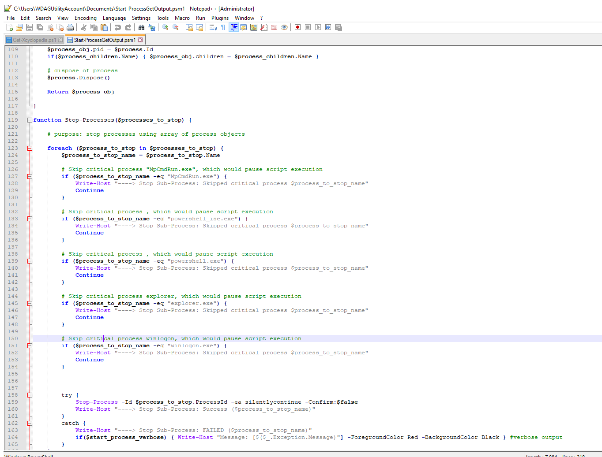
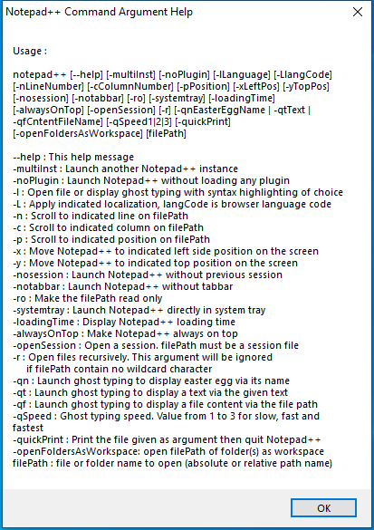

---
title: notepad++.exe | Notepad++ - a free (GNU) source code editor
excerpt: What is notepad++.exe?
---

# notepad++.exe 

* File Path: `C:\Program Files (x86)\Notepad++\notepad++.exe`
* Description: Notepad++ : a free (GNU) source code editor

## Screenshot

## Hashes

Type | Hash
-- | --
MD5 | `61FBB38D8210EDC9A6AD10B3C9C1368F`
SHA1 | `494E697970628BF9C23191FAC9952CCCBD727D7E`
SHA256 | `83F00E4639A26E61FA97AAE3CFA9C3F3005E89B6ACE119B5BC2F5E8DADAA21F4`
SHA384 | `6D81CD9277D60B1453751283F0E586C342814398F67A2B07D927FC326BB51B4253E974C25A2696220E501B19280042EB`
SHA512 | `0B668DBBE3198D6F684C91B80A405BA4BD56CEE82FF03BA3820DB059CFEEBD26F4CA84C1E2DE3D6C41D78AC69C6053E03B98C6C4975B7E2435EA669927C60CF9`
SSDEEP | `49152:uJ1TgYFipD8MdIRBMPDqbYnIDDLmIOqowTe15VNlOQy7P26zNQ/KHYIqRGVBeoRu:MFipDvdI/f0znOE/KH/1Bu`
IMP | `A03A24DB13A60C43F25AEBF3F465B62C`
PESHA1 | `A1EF6E13349E0E5697565E15803E04B47AA7A034`
PE256 | `7FFC01C478FDD7B654D0E9CF81D104F770F8BBE5B73E00B078F4621097EB33A0`

## Runtime Data

### Window Title:
new 1 - Notepad++ [Administrator]

### Open Handles:

Path | Type
-- | --
(R-D)   C:\Windows\Fonts\StaticCache.dat | File
(R-D)   C:\Windows\System32\en-US\crypt32.dll.mui | File
(R-D)   C:\Windows\System32\en-US\propsys.dll.mui | File
(R-D)   C:\Windows\SysWOW64\en-US\user32.dll.mui | File
(RW-)   C:\Program Files (x86)\Notepad++ | File
(RW-)   C:\Windows | File
(RW-)   C:\Windows\WinSxS\x86_microsoft.windows.common-controls_6595b64144ccf1df_6.0.19041.488_none_11b1e5df2ffd8627 | File
\BaseNamedObjects\__ComCatalogCache__ | Section
\BaseNamedObjects\C:\*ProgramData\*Microsoft\*Windows\*Caches\*{6AF0698E-D558-4F6E-9B3C-3716689AF493}.2.ver0x0000000000000003.db | Section
\BaseNamedObjects\C:\*ProgramData\*Microsoft\*Windows\*Caches\*{DDF571F2-BE98-426D-8288-1A9A39C3FDA2}.2.ver0x0000000000000002.db | Section
\BaseNamedObjects\C:\*ProgramData\*Microsoft\*Windows\*Caches\*cversions.2 | Section
\BaseNamedObjects\NLS_CodePage_1252_3_2_0_0 | Section
\BaseNamedObjects\NLS_CodePage_437_3_2_0_0 | Section
\BaseNamedObjects\windows_shell_global_counters | Section
\Sessions\1\BaseNamedObjects\1038HWNDInterface:1f708ac | Section
\Sessions\1\BaseNamedObjects\1038HWNDInterface:28008fe | Section
\Sessions\1\BaseNamedObjects\1038HWNDInterface:34608f6 | Section
\Sessions\1\BaseNamedObjects\1038HWNDInterface:b508f2 | Section
\Sessions\1\BaseNamedObjects\UrlZonesSM_user | Section
\Sessions\1\BaseNamedObjects\windows_shell_global_counters | Section
\Sessions\1\Windows\Theme2547664911 | Section
\Windows\Theme3854699184 | Section

### Loaded Modules:

Path |
-- |
C:\Program Files (x86)\Notepad++\notepad++.exe |
C:\Windows\SYSTEM32\ntdll.dll |
C:\Windows\System32\wow64.dll |
C:\Windows\System32\wow64cpu.dll |
C:\Windows\System32\wow64win.dll |

## Signature

* Status: Signature verified.
* Serial: `01342592A0010CB1109C11C0519CFD24`
* Thumbprint: `7649DC70ECA74657C1BAE0128492098AE47097FF`
* Issuer: CN=DigiCert SHA2 Assured ID Code Signing CA, OU=www.digicert.com, O=DigiCert Inc, C=US
* Subject: CN="Notepad++", O="Notepad++", L=Saint Cloud, S=Ile-de-France, C=FR

## File Metadata

* Original Filename: Notepad++.exe
* Product Name: Notepad++
* Company Name: Don HO don.h@free.fr
* File Version: 7.89
* Product Version: 7.89
* Language: English (United States)
* Legal Copyright: Copyleft 1998-2016 by Don HO
* Machine Type: 32-bit

## File Scan

* VirusTotal Detections: 0/67
* VirusTotal Link: https://www.virustotal.com/gui/file/83f00e4639a26e61fa97aae3cfa9c3f3005e89b6ace119b5bc2f5e8dadaa21f4/detection/

MIT License. Copyright (c) 2020 Strontic.

