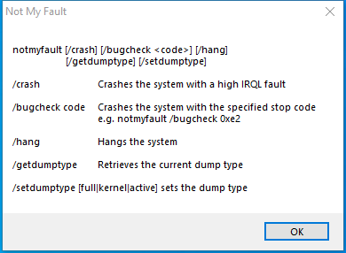

---
title: notmyfault.exe | Driver Bug Test Program
excerpt: What is notmyfault.exe?
---

# notmyfault.exe 

* File Path: `C:\SysinternalsSuite\notmyfault.exe`
* Description: Driver Bug Test Program

## Screenshot

## Hashes

Type | Hash
-- | --
MD5 | `43F2AF6E2749B91407D6C255029B5030`
SHA1 | `F5C95CE60E17F6C46F0EB2B0E292AD28AFEB04D1`
SHA256 | `EAF59DFECBD26A8817237C56EB631C7E8CAE110CAD2CADDDE6082B7596D760A5`
SHA384 | `5907EE4FEE273B59A04B6ED74727E7F2A05AC0F6BADCB9F0AF7113A3C2D9B09869D12EBC2B697974091936017340B3E4`
SHA512 | `6F80369410C659DD830355827FF47E4A7A95F1BA1DFEA0C465F8724BEF692080EF57BB5CB61B0C980A12BF9F7F383C738D1775E838726156641B1E0EE6372403`
SSDEEP | `6144:xKXGoFVXuA1c24rBcpMcwWq23LaERKcfdZYvG3wHABCjO0fcyJi:oGyVXuAm2sBcpMcT3LtHfSJU6i`
IMP | `1D502579AEFF205729CF00C24E728D80`
PESHA1 | `294CFA4E3A8D22DFB3F1BF88D7E06BE63E57B891`
PE256 | `3CC400F66E21EF0C0A8560AB11A9A62C78E9CF27A50A67EAE4CF1F077838F958`

## Runtime Data

### Window Title:
Not My Fault

### Open Handles:

Path | Type
-- | --
(R-D)   C:\Windows\Fonts\StaticCache.dat | File
(R-D)   C:\Windows\System32\en-US\KernelBase.dll.mui | File
(R-D)   C:\Windows\SystemResources\imageres.dll.mun | File
(R-D)   C:\Windows\WinSxS\x86_microsoft.windows.c..-controls.resources_6595b64144ccf1df_6.0.19041.1_en-us_130e63d987a738df\comctl32.dll.mui | File
(RW-)   C:\Windows | File
(RW-)   C:\Windows\WinSxS\x86_microsoft.windows.c..-controls.resources_6595b64144ccf1df_6.0.19041.1_en-us_130e63d987a738df | File
(RW-)   C:\Windows\WinSxS\x86_microsoft.windows.common-controls_6595b64144ccf1df_6.0.19041.488_none_11b1e5df2ffd8627 | File
(RW-)   C:\xCyclopedia | File
\BaseNamedObjects\NLS_CodePage_1252_3_2_0_0 | Section
\BaseNamedObjects\NLS_CodePage_437_3_2_0_0 | Section
\Sessions\1\Windows\Theme2036293991 | Section
\Windows\Theme1324212991 | Section

### Loaded Modules:

Path |
-- |
C:\SysinternalsSuite\notmyfault.exe |
C:\Windows\SYSTEM32\ntdll.dll |
C:\Windows\System32\wow64.dll |
C:\Windows\System32\wow64cpu.dll |
C:\Windows\System32\wow64win.dll |

## Signature

* Status: Signature verified.
* Serial: `33000001B1DDEDBA54E965B85F0001000001B1`
* Thumbprint: `9DC17888B5CFAD98B3CB35C1994E96227F061675`
* Issuer: CN=Microsoft Code Signing PCA, O=Microsoft Corporation, L=Redmond, S=Washington, C=US
* Subject: CN=Microsoft Corporation, O=Microsoft Corporation, L=Redmond, S=Washington, C=US

## File Metadata

* Original Filename: NotMyfault.exe
* Product Name: Sysinternals NotMyfault
* Company Name: Sysinternals - www.sysinternals.com
* File Version: 4.20
* Product Version: 4.20
* Language: English (United States)
* Legal Copyright: Copyright (C) 2002-2019 Mark Russinovich
* Machine Type: 32-bit

## File Scan

* VirusTotal Detections: 0/71
* VirusTotal Link: https://www.virustotal.com/gui/file/eaf59dfecbd26a8817237c56eb631c7e8cae110cad2caddde6082b7596d760a5/detection/

MIT License. Copyright (c) 2020-2021 Strontic.

