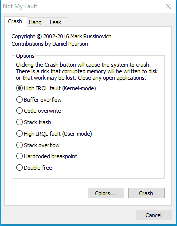
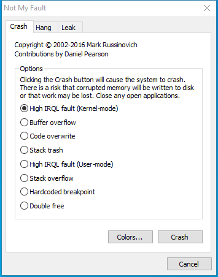

---
title: notmyfault64.exe | Driver Bug Test Program
excerpt: What is notmyfault64.exe?
---

# notmyfault64.exe 

* File Path: `C:\SysinternalsSuite\notmyfault64.exe`
* Description: Driver Bug Test Program

## Screenshot

## Hashes

Type | Hash
-- | --
MD5 | `6F721A6F4B153E8058D1CB8944825C5C`
SHA1 | `2F35A04C99131F8AE4BF1F48DCA21738E7508345`
SHA256 | `D38AF269A268FA5E2E441EAEA1CC6B57442E89AA302E9800B88B39AEF8573C22`
SHA384 | `315D2A0E6B31406F635D582A8A2E20E8E6008D465A4DFB9EC83CF582C9EDC391C9997CBE451AFDFCFB54582AF2888D33`
SHA512 | `F7BDEAC2F280CD5B925ADC867E6D4BC9A8526B0FB2643CB58A26480805B3F011B7D9889388CAD7FCD13AF4F35AF248CBA9EA994F9B382013DEC7588ADEC507BE`
SSDEEP | `12288:qknlRuy4NYKKIfu9yQ93gJbPqrwL/WCiNJqYaYxGWs:VLuFNYKKIfu9yQ9k2wL/WCiDdGB`
IMP | `45DE421EE9812C3FBE6F15CFAAE1AD91`
PESHA1 | `7A33D366724202F670714B0012FA3805A144A507`
PE256 | `E8D76511565584AFC1C289C238C403EE23B197EDE1D9D576728F66890AAB2577`

## Runtime Data

### Window Title:
Not My Fault

### Open Handles:

Path | Type
-- | --
(R-D)   C:\Windows\Fonts\StaticCache.dat | File
(R-D)   C:\Windows\WinSxS\amd64_microsoft.windows.c..-controls.resources_6595b64144ccf1df_6.0.19041.1_en-us_cb612d02732b0fd9\comctl32.dll.mui | File
(RW-)   C:\Windows\WinSxS\amd64_microsoft.windows.c..-controls.resources_6595b64144ccf1df_6.0.19041.1_en-us_cb612d02732b0fd9 | File
(RW-)   C:\Windows\WinSxS\amd64_microsoft.windows.common-controls_6595b64144ccf1df_6.0.19041.488_none_ca04af081b815d21 | File
(RW-)   C:\xCyclopedia | File
\BaseNamedObjects\NLS_CodePage_1252_3_2_0_0 | Section
\BaseNamedObjects\NLS_CodePage_437_3_2_0_0 | Section
\Sessions\1\Windows\Theme2036293991 | Section
\Windows\Theme1324212991 | Section

### Loaded Modules:

Path |
-- |
C:\SysinternalsSuite\notmyfault64.exe |
C:\Windows\System32\GDI32.dll |
C:\Windows\System32\gdi32full.dll |
C:\Windows\System32\KERNEL32.DLL |
C:\Windows\System32\KERNELBASE.dll |
C:\Windows\System32\msvcp_win.dll |
C:\Windows\System32\msvcrt.dll |
C:\Windows\SYSTEM32\ntdll.dll |
C:\Windows\System32\SHLWAPI.dll |
C:\Windows\System32\USER32.dll |
C:\Windows\SYSTEM32\VERSION.dll |
C:\Windows\System32\win32u.dll |
C:\Windows\WinSxS\amd64_microsoft.windows.common-controls_6595b64144ccf1df_6.0.19041.488_none_ca04af081b815d21\COMCTL32.dll |

## Signature

* Status: Signature verified.
* Serial: `33000001B1DDEDBA54E965B85F0001000001B1`
* Thumbprint: `9DC17888B5CFAD98B3CB35C1994E96227F061675`
* Issuer: CN=Microsoft Code Signing PCA, O=Microsoft Corporation, L=Redmond, S=Washington, C=US
* Subject: CN=Microsoft Corporation, O=Microsoft Corporation, L=Redmond, S=Washington, C=US

## File Metadata

* Original Filename: NotMyfault.exe
* Product Name: Sysinternals NotMyfault
* Company Name: Sysinternals - www.sysinternals.com
* File Version: 4.20
* Product Version: 4.20
* Language: English (United States)
* Legal Copyright: Copyright (C) 2002-2019 Mark Russinovich
* Machine Type: 64-bit

## File Scan

* VirusTotal Detections: 0/68
* VirusTotal Link: https://www.virustotal.com/gui/file/d38af269a268fa5e2e441eaea1cc6b57442e89aa302e9800b88b39aef8573c22/detection/

MIT License. Copyright (c) 2020 Strontic.

