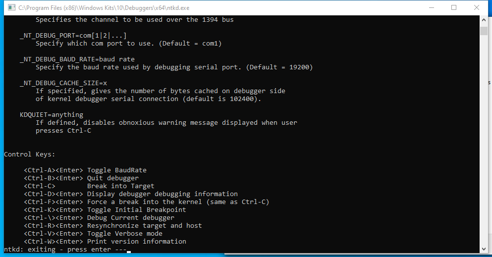

---
title: ntkd.exe | Windows Kernel Debugger
excerpt: What is ntkd.exe?
---

# ntkd.exe 

* File Path: `C:\Program Files (x86)\Windows Kits\10\Debuggers\x64\ntkd.exe`
* Description: Windows Kernel Debugger

## Screenshot

## Hashes

Type | Hash
-- | --
MD5 | `518942A9C2EEBC5A824BCE51F2536AB3`
SHA1 | `0281B22D8DB3DAEEC86FE134291E882042B6ADB7`
SHA256 | `BEDE8DE4FCF51B74E14AB2970861503CEB91C251B81E3CDB97CE2EE4FB8B6688`
SHA384 | `863A11142D271C774A433C20D810CA9BA20223A0EA4BB73258D00A774B23338032092A824562DE8C0A49A0B06272C7AB`
SHA512 | `01E4A9AB3B101688FBF19140159BEFB7731FCB59029C8789FC9577C68CD82093682E748B0E7ACB37DB31086D3FA9A7EBEDB1FFEA88B273E016B2B8105945DD23`
SSDEEP | `3072:5YEIF3Ce2SqsnM+GZVX7MBmpATeK9Wc0QyJEAYT:5YE+CeF7M9c0QsEAY`
IMP | `ED48E803B3F981E212CC99B18B589295`
PESHA1 | `6C78239C974400A52AA6391051B26FB53628981C`
PE256 | `2E5DE400BBCAB7294A88E6D66CBFC07292D31FA0C6AD970966AAC5CD425BE499`

## Runtime Data

### Child Processes:
conhost.exe

### Window Title:
C:\Program Files (x86)\Windows Kits\10\Debuggers\x64\ntkd.exe

### Open Handles:

Path | Type
-- | --
(RW-)   C:\Users\user | File
\BaseNamedObjects\C:\*ProgramData\*Microsoft\*Windows\*Caches\*{6AF0698E-D558-4F6E-9B3C-3716689AF493}.2.ver0x0000000000000002.db | Section
\BaseNamedObjects\C:\*ProgramData\*Microsoft\*Windows\*Caches\*{DDF571F2-BE98-426D-8288-1A9A39C3FDA2}.2.ver0x0000000000000002.db | Section
\BaseNamedObjects\C:\*ProgramData\*Microsoft\*Windows\*Caches\*cversions.2 | Section
\BaseNamedObjects\NLS_CodePage_1252_3_2_0_0 | Section
\BaseNamedObjects\NLS_CodePage_437_3_2_0_0 | Section

### Loaded Modules:

Path |
-- |
C:\Program Files (x86)\Windows Kits\10\Debuggers\x64\dbgeng.dll |
C:\Program Files (x86)\Windows Kits\10\Debuggers\x64\ntkd.exe |
C:\Windows\System32\bcrypt.dll |
C:\Windows\System32\KERNEL32.DLL |
C:\Windows\System32\KERNELBASE.dll |
C:\Windows\System32\msvcrt.dll |
C:\Windows\SYSTEM32\ntdll.dll |
C:\Windows\System32\RPCRT4.dll |
C:\Windows\System32\ucrtbase.dll |

## Signature

* Status: Signature verified.
* Serial: `33000002CF6D2CC57CAA65A6D80000000002CF`
* Thumbprint: `1A221B3B4FEF088B17BA6704FD088DF192D9E0EF`
* Issuer: CN=Microsoft Code Signing PCA 2010, O=Microsoft Corporation, L=Redmond, S=Washington, C=US
* Subject: CN=Microsoft Corporation, O=Microsoft Corporation, L=Redmond, S=Washington, C=US

## File Metadata

* Original Filename: ntkd.exe
* Product Name: Microsoft Windows Operating System
* Company Name: Microsoft Corporation
* File Version: 10.0.19041.1 (WinBuild.160101.0800)
* Product Version: 10.0.19041.1
* Language: English (United States)
* Legal Copyright:  Microsoft Corporation. All rights reserved.
* Machine Type: 64-bit

## File Scan

* VirusTotal Detections: 0/75
* VirusTotal Link: https://www.virustotal.com/gui/file/bede8de4fcf51b74e14ab2970861503ceb91c251b81e3cdb97ce2ee4fb8b6688/detection

MIT License. Copyright (c) 2020 Strontic.

