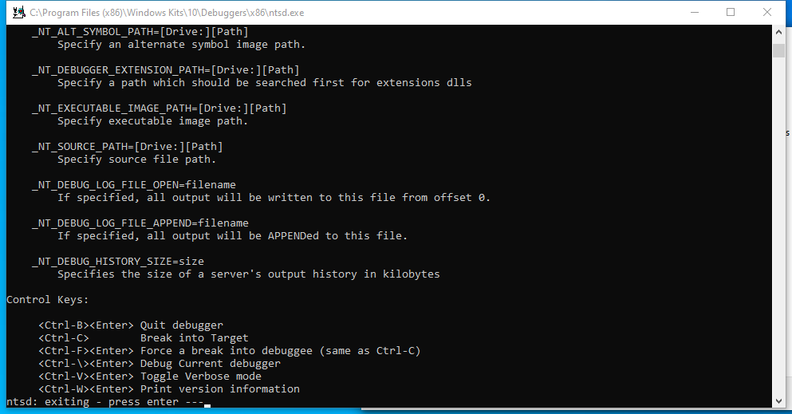
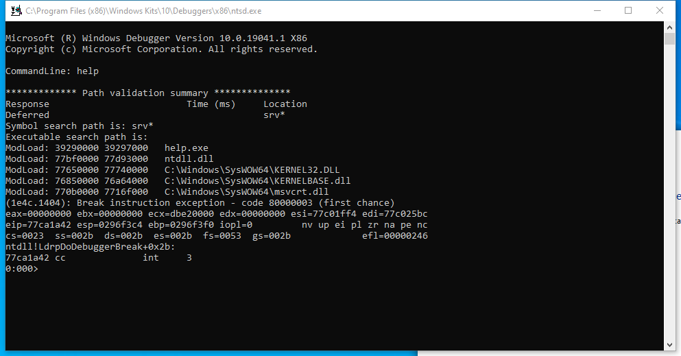
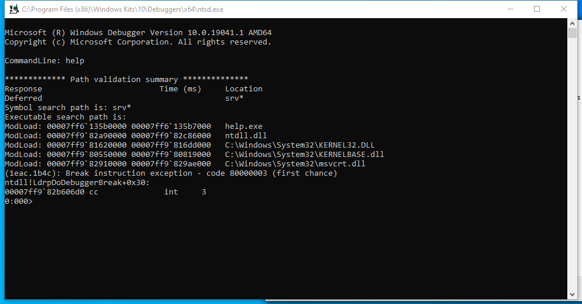

---
title: ntsd.exe | Symbolic Debugger for Windows
excerpt: What is ntsd.exe?
---

# ntsd.exe 

* File Path: `C:\Program Files (x86)\Windows Kits\10\Debuggers\x64\ntsd.exe`
* Description: Symbolic Debugger for Windows

## Screenshot

## Hashes

Type | Hash
-- | --
MD5 | `B5BC3A27E60D60EEA47608C3E2B35FD1`
SHA1 | `C6E9F65CE2CBC4D6AAD748F82407FA2631D4F049`
SHA256 | `15730D0FB2B857972371FA03910474E0971D0F2DA7999C1D606C74C475DD2899`
SHA384 | `702D2804663FF96D5BC9373B940CBE89C4F05CB0B8232E2114BBD835881674DB379F972FCD18ED10DAE993F1B9C1FDF8`
SHA512 | `24A923E1FB822F20312FF231E4C5D9A1D231B451D9C7990553B8671E27C41220196C0C363A816F1D01DFEBB109509FE2C5E7DB8E85E8D7EB33490F9E55C7B7D3`
SSDEEP | `3072:P8906DXGgoIokGcz7+JBVX7MpmpATeKzA0QKMg83J:P89tDXGUokGC7q0QKMg83`
IMP | `81BC91DB7CF89B0EDDA000530F72E4FA`
PESHA1 | `3A139ACDDEB84D467C668DBBC1DE7903F5D709FC`
PE256 | `90120AEA4F03002EC7C5E26D45B4720E82209EDD1D87D094FA9C2C688DB9F115`

## Runtime Data

### Child Processes:
conhost.exe

### Window Title:
C:\Program Files (x86)\Windows Kits\10\Debuggers\x64\ntsd.exe

### Open Handles:

Path | Type
-- | --
(R-D)   C:\Program Files (x86)\Windows Kits\10\Debuggers\x64\sym\ntdll.pdb\1EB9FACB04C73C5DEA7160764CD333D01\ntdll.pdb | File
(RW-)   C:\Users\user | File
(RWD)   C:\Windows\System32\ntdll.dll | File
\BaseNamedObjects\C:\*ProgramData\*Microsoft\*Windows\*Caches\*{6AF0698E-D558-4F6E-9B3C-3716689AF493}.2.ver0x0000000000000002.db | Section
\BaseNamedObjects\C:\*ProgramData\*Microsoft\*Windows\*Caches\*{DDF571F2-BE98-426D-8288-1A9A39C3FDA2}.2.ver0x0000000000000002.db | Section
\BaseNamedObjects\C:\*ProgramData\*Microsoft\*Windows\*Caches\*cversions.2 | Section
\BaseNamedObjects\NLS_CodePage_1252_3_2_0_0 | Section
\BaseNamedObjects\NLS_CodePage_437_3_2_0_0 | Section

### Loaded Modules:

Path |
-- |
C:\Program Files (x86)\Windows Kits\10\Debuggers\x64\dbgeng.dll |
C:\Program Files (x86)\Windows Kits\10\Debuggers\x64\ntsd.exe |
C:\Windows\System32\bcrypt.dll |
C:\Windows\System32\KERNEL32.DLL |
C:\Windows\System32\KERNELBASE.dll |
C:\Windows\System32\msvcrt.dll |
C:\Windows\SYSTEM32\ntdll.dll |
C:\Windows\System32\RPCRT4.dll |
C:\Windows\System32\ucrtbase.dll |

## Signature

* Status: Signature verified.
* Serial: `33000002CF6D2CC57CAA65A6D80000000002CF`
* Thumbprint: `1A221B3B4FEF088B17BA6704FD088DF192D9E0EF`
* Issuer: CN=Microsoft Code Signing PCA 2010, O=Microsoft Corporation, L=Redmond, S=Washington, C=US
* Subject: CN=Microsoft Corporation, O=Microsoft Corporation, L=Redmond, S=Washington, C=US

## File Metadata

* Original Filename: NTSD.Exe
* Product Name: Microsoft Windows Operating System
* Company Name: Microsoft Corporation
* File Version: 10.0.19041.1 (WinBuild.160101.0800)
* Product Version: 10.0.19041.1
* Language: English (United States)
* Legal Copyright:  Microsoft Corporation. All rights reserved.
* Machine Type: 64-bit

## File Scan

* VirusTotal Detections: 0/75
* VirusTotal Link: https://www.virustotal.com/gui/file/15730d0fb2b857972371fa03910474e0971d0f2da7999c1d606c74c475dd2899/detection

## Possible Misuse

*The following table contains possible examples of `ntsd.exe` being misused. While `ntsd.exe` is **not** inherently malicious, its legitimate functionality can be abused for malicious purposes.*

Source | Source File | Example | License
-- | -- | -- | --
[atomic-red-team](https://github.com/redcanaryco/atomic-red-team) | [T1546.012.md](https://github.com/redcanaryco/atomic-red-team/blob/master/atomics/T1546.012/T1546.012.md) | <blockquote>Adversaries may establish persistence and/or elevate privileges by executing malicious content triggered by Image File Execution Options (IFEO) debuggers. IFEOs enable a developer to attach a debugger to an application. When a process is created, a debugger present in an application’s IFEO will be prepended to the application’s name, effectively launching the new process under the debugger (e.g., <code>C:\dbg\ntsd.exe -g  notepad.exe</code>). (Citation: Microsoft Dev Blog IFEO Mar 2010) | [MIT License. © 2018 Red Canary](https://github.com/redcanaryco/atomic-red-team/blob/master/LICENSE.txt)

MIT License. Copyright (c) 2020-2021 Strontic.

