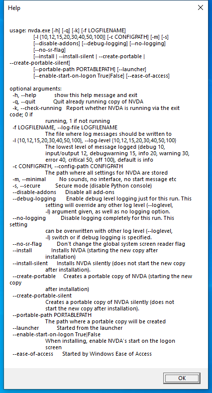
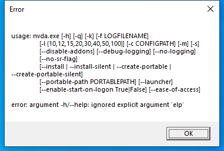

---
title: nvda.exe | NVDA application
excerpt: What is nvda.exe?
---

# nvda.exe 

* File Path: `C:\Program Files (x86)\NVDA\nvda.exe`
* Description: NVDA application

## Screenshot

## Hashes

Type | Hash
-- | --
MD5 | `85A798DF55AE642F0ABC6CBD12A8397E`
SHA1 | `3809AE7728C0986102E33AC186C48A8CBB4E8BB6`
SHA256 | `06F97F3032B028B9F86F2DC602DBFEE8176772CBEC9C4D462C25238A1B4EF512`
SHA384 | `0926C47BFF13EABF2B7BB43A84EE2208EAE4FFA4AD650BC15222882DC398BBB437D9BE84AD3FE0E31A9DE27939DE84A4`
SHA512 | `B20932F7741CD8D30C346EFD2D4C76C86779BB4952CCEB441ACB9E2CF7190C12BDE90F917C9546AAF06D67D3BAFDB2E1723E2C368E5F689736BA9F18B1784A51`
SSDEEP | `1536:B8a1nv7jgVHZL9qTTPtVCVAK29hrKkEC/RKXGjos3:BN72HZL9qTrSTwEC/aGt3`
IMP | `F234EB5A6DE92D84E1C99397EB8FBBF3`
PESHA1 | `095BE33284B3A9A1BB64F7FB4C9497CA8423140E`
PE256 | `07F0A851A0452CA580FE2F806E5CD6D1CDE20C53E21A3E64138E77F44A864CDF`

## Runtime Data

### Child Processes:
nvdaHelperRemoteLoader.exe

### Window Title:
Welcome to NVDA

### Open Handles:

Path | Type
-- | --
(R--)   C:\Windows\Speech_OneCore\Engines\TTS\en-US\NUSData\M1033David.keyboard.WVE | File
(R-D)   C:\Windows\Fonts\StaticCache.dat | File
(R-D)   C:\Windows\System32\en-US\kernel32.dll.mui | File
(R-D)   C:\Windows\System32\en-US\KernelBase.dll.mui | File
(R-D)   C:\Windows\System32\en-US\wdmaud.drv.mui | File
(R-D)   C:\Windows\SysWOW64\en-US\msacm32.drv.mui | File
(R-D)   C:\Windows\SysWOW64\oleacc.dll | File
(RW-)   C:\Program Files (x86)\NVDA | File
(RW-)   C:\Users\user\AppData\Local\Temp\nvda.log | File
(RW-)   C:\Windows | File
(RW-)   C:\Windows\SysWOW64 | File
(RW-)   C:\Windows\WinSxS\x86_microsoft.windows.common-controls_6595b64144ccf1df_6.0.19041.488_none_11b1e5df2ffd8627 | File
(RW-)   C:\Windows\WinSxS\x86_microsoft.windows.gdiplus_6595b64144ccf1df_1.1.19041.508_none_429cdbca8a8ffa94 | File
\BaseNamedObjects\__ComCatalogCache__ | Section
\BaseNamedObjects\NLS_CodePage_1252_3_2_0_0 | Section
\BaseNamedObjects\NLS_CodePage_437_3_2_0_0 | Section
\Sessions\1\BaseNamedObjects\{70DDDE67-D830-4EDB-BC52-3899F471DE7E}-Map-GLOBAL | Section
\Sessions\1\BaseNamedObjects\windows_shell_global_counters | Section
\Sessions\1\Windows\Theme2547664911 | Section
\Windows\Theme3854699184 | Section

### Loaded Modules:

Path |
-- |
C:\Program Files (x86)\NVDA\nvda.exe |
C:\Windows\SYSTEM32\ntdll.dll |
C:\Windows\System32\wow64.dll |
C:\Windows\System32\wow64cpu.dll |
C:\Windows\System32\wow64win.dll |

## Signature

* Status: Signature verified.
* Serial: `05A5D5961B5ACC20CC6D4929DA8ADC85`
* Thumbprint: `48F05E5489B4ED66E5C7D110CD0371047457CFA6`
* Issuer: CN=DigiCert SHA2 Assured ID Code Signing CA, OU=www.digicert.com, O=DigiCert Inc, C=US
* Subject: E=sysadmin@nvaccess.org, CN=NV Access Limited, O=NV Access Limited, L=Camp Mountain, S=Queensland, C=AU

## File Metadata

* Original Filename: nvda_uiAccess.exe
* Product Name: NVDA
* Company Name: NV Access
* File Version: 2020.2.0.20631
* Product Version: 2020.2
* Language: English (United States)
* Legal Copyright: Copyright (C) 2006-2020 NVDA Contributors
* Machine Type: 32-bit

## File Scan

* VirusTotal Detections: 0/65
* VirusTotal Link: https://www.virustotal.com/gui/file/06f97f3032b028b9f86f2dc602dbfee8176772cbec9c4d462c25238a1b4ef512/detection/

## File Similarity (ssdeep match)

File | Score
-- | --
[C:\Program Files (x86)\NVDA\nvda_eoaProxy.exe](nvda_eoaProxy.exe-DE63A0A3E0FE2B162EBA8DDCF7C702D1.md) | 69
[C:\Program Files (x86)\NVDA\nvda_noUIAccess.exe](nvda_noUIAccess.exe-7B3DEE8C8E3368A7432531303B17A3BB.md) | 80
[C:\Program Files (x86)\NVDA\nvda_slave.exe](nvda_slave.exe-482AE3F4BE101B3F7F65E25B5CA7E3D4.md) | 69
[C:\Program Files (x86)\NVDA\nvda_uiAccess.exe](nvda_uiAccess.exe-85A798DF55AE642F0ABC6CBD12A8397E.md) | 100

MIT License. Copyright (c) 2020-2021 Strontic.

