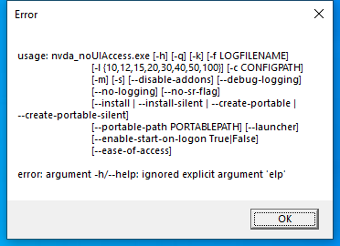
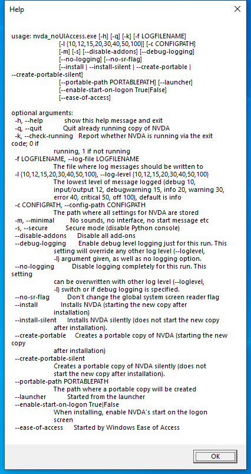

---
title: nvda_noUIAccess.exe | NVDA application
excerpt: What is nvda_noUIAccess.exe?
---

# nvda_noUIAccess.exe 

* File Path: `C:\Program Files (x86)\NVDA\nvda_noUIAccess.exe`
* Description: NVDA application

## Screenshot

## Hashes

Type | Hash
-- | --
MD5 | `DFF55687DB9476D00D794224C73CDE07`
SHA1 | `0C84598E6B0A7518DB6CF814200D4BF727688F37`
SHA256 | `14536EBCC84D69AD3D215EC6212E556273B074175FD1C8ED26DFF9A1EF9C5435`
SHA384 | `18211C5C1E4F4E15AC1CA51E9594D86BF43D5FFFFBF185525E56B5175909274A1B0D53AAC0D1293CA7C8DAC15B2EC041`
SHA512 | `8BC7606D7300FE482C595A1B2CFFCC88EE17EE582D8485A177465CDFFD03ED615D33CCD60F0D7653D4C803DB0AD2D6C5CC603A39DA0E50645BFB17E90837B57D`
SSDEEP | `1536:8pnbg3WNzDBTveJdc6kz2r29hrKkEC/RKrqXEs4:8+YDBT/6vwEC/uq0s4`
IMP | `2A9DF92EE15731BBE6E6DF974A9E6E00`
PESHA1 | `C3FC4FDEAAF6243649B03BDEC64E36D98787CEB8`
PE256 | `7D372779129A9B5F6A460888D8EABBFB660EEA3EE3B3C3867CF8545DB24ACB0A`

## Runtime Data

### Child Processes:
nvdaHelperRemoteLoader.exe

### Window Title:
Help

### Open Handles:

Path | Type
-- | --
(R-D)   C:\Windows\Fonts\StaticCache.dat | File
(R-D)   C:\Windows\System32\en-US\kernel32.dll.mui | File
(R-D)   C:\Windows\System32\en-US\KernelBase.dll.mui | File
(RW-)   C:\Program Files (x86)\NVDA | File
(RW-)   C:\Program Files (x86)\NVDA\lib\2021.2 | File
(RW-)   C:\Windows | File
\BaseNamedObjects\__ComCatalogCache__ | Section
\BaseNamedObjects\C:\*ProgramData\*Microsoft\*Windows\*Caches\*{6AF0698E-D558-4F6E-9B3C-3716689AF493}.2.ver0x0000000000000002.db | Section
\BaseNamedObjects\C:\*ProgramData\*Microsoft\*Windows\*Caches\*{DDF571F2-BE98-426D-8288-1A9A39C3FDA2}.2.ver0x0000000000000002.db | Section
\BaseNamedObjects\C:\*ProgramData\*Microsoft\*Windows\*Caches\*cversions.2 | Section
\BaseNamedObjects\NLS_CodePage_1252_3_2_0_0 | Section
\BaseNamedObjects\NLS_CodePage_437_3_2_0_0 | Section
\Sessions\1\Windows\Theme449731986 | Section
\Windows\Theme1396518710 | Section

### Loaded Modules:

Path |
-- |
C:\Program Files (x86)\NVDA\nvda_noUIAccess.exe |
C:\Windows\SYSTEM32\ntdll.dll |
C:\Windows\System32\wow64.dll |
C:\Windows\System32\wow64cpu.dll |
C:\Windows\System32\wow64win.dll |

## Signature

* Status: Signature verified.
* Serial: `01F88F85EC0E5501C9810C1D40F77C21`
* Thumbprint: `B1CFD0C99D00FC4B8FBCAA1BA24FA48F6770C461`
* Issuer: CN=DigiCert SHA2 Assured ID Code Signing CA, OU=www.digicert.com, O=DigiCert Inc, C=US
* Subject: E=sysadmin@nvaccess.org, CN=NV Access Limited, O=NV Access Limited, L=Camp Mountain, S=Queensland, C=AU

## File Metadata

* Original Filename: nvda_noUIAccess.exe
* Product Name: NVDA
* Company Name: NV Access
* File Version: 2021.2.0.23747
* Product Version: 2021.2
* Language: English (United States)
* Legal Copyright: Copyright (C) 2006-2021 NVDA Contributors
* Machine Type: 32-bit

## File Scan

* VirusTotal Detections: 0/73
* VirusTotal Link: https://www.virustotal.com/gui/file/14536ebcc84d69ad3d215ec6212e556273b074175fd1c8ed26dff9a1ef9c5435/detection

## File Similarity (ssdeep match)

File | Score
-- | --
[C:\Program Files (x86)\NVDA\nvda.exe](nvda.exe-85A798DF55AE642F0ABC6CBD12A8397E.md) | 44
[C:\Program Files (x86)\NVDA\nvda.exe](nvda.exe-A61AE8F412C2060035D05172AA483DB1.md) | 83
[C:\Program Files (x86)\NVDA\nvda_dmp.exe](nvda_dmp.exe-628A5351901FE2EA12A94CD555CAAFE0.md) | 44
[C:\Program Files (x86)\NVDA\nvda_eoaProxy.exe](nvda_eoaProxy.exe-6BCAA07CF6F0248FEF09FC5EC17CE4C5.md) | 68
[C:\Program Files (x86)\NVDA\nvda_eoaProxy.exe](nvda_eoaProxy.exe-DE63A0A3E0FE2B162EBA8DDCF7C702D1.md) | 44
[C:\Program Files (x86)\NVDA\nvda_noUIAccess.exe](nvda_noUIAccess.exe-7B3DEE8C8E3368A7432531303B17A3BB.md) | 36
[C:\Program Files (x86)\NVDA\nvda_slave.exe](nvda_slave.exe-482AE3F4BE101B3F7F65E25B5CA7E3D4.md) | 41
[C:\Program Files (x86)\NVDA\nvda_slave.exe](nvda_slave.exe-5DEB8FAF8774C4A6903ACC0702503A10.md) | 66
[C:\Program Files (x86)\NVDA\nvda_uiAccess.exe](nvda_uiAccess.exe-85A798DF55AE642F0ABC6CBD12A8397E.md) | 44
[C:\Program Files (x86)\NVDA\nvda_uiAccess.exe](nvda_uiAccess.exe-A61AE8F412C2060035D05172AA483DB1.md) | 83

MIT License. Copyright (c) 2020-2021 Strontic.

