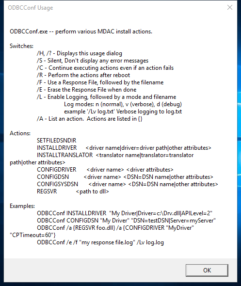

---
title: odbcconf.exe | ODBC Driver Configuration Program
---

# odbcconf.exe 

* File Path: `C:\windows\SysWOW64\odbcconf.exe`
* Description: ODBC Driver Configuration Program

## Screenshot

## Hashes

Type | Hash
-- | --
MD5 | `35CDB46FD7E96B9357D75FF285099B14`
SHA1 | `3DA25ACA4E86908C7FE514E53684FE52A83B0A36`
SHA256 | `82984508D7814CAF0E73D70ABA19359297CF23A53FF1AC891BCB84B803321858`
SHA384 | `3F194EA79189232CB8FF8603CB069F3FB4028FF6C062E321A8DD27186304FB9C4A6E04B8F7569788068000DD2DFACA39`
SHA512 | `6D2236E79932B9E6D7D88094F7A2663448AE403611925C92E7E7B94728CCD3B029963DBA286D59654FDA4D282F5A20801BAD5E2B0FEEEA8388D5EC513459609D`
SSDEEP | `384:yVrAigT9MLuRYdwgm+E1lPK2tCnnnA2OyYOFdsvwnunVNhdpStF1a1rSCvC1yJX2:gutkmUdsHjtC1PSQygx`

## Signature

* Status: Signature verified.
* Serial: `33000001C422B2F79B793DACB20000000001C4`
* Thumbprint: `AE9C1AE54763822EEC42474983D8B635116C8452`
* Issuer: CN=Microsoft Windows Production PCA 2011, O=Microsoft Corporation, L=Redmond, S=Washington, C=US
* Subject: CN=Microsoft Windows, O=Microsoft Corporation, L=Redmond, S=Washington, C=US

## File Metadata

* Original Filename: odbcconf.exe.mui
* Product Name: Microsoft Windows Operating System
* Company Name: Microsoft Corporation
* File Version: 10.0.17763.1 (WinBuild.160101.0800)
* Product Version: 10.0.17763.1
* Language: English (United States)
* Legal Copyright:  Microsoft Corporation. All rights reserved.

## File Similarity (ssdeep match)

File | Score
-- | --
[C:\windows\SysWOW64\odbcconf.exe](odbcconf.exe-607DDC78852AE90B118040B3E4CC96D2.md) | 29
[C:\WINDOWS\SysWOW64\odbcconf.exe](odbcconf.exe-86D1F10725566E818EEDB82ACBCD5CBE.md) | 60
[C:\Windows\SysWOW64\odbcconf.exe](odbcconf.exe-B38C108A8DB4B97EA352287BF796A273.md) | 40
[C:\Windows\SysWOW64\odbcconf.exe](odbcconf.exe-D567FFF92055255DBE43BF8F989A4B7E.md) | 41

## Possible Misuse

*The following table contains possible examples of `odbcconf.exe` being misused. While `odbcconf.exe` is **not** inherently malicious, its legitimate functionality can by abused for malicious purposes.*

Source | Source File | Example | License
-- | -- | -- | --
[sigma](https://github.com/Neo23x0/sigma) | [win_susp_odbcconf.yml](https://github.com/Neo23x0/sigma/blob/master/rules/windows/process_creation/win_susp_odbcconf.yml) | `title: Application Whitelisting Bypass via DLL Loaded by odbcconf.exe` | [DRL 1.0](https://github.com/Neo23x0/sigma/blob/master/LICENSE.Detection.Rules.md)
[sigma](https://github.com/Neo23x0/sigma) | [win_susp_odbcconf.yml](https://github.com/Neo23x0/sigma/blob/master/rules/windows/process_creation/win_susp_odbcconf.yml) | `description: Detects defence evasion attempt via odbcconf.exe execution to load DLL` | [DRL 1.0](https://github.com/Neo23x0/sigma/blob/master/LICENSE.Detection.Rules.md)
[sigma](https://github.com/Neo23x0/sigma) | [win_susp_odbcconf.yml](https://github.com/Neo23x0/sigma/blob/master/rules/windows/process_creation/win_susp_odbcconf.yml) | `    - https://github.com/LOLBAS-Project/LOLBAS/blob/master/yml/OSBinaries/Odbcconf.yml` | [DRL 1.0](https://github.com/Neo23x0/sigma/blob/master/LICENSE.Detection.Rules.md)
[sigma](https://github.com/Neo23x0/sigma) | [win_susp_odbcconf.yml](https://github.com/Neo23x0/sigma/blob/master/rules/windows/process_creation/win_susp_odbcconf.yml) | `        Image\|endswith: '\odbcconf.exe'` | [DRL 1.0](https://github.com/Neo23x0/sigma/blob/master/LICENSE.Detection.Rules.md)
[sigma](https://github.com/Neo23x0/sigma) | [win_susp_odbcconf.yml](https://github.com/Neo23x0/sigma/blob/master/rules/windows/process_creation/win_susp_odbcconf.yml) | `        ParentImage\|endswith: '\odbcconf.exe'` | [DRL 1.0](https://github.com/Neo23x0/sigma/blob/master/LICENSE.Detection.Rules.md)
[sigma](https://github.com/Neo23x0/sigma) | [win_susp_odbcconf.yml](https://github.com/Neo23x0/sigma/blob/master/rules/windows/process_creation/win_susp_odbcconf.yml) | `    - Legitimate use of odbcconf.exe by legitimate user` | [DRL 1.0](https://github.com/Neo23x0/sigma/blob/master/LICENSE.Detection.Rules.md)
[LOLBAS](https://github.com/LOLBAS-Project/LOLBAS) | [Odbcconf.yml](https://github.com/LOLBAS-Project/LOLBAS/blob/master/yml/OSBinaries/Odbcconf.yml) | `Name: Odbcconf.exe` | 
[LOLBAS](https://github.com/LOLBAS-Project/LOLBAS) | [Odbcconf.yml](https://github.com/LOLBAS-Project/LOLBAS/blob/master/yml/OSBinaries/Odbcconf.yml) | `  - Command: odbcconf -f file.rsp` | 
[LOLBAS](https://github.com/LOLBAS-Project/LOLBAS) | [Odbcconf.yml](https://github.com/LOLBAS-Project/LOLBAS/blob/master/yml/OSBinaries/Odbcconf.yml) | `  - Command: odbcconf /a {REGSVR c:\test\test.dll}` | 
[LOLBAS](https://github.com/LOLBAS-Project/LOLBAS) | [Odbcconf.yml](https://github.com/LOLBAS-Project/LOLBAS/blob/master/yml/OSBinaries/Odbcconf.yml) | `  - Path: C:\Windows\System32\odbcconf.exe` | 
[LOLBAS](https://github.com/LOLBAS-Project/LOLBAS) | [Odbcconf.yml](https://github.com/LOLBAS-Project/LOLBAS/blob/master/yml/OSBinaries/Odbcconf.yml) | `  - Path: C:\Windows\SysWOW64\odbcconf.exe` | 
[atomic-red-team](https://github.com/redcanaryco/atomic-red-team) | [index.md](https://github.com/redcanaryco/atomic-red-team/blob/master/atomics/Indexes/Indexes-Markdown/index.md) | - [T1218.008 Odbcconf](../../T1218.008/T1218.008.md) | [MIT License. © 2018 Red Canary](https://github.com/redcanaryco/atomic-red-team/blob/master/LICENSE.txt)
[atomic-red-team](https://github.com/redcanaryco/atomic-red-team) | [index.md](https://github.com/redcanaryco/atomic-red-team/blob/master/atomics/Indexes/Indexes-Markdown/index.md) |   - Atomic Test #1: Odbcconf.exe - Execute Arbitrary DLL [windows] | [MIT License. © 2018 Red Canary](https://github.com/redcanaryco/atomic-red-team/blob/master/LICENSE.txt)
[atomic-red-team](https://github.com/redcanaryco/atomic-red-team) | [windows-index.md](https://github.com/redcanaryco/atomic-red-team/blob/master/atomics/Indexes/Indexes-Markdown/windows-index.md) | - [T1218.008 Odbcconf](../../T1218.008/T1218.008.md) | [MIT License. © 2018 Red Canary](https://github.com/redcanaryco/atomic-red-team/blob/master/LICENSE.txt)
[atomic-red-team](https://github.com/redcanaryco/atomic-red-team) | [windows-index.md](https://github.com/redcanaryco/atomic-red-team/blob/master/atomics/Indexes/Indexes-Markdown/windows-index.md) |   - Atomic Test #1: Odbcconf.exe - Execute Arbitrary DLL [windows] | [MIT License. © 2018 Red Canary](https://github.com/redcanaryco/atomic-red-team/blob/master/LICENSE.txt)
[atomic-red-team](https://github.com/redcanaryco/atomic-red-team) | [matrix.md](https://github.com/redcanaryco/atomic-red-team/blob/master/atomics/Indexes/Matrices/matrix.md) | \|  \|  \| [Re-opened Applications](../../T1547.007/T1547.007.md) \| [Services File Permissions Weakness](../../T1574.010/T1574.010.md) \| [Odbcconf](../../T1218.008/T1218.008.md) \|  \|  \|  \|  \|  \|  \|  \| | [MIT License. © 2018 Red Canary](https://github.com/redcanaryco/atomic-red-team/blob/master/LICENSE.txt)
[atomic-red-team](https://github.com/redcanaryco/atomic-red-team) | [windows-matrix.md](https://github.com/redcanaryco/atomic-red-team/blob/master/atomics/Indexes/Matrices/windows-matrix.md) | \|  \|  \| [Services File Permissions Weakness](../../T1574.010/T1574.010.md) \| Valid Accounts [CONTRIBUTE A TEST](https://atomicredteam.io/contributing) \| [Odbcconf](../../T1218.008/T1218.008.md) \|  \|  \|  \|  \|  \|  \|  \| | [MIT License. © 2018 Red Canary](https://github.com/redcanaryco/atomic-red-team/blob/master/LICENSE.txt)
[atomic-red-team](https://github.com/redcanaryco/atomic-red-team) | [T1218.008.md](https://github.com/redcanaryco/atomic-red-team/blob/master/atomics/T1218.008/T1218.008.md) | # T1218.008 - Odbcconf | [MIT License. © 2018 Red Canary](https://github.com/redcanaryco/atomic-red-team/blob/master/LICENSE.txt)
[atomic-red-team](https://github.com/redcanaryco/atomic-red-team) | [T1218.008.md](https://github.com/redcanaryco/atomic-red-team/blob/master/atomics/T1218.008/T1218.008.md) | <blockquote>Adversaries may abuse odbcconf.exe to proxy execution of malicious payloads. Odbcconf.exe is a Windows utility that allows you to configure Open Database Connectivity (ODBC) drivers and data source names.(Citation: Microsoft odbcconf.exe) Odbcconf.exe is digitally signed by Microsoft. | [MIT License. © 2018 Red Canary](https://github.com/redcanaryco/atomic-red-team/blob/master/LICENSE.txt)
[atomic-red-team](https://github.com/redcanaryco/atomic-red-team) | [T1218.008.md](https://github.com/redcanaryco/atomic-red-team/blob/master/atomics/T1218.008/T1218.008.md) | Adversaries may abuse odbcconf.exe to bypass application whitelisting solutions that do not account for its potential abuse. Similar to [Regsvr32](https://attack.mitre.org/techniques/T1218/010), odbcconf.exe has a <code>REGSVR</code> flag that can be misused to execute DLLs (ex: <code>odbcconf.exe /S /A &lbrace;REGSVR "C:\Users\Public\file.dll"&rbrace;</code>). (Citation: LOLBAS Odbcconf)(Citation: TrendMicro Squiblydoo Aug 2017)(Citation: TrendMicro Cobalt Group Nov 2017)  | [MIT License. © 2018 Red Canary](https://github.com/redcanaryco/atomic-red-team/blob/master/LICENSE.txt)
[atomic-red-team](https://github.com/redcanaryco/atomic-red-team) | [T1218.008.md](https://github.com/redcanaryco/atomic-red-team/blob/master/atomics/T1218.008/T1218.008.md) | - [Atomic Test #1 - Odbcconf.exe - Execute Arbitrary DLL](#atomic-test-1---odbcconfexe---execute-arbitrary-dll) | [MIT License. © 2018 Red Canary](https://github.com/redcanaryco/atomic-red-team/blob/master/LICENSE.txt)
[atomic-red-team](https://github.com/redcanaryco/atomic-red-team) | [T1218.008.md](https://github.com/redcanaryco/atomic-red-team/blob/master/atomics/T1218.008/T1218.008.md) | ## Atomic Test #1 - Odbcconf.exe - Execute Arbitrary DLL | [MIT License. © 2018 Red Canary](https://github.com/redcanaryco/atomic-red-team/blob/master/LICENSE.txt)
[atomic-red-team](https://github.com/redcanaryco/atomic-red-team) | [T1218.008.md](https://github.com/redcanaryco/atomic-red-team/blob/master/atomics/T1218.008/T1218.008.md) | odbcconf.exe /S /A {REGSVR "#{dll_payload}"} | [MIT License. © 2018 Red Canary](https://github.com/redcanaryco/atomic-red-team/blob/master/LICENSE.txt)

MIT License. Copyright (c) 2020 Strontic.

