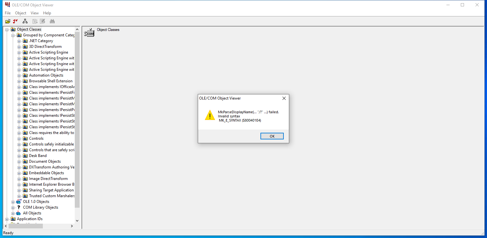

---
title: oleview.exe | OLE/COM Object Viewer
excerpt: What is oleview.exe?
---

# oleview.exe 

* File Path: `C:\Program Files (x86)\Windows Kits\10\bin\10.0.19041.0\arm64\oleview.exe`
* Description: OLE/COM Object Viewer

## Screenshot

## Hashes

Type | Hash
-- | --
MD5 | `BA92550275477C68D1A9E1B4CD3D7E8C`
SHA1 | `7B7BAB9220968991E76CDEE3FD7FE83183839A2D`
SHA256 | `1BDD5C86AD166EA5A61DCB79E57622AA11AD33B95F3CE50D0BE296D94296CB76`
SHA384 | `BE1CE4D55CA849F3987CFB9F71489B512C945C5584F6F1426053B5B12C9D652418DA5B06A2BBED01FDF92AFB694D1EA6`
SHA512 | `581728C5E54DCDA6C3DC23C6C43F5B47541547C7D9007DD154860E15505F19B098E7D323F8D93AE045649F63DF32CFE1D3743D3EF3C8A6C823E99F555077537D`
SSDEEP | `6144:1mMxWycohkdPZVpfIl3CTonpVGOcWuAsZBm9j/dPwr:QMxW3PZVb0bSWhABwjFP2`
IMP | `F273BD9841C5DF5D6DC8CA7FBB14165E`
PESHA1 | `0138D9E5F46F0C3EA1500976F4099FEDC84369ED`
PE256 | `A5322915E240D59472B0994E65D859A042B4C1683A95D23DAEED4E753C3B2C2C`

## Signature

* Status: Signature verified.
* Serial: `33000002B7E8E007A82AEF13150000000002B7`
* Thumbprint: `5A68625F1A516670A744F7EF919500A479D32A5B`
* Issuer: CN=Microsoft Code Signing PCA 2010, O=Microsoft Corporation, L=Redmond, S=Washington, C=US
* Subject: CN=Microsoft Windows Kits Publisher, O=Microsoft Corporation, L=Redmond, S=Washington, C=US

## File Metadata

* Original Filename: OLEVIEW.EXE
* Product Name: Microsoft Windows Operating System
* Company Name: Microsoft Corporation
* File Version: 10.0.19041.1 (WinBuild.160101.0800)
* Product Version: 10.0.19041.1
* Language: English (United States)
* Legal Copyright:  Microsoft Corporation. All rights reserved.
* Machine Type: 64-bit ARM

## File Scan

* VirusTotal Detections: 0/73
* VirusTotal Link: https://www.virustotal.com/gui/file/1bdd5c86ad166ea5a61dcb79e57622aa11ad33b95f3ce50d0be296d94296cb76/detection

## Possible Misuse

*The following table contains possible examples of `oleview.exe` being misused. While `oleview.exe` is **not** inherently malicious, its legitimate functionality can be abused for malicious purposes.*

Source | Source File | Example | License
-- | -- | -- | --
[sigma](https://github.com/Neo23x0/sigma) | [win_plugx_susp_exe_locations.yml](https://github.com/Neo23x0/sigma/blob/master/rules/windows/process_creation/win_plugx_susp_exe_locations.yml) | `Image\|endswith: '\OleView.exe'`{:.highlight .language-yaml} | [DRL 1.0](https://github.com/Neo23x0/sigma/blob/master/LICENSE.Detection.Rules.md)

MIT License. Copyright (c) 2020-2021 Strontic.

