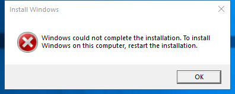

---
title: oobeldr.exe | OOBE Loader
excerpt: What is oobeldr.exe?
---

# oobeldr.exe 

* File Path: `C:\Windows\system32\oobe\oobeldr.exe`
* Description: OOBE Loader

## Screenshot

## Hashes

Type | Hash
-- | --
MD5 | `C06CFC85B4F5251137B0A8CCD5B1A159`
SHA1 | `20681CABDBD21FAACB824E75F0E79404B0AB46FD`
SHA256 | `67FE654B8B277DF364E596C2AC7466BD307F28C244425AAC7BC79F1DE3269A5A`
SHA384 | `4E5E5668D84CB594C125C0ECB72EBE488112FF44ECC05DCEFD97FDC10AA27EF10C75D7443B868DAB155657265E047F09`
SHA512 | `35BA7A5D8932EB1986DD8BA954837A3AE6D14700E6C59ACBEDCEA3879AB982500DF3F8E998211C90E1F899CF7E91F41D397396E5E1E99F0246BBEE015CECA7EF`
SSDEEP | `1536:4LKuETtMeVp1z0Cf6TMuB1k8iobVklp8t2bH3hvHBxXiSK:4udTi4Dz0Cf6TMuB1k8TbVklp8+hZ1+`
IMP | `056DD64EBE1622D153F1DA843F487C05`
PESHA1 | `12F53D888CCCC6B60F4170E52C2B206F53CE9E0C`
PE256 | `7AA587A84CB061EBD611F78411D1CF8D112BC5351DF6E03EF10E7F1DB584FCCF`

## Runtime Data

### Open Handles:

Path | Type
-- | --
(R-D)   C:\Windows\Fonts\StaticCache.dat | File
(R-D)   C:\Windows\System32\oobe\en-US\oobeldr.exe.mui | File
(RW-)   C:\Users\user | File
(RW-)   C:\Windows\Panther\UnattendGC\diagerr.xml | File
(RW-)   C:\Windows\Panther\UnattendGC\diagwrn.xml | File
(RW-)   C:\Windows\Panther\UnattendGC\setupact.log | File
(RW-)   C:\Windows\Panther\UnattendGC\setuperr.log | File
\BaseNamedObjects\C:\*ProgramData\*Microsoft\*Windows\*Caches\*{6AF0698E-D558-4F6E-9B3C-3716689AF493}.2.ver0x0000000000000002.db | Section
\BaseNamedObjects\C:\*ProgramData\*Microsoft\*Windows\*Caches\*{DDF571F2-BE98-426D-8288-1A9A39C3FDA2}.2.ver0x0000000000000002.db | Section
\BaseNamedObjects\C:\*ProgramData\*Microsoft\*Windows\*Caches\*cversions.2 | Section
\BaseNamedObjects\NLS_CodePage_1252_3_2_0_0 | Section
\BaseNamedObjects\NLS_CodePage_437_3_2_0_0 | Section
\BaseNamedObjects\SetupLogSection | Section
\Sessions\1\Windows\Theme1800662698 | Section
\Windows\Theme722103516 | Section

### Loaded Modules:

Path |
-- |
C:\Windows\SYSTEM32\ActionQueue.dll |
C:\Windows\System32\combase.dll |
C:\Windows\SYSTEM32\dbgcore.DLL |
C:\Windows\system32\dbghelp.dll |
C:\Windows\System32\KERNEL32.DLL |
C:\Windows\System32\KERNELBASE.dll |
C:\Windows\System32\msvcp_win.dll |
C:\Windows\System32\msvcrt.dll |
C:\Windows\SYSTEM32\ntdll.dll |
C:\Windows\System32\OLEAUT32.dll |
C:\Windows\system32\oobe\oobeldr.exe |
C:\Windows\System32\RPCRT4.dll |
C:\Windows\System32\shcore.dll |
C:\Windows\System32\ucrtbase.dll |
C:\Windows\SYSTEM32\UNATTEND.DLL |
C:\Windows\SYSTEM32\wdscore.dll |

## Signature

* Status: Signature verified.
* Serial: `3300000266BD1580EFA75CD6D3000000000266`
* Thumbprint: `A4341B9FD50FB9964283220A36A1EF6F6FAA7840`
* Issuer: CN=Microsoft Windows Production PCA 2011, O=Microsoft Corporation, L=Redmond, S=Washington, C=US
* Subject: CN=Microsoft Windows, O=Microsoft Corporation, L=Redmond, S=Washington, C=US

## File Metadata

* Original Filename: OOBELDR.EXE.MUI
* Product Name: Microsoft Windows Operating System
* Company Name: Microsoft Corporation
* File Version: 10.0.19041.1 (WinBuild.160101.0800)
* Product Version: 10.0.19041.1
* Language: English (United States)
* Legal Copyright:  Microsoft Corporation. All rights reserved.
* Machine Type: 64-bit

## File Scan

* VirusTotal Detections: 0/76
* VirusTotal Link: https://www.virustotal.com/gui/file/67fe654b8b277df364e596c2ac7466bd307f28c244425aac7bc79f1de3269a5a/detection

MIT License. Copyright (c) 2020 Strontic.

