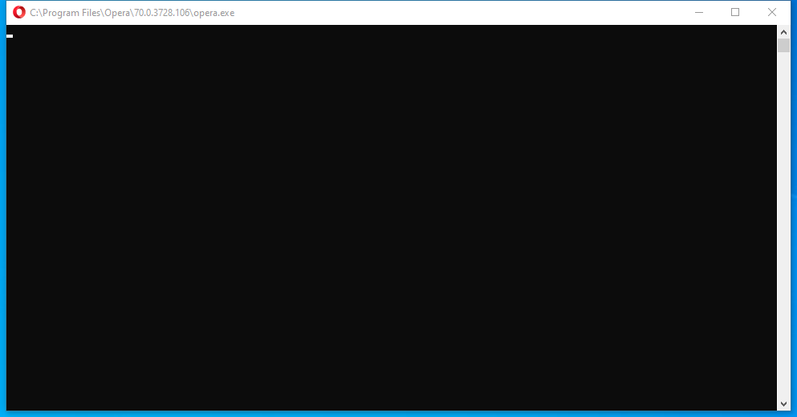

---
title: opera.exe | Opera Internet Browser
---

# opera.exe 

* File Path: `C:\Program Files\Opera\70.0.3728.106\opera.exe`
* Description: Opera Internet Browser

## Screenshot



## Hashes

Type | Hash
-- | --
MD5 | `C3365FF810311F43C51189D1F646D420`
SHA1 | `C81DC5FD5ECFEA2B3FD68978F79E8B6A27D777A1`
SHA256 | `E8CBF7487B32541CAC4B87D870C13320A3D0D954C40F4777C397B960BE690174`
SHA384 | `261DE0026F6E63386A43D385A956F67206AC8A56461CA0D959016ADCEF7CD399B24A0DFCD22105D25702C5A67B81A2EE`
SHA512 | `F6689D71661A26E7DBC7B7E264C52780ECFB4143617C1D7CA8F247EBA7F14261761F1C43D27692E848C03A5F9F177AF2F7550CF984EE60F858C26A6FAA7D7986`
SSDEEP | `12288:5vwkvP/aNl347aOSvtpYb1jyUPqfM0RcNZrfAhvGOwHceR5+n3coXCC7F:5PaNt2aOSvjOj6fM4hv8qcmn7F`

## Runtime Data

### Usage (stdout):
```Batchfile
Opera 70.0.3728.106 Stable
Features available through command-line switches:
	--with-feature:enhanced-address-bar [Enabled by default: false]
	--with-feature:handle-abp-protocol [Enabled by default: true]
	--with-feature:history-onboarding [Enabled by default: false]
	--with-feature:instagram-panel [Enabled by default: true]
	--with-feature:lookalike-url-navigation-suggestions [Enabled by default: true]
	--with-feature:procedural-tab-drawing [Enabled by default: true]
	--with-feature:search-in-closed-tabs [Enabled by default: true]
	--with-feature:search-text-in-tabs [Enabled by default: true]
	--with-feature:shared-start-page [Enabled by default: true]
	--with-feature:sidebar-site-panel [Enabled by default: false]
	--with-feature:smart-files [Enabled by default: false]
	--with-feature:suggestion-scoring-improved [Enabled by default: true]
	--with-feature:sync-passphrase-papercuts [Enabled by default: true]
	--with-feature:weather-on-startpage [Enabled by default: true]
	--with-feature:workspaces [Enabled by default: true]
	--with-feature:workspaces-bookmark-context-menu [Enabled by default: true]
	--with-feature:workspaces-extended-menu [Enabled by default: false]
	--with-feature:workspaces-sidebar-context-menu [Enabled by default: true]
	--with-feature:workspaces-sidebar-notification [Enabled by default: true]
	--with-feature:workspaces-dnd [Enabled by default: false]
	--with-feature:yandex-zen-news [Enabled by default: false]
Press any key to continue . . . 

```

### Child Processes:
launcher.exe

## Signature

* Status: Signature verified.
* Serial: `0D31C23EB2249CE611B953FB16EA0D25`
* Thumbprint: `373CD800B048D39CE2057A09937093EA73BCDE5F`
* Issuer: CN=DigiCert EV Code Signing CA (SHA2), OU=www.digicert.com, O=DigiCert Inc, C=US
* Subject: CN=Opera Software AS, O=Opera Software AS, L=Oslo, C=NO, SERIALNUMBER=916 368 127, OID.2.5.4.15=Private Organization, OID.1.3.6.1.4.1.311.60.2.1.3=NO

## File Metadata

* Original Filename: 
* Product Name: Opera Internet Browser
* Company Name: Opera Software
* File Version: 70.0.3728.106
* Product Version: 70.0.3728.106
* Language: English (United States)
* Legal Copyright: Copyright Opera Software 2020

## File Similarity (ssdeep match)

File | Score
-- | --
[C:\program files\Opera\70.0.3728.133\opera.exe](opera.exe-4237013D5E170927224FC5BD863CBD3D.md) | 96

## Possible Misuse

*The following table contains possible examples of `opera.exe` being misused. While `opera.exe` is **not** inherently malicious, its legitimate functionality can by abused for malicious purposes.*

Source | Source File | Example | License
-- | -- | -- | --
[sigma](https://github.com/Neo23x0/sigma) | [proxy_ua_malware.yml](https://github.com/Neo23x0/sigma/blob/master/rules/proxy/proxy_ua_malware.yml) | `        - 'Opera/8.81 (Windows NT 6.0; U; en)'  # Sality` | [DRL 1.0](https://github.com/Neo23x0/sigma/blob/master/LICENSE.Detection.Rules.md)
[sigma](https://github.com/Neo23x0/sigma) | [proxy_ua_malware.yml](https://github.com/Neo23x0/sigma/blob/master/rules/proxy/proxy_ua_malware.yml) | `        - 'Opera'  # Trojan Keragany` | [DRL 1.0](https://github.com/Neo23x0/sigma/blob/master/LICENSE.Detection.Rules.md)
[sigma](https://github.com/Neo23x0/sigma) | [win_suspicious_outbound_kerberos_connection.yml](https://github.com/Neo23x0/sigma/blob/master/rules/windows/builtin/win_suspicious_outbound_kerberos_connection.yml) | `            - '\opera.exe'` | [DRL 1.0](https://github.com/Neo23x0/sigma/blob/master/LICENSE.Detection.Rules.md)
[sigma](https://github.com/Neo23x0/sigma) | [sysmon_suspicious_outbound_kerberos_connection.yml](https://github.com/Neo23x0/sigma/blob/master/rules/windows/network_connection/sysmon_suspicious_outbound_kerberos_connection.yml) | `            - '\opera.exe'` | [DRL 1.0](https://github.com/Neo23x0/sigma/blob/master/LICENSE.Detection.Rules.md)
[malware-ioc](https://github.com/eset/malware-ioc) | [nouns.txt](https://github.com/eset/malware-ioc/blob/master/kryptocibule/nouns.txt) | `opera` | [© ESET 2014-2018](https://github.com/eset/malware-ioc/blob/master/LICENSE)
[atomic-red-team](https://github.com/redcanaryco/atomic-red-team) | [T1071.001.md](https://github.com/redcanaryco/atomic-red-team/blob/master/atomics/T1071.001/T1071.001.md) | Invoke-WebRequest #{domain} -UserAgent "Opera/8.81 (Windows NT 6.0; U; en)" \| out-null | [MIT License. © 2018 Red Canary](https://github.com/redcanaryco/atomic-red-team/blob/master/LICENSE.txt)
[atomic-red-team](https://github.com/redcanaryco/atomic-red-team) | [T1071.001.md](https://github.com/redcanaryco/atomic-red-team/blob/master/atomics/T1071.001/T1071.001.md) | #{curl_path} -s -A "Opera/8.81 (Windows NT 6.0; U; en)" -m3 #{domain} >nul 2>&1 | [MIT License. © 2018 Red Canary](https://github.com/redcanaryco/atomic-red-team/blob/master/LICENSE.txt)
[atomic-red-team](https://github.com/redcanaryco/atomic-red-team) | [T1071.001.md](https://github.com/redcanaryco/atomic-red-team/blob/master/atomics/T1071.001/T1071.001.md) | curl -s -A "Opera/8.81 (Windows NT 6.0; U; en)" -m3 #{domain} | [MIT License. © 2018 Red Canary](https://github.com/redcanaryco/atomic-red-team/blob/master/LICENSE.txt)
[signature-base](https://github.com/Neo23x0/signature-base) | [apt_apt30_backspace.yar](https://github.com/Neo23x0/signature-base/blob/master/yara/apt_apt30_backspace.yar) | 		$s2 = "Opera.exe" fullword wide | [CC BY-NC 4.0](https://github.com/Neo23x0/signature-base/blob/master/LICENSE)
[signature-base](https://github.com/Neo23x0/signature-base) | [apt_apt30_backspace.yar](https://github.com/Neo23x0/signature-base/blob/master/yara/apt_apt30_backspace.yar) | 		$s6 = "Copyright Opera Software 1995-" fullword wide | [CC BY-NC 4.0](https://github.com/Neo23x0/signature-base/blob/master/LICENSE)
[signature-base](https://github.com/Neo23x0/signature-base) | [apt_apt30_backspace.yar](https://github.com/Neo23x0/signature-base/blob/master/yara/apt_apt30_backspace.yar) | 		$s9 = "Opera Internet Browser" fullword wide | [CC BY-NC 4.0](https://github.com/Neo23x0/signature-base/blob/master/LICENSE)
[signature-base](https://github.com/Neo23x0/signature-base) | [apt_apt30_backspace.yar](https://github.com/Neo23x0/signature-base/blob/master/yara/apt_apt30_backspace.yar) | 		$s12 = "Opera Software" fullword wide | [CC BY-NC 4.0](https://github.com/Neo23x0/signature-base/blob/master/LICENSE)
[signature-base](https://github.com/Neo23x0/signature-base) | [apt_buckeye.yar](https://github.com/Neo23x0/signature-base/blob/master/yara/apt_buckeye.yar) | 		$s1 = "Opera Software\\Opera Stable\\Login Data" fullword wide | [CC BY-NC 4.0](https://github.com/Neo23x0/signature-base/blob/master/LICENSE)
[signature-base](https://github.com/Neo23x0/signature-base) | [apt_dragonfly.yar](https://github.com/Neo23x0/signature-base/blob/master/yara/apt_dragonfly.yar) |       $s1 = "\\AppData\\Roaming\\Opera Software\\Opera Stable\\Login Data" fullword wide | [CC BY-NC 4.0](https://github.com/Neo23x0/signature-base/blob/master/LICENSE)
[signature-base](https://github.com/Neo23x0/signature-base) | [apt_dragonfly.yar](https://github.com/Neo23x0/signature-base/blob/master/yara/apt_dragonfly.yar) |       $s5 = "********************** Opera *********************" fullword wide | [CC BY-NC 4.0](https://github.com/Neo23x0/signature-base/blob/master/LICENSE)
[signature-base](https://github.com/Neo23x0/signature-base) | [apt_telebots.yar](https://github.com/Neo23x0/signature-base/blob/master/yara/apt_telebots.yar) |       $s6 = "Opera old version credentials" fullword wide | [CC BY-NC 4.0](https://github.com/Neo23x0/signature-base/blob/master/LICENSE)
[signature-base](https://github.com/Neo23x0/signature-base) | [crime_credstealer_generic.yar](https://github.com/Neo23x0/signature-base/blob/master/yara/crime_credstealer_generic.yar) |       $s3 = "%s\\Opera Software\\Opera Stable\\Login Data" fullword ascii | [CC BY-NC 4.0](https://github.com/Neo23x0/signature-base/blob/master/LICENSE)
[signature-base](https://github.com/Neo23x0/signature-base) | [crime_credstealer_generic.yar](https://github.com/Neo23x0/signature-base/blob/master/yara/crime_credstealer_generic.yar) |       $s10 = "%s\\Opera\\Opera\\profile\\wand.dat" fullword ascii | [CC BY-NC 4.0](https://github.com/Neo23x0/signature-base/blob/master/LICENSE)
[signature-base](https://github.com/Neo23x0/signature-base) | [crime_envrial.yar](https://github.com/Neo23x0/signature-base/blob/master/yara/crime_envrial.yar) |       $a1 = "\\Opera Software\\Opera Stable\\Login Data" fullword wide | [CC BY-NC 4.0](https://github.com/Neo23x0/signature-base/blob/master/LICENSE)
[signature-base](https://github.com/Neo23x0/signature-base) | [crime_ransom_ragna_locker.yar](https://github.com/Neo23x0/signature-base/blob/master/yara/crime_ransom_ragna_locker.yar) |       $s3 = "Opera Software" fullword wide  /* Don't touch browsers for contact him*/ | [CC BY-NC 4.0](https://github.com/Neo23x0/signature-base/blob/master/LICENSE)
[signature-base](https://github.com/Neo23x0/signature-base) | [general_cloaking.yar](https://github.com/Neo23x0/signature-base/blob/master/yara/general_cloaking.yar) |       and not filepath contains "Opera" | [CC BY-NC 4.0](https://github.com/Neo23x0/signature-base/blob/master/LICENSE)
[signature-base](https://github.com/Neo23x0/signature-base) | [thor-hacktools.yar](https://github.com/Neo23x0/signature-base/blob/master/yara/thor-hacktools.yar) |       $s1 = "softwares.opera(" fullword ascii | [CC BY-NC 4.0](https://github.com/Neo23x0/signature-base/blob/master/LICENSE)


MIT License. Copyright (c) 2020 Strontic.


