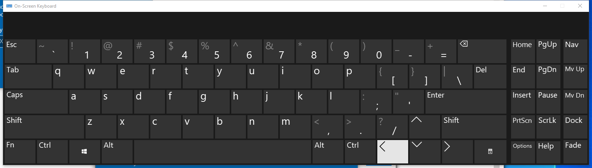

---
title: osk.exe | Accessibility On-Screen Keyboard
---

# osk.exe 

* File Path: `C:\windows\system32\osk.exe`
* Description: Accessibility On-Screen Keyboard

## Screenshot

## Hashes

Type | Hash
-- | --
MD5 | `17BD0C6AA822D5957EF63E3884CF5BC2`
SHA1 | `7D94A06925A167FB061A0623F65353052D497BE3`
SHA256 | `C7E22B9BF45AE6578810914AD912CAB77D3F3C5EE0B716E48028C124E1233F73`
SHA384 | `EE16EB95CF2F3A3FCD6531827E951781AF4B6BF6F7D164D50C4B55360F2BA504781F2069AEA403451B13182D55927AB4`
SHA512 | `5199173AA5C5D72B5438CD3DC57295C963C1B4DC98C362C034341B1098861186C5B6880F15CDA49EF244294CACCE88537FBC17A00D50B2E7B3DF47C6E2500925`
SSDEEP | `6144:I0ZXOZ2Sxhqn66VhQMUbC+J6yihdIbmbVobH3AdKy9HGeofJgDEvr6slnCUGw/xl:6ZBxhqn66VuL1kyY3jmNwzaoo`

## Signature

* Status: The file C:\windows\system32\osk.exe is not digitally signed. You cannot run this script on the current system. For more information about running scripts and setting execution policy, see about_Execution_Policies at http://go.microsoft.com/fwlink/?LinkID=135170
* Serial: ``
* Thumbprint: ``
* Issuer: 
* Subject: 

## File Metadata

* Original Filename: osk.exe.mui
* Product Name: Microsoft Windows Operating System
* Company Name: Microsoft Corporation
* File Version: 6.3.9600.16384 (winblue_rtm.130821-1623)
* Product Version: 6.3.9600.16384
* Language: English (United States)
* Legal Copyright:  Microsoft Corporation. All rights reserved.

## File Similarity (ssdeep match)

File | Score
-- | --
[C:\Windows\system32\osk.exe](osk.exe-745F2DF5BEED97B8C751DF83938CB418.md) | 50
[C:\WINDOWS\system32\osk.exe](osk.exe-9237BD6C14767145300EA58ACC2F20F9.md) | 52
[C:\Windows\system32\osk.exe](osk.exe-B160BA195ACC126E2ECA539094914688.md) | 50
[C:\Windows\system32\osk.exe](osk.exe-C6012DC3DBF49FBD67DBF57F1DE35E35.md) | 54
[C:\windows\SysWOW64\osk.exe](osk.exe-8519218ECB3C67B13A7CCAD4453B6012.md) | 50
[C:\Windows\SysWOW64\osk.exe](osk.exe-D49B6A24B175D6377AD62E9C6690E75B.md) | 60

## Possible Misuse

*The following table contains possible examples of `osk.exe` being misused. While `osk.exe` is **not** inherently malicious, its legitimate functionality can by abused for malicious purposes.*

Source | Source File | Example | License
-- | -- | -- | --
[sigma](https://github.com/Neo23x0/sigma) | [win_install_reg_debugger_backdoor.yml](https://github.com/Neo23x0/sigma/blob/master/rules/windows/process_creation/win_install_reg_debugger_backdoor.yml) | `            - '*\CurrentVersion\Image File Execution Options\osk.exe*'` | [DRL 1.0](https://github.com/Neo23x0/sigma/blob/master/LICENSE.Detection.Rules.md)
[sigma](https://github.com/Neo23x0/sigma) | [sysmon_stickykey_like_backdoor.yml](https://github.com/Neo23x0/sigma/blob/master/rules/windows/registry_event/sysmon_stickykey_like_backdoor.yml) | `            - '*\SOFTWARE\Microsoft\Windows NT\CurrentVersion\Image File Execution Options\osk.exe\Debugger'` | [DRL 1.0](https://github.com/Neo23x0/sigma/blob/master/LICENSE.Detection.Rules.md)
[sigma](https://github.com/Neo23x0/sigma) | [sysmon_stickykey_like_backdoor.yml](https://github.com/Neo23x0/sigma/blob/master/rules/windows/registry_event/sysmon_stickykey_like_backdoor.yml) | `            - '*cmd.exe osk.exe *'` | [DRL 1.0](https://github.com/Neo23x0/sigma/blob/master/LICENSE.Detection.Rules.md)
[LOLBAS](https://github.com/LOLBAS-Project/LOLBAS) | [Wmic.yml](https://github.com/LOLBAS-Project/LOLBAS/blob/master/yml/OSBinaries/Wmic.yml) | `  - Command: wmic.exe process call create "C:\Windows\system32\reg.exe add \"HKLM\SOFTWARE\Microsoft\Windows NT\CurrentVersion\Image File Execution Options\osk.exe\" /v \"Debugger\" /t REG_SZ /d \"cmd.exe\" /f"` | 
[LOLBAS](https://github.com/LOLBAS-Project/LOLBAS) | [Wmic.yml](https://github.com/LOLBAS-Project/LOLBAS/blob/master/yml/OSBinaries/Wmic.yml) | `    Description: Add cmd.exe as a debugger for the osk.exe process. Each time osk.exe is run, cmd.exe will be run as well.` | 
[atomic-red-team](https://github.com/redcanaryco/atomic-red-team) | [T1021.006.md](https://github.com/redcanaryco/atomic-red-team/blob/master/atomics/T1021.006/T1021.006.md) | Upon successful execution, cmd will utilize wmic.exe to modify the registry on a remote endpoint to swap osk.exe with cmd.exe. | [MIT License. © 2018 Red Canary](https://github.com/redcanaryco/atomic-red-team/blob/master/LICENSE.txt)
[atomic-red-team](https://github.com/redcanaryco/atomic-red-team) | [T1021.006.md](https://github.com/redcanaryco/atomic-red-team/blob/master/atomics/T1021.006/T1021.006.md) | wmic /user:#{user_name} /password:#{password} /node:#{computer_name} process call create "C:\Windows\system32\reg.exe add \"HKLM\SOFTWARE\Microsoft\Windows NT\CurrentVersion\Image File Execution Options\osk.exe\" /v \"Debugger\" /t REG_SZ /d \"cmd.exe\" /f" | [MIT License. © 2018 Red Canary](https://github.com/redcanaryco/atomic-red-team/blob/master/LICENSE.txt)
[atomic-red-team](https://github.com/redcanaryco/atomic-red-team) | [T1546.008.md](https://github.com/redcanaryco/atomic-red-team/blob/master/atomics/T1546.008/T1546.008.md) | * On-Screen Keyboard: <code>C:\Windows\System32\osk.exe</code> | [MIT License. © 2018 Red Canary](https://github.com/redcanaryco/atomic-red-team/blob/master/LICENSE.txt)
[atomic-red-team](https://github.com/redcanaryco/atomic-red-team) | [T1546.008.md](https://github.com/redcanaryco/atomic-red-team/blob/master/atomics/T1546.008/T1546.008.md) | Upon successful execution, powershell will modify the registry and swap osk.exe with cmd.exe. | [MIT License. © 2018 Red Canary](https://github.com/redcanaryco/atomic-red-team/blob/master/LICENSE.txt)
[atomic-red-team](https://github.com/redcanaryco/atomic-red-team) | [T1546.008.md](https://github.com/redcanaryco/atomic-red-team/blob/master/atomics/T1546.008/T1546.008.md) | \| parent_list \| Comma separated list of system binaries to which you want to attach each #{attached_process}. Default: "osk.exe" \| String \| osk.exe, sethc.exe, utilman.exe, magnify.exe, narrator.exe, DisplaySwitch.exe, atbroker.exe\| | [MIT License. © 2018 Red Canary](https://github.com/redcanaryco/atomic-red-team/blob/master/LICENSE.txt)
[signature-base](https://github.com/Neo23x0/signature-base) | [thor_inverse_matches.yar](https://github.com/Neo23x0/signature-base/blob/master/yara/thor_inverse_matches.yar) | 		description = "Abnormal osk.exe (On Screen Keyboard) - typical strings not found in file" | [CC BY-NC 4.0](https://github.com/Neo23x0/signature-base/blob/master/LICENSE)
[signature-base](https://github.com/Neo23x0/signature-base) | [thor_inverse_matches.yar](https://github.com/Neo23x0/signature-base/blob/master/yara/thor_inverse_matches.yar) | 		filename == "osk.exe" | [CC BY-NC 4.0](https://github.com/Neo23x0/signature-base/blob/master/LICENSE)

MIT License. Copyright (c) 2020 Strontic.

