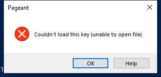

---
title: pageant.exe | PuTTY SSH authentication agent
excerpt: What is pageant.exe?
---

# pageant.exe 

* File Path: `C:\Program Files (x86)\WinSCP\PuTTY\pageant.exe`
* Description: PuTTY SSH authentication agent

## Screenshot

## Hashes

Type | Hash
-- | --
MD5 | `3BC0BBBFFC54C639CB3FE13F87696CF5`
SHA1 | `C1EE80C2F5AD7CD1AC0C1BAC9E12C960F8A1827F`
SHA256 | `3504BB149E194DCC587AF4B73FCAD3CC1EA4344414059857848C179FC4FA698E`
SHA384 | `2B48C13C0EC12C4A3E0F564ADCD73F556C0BBB89D492F85F0E0B7CF541F072AE2488E6E274E332B5C49868D8A74D4968`
SHA512 | `4111F2B829AF1AACF686F8503DFCD0BCF1E28E73D3AEDB33FE6A1F7E61B7263ECCE8DFEFCA5D7792F2D88C1C8CE75841E015D0468C35157535CBA860F06541EB`
SSDEEP | `6144:Q+L/NJQQTqoAziD2oqqICtxpX7zYtqDUIMA3JEzHibp7:Q+L/N2yqeIYpXPYYoX3ibp7`
IMP | `10D51C0E5E9DD1316F3A236340E2CDF8`
PESHA1 | `55725864E17328C5FD4CA2F419A4BF952FCB57F0`
PE256 | `2BCB4872F081AA44C86E7EBEE83DCB4008035713FE68C5B5779498EA6109EA59`

## Runtime Data

### Window Title:
Pageant

### Open Handles:

Path | Type
-- | --
(R-D)   C:\Windows\Fonts\StaticCache.dat | File
(R-D)   C:\Windows\SystemResources\imageres.dll.mun | File
(RW-)   C:\Windows | File
(RW-)   C:\Windows\WinSxS\x86_microsoft.windows.common-controls_6595b64144ccf1df_6.0.19041.488_none_11b1e5df2ffd8627 | File
(RW-)   C:\xCyclopedia | File
\BaseNamedObjects\NLS_CodePage_1252_3_2_0_0 | Section
\BaseNamedObjects\NLS_CodePage_437_3_2_0_0 | Section
\Sessions\1\Windows\Theme2547664911 | Section
\Windows\Theme3854699184 | Section

### Loaded Modules:

Path |
-- |
C:\Program Files (x86)\WinSCP\PuTTY\pageant.exe |
C:\Windows\SYSTEM32\ntdll.dll |
C:\Windows\System32\wow64.dll |
C:\Windows\System32\wow64cpu.dll |
C:\Windows\System32\wow64win.dll |

## Signature

* Status: Signature verified.
* Serial: `7C1118CBBADC95DA3752C46E47A27438`
* Thumbprint: `5B9E273CF11941FD8C6BE3F038C4797BBE884268`
* Issuer: CN=COMODO RSA Code Signing CA, O=COMODO CA Limited, L=Salford, S=Greater Manchester, C=GB
* Subject: CN=Simon Tatham, O=Simon Tatham, L=Cambridge, S=Cambridgeshire, C=GB

## File Metadata

* Original Filename: Pageant
* Product Name: PuTTY suite
* Company Name: Simon Tatham
* File Version: Release 0.73 (without embedded help)
* Product Version: Release 0.73
* Language: English (United Kingdom)
* Legal Copyright: Copyright  1997-2019 Simon Tatham.
* Machine Type: 32-bit

## File Scan

* VirusTotal Detections: 0/69
* VirusTotal Link: https://www.virustotal.com/gui/file/3504bb149e194dcc587af4b73fcad3cc1ea4344414059857848c179fc4fa698e/detection/

MIT License. Copyright (c) 2020-2021 Strontic.

