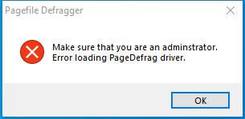

---
title: pagedfrg.exe | System defragmenter
excerpt: What is pagedfrg.exe?
---

# pagedfrg.exe 

* File Path: `C:\SysinternalsSuite\pagedfrg.exe`
* Description: System defragmenter

## Screenshot

## Hashes

Type | Hash
-- | --
MD5 | `24898BA51CBAAD01A046541CC0A8D26F`
SHA1 | `301BB9951B3363C2A7D9FCD75830AACE96AFEE9C`
SHA256 | `19CE7DFFDC417DC1EC126D9E1390F05F931B15AC5F67E8B528DFE55B6BFC3D38`
SHA384 | `BF1DC190C66663E7B27286D8CB8CD5A5A30EE877E790EB4B5E06C7CF2E4ACE2117AB4335816DCB06ACC13D146C8CC37E`
SHA512 | `A492F1111AEAC336E9A8CB981D148201205C6928788784027304D86E8579FF2F11104B35CA917B3058C9F52BF0B1522631A17F9C3F7915C94F882510BDC3C3C5`
SSDEEP | `1536:uhaJeqI4KNLGLY9NmE8zkt6KSdkmVnTA6uv6d3RXYI5/wRf5UyWaOVWcL21HaeF:AaJrLUMot6JZYFJ56VWY2cO`
IMP | `BD450E46D8E9A796DB50878D454EA94A`
PESHA1 | `21C62D4465D6C5C9B3B644701C8AA36D645358DA`
PE256 | `36F2F28957304D7C73675571118CA4C1F1562C3E43E9C0D7AEB580A05376D3D3`

## Runtime Data

### Window Title:
Pagefile Defragger

### Open Handles:

Path | Type
-- | --
(R-D)   C:\Windows\Fonts\StaticCache.dat | File
(R-D)   C:\Windows\SystemResources\imageres.dll.mun | File
(RW-)   C:\Windows | File
(RW-)   C:\Windows\WinSxS\x86_microsoft.windows.common-controls_6595b64144ccf1df_6.0.19041.488_none_11b1e5df2ffd8627 | File
(RW-)   C:\xCyclopedia | File
\BaseNamedObjects\NLS_CodePage_1252_3_2_0_0 | Section
\BaseNamedObjects\NLS_CodePage_437_3_2_0_0 | Section
\Sessions\1\Windows\Theme2036293991 | Section
\Windows\Theme1324212991 | Section

### Loaded Modules:

Path |
-- |
C:\SysinternalsSuite\pagedfrg.exe |
C:\Windows\SYSTEM32\ntdll.dll |
C:\Windows\System32\wow64.dll |
C:\Windows\System32\wow64cpu.dll |
C:\Windows\System32\wow64win.dll |

## Signature

* Status: Signature verified.
* Serial: `61469ECB000400000065`
* Thumbprint: `564E01066387F26C912010D06BD78D3CF1E845AB`
* Issuer: CN=Microsoft Code Signing PCA, OU=Copyright (c) 2000 Microsoft Corp., O=Microsoft Corporation, L=Redmond, S=Washington, C=US
* Subject: CN=Microsoft Corporation, O=Microsoft Corporation, L=Redmond, S=Washington, C=US

## File Metadata

* Original Filename: pagedfrg.exe
* Product Name: Sysinternals System Defragmenter
* Company Name: Sysinternals
* File Version: 2.32
* Product Version: 2.32
* Language: English (United States)
* Legal Copyright: Copyright  2001-2005  Mark Russinovich
* Machine Type: 32-bit

## File Scan

* VirusTotal Detections: 0/70
* VirusTotal Link: https://www.virustotal.com/gui/file/19ce7dffdc417dc1ec126d9e1390f05f931b15ac5f67e8b528dfe55b6bfc3d38/detection/

## File Similarity (ssdeep match)

File | Score
-- | --
[C:\SysinternalsSuite\AccessEnum.exe](AccessEnum.exe-F4CD850FDAB64FFBBCC249374BA17F5B.md) | 40
[C:\SysinternalsSuite\adrestore.exe](adrestore.exe-03B7E47241775016B74BEC1B10894974.md) | 33
[C:\SysinternalsSuite\Cacheset.exe](Cacheset.exe-99936EC7843663C081BA7AD33AAB9D17.md) | 35
[C:\SysinternalsSuite\ctrl2cap.exe](ctrl2cap.exe-C100EA4F0C45C916C795860FD1EB74CC.md) | 40
[C:\SysinternalsSuite\Diskmon.exe](Diskmon.exe-0942C078FE8941282372BB6B5D73E2C8.md) | 22
[C:\SysinternalsSuite\efsdump.exe](efsdump.exe-4CEF8412C762F4840349E5622A05A307.md) | 38
[C:\SysinternalsSuite\ldmdump.exe](ldmdump.exe-202119E519DD179DE64AFD195F0DDA42.md) | 40

MIT License. Copyright (c) 2020-2021 Strontic.

